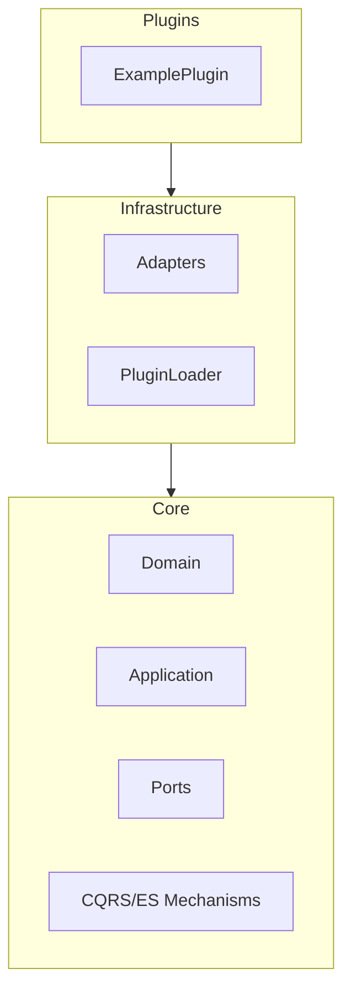

# Epic-1 - Story-2

Core Architecture Implementation

**As a** framework developer
**I want** to implement the foundational architecture patterns (Hexagonal, CQRS/ES, Plugin System)
**so that** the framework is robust, extensible, and maintainable for enterprise applications.

## Status

Completed

## Context

- Building on the monorepo setup (Story-1), this story implements the core architecture patterns described in the PRD and architecture document.
- The goal is to lay the technical foundation for all further features: Hexagonal Architecture (separation of domain, application, infrastructure), CQRS/Event Sourcing mechanisms (including event store interface, buses, idempotency/evolution concepts), and the plugin system (interface, loader, migration handling).
- These patterns are essential for scalability, testability, and extensibility of the framework.

## Estimation

Story Points: 3

## Tasks

1. - [x] Implement Hexagonal Architecture base
    1. - [x] Define the layers and dependencies (core, infrastructure, apps)
    2. - [x] Create the basic interfaces (ports) and adapter structure
2. - [x] Set up CQRS/ES mechanisms
    1. - [x] Implement CommandBus, QueryBus, EventBus (basic)
    2. - [x] Define event store interface and domain events
    3. - [x] Prepare the concept for event schema evolution (versioning, upcasting)
    4. - [x] Prepare the concept for idempotency (tracking table)
3. - [x] Establish plugin system basics
    1. - [x] Define plugin interface and loader mechanism
    2. - [x] Concept for plugin migration handling
    3. - [x] Example plugin as reference
4. - [x] Tests for architecture basics (unit tests for buses, event store interface, plugin loader)

## Constraints

- The architecture must strictly enforce layer separation and dependency rules (Dependency Rule: infrastructure -> application -> domain).
- CQRS/ES mechanisms must be defined in a technology-agnostic way in the core layer.
- The plugin system must allow extensions without changes to the core.

## Data Models / Schema

- Event store interface (TypeScript interface)
- Domain event types
- Example for event versioning
- Plugin interface

## Structure

- `libs/core/`: Domain, application, ports, CQRS/ES mechanisms
- `libs/infrastructure/`: Adapters, implementations of ports, plugin loader
- `libs/plugins/`: Example plugin

## Diagrams

## Dev Notes

- The exact distribution of interfaces and implementations will be further detailed in the architecture document.
- The mechanisms for event evolution and idempotency will be prepared as concepts and implemented as interfaces with in-memory examples.
- Focus was on structure, interfaces, and testability.
- All components have comprehensive unit tests with good test coverage.

## Chat Command Log

- User: ja, erstelle die nächste story-datei und lege sie mir zur überprüfung vor
- Agent: Reads story template and creates draft for Story 2
- User: Implements Hexagonal Architecture, CQRS/ES mechanisms, and Plugin system
- Agent: Creates core interfaces, ports, adapters, and implementations
- User: Implements event schema evolution and idempotency
- Agent: Creates plugin system with demo plugin and improves test coverage
