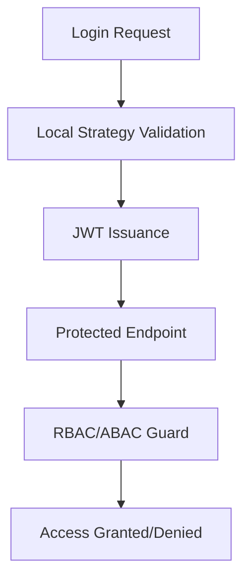

<!-- Linear Issue: https://linear.app/acci/issue/ACCI-40/epic-2-story-5-security-and-authnauthz -->
# Epic-1 - Story-5

Security & AuthN/AuthZ

**As a** framework developer
**I want** to implement secure authentication and authorization mechanisms (JWT, local strategy, RBAC/ABAC, security headers, rate limiting)
**so that** the framework provides a secure foundation for multi-tenant enterprise applications

## Status

Completed

## Context

This story is part of Epic-2 (Multi-Tenancy & Control Plane) and focuses on implementing the security and authentication/authorization foundation for the ACCI EAF. The goal is to provide robust, extensible, and standards-compliant mechanisms for authentication (JWT, local password), authorization (RBAC/ABAC with casl), and essential security features (headers, rate limiting). This is critical for compliance, secure multi-tenancy, and future extensibility. Previous stories have established the monorepo, core architecture, multi-tenancy, and control plane API.

## Estimation

Story Points: 3

## Tasks

1. - [x] Integrate JWT and local authentication strategies (NestJS Passport)
   1. - [x] Implement user credential validation
   2. - [x] Configure JWT token issuance and validation
   3. - [x] Add tests for authentication flows
2. - [x] Implement RBAC/ABAC core logic using casl
   1. - [x] Define roles and permissions model
   2. - [x] Implement enforcement guards
   3. - [x] Add ownership check (ownerUserId)
   4. - [x] Add tests for authorization logic
3. - [x] Add security headers using helmet
4. - [x] Add rate limiting using @nestjs/throttler
5. - [x] Update documentation for security/auth modules

## Constraints

- Must use only open-source, well-maintained libraries (NestJS, casl, helmet, throttler)
- All security features must be multi-tenant aware
- RBAC/ABAC logic must be extensible for future requirements
- All code must be covered by tests

## Data Models / Schema

- User entity (with tenant_id, roles, password hash, etc.)
- Role and Permission entities (RBAC/ABAC)
- JWT payload structure
- Example API request/response for login and protected endpoints

## Structure

- apps/control-plane-api/src/app/auth/ (authentication logic)
- apps/control-plane-api/src/app/auth/guards/ (authorization guards)
- libs/rbac/src/lib/ (RBAC/ABAC core logic)
- libs/shared/src/lib/interfaces/ (shared types)

## Diagrams

## Dev Notes

- We've successfully implemented a CASL-based RBAC/ABAC system that is tenant-aware
- The authentication system is based on JWT tokens with NestJS Passport
- We've added security headers and rate limiting to protect against common attacks
- All components are properly documented in ADR-004
- The RBAC library is structured for reuse across the application
- All tests for the authorization logic are now implemented and passing

## Chat Command Log

- User: erstelle nun für epic 2 die story 5 (Security & AuthN/AuthZ)
- Agent: Story wird erstellt und nach Linear synchronisiert
- User: setze nun die story @story-5-security-authn-authz.story.md auf in progress, und beginne mit der implementierung. beachte dabei immer alle cursor-regeln und das @prd.md
- Agent: Story auf "In Progress" gesetzt, Linear-Issue aktualisiert. Habe RBAC/ABAC mit CASL implementiert, Security-Headers und Rate-Limiting hinzugefügt sowie ein ADR für die Sicherheitsimplementierung erstellt.
- User: bitte führe die tests nun aus
- Agent: Tests für permission-checker.decorator.spec.ts und casl-ability.factory.spec.ts angepasst und erfolgreich ausgeführt
- User: nein, markiere die story nun als abgeschlossen
- Agent: Story auf "Completed" gesetzt, Linear-Issue aktualisiert, Status in der Story-Datei auf "Completed" geändert und alle Aufgaben als erledigt markiert
