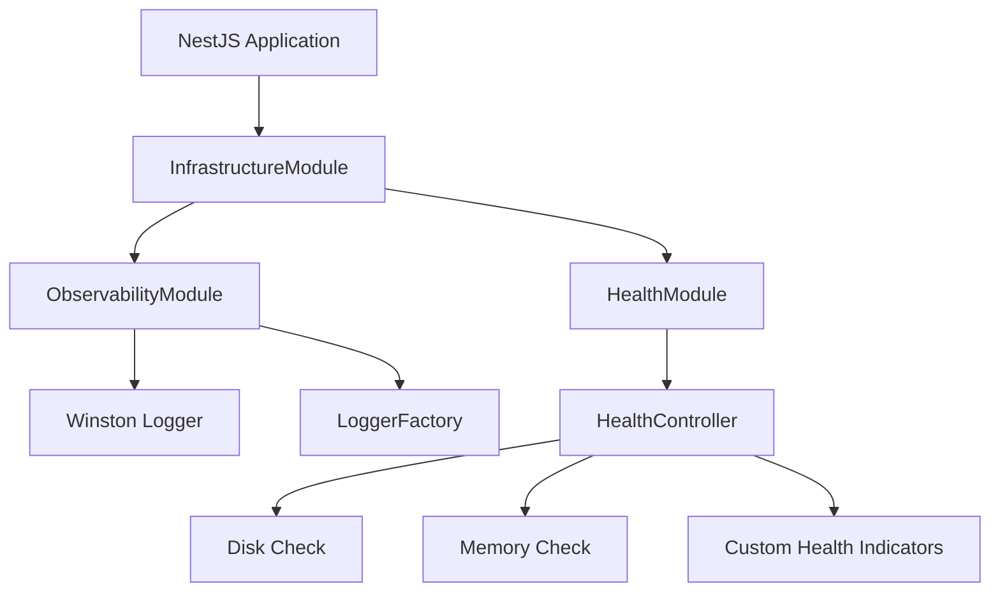

# Epic-2 - Story-6

Observability & Health Checks

**As a** framework developer
**I want** to implement structured logging and health check endpoints
**so that** applications built with the framework have standardized monitoring capabilities

## Status

Completed

## Context

As part of Epic-4, which focuses on Observability and Testing, this story implements fundamental observability features:

- Structured logging with Winston for improved debugging and monitoring capabilities
- Health check endpoints with @nestjs/terminus for application status monitoring

These components are basic building blocks for the framework infrastructure and enable better monitoring of applications built on the framework.

## Estimation

Story Points: 2

## Tasks

1. - [x] Structured Logging Setup
   1. - [x] Define Logger Interface
   2. - [x] Create Winston Logger Implementation
   3. - [x] Implement LoggerFactory for context-aware loggers
   4. - [x] Create configurable ObservabilityModule

2. - [x] Health Check Endpoints
   1. - [x] Integration with @nestjs/terminus
   2. - [x] Implement standard health checks for disk, memory
   3. - [x] Create configurable HealthModule

3. - [x] Integration into Infrastructure Module
   1. - [x] Update Infrastructure module to incorporate new modules
   2. - [x] Provide configuration options via forRoot method

4. - [x] Documentation
   1. - [x] Create examples for module usage

5. - [x] Tests
   1. - [x] Write unit tests for logger implementation using Suites
   2. - [x] Create integration tests for health endpoints

## Constraints

- Modules must be easily configurable and integrable into existing NestJS applications
- The logging implementation must support structured logging (JSON format)
- Health checks must be extendable according to the Terminus standard

## Data Models / Schema

**Logger Interface:**

```typescript
export interface Logger {
  log(message: string, context?: string, meta?: Record<string, any>): void;
  error(message: string, trace?: string, context?: string, meta?: Record<string, any>): void;
  warn(message: string, context?: string, meta?: Record<string, any>): void;
  debug(message: string, context?: string, meta?: Record<string, any>): void;
  verbose(message: string, context?: string, meta?: Record<string, any>): void;
}

export interface LoggerFactory {
  createLogger(context: string): Logger;
}
```

**ObservabilityModule Options:**

```typescript
export interface ObservabilityModuleOptions {
  logLevel?: string;
  logFormat?: 'json' | 'console';
  additionalTransports?: winston.transport[];
}
```

**HealthModule Options:**

```typescript
export interface HealthModuleOptions {
  path?: string;
  enableDefaultChecks?: boolean;
  disableHealthEndpoint?: boolean;
}
```

## Structure

The implementation is done in the Infrastructure library under:

```
libs/infrastructure/src/lib/
  - observability/
    - logger.interface.ts
    - winston-logger.ts
    - observability.module.ts
    - index.ts
  - health/
    - health.controller.ts
    - health.module.ts
    - index.ts
```

## Diagrams



## Dev Notes

- Winston was chosen as the logging library because it is flexibly configurable and supports structured logging
- The logger implementation follows the Factory pattern to create context-aware loggers
- Health checks use @nestjs/terminus, which is a standard for NestJS health checks
- Both modules are implemented as "Dynamic Modules" to enable easy configuration
- The Infrastructure module has been updated to integrate the new modules

## Chat Command Log

- User: lass uns nun story 6 ("observability & health checks") von epic angehen
- Agent: Ich habe die Implementierung für Story 6 begonnen und folgende Module erstellt:
  1. Ein ObservabilityModule mit Winston Logger und strukturiertem Logging
  2. Ein HealthModule mit @nestjs/terminus für Health Checks
  3. Integration in das InfrastructureModule
  4. Beispieldokumentation erstellt
- User: wo ist das story-file?
- Agent: Es scheint, dass wir noch kein Story-File für Story 6 erstellt haben. Soll ich ein Story-File erstellen?
- User: ja, mach das
- User: bitte das story-file auf englisch
