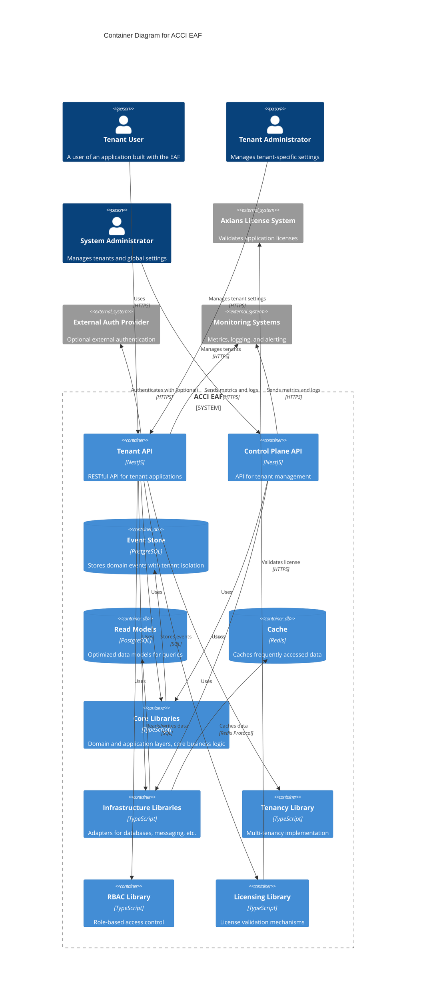

# arc42 Architecture Documentation for ACCI EAF

## 1. Introduction and Goals

The ACCI EAF (Axians Competence Center Infrastructure Enterprise Application Framework) is an internal software framework designed to accelerate the development of robust, scalable, secure, and maintainable enterprise applications. It provides a solid foundation, reusable components, and clear architectural patterns to address common challenges in enterprise software projects—such as multi-tenancy, security, compliance, extensibility, and maintainability.

**Purpose:**

- Serve as a technical guide for developers and architects using or evolving the framework.
- Establish a consistent, best-practice-based foundation for Axians projects.
- Enable faster time-to-market and higher code quality for customer solutions.

**Target Audience:**

- Software development teams at Axians building enterprise applications for customers.
- Technical architects defining solutions and standards.
- Security & compliance officers (for certification and audit support).

**Key Goals:**

- Accelerate development by providing reusable building blocks and clear patterns.
- Promote best practices: Hexagonal Architecture, CQRS/Event Sourcing, Multi-Tenancy, RBAC/ABAC, i18n, SBOM, Security by Design.
- Improve quality and maintainability through modularity, testability, and documentation (ADRs).
- Support Axians' business model via integrated license validation.
- Enable compliance with industry standards (ISO 27001, SOC2) and support certification processes.

## 2. Constraints

The architecture and implementation of ACCI EAF are shaped by the following constraints:

**Technical Constraints:**

- Use of TypeScript and Node.js as the primary language and runtime.
- Backend framework: NestJS; ORM: MikroORM; Database: PostgreSQL; Caching: Redis.
- Monorepo structure managed with Nx; strict separation of apps and libraries.
- Multi-tenancy enforced via Row-Level Security (RLS) using MikroORM filters and a `tenant_id` column.
- Event Sourcing and CQRS as core architectural patterns.
- Plugin system must support dynamic entity discovery and extension without core changes.
- All code and documentation must be in English (unless otherwise specified).

**Organizational Constraints:**

- Must support Axians' business model, including license validation and compliance requirements.
- Designed for use by multiple development teams and projects within Axians.
- Documentation and architectural decisions must be maintained and traceable (ADRs).

**Legal/Compliance Constraints:**

- Must enable compliance with ISO 27001, SOC2, and other relevant standards.
- Security by Design: RLS, RBAC/ABAC, auditability, and SBOM generation are mandatory.
- Data protection and privacy requirements must be considered for all tenant data.

**Out of Scope (V1):**

- No frontend UI frameworks or admin UIs included.
- No advanced observability (metrics, tracing), advanced AuthN (OIDC, LDAP), or audit trail in V1.
- No production-ready CI/CD pipeline templates or extensive plugin library in V1.

## 3. System Scope and Context

The ACCI EAF provides the technical foundation for building multi-tenant enterprise applications. It is used by application developers, system administrators, and tenant administrators, and interacts with external systems such as license validation services and monitoring solutions.

**System Context Diagram:**

```mermaid
C4Context
title System Context Diagram for ACCI EAF

Person(tenant_user, "Tenant User", "A user of an application built with the EAF, belongs to a specific tenant")
Person(tenant_admin, "Tenant Administrator", "Manages users, roles and permissions within a specific tenant")
Person(system_admin, "System Administrator", "Manages tenants and global settings")
Person(developer, "Application Developer", "Develops applications using the EAF")

System_Boundary(eaf, "ACCI EAF") {
    System(tenant_app, "Tenant Application", "Enterprise application built with EAF, supports multiple tenants")
    System(control_plane, "Control Plane API", "Manages tenants and global configuration")
}

System_Ext(license_system, "Axians License System", "Validates application licenses")
System_Ext(auth_provider, "External Auth Provider", "Optional external authentication (OAuth, OIDC)")
System_Ext(monitoring, "Monitoring Systems", "Metrics, logging, and alerting")

Rel(tenant_user, tenant_app, "Uses")
Rel(tenant_admin, tenant_app, "Manages tenant-specific settings, users, and roles")
Rel(system_admin, control_plane, "Manages tenants and global settings")
Rel(developer, eaf, "Builds applications using")

Rel(tenant_app, license_system, "Validates license", "HTTPS")
Rel(tenant_app, auth_provider, "Authenticates with (optional)", "HTTPS")
Rel(tenant_app, monitoring, "Sends metrics and logs", "HTTPS")
Rel(control_plane, monitoring, "Sends metrics and logs", "HTTPS")

UpdateLayoutConfig($c4ShapeInRow="3", $c4BoundaryInRow="1")
```

**Scope:**

- The EAF core libraries and infrastructure are in scope.
- The Control Plane API for tenant management is in scope.
- Sample applications and plugins are in scope as reference implementations.
- Frontend UIs, advanced observability, and external admin tools are out of scope for V1.

## 4. Solution Strategy

The ACCI EAF is built on proven architectural patterns and principles to ensure modularity, extensibility, and maintainability:

- **Hexagonal Architecture (Ports & Adapters):** Strict separation of core business logic from infrastructure and frameworks. Core logic is technology-agnostic and exposed via well-defined ports; adapters implement these ports for specific technologies (e.g., REST, DB, cache).
- **CQRS & Event Sourcing:** Clear separation of command (write) and query (read) responsibilities. All state changes are captured as events, enabling traceability, auditability, and flexible projections.
- **Multi-Tenancy via Row-Level Security:** Tenant isolation is enforced at the database level using a `tenant_id` column and MikroORM filters, with tenant context propagated via AsyncLocalStorage.
- **Plugin System:** The framework is extensible via a plugin mechanism that supports dynamic entity discovery and registration, allowing new features without core changes.
- **Security by Design:** RBAC/ABAC, secure authentication, and compliance features are integrated from the start.
- **Monorepo with Nx:** Promotes code sharing, consistent tooling, and efficient dependency management across apps and libraries.

These strategies enable the EAF to address enterprise requirements for security, scalability, extensibility, and compliance, while supporting rapid development and maintainability.

## 5. Building Block View

The EAF is organized into modular building blocks, each with a clear responsibility. The main components are grouped into core libraries, infrastructure, and applications.

**Container Diagram:**



**Key Building Blocks:**

- **Core Libraries:** Domain logic, application services, CQRS buses, event sourcing, ports.
- **Infrastructure Libraries:** Adapters for persistence (MikroORM/PostgreSQL), cache (Redis), web (NestJS), i18n, etc.
- **Tenancy Library:** Tenant context management, RLS enforcement.
- **RBAC Library:** Role-based access control, guards, permission management.
- **Licensing Library:** License validation logic.
- **Applications:**
  - **Control Plane API:** Central tenant management.
  - **Sample App:** Reference implementation for EAF consumers.

## 6. Runtime View

The runtime view describes how the main flows are processed within the EAF. The most important scenarios are:

**Command Flow:**

- HTTP request → NestJS Controller → CommandBus → Command Handler (loads Aggregate via Repository) → Aggregate (validates, creates Domain Event) → Event Store Adapter (saves Event) → EventBus.

**Event Flow:**

- EventBus (or polling the store) → Event Handler / Projector (updates Read Model).

**Query Flow:**

- HTTP request → NestJS Controller → QueryBus → Query Handler → Read Model Repository Adapter (reads from optimized Read Model DB) → Response.

<!-- TODO: Add sequence diagrams for these flows (see ARCH.md for details) -->

## 7. Deployment View

The EAF applications are typically packaged as Docker containers and deployed using Docker Compose or orchestration platforms such as Kubernetes. The monorepo build process (Nx) generates optimized artifacts for each application. Health check endpoints support orchestration and monitoring. Graceful shutdown is implemented for reliability.

**Deployment Highlights:**

- Docker images for all applications and core libraries
- Offline tarball package for customer VM installation (includes Docker Compose, images, setup scripts)
- Health check endpoints for liveness/readiness
- Support for future Kubernetes deployment

<!-- TODO: Add infrastructure/deployment diagram -->

## 8. Crosscutting Concepts

The EAF addresses several crosscutting concerns that are critical for enterprise applications:

- **Security:** RBAC/ABAC, secure authentication (JWT, local), RLS for tenant isolation, security headers (helmet), rate limiting, and auditability.
- **Observability:** Structured logging, health check endpoints, and (future) support for metrics and distributed tracing.
- **Internationalization (i18n):** API responses and validation errors are translatable via nestjs-i18n; locale detection is supported.
- **Licensing:** Integrated license validation (offline/online), robust against tampering, supports Axians business model.
- **SBOM (Software Bill of Materials):** Generation of SBOMs (e.g., CycloneDX) is part of the CI/CD build process for all applications and libraries.
- **Extensibility:** Plugin system allows for extension without core changes, including dynamic entity discovery.
- **Testability:** High test coverage, clear test strategy (unit, integration, E2E), and shared test utilities.

## 9. Architectural Decisions

Architectural decisions are documented as Architecture Decision Records (ADRs) in the `docs/adr/` directory. These records capture the rationale behind key design choices and enable traceability for future evolution.

**Key ADRs:**

- [001-rbac-library-selection.md](adr/001-rbac-library-selection.md): Selection of RBAC library (`casl` recommended)
- [002-sbom-tool-selection.md](adr/002-sbom-tool-selection.md): Tool and format for SBOM generation
- [003-license-validation-mechanism.md](adr/003-license-validation-mechanism.md): License validation mechanism (offline/online)
- [006-rls-enforcement-strategy.md](adr/006-rls-enforcement-strategy.md): RLS enforcement strategy with MikroORM filters
- [007-controlplane-bootstrapping.md](adr/007-controlplane-bootstrapping.md): Bootstrapping process for the Control Plane
- [008-plugin-migrations.md](adr/008-plugin-migrations.md): Plugin entity discovery and migration management
- [009-idempotent-event-handlers.md](adr/009-idempotent-event-handlers.md): Idempotency in event handlers
- [010-event-schema-evolution.md](adr/010-event-schema-evolution.md): Event schema evolution strategy

## 10. Quality Requirements

The following non-functional requirements (NFRs) define the quality goals for the EAF:

| ID     | Category        | Requirement                                                                                                    | Target/Measurement                      |
|--------|----------------|----------------------------------------------------------------------------------------------------------------|-----------------------------------------|
| NFR-01 | Performance    | API response times for typical queries should be low; command processing efficient; RLS must not be a bottleneck | P95 Latency < 200ms (Queries)           |
| NFR-02 | Scalability    | Architecture must allow horizontal scaling of read/write paths; statelessness where possible                    | Scalability tests under load             |
| NFR-03 | Reliability    | Graceful shutdown, robust error handling, idempotent event handlers, robust offline update process              | Tests, code reviews, update script test  |
| NFR-04 | Security       | RLS, RBAC/ABAC, secure AuthN/AuthZ, SBOM, compliance support, protection against OWASP Top 10                   | Security reviews, pentest, mapping check |
| NFR-05 | Maintainability| SOLID principles, documentation, high test coverage, clear module boundaries                                    | Code coverage > 85%, static analysis    |
| NFR-06 | Testability    | Core logic testable in isolation, reliable integration tests, easy unit tests                                   | Test pyramid implemented                |
| NFR-07 | Extensibility  | Plugin system allows extension without core changes, swappable adapters                                        | Example plugin, design review            |
| NFR-08 | Documentation  | Comprehensive docs: setup, architecture, concepts, ADRs, API reference                                         | Availability & quality of docs           |
| NFR-09 | Dev Experience | Intuitive usage, good IDE support, clear errors, simple setup, easy plugin dev                                  | Developer feedback                       |
| NFR-10 | i18n Support   | API responses translatable via nestjs-i18n                                                                     | Tests for localized responses            |
| NFR-11 | Licensing      | Hybrid validation mechanism reliable and secure                                                                | Design review, tests                     |
| NFR-12 | Compliance     | SBOM generation, compliance support in design                                                                  | SBOM in build, design reviews            |
| NFR-13 | Deployment     | Tarball package contains all artifacts for offline install, robust setup/update scripts                        | Install/update test from tarball         |

## 11. Risks and Technical Debt

The following risks, open questions, and areas of technical debt have been identified:

- **Licensing:** Details of license validation (file format, signature, online API, failure handling) are still open.
- **RLS Enforcement:** Best practices for configuring and dynamically passing tenant_id to MikroORM filters in NestJS context.
- **Plugin Entity Discovery:** Reliable discovery and migration management for plugin entities, especially in offline setups.
- **Control Plane Bootstrapping:** Process for creating the first tenant and system administrator.
- **Event Schema Evolution:** Long-term strategy for evolving event schemas and supporting backward compatibility.
- **Audit Trail:** Dedicated audit trail service/module is out of scope for V1 but required for compliance in future versions.
- **Advanced Observability:** Metrics and distributed tracing are not yet implemented.
- **RBAC/ABAC Model:** Further refinement and extension of the authorization model may be needed.
- **Deployment Automation:** Production-ready CI/CD pipeline templates are not included in V1.
- **Technical Debt:** Areas marked as TBD in the codebase and documentation should be tracked and addressed iteratively.

## 12. Glossary

- **ACCI EAF:** Axians Competence Center Infrastructure Enterprise Application Framework
- **RLS:** Row-Level Security. Data access restriction at the row level, here using tenant_id.
- **RBAC:** Role-Based Access Control. Access based on user roles.
- **ABAC:** Attribute-Based Access Control. Access based on attributes (here: ownership).
- **Control Plane:** Separate API for central management of tenants by system administrators.
- **Tenant Context:** Information identifying the current tenant for an operation.
- **Event Sourcing:** Storing all changes to application state as a sequence of events.
- **CQRS:** Command Query Responsibility Segregation. Separation of read and write operations.
- **Plugin:** Extension mechanism for adding features/entities without core changes.
- **SBOM:** Software Bill of Materials. A list of all components in the software, used for compliance.

// End of arc42 documentation
