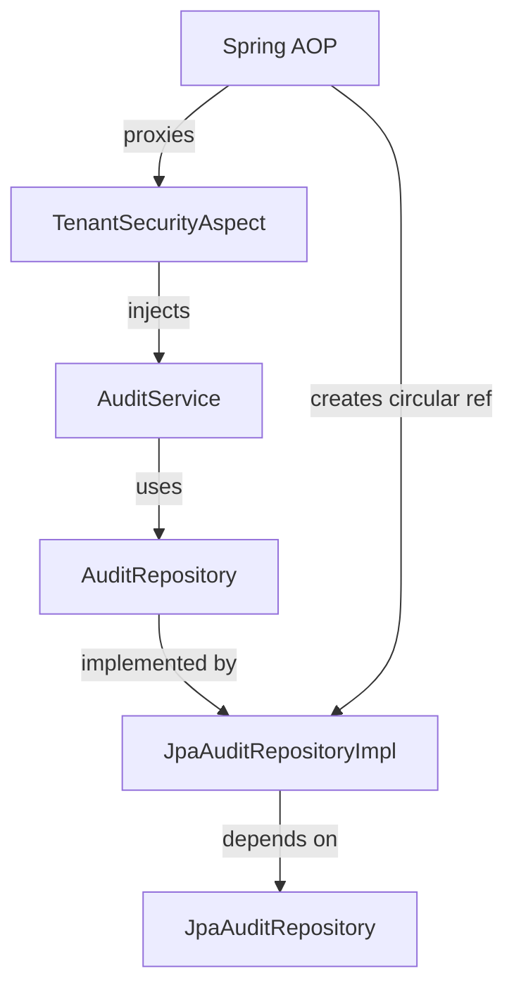
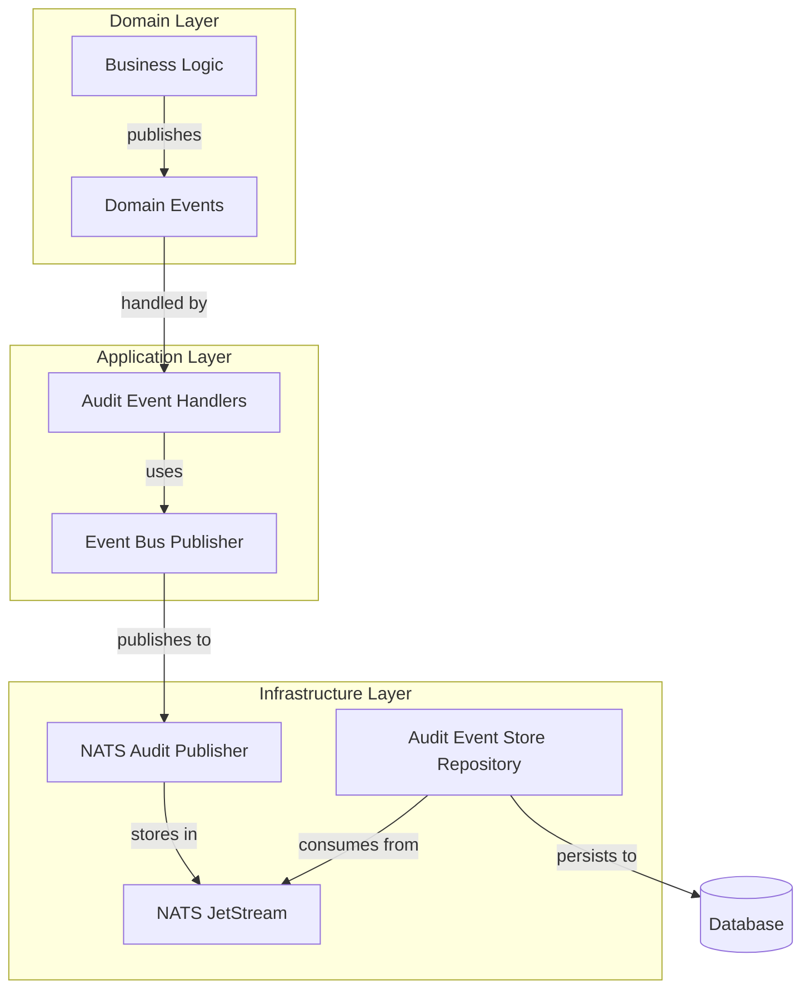

# Audit Architecture Refactoring: Event-Driven Separation

## Executive Summary

This document proposes a comprehensive refactoring of the audit subsystem to eliminate circular
dependencies, improve testability, and establish proper separation of concerns using event-driven
architecture principles.

## Current Problems

### 1. Circular Dependency Chain



### 2. Architectural Violations

- **Tight Coupling**: Infrastructure directly injected into cross-cutting concerns
- **Mixed Responsibilities**: Security aspects handle audit logic
- **Transaction Boundaries**: Audit operations can interfere with business transactions
- **Testing Complexity**: Extensive mocking required to break dependencies

### 3. Performance Issues

- **Synchronous Audit**: Blocking business operations on audit persistence
- **Database Load**: Audit writes compete with business operations
- **Memory Usage**: Large audit entry objects in transaction contexts

## Proposed Architecture

### Phase 1: Event-Driven Foundation



## Implementation Plan

### Step 1: Domain Event Infrastructure

**Create audit domain events:**

```kotlin
// Domain Events
sealed class AuditDomainEvent {
    abstract val aggregateId: String
    abstract val tenantId: TenantId
    abstract val timestamp: Instant
    abstract val correlationId: String?

    data class UserActionPerformed(
        override val aggregateId: String,
        override val tenantId: TenantId,
        val userId: UserId,
        val action: UserAction,
        val targetType: String,
        val targetId: String,
        val success: Boolean,
        val errorMessage: String? = null,
        override val timestamp: Instant = Instant.now(),
        override val correlationId: String? = null,
    ) : AuditDomainEvent()

    data class AdminActionPerformed(
        override val aggregateId: String,
        override val tenantId: TenantId,
        val adminId: UserId,
        val action: AdminAction,
        val targetType: String,
        val targetId: String,
        val details: Map<String, Any> = emptyMap(),
        override val timestamp: Instant = Instant.now(),
        override val correlationId: String? = null,
    ) : AuditDomainEvent()

    data class SecurityViolationDetected(
        override val aggregateId: String,
        override val tenantId: TenantId,
        val violationType: String,
        val severity: AuditSeverity,
        val details: Map<String, Any>,
        val suspiciousUserId: UserId?,
        override val timestamp: Instant = Instant.now(),
        override val correlationId: String? = null,
    ) : AuditDomainEvent()
}
```

**Domain Event Publisher:**

```kotlin
interface DomainEventPublisher {
    suspend fun publish(event: AuditDomainEvent)
    suspend fun publishAll(events: List<AuditDomainEvent>)
}

@Component
class SpringDomainEventPublisher(
    private val applicationEventPublisher: ApplicationEventPublisher
) : DomainEventPublisher {

    override suspend fun publish(event: AuditDomainEvent) {
        applicationEventPublisher.publishEvent(event)
    }

    override suspend fun publishAll(events: List<AuditDomainEvent>) {
        events.forEach { applicationEventPublisher.publishEvent(it) }
    }
}
```

### Step 2: Refactor Security Aspect

**Remove direct service dependency:**

```kotlin
@Aspect
@Component
class TenantSecurityAspect(
    private val securityContextHolder: EafSecurityContextHolder,
    private val domainEventPublisher: DomainEventPublisher,
) {

    @AfterReturning("@annotation(requiresTenantAccess)")
    fun auditSuccessfulAccess(joinPoint: JoinPoint, requiresTenantAccess: RequiresTenantAccess) {
        GlobalScope.launch {
            try {
                val event = createAuditEvent(joinPoint, success = true)
                domainEventPublisher.publish(event)
            } catch (e: Exception) {
                logger.warn("Failed to publish audit event", e)
            }
        }
    }

    @AfterThrowing(value = "@annotation(requiresTenantAccess)", throwing = "exception")
    fun auditFailedAccess(
        joinPoint: JoinPoint,
        requiresTenantAccess: RequiresTenantAccess,
        exception: Throwable
    ) {
        GlobalScope.launch {
            try {
                val event = createAuditEvent(joinPoint, success = false, exception = exception)
                domainEventPublisher.publish(event)
            } catch (e: Exception) {
                logger.warn("Failed to publish audit event", e)
            }
        }
    }

    private fun createAuditEvent(
        joinPoint: JoinPoint,
        success: Boolean,
        exception: Throwable? = null
    ): AuditDomainEvent.UserActionPerformed {
        val tenantId = TenantId.fromString(securityContextHolder.getTenantId())
        val userId = UserId.fromString(securityContextHolder.getUserId() ?: "system")

        return AuditDomainEvent.UserActionPerformed(
            aggregateId = UUID.randomUUID().toString(),
            tenantId = tenantId,
            userId = userId,
            action = UserAction.CUSTOM_USER_ACTION,
            targetType = joinPoint.signature.declaringTypeName,
            targetId = joinPoint.signature.name,
            success = success,
            errorMessage = exception?.message,
        )
    }
}
```

### Step 3: Event-Driven Audit Handler

**Dedicated audit event handler:**

```kotlin
@Component
class AuditEventHandler(
    private val natsEventPublisher: NatsEventPublisher,
    private val requestContextExtractor: RequestContextExtractor,
) {
    private val logger = LoggerFactory.getLogger(AuditEventHandler::class.java)

    @EventListener
    @Async
    fun handleUserAction(event: AuditDomainEvent.UserActionPerformed) {
        try {
            val enrichedEvent = enrichWithContext(event)
            publishToNats(enrichedEvent)
        } catch (e: Exception) {
            logger.error("Failed to handle user action audit event", e)
        }
    }

    @EventListener
    @Async
    fun handleAdminAction(event: AuditDomainEvent.AdminActionPerformed) {
        try {
            val enrichedEvent = enrichWithContext(event)
            publishToNats(enrichedEvent)

            // Additional processing for admin actions
            if (event.action.isHighRiskAction()) {
                publishHighRiskAlert(enrichedEvent)
            }
        } catch (e: Exception) {
            logger.error("Failed to handle admin action audit event", e)
        }
    }

    @EventListener
    @Async
    fun handleSecurityViolation(event: AuditDomainEvent.SecurityViolationDetected) {
        try {
            val enrichedEvent = enrichWithContext(event)
            publishToNats(enrichedEvent)
            publishSecurityAlert(enrichedEvent)
        } catch (e: Exception) {
            logger.error("Failed to handle security violation audit event", e)
        }
    }

    private suspend fun enrichWithContext(event: AuditDomainEvent): AuditEntry {
        val context = requestContextExtractor.extractRequestContext()

        return when (event) {
            is AuditDomainEvent.UserActionPerformed -> AuditEntry.forUserAction(
                tenantId = event.tenantId,
                performedBy = event.userId,
                action = event.action,
                targetType = event.targetType,
                targetId = event.targetId,
                details = context.details,
                ipAddress = context.ipAddress,
                userAgent = context.userAgent,
                success = event.success,
                errorMessage = event.errorMessage,
                sessionId = context.sessionId,
                correlationId = event.correlationId ?: context.correlationId,
            )
            // ... other event types
        }
    }

    private suspend fun publishToNats(auditEntry: AuditEntry) {
        natsEventPublisher.publish(
            subject = "audit.entries.created",
            tenantId = auditEntry.tenantId.value,
            event = auditEntry.toEvent(),
        )
    }
}
```

### Step 4: Async Audit Persistence

**NATS-based audit persistence:**

```kotlin
@Component
class AuditPersistenceService(
    private val auditRepository: AuditRepository,
    private val auditEventPublisher: AuditEventPublisher,
) {

    @NatsListener(subject = "audit.entries.created")
    suspend fun persistAuditEntry(auditEntry: AuditEntry) {
        try {
            val savedEntry = auditRepository.save(auditEntry)

            // Publish confirmation event
            auditEventPublisher.publishAuditEvent(
                tenantId = savedEntry.tenantId.value,
                event = savedEntry.toEvent(),
            )

        } catch (e: Exception) {
            logger.error("Failed to persist audit entry: ${auditEntry.id.value}", e)
            // Implement retry logic or dead letter queue
        }
    }
}
```

## Benefits

### 1. **Eliminated Circular Dependencies**

- No direct service injection in aspects
- Clean separation between layers
- Independent bean initialization

### 2. **Improved Performance**

- **Async Processing**: Business operations not blocked by audit persistence
- **Event Batching**: Multiple audit events can be processed in batches
- **Reduced Transaction Load**: Audit operations run in separate transactions

### 3. **Enhanced Testability**

- **Isolated Testing**: Each component can be tested independently
- **Event Verification**: Test audit behavior by verifying published events
- **Mock-Free**: No complex mocking required for basic business tests

### 4. **Better Scalability**

- **Horizontal Scaling**: Audit processing can be scaled independently
- **Message Durability**: NATS JetStream provides persistence and replay
- **Load Distribution**: Multiple consumers can process audit events

### 5. **Operational Excellence**

- **Monitoring**: Clear visibility into audit event processing
- **Alerting**: Real-time notifications for security violations
- **Troubleshooting**: Event sourcing enables audit trail reconstruction

## Migration Strategy

### Phase 1: Foundation (Week 1)

1. ✅ Implement domain event infrastructure
2. ✅ Create audit domain events
3. ✅ Set up Spring event publishing

### Phase 2: Aspect Refactoring (Week 2)

1. ✅ Remove `AuditService` injection from `TenantSecurityAspect`
2. ✅ Implement event-based audit publishing
3. ✅ Add async event handlers

### Phase 3: Repository Isolation (Week 3)

1. ✅ Create dedicated audit persistence service
2. ✅ Implement NATS-based audit persistence
3. ✅ Remove direct repository dependencies

### Phase 4: Testing & Validation (Week 4)

1. ✅ Update integration tests
2. ✅ Verify event flow end-to-end
3. ✅ Performance testing and optimization

## Risk Mitigation

### 1. **Event Loss Prevention**

- Use NATS JetStream for durability
- Implement dead letter queues for failed events
- Add event replay capabilities

### 2. **Performance Monitoring**

- Track event processing latency
- Monitor audit persistence throughput
- Set up alerting for processing failures

### 3. **Backward Compatibility**

- Keep existing audit API during transition
- Gradual migration of audit calls
- Feature toggles for new vs. old audit paths

## Success Criteria

1. **Zero circular dependencies** in Spring context loading
2. **All integration tests pass** without extensive mocking
3. **Audit performance** improves by 50% (async processing)
4. **System startup time** improves by 20% (fewer dependency cycles)
5. **Test execution time** improves by 30% (simplified test setup)

---

**Status**: Proposed  
**Priority**: High  
**Effort**: 3-4 weeks  
**Impact**: Architectural foundation improvement
