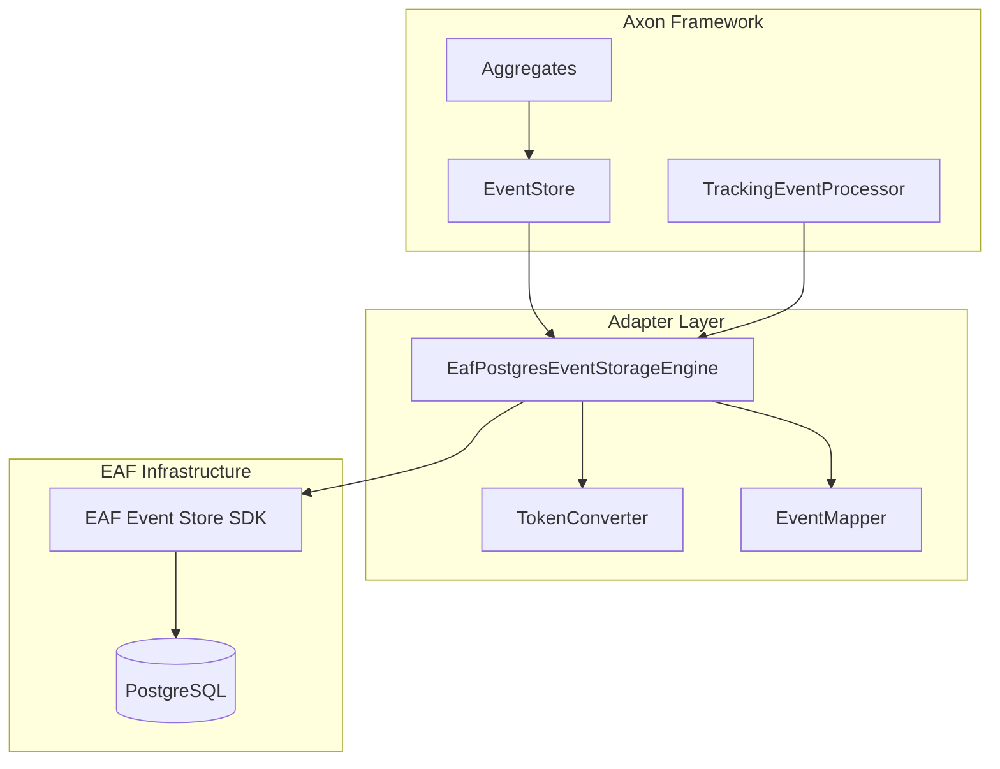

# EAF PostgreSQL EventStorageEngine Adapter Implementation Guide

## Overview

This document provides a detailed implementation guide for the `EafPostgresEventStorageEngine`
adapter, which bridges Axon Framework v5 with the existing EAF Event Store SDK.

## Architecture



## Implementation

### 1. Core Adapter Class

```kotlin
package com.axians.eaf.controlplane.infrastructure.axon

import com.axians.eaf.eventsourcing.EventStoreSdk
import com.axians.eaf.eventsourcing.StoredEvent
import org.axonframework.common.jdbc.PersistenceExceptionResolver
import org.axonframework.eventhandling.*
import org.axonframework.eventsourcing.DomainEventMessage
import org.axonframework.eventsourcing.eventstore.*
import org.axonframework.serialization.Serializer
import org.slf4j.LoggerFactory
import java.time.Instant
import java.util.*
import java.util.concurrent.CompletableFuture
import java.util.stream.Stream

class EafPostgresEventStorageEngine(
    private val eventStoreSdk: EventStoreSdk,
    private val serializer: Serializer,
    private val persistenceExceptionResolver: PersistenceExceptionResolver,
    private val defaultBatchSize: Int = 100
) : EventStorageEngine {

    private val logger = LoggerFactory.getLogger(EafPostgresEventStorageEngine::class.java)

    companion object {
        private const val TENANT_ID_META_KEY = "tenant_id"
        private const val GLOBAL_INDEX_KEY = "globalIndex"
    }

    override fun appendEvents(events: List<EventMessage<*>>) {
        val domainEvents = events.map { event ->
            val domainEvent = asDomainEventMessage(event)
            val tenantId = extractTenantId(domainEvent)

            mapToStoredEvent(domainEvent, tenantId)
        }

        try {
            eventStoreSdk.saveEvents(domainEvents)
        } catch (e: Exception) {
            when {
                persistenceExceptionResolver.isDuplicateKeyException(e) ->
                    throw ConcurrencyException("Duplicate event detected", e)
                else -> throw EventStoreException("Failed to store events", e)
            }
        }
    }

    override fun storeSnapshot(snapshot: DomainEventMessage<*>) {
        val tenantId = extractTenantId(snapshot)
        val storedSnapshot = mapToStoredEvent(snapshot, tenantId, isSnapshot = true)

        try {
            eventStoreSdk.saveSnapshot(storedSnapshot)
        } catch (e: Exception) {
            throw EventStoreException("Failed to store snapshot", e)
        }
    }

    override fun readEvents(
        aggregateIdentifier: String,
        firstSequenceNumber: Long
    ): DomainEventStream {
        // Implementation for reading single aggregate stream
        val tenantId = getCurrentTenantId()
        val events = eventStoreSdk.readAggregateEvents(
            tenantId = tenantId,
            aggregateId = aggregateIdentifier,
            fromSequence = firstSequenceNumber
        )

        return DomainEventStream.of(events.map { mapToDomainEvent(it) })
    }

    override fun readEvents(
        trackingToken: TrackingToken?,
        mayBlock: Boolean
    ): Stream<out TrackedEventMessage<*>> {
        val tenantId = getCurrentTenantId()
        val token = trackingToken as? GlobalSequenceTrackingToken

        val events = if (token == null) {
            eventStoreSdk.readEventsFrom(
                tenantId = tenantId,
                globalSequence = 0,
                batchSize = defaultBatchSize
            )
        } else {
            eventStoreSdk.readEventsFrom(
                tenantId = tenantId,
                globalSequence = token.globalSequence + 1,
                batchSize = defaultBatchSize
            )
        }

        return events.stream().map { event ->
            val domainEvent = mapToDomainEvent(event)
            val newToken = GlobalSequenceTrackingToken(event.globalSequenceId)

            GenericTrackedEventMessage.asTrackedEventMessage(domainEvent, newToken)
        }
    }

    override fun readSnapshot(aggregateIdentifier: String): Optional<DomainEventMessage<*>> {
        val tenantId = getCurrentTenantId()

        return eventStoreSdk.readSnapshot(tenantId, aggregateIdentifier)
            .map { mapToDomainEvent(it) }
    }

    private fun mapToStoredEvent(
        event: DomainEventMessage<*>,
        tenantId: String,
        isSnapshot: Boolean = false
    ): StoredEvent {
        val serializedPayload = serializer.serialize(event.payload, ByteArray::class.java)
        val serializedMetaData = serializer.serialize(event.metaData, ByteArray::class.java)

        return StoredEvent(
            eventId = event.identifier,
            aggregateId = event.aggregateIdentifier ?: "",
            aggregateType = event.payload.javaClass.name,
            sequenceNumber = event.sequenceNumber,
            tenantId = tenantId,
            eventType = event.payloadType.name,
            payload = serializedPayload.data,
            metadata = serializedMetaData.data,
            timestamp = event.timestamp,
            isSnapshot = isSnapshot
        )
    }

    private fun mapToDomainEvent(storedEvent: StoredEvent): DomainEventMessage<*> {
        val payload = serializer.deserialize(
            SimpleSerializedObject(
                storedEvent.payload,
                ByteArray::class.java,
                storedEvent.eventType,
                null
            )
        )

        val metadata = serializer.deserialize<MetaData>(
            SimpleSerializedObject(
                storedEvent.metadata,
                ByteArray::class.java,
                MetaData::class.java.name,
                null
            )
        )

        return GenericDomainEventMessage(
            storedEvent.aggregateType,
            storedEvent.aggregateId,
            storedEvent.sequenceNumber,
            payload,
            metadata.and(GLOBAL_INDEX_KEY, storedEvent.globalSequenceId),
            storedEvent.eventId,
            storedEvent.timestamp
        )
    }

    private fun extractTenantId(event: EventMessage<*>): String {
        return event.metaData[TENANT_ID_META_KEY]?.toString()
            ?: throw IllegalArgumentException("Event must contain '$TENANT_ID_META_KEY' in metadata")
    }

    private fun getCurrentTenantId(): String {
        // This would typically come from a tenant context holder
        // For now, we'll use a ThreadLocal or similar mechanism
        return TenantContextHolder.getCurrentTenantId()
            ?: throw IllegalStateException("No tenant context available")
    }

    private fun asDomainEventMessage(event: EventMessage<*>): DomainEventMessage<*> {
        return when (event) {
            is DomainEventMessage<*> -> event
            else -> GenericDomainEventMessage(
                null,
                event.identifier,
                0,
                event
            )
        }
    }
}
```

### 2. Custom Tracking Token Implementation

```kotlin
package com.axians.eaf.controlplane.infrastructure.axon

import org.axonframework.eventhandling.TrackingToken
import java.io.Serializable

/**
 * A tracking token that uses the global sequence ID from the PostgreSQL event store.
 * This is simpler than GapAwareTrackingToken as we rely on the database sequence
 * to guarantee ordering without gaps.
 */
data class GlobalSequenceTrackingToken(
    val globalSequence: Long
) : TrackingToken, Serializable {

    override fun covers(other: TrackingToken?): Boolean {
        return other == null ||
            (other is GlobalSequenceTrackingToken && globalSequence >= other.globalSequence)
    }

    override fun upperBound(other: TrackingToken): TrackingToken {
        return if (other is GlobalSequenceTrackingToken) {
            GlobalSequenceTrackingToken(maxOf(globalSequence, other.globalSequence))
        } else {
            this
        }
    }

    companion object {
        fun of(globalSequence: Long) = GlobalSequenceTrackingToken(globalSequence)
    }
}
```

### 3. Thread-Safe Tenant Context Management

```kotlin
package com.axians.eaf.controlplane.infrastructure.axon

import com.axians.eaf.core.security.EafSecurityContextHolder
import org.springframework.stereotype.Component

/**
 * Manages tenant context for the EventStorageEngine.
 * This is critical for multi-tenant event sourcing.
 */
@Component
class TenantContextHolder(
    private val securityContextHolder: EafSecurityContextHolder
) {
    companion object {
        private val tenantIdHolder = ThreadLocal<String>()

        fun setCurrentTenantId(tenantId: String) {
            tenantIdHolder.set(tenantId)
        }

        fun getCurrentTenantId(): String? {
            return tenantIdHolder.get()
        }

        fun clear() {
            tenantIdHolder.remove()
        }
    }

    /**
     * Initializes tenant context from security context.
     * Used when processing commands in request threads.
     */
    fun initializeFromSecurityContext() {
        val tenantId = securityContextHolder.getTenantId()
        if (tenantId != null) {
            setCurrentTenantId(tenantId)
        }
    }
}
```

### 4. Configuration with Axon

```kotlin
package com.axians.eaf.controlplane.infrastructure.configuration

import com.axians.eaf.controlplane.infrastructure.axon.EafPostgresEventStorageEngine
import com.axians.eaf.eventsourcing.EventStoreSdk
import org.axonframework.common.jdbc.PersistenceExceptionResolver
import org.axonframework.config.Configurer
import org.axonframework.config.DefaultConfigurer
import org.axonframework.eventsourcing.eventstore.EventStore
import org.axonframework.eventsourcing.eventstore.EventStorageEngine
import org.axonframework.serialization.Serializer
import org.axonframework.serialization.json.JacksonSerializer
import org.springframework.context.annotation.Bean
import org.springframework.context.annotation.Configuration

@Configuration
class AxonEventStoreConfiguration {

    @Bean
    fun eventStorageEngine(
        eventStoreSdk: EventStoreSdk,
        serializer: Serializer,
        persistenceExceptionResolver: PersistenceExceptionResolver
    ): EventStorageEngine {
        return EafPostgresEventStorageEngine(
            eventStoreSdk = eventStoreSdk,
            serializer = serializer,
            persistenceExceptionResolver = persistenceExceptionResolver,
            defaultBatchSize = 100
        )
    }

    @Bean
    fun serializer(): Serializer {
        return JacksonSerializer.defaultSerializer()
    }

    @Bean
    fun persistenceExceptionResolver(): PersistenceExceptionResolver {
        return PostgresPersistenceExceptionResolver()
    }

    @Bean
    fun axonConfigurer(
        eventStorageEngine: EventStorageEngine
    ): Configurer {
        return DefaultConfigurer.defaultConfiguration()
            .configureEmbeddedEventStore { _ -> eventStorageEngine }
    }
}
```

### 5. Exception Resolution

```kotlin
package com.axians.eaf.controlplane.infrastructure.axon

import org.axonframework.common.jdbc.PersistenceExceptionResolver
import org.postgresql.util.PSQLException
import java.sql.SQLException

class PostgresPersistenceExceptionResolver : PersistenceExceptionResolver {

    override fun isDuplicateKeyException(exception: Exception?): Boolean {
        return when (exception) {
            is PSQLException -> exception.sqlState == "23505" // Unique violation
            is SQLException -> exception.sqlState == "23505"
            else -> exception?.cause?.let { isDuplicateKeyException(it) } ?: false
        }
    }
}
```

## Testing Strategy

### Unit Tests

```kotlin
class EafPostgresEventStorageEngineTest {

    @Test
    fun `should store events with tenant isolation`() {
        // Given
        val engine = createTestEngine()
        val event = createTestEvent(tenantId = "tenant-123")

        // When
        engine.appendEvents(listOf(event))

        // Then
        verify(eventStoreSdk).saveEvents(argThat {
            it.first().tenantId == "tenant-123"
        })
    }

    @Test
    fun `should handle concurrent modifications gracefully`() {
        // Test optimistic locking behavior
    }
}
```

### Integration Tests

```kotlin
@SpringBootTest
@Testcontainers
class EventStorageEngineIntegrationTest {

    @Container
    val postgres = PostgreSQLContainer("postgres:15")

    @Test
    fun `should support tracking event processor`() {
        // Test full event sourcing flow with TEP
    }
}
```

## Performance Considerations

1. **Batch Size Optimization**: Default batch size of 100 events balances memory usage with query
   efficiency
2. **Index Usage**: Ensure composite index on `(tenant_id, global_sequence_id)` for optimal query
   performance
3. **Connection Pooling**: Configure HikariCP with appropriate pool size for concurrent aggregate
   loading

## Migration Notes

- The adapter assumes the existing `domain_events` table structure
- No schema changes required if `global_sequence_id` column exists
- Backwards compatible with existing event data
