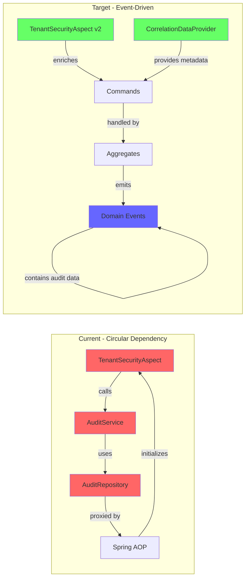

# Security Context Evolution: Breaking the Circular Dependency

## Overview

This document details the transformation of the `TenantSecurityAspect` from a service-dependent
component to a pure context enricher, effectively breaking the circular dependency while maintaining
audit trail integrity through Axon's correlation data mechanism.

## Current vs Target Architecture



## Implementation Steps

### 1. Create the SecurityContextCorrelationDataProvider

```kotlin
package com.axians.eaf.controlplane.infrastructure.axon.correlation

import com.axians.eaf.core.security.EafSecurityContextHolder
import org.axonframework.messaging.Message
import org.axonframework.messaging.correlation.CorrelationDataProvider
import org.slf4j.LoggerFactory
import org.springframework.stereotype.Component
import org.springframework.web.context.request.RequestContextHolder
import org.springframework.web.context.request.ServletRequestAttributes
import java.time.Instant
import java.util.*

/**
 * Provides security and request context as correlation data for all Axon messages.
 * This data automatically flows from commands to events, creating an implicit audit trail.
 */
@Component
class SecurityContextCorrelationDataProvider(
    private val securityContextHolder: EafSecurityContextHolder
) : CorrelationDataProvider {

    private val logger = LoggerFactory.getLogger(SecurityContextCorrelationDataProvider::class.java)

    companion object {
        // Standard correlation keys
        const val TENANT_ID_KEY = "tenant_id"
        const val USER_ID_KEY = "user_id"
        const val USER_EMAIL_KEY = "user_email"
        const val CORRELATION_ID_KEY = "correlation_id"
        const val REQUEST_ID_KEY = "request_id"
        const val SOURCE_IP_KEY = "source_ip"
        const val USER_AGENT_KEY = "user_agent"
        const val TIMESTAMP_KEY = "timestamp"
        const val SESSION_ID_KEY = "session_id"

        // Security context keys
        const val ROLES_KEY = "user_roles"
        const val PERMISSIONS_KEY = "user_permissions"
        const val AUTHENTICATION_METHOD_KEY = "auth_method"
    }

    override fun correlationDataFor(message: Message<*>): Map<String, *> {
        val correlationData = mutableMapOf<String, Any>()

        try {
            // Extract security context
            extractSecurityContext(correlationData)

            // Extract request context if available
            extractRequestContext(correlationData)

            // Add message tracking data
            addMessageTrackingData(correlationData, message)

        } catch (e: Exception) {
            logger.warn("Failed to extract complete correlation data: ${e.message}")
            // Always provide minimum required data
            correlationData[TENANT_ID_KEY] = "system"
            correlationData[USER_ID_KEY] = "system"
        }

        return correlationData
    }

    private fun extractSecurityContext(data: MutableMap<String, Any>) {
        // Tenant ID (required)
        val tenantId = securityContextHolder.getTenantId()
        if (tenantId != null) {
            data[TENANT_ID_KEY] = tenantId
        } else {
            throw IllegalStateException("No tenant context available")
        }

        // User information
        val userId = securityContextHolder.getUserId()
        if (userId != null) {
            data[USER_ID_KEY] = userId

            // Additional user details if available
            securityContextHolder.getUserEmail()?.let {
                data[USER_EMAIL_KEY] = it
            }

            securityContextHolder.getUserRoles()?.let { roles ->
                data[ROLES_KEY] = roles.joinToString(",")
            }

            securityContextHolder.getUserPermissions()?.let { permissions ->
                data[PERMISSIONS_KEY] = permissions.joinToString(",")
            }
        }

        // Authentication method
        securityContextHolder.getAuthenticationMethod()?.let {
            data[AUTHENTICATION_METHOD_KEY] = it
        }
    }

    private fun extractRequestContext(data: MutableMap<String, Any>) {
        val requestAttributes = RequestContextHolder.getRequestAttributes()
        if (requestAttributes is ServletRequestAttributes) {
            val request = requestAttributes.request

            // Client IP address
            val clientIp = extractClientIp(request)
            data[SOURCE_IP_KEY] = clientIp

            // User agent
            request.getHeader("User-Agent")?.let {
                data[USER_AGENT_KEY] = it
            }

            // Session ID if available
            request.session?.id?.let {
                data[SESSION_ID_KEY] = it
            }

            // Request ID from header if present
            request.getHeader("X-Request-ID")?.let {
                data[REQUEST_ID_KEY] = it
            }
        }
    }

    private fun addMessageTrackingData(data: MutableMap<String, Any>, message: Message<*>) {
        // Correlation ID - either from existing metadata or generate new
        val correlationId = message.metaData[CORRELATION_ID_KEY]?.toString()
            ?: UUID.randomUUID().toString()
        data[CORRELATION_ID_KEY] = correlationId

        // Timestamp
        data[TIMESTAMP_KEY] = Instant.now().toString()
    }

    private fun extractClientIp(request: javax.servlet.http.HttpServletRequest): String {
        // Check for common proxy headers
        val forwardedFor = request.getHeader("X-Forwarded-For")
        if (!forwardedFor.isNullOrBlank()) {
            return forwardedFor.split(",")[0].trim()
        }

        val realIp = request.getHeader("X-Real-IP")
        if (!realIp.isNullOrBlank()) {
            return realIp
        }

        return request.remoteAddr ?: "unknown"
    }
}
```

### 2. Refactor TenantSecurityAspect

```kotlin
package com.axians.eaf.controlplane.infrastructure.security.aspect

import com.axians.eaf.controlplane.infrastructure.security.annotation.RequiresTenant
import com.axians.eaf.core.security.EafSecurityContextHolder
import org.aspectj.lang.JoinPoint
import org.aspectj.lang.ProceedingJoinPoint
import org.aspectj.lang.annotation.Around
import org.aspectj.lang.annotation.Aspect
import org.aspectj.lang.annotation.Before
import org.slf4j.LoggerFactory
import org.slf4j.MDC
import org.springframework.core.annotation.Order
import org.springframework.stereotype.Component

/**
 * Refactored security aspect that only enriches context without service dependencies.
 * Audit logging is now handled implicitly through event sourcing.
 */
@Aspect
@Component
@Order(1) // Execute early in the aspect chain
class TenantSecurityAspect(
    private val securityContextHolder: EafSecurityContextHolder
    // REMOVED: private val auditService: AuditService - Breaking the circular dependency!
) {

    private val logger = LoggerFactory.getLogger(TenantSecurityAspect::class.java)

    /**
     * Enriches MDC context before method execution for logging and tracing.
     * No longer performs audit logging - that's handled by event sourcing.
     */
    @Before("@annotation(requiresTenant)")
    fun enrichContextBeforeExecution(
        joinPoint: JoinPoint,
        requiresTenant: RequiresTenant
    ) {
        val tenantId = securityContextHolder.getTenantId()
        val userId = securityContextHolder.getUserId()

        // Enrich MDC for structured logging
        MDC.put("tenant_id", tenantId ?: "unknown")
        MDC.put("user_id", userId ?: "system")
        MDC.put("method", joinPoint.signature.toShortString())

        logger.debug(
            "Executing secured method {} for tenant {} by user {}",
            joinPoint.signature.name,
            tenantId,
            userId
        )
    }

    /**
     * Validates tenant access permissions.
     * Security violations will naturally be captured in the command rejection events.
     */
    @Around("@annotation(requiresTenant)")
    fun validateTenantAccess(
        joinPoint: ProceedingJoinPoint,
        requiresTenant: RequiresTenant
    ): Any? {
        val startTime = System.currentTimeMillis()

        try {
            // Validate tenant context
            val userTenantId = securityContextHolder.getTenantId()
                ?: throw TenantContextMissingException("No tenant context available")

            // Extract target tenant if specified in method arguments
            val targetTenantId = extractTargetTenantId(joinPoint, requiresTenant)

            // Validate access
            if (targetTenantId != null && targetTenantId != userTenantId) {
                // Check for global access permissions
                if (!hasGlobalAccess()) {
                    throw TenantAccessDeniedException(
                        "User from tenant $userTenantId cannot access tenant $targetTenantId"
                    )
                }
            }

            // Proceed with the method execution
            return joinPoint.proceed()

        } catch (e: Exception) {
            // Log security violations at WARN level
            if (e is TenantAccessDeniedException || e is TenantContextMissingException) {
                logger.warn(
                    "Security violation in method {}: {}",
                    joinPoint.signature.toShortString(),
                    e.message
                )
            }
            throw e
        } finally {
            // Clean up MDC
            MDC.remove("tenant_id")
            MDC.remove("user_id")
            MDC.remove("method")

            val duration = System.currentTimeMillis() - startTime
            logger.debug(
                "Method {} completed in {}ms",
                joinPoint.signature.name,
                duration
            )
        }
    }

    private fun extractTargetTenantId(
        joinPoint: ProceedingJoinPoint,
        requiresTenant: RequiresTenant
    ): String? {
        // Implementation to extract tenant ID from method arguments
        // Similar to existing implementation but simplified
        return null // Simplified for brevity
    }

    private fun hasGlobalAccess(): Boolean {
        val roles = securityContextHolder.getUserRoles() ?: emptyList()
        return roles.any { it in listOf("SUPER_ADMIN", "PLATFORM_ADMIN") }
    }
}

// Custom exceptions for better error handling
class TenantContextMissingException(message: String) : SecurityException(message)
class TenantAccessDeniedException(message: String) : SecurityException(message)
```

### 3. Update Command Handlers to Use Correlation Data

```kotlin
package com.axians.eaf.controlplane.application.command

import org.axonframework.commandhandling.CommandHandler
import org.axonframework.eventsourcing.EventSourcingHandler
import org.axonframework.modelling.command.AggregateIdentifier
import org.axonframework.modelling.command.AggregateLifecycle

/**
 * Example aggregate showing how audit data flows naturally through events.
 */
class User {

    @AggregateIdentifier
    private lateinit var userId: UserId
    private lateinit var email: String
    private var active: Boolean = false

    /**
     * Command handler for user creation.
     * The correlation data (tenant_id, user_id, etc.) is automatically attached to events.
     */
    @CommandHandler
    constructor(command: CreateUserCommand) {
        // Business validation
        require(command.email.contains("@")) { "Invalid email format" }

        // Apply event - correlation data is automatically included
        AggregateLifecycle.apply(
            UserCreatedEvent(
                userId = command.userId,
                email = command.email,
                roles = command.roles,
                createdAt = Instant.now()
                // Note: tenant_id, user_id, ip_address etc. are added automatically
            )
        )
    }

    /**
     * Command handler for user activation.
     * Security context flows through to the event automatically.
     */
    @CommandHandler
    fun handle(command: ActivateUserCommand) {
        if (active) {
            throw IllegalStateException("User is already active")
        }

        AggregateLifecycle.apply(
            UserActivatedEvent(
                userId = userId,
                activatedAt = Instant.now()
                // Audit trail data added automatically via correlation
            )
        )
    }

    @EventSourcingHandler
    fun on(event: UserCreatedEvent) {
        this.userId = event.userId
        this.email = event.email
        this.active = false
    }

    @EventSourcingHandler
    fun on(event: UserActivatedEvent) {
        this.active = true
    }
}
```

### 4. Create Audit Projection

```kotlin
package com.axians.eaf.controlplane.infrastructure.projection

import com.axians.eaf.eventing.consumer.EafProjectorEventHandler
import org.axonframework.eventhandling.EventMessage
import org.springframework.stereotype.Component
import java.time.Instant
import java.util.UUID

/**
 * Projects all domain events into an audit trail.
 * This replaces the synchronous AuditService.
 */
@Component
class AuditTrailProjector(
    private val auditTrailRepository: AuditTrailRepository
) {

    /**
     * Generic handler that creates audit entries for all events.
     * The correlation data provides all necessary audit information.
     */
    @EafProjectorEventHandler(
        subject = "events.>",
        projectorName = "audit-trail-projector"
    )
    fun on(
        event: Any,
        eventId: UUID,
        @MetaData("tenant_id") tenantId: String,
        @MetaData("user_id") userId: String?,
        @MetaData("source_ip") sourceIp: String?,
        @MetaData("user_agent") userAgent: String?,
        @MetaData("correlation_id") correlationId: String?,
        @MetaData metadata: Map<String, Any>
    ) {
        val auditEntry = AuditTrailEntry(
            id = UUID.randomUUID(),
            eventId = eventId,
            tenantId = tenantId,
            performedBy = userId ?: "system",
            eventType = event.javaClass.simpleName,
            action = deriveAction(event),
            targetType = deriveTargetType(event),
            targetId = deriveTargetId(event),
            timestamp = Instant.now(),
            sourceIp = sourceIp ?: "unknown",
            userAgent = userAgent ?: "unknown",
            correlationId = correlationId,
            metadata = metadata,
            eventPayload = event
        )

        auditTrailRepository.save(auditEntry)
    }

    private fun deriveAction(event: Any): String {
        // Derive human-readable action from event type
        return event.javaClass.simpleName
            .replace("Event", "")
            .replace(Regex("([A-Z])"), " $1")
            .trim()
            .uppercase()
    }

    private fun deriveTargetType(event: Any): String {
        // Extract target type from event
        return when (event) {
            is UserEvent -> "USER"
            is TenantEvent -> "TENANT"
            is RoleEvent -> "ROLE"
            else -> "UNKNOWN"
        }
    }

    private fun deriveTargetId(event: Any): String {
        // Extract target ID using reflection or pattern matching
        return try {
            val idProperty = event.javaClass.getDeclaredField("id")
                ?: event.javaClass.getDeclaredField("${event.javaClass.simpleName.lowercase()}Id")
            idProperty.isAccessible = true
            idProperty.get(event).toString()
        } catch (e: Exception) {
            "unknown"
        }
    }
}
```

## Testing Strategy

### 1. Test CorrelationDataProvider

```kotlin
@SpringBootTest
class SecurityContextCorrelationDataProviderTest {

    @Autowired
    private lateinit var provider: SecurityContextCorrelationDataProvider

    @Test
    fun `should extract complete security context`() {
        // Given
        SecurityContextHolder.getContext().authentication = TestAuthentication(
            tenantId = "tenant-123",
            userId = "user-456",
            roles = listOf("ADMIN")
        )

        // When
        val correlationData = provider.correlationDataFor(GenericMessage<Any>("test"))

        // Then
        assertThat(correlationData).containsEntry("tenant_id", "tenant-123")
        assertThat(correlationData).containsEntry("user_id", "user-456")
        assertThat(correlationData).containsEntry("user_roles", "ADMIN")
        assertThat(correlationData).containsKey("correlation_id")
        assertThat(correlationData).containsKey("timestamp")
    }
}
```

### 2. Verify No Circular Dependencies

```kotlin
@SpringBootTest
class CircularDependencyTest {

    @Autowired
    private lateinit var applicationContext: ApplicationContext

    @Test
    fun `should start without circular dependency exceptions`() {
        // The test itself verifies successful startup
        assertThat(applicationContext).isNotNull

        // Verify the aspect no longer depends on AuditService
        val aspect = applicationContext.getBean(TenantSecurityAspect::class.java)
        val dependencies = applicationContext.getBeanFactory()
            .getDependenciesForBean("tenantSecurityAspect")

        assertThat(dependencies).doesNotContain("auditService")
    }
}
```

## Migration Checklist

- [ ] Deploy CorrelationDataProvider
- [ ] Update TenantSecurityAspect to remove AuditService dependency
- [ ] Deploy audit trail projector
- [ ] Verify audit events are being captured
- [ ] Remove @Lazy annotations
- [ ] Remove old AuditService and AuditRepository
- [ ] Update monitoring dashboards to use event-based audit data

## Benefits Achieved

1. **Circular Dependency Eliminated**: No more startup failures or @Lazy workarounds
2. **Performance Improved**: Audit logging no longer blocks request processing
3. **Audit Trail Integrity**: Events provide immutable, comprehensive audit trail
4. **Simplified Architecture**: Fewer moving parts, clearer separation of concerns
5. **Future-Proof**: Ready for event sourcing, CQRS, and advanced projections
