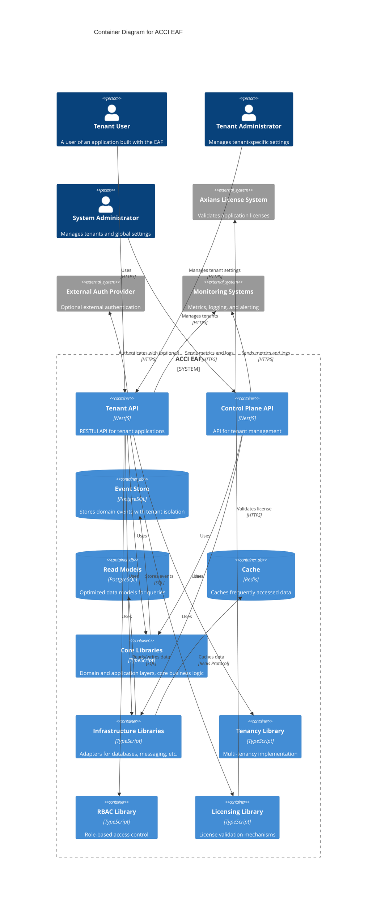

# arc42 Architektur-Dokumentation für ACCI EAF

## 1. Einleitung und Ziele

Das ACCI EAF (Axians Competence Center Infrastructure Enterprise Application Framework) ist ein internes Software-Framework, das die Entwicklung robuster, skalierbarer, sicherer und wartbarer Enterprise-Anwendungen beschleunigt. Es bietet eine solide Basis, wiederverwendbare Komponenten und klare Architektur-Patterns, um typische Herausforderungen in Enterprise-Projekten – wie Mandantenfähigkeit, Sicherheit, Compliance, Erweiterbarkeit und Wartbarkeit – gezielt zu adressieren.

**Zweck:**

- Technischer Leitfaden für Entwickler:innen und Architekt:innen, die das Framework nutzen oder weiterentwickeln.
- Etablierung einer konsistenten, best-practice-basierten Grundlage für Axians-Projekte.
- Schnellere Time-to-Market und höhere Codequalität für Kundenlösungen.

**Zielgruppe:**

- Entwicklungsteams bei Axians, die Enterprise-Anwendungen für Kunden bauen.
- Technische Architekt:innen, die Lösungen und Standards definieren.
- Security- & Compliance-Beauftragte (für Zertifizierung und Audits).

**Zentrale Ziele:**

- Entwicklung beschleunigen durch wiederverwendbare Bausteine und klare Patterns.
- Best Practices fördern: Hexagonale Architektur, CQRS/Event Sourcing, Multi-Tenancy, RBAC/ABAC, i18n, SBOM, Security by Design.
- Qualität und Wartbarkeit durch Modularität, Testbarkeit und Dokumentation (ADRs) verbessern.
- Axians-Geschäftsmodell durch integrierte Lizenzvalidierung unterstützen.
- Compliance mit Industriestandards (ISO 27001, SOC2) ermöglichen und Zertifizierungsprozesse unterstützen.

## 2. Randbedingungen

Die Architektur und Implementierung des ACCI EAF werden durch folgende Randbedingungen geprägt:

**Technische Randbedingungen:**

- TypeScript und Node.js als Hauptsprache und Laufzeitumgebung.
- Backend-Framework: NestJS; ORM: MikroORM; Datenbank: PostgreSQL; Caching: Redis.
- Monorepo-Struktur mit Nx; strikte Trennung von Apps und Libraries.
- Mandantenfähigkeit durch Row-Level Security (RLS) mit MikroORM-Filtern und `tenant_id`-Spalte.
- Event Sourcing und CQRS als zentrale Architektur-Patterns.
- Pluginsystem muss dynamische Entity-Discovery und Erweiterbarkeit ohne Core-Änderungen unterstützen.
- Quellcode und Doku standardmäßig auf Englisch (außer explizit anders gefordert).

**Organisatorische Randbedingungen:**

- Muss das Axians-Geschäftsmodell inkl. Lizenzvalidierung und Compliance-Anforderungen unterstützen.
- Für mehrere Teams und Projekte innerhalb von Axians konzipiert.
- Dokumentation und Architekturentscheidungen müssen gepflegt und nachvollziehbar sein (ADRs).

**Rechtliche/Compliance-Randbedingungen:**

- Muss Compliance mit ISO 27001, SOC2 und weiteren Standards ermöglichen.
- Security by Design: RLS, RBAC/ABAC, Auditierbarkeit und SBOM sind Pflicht.
- Datenschutz und Privacy-Anforderungen für alle Mandantendaten beachten.

**Out of Scope (V1):**

- Keine Frontend-UI-Frameworks oder Admin-UIs enthalten.
- Keine Advanced Observability (Metriken, Tracing), Advanced AuthN (OIDC, LDAP) oder Audit Trail in V1.
- Keine produktionsreifen CI/CD-Pipeline-Templates oder umfangreiche Plugin-Bibliothek in V1.

## 3. Systemabgrenzung und Kontext

Das ACCI EAF stellt die technische Basis für mandantenfähige Enterprise-Anwendungen bereit. Es wird von Anwendungsentwickler:innen, System- und Tenant-Admins genutzt und interagiert mit externen Systemen wie Lizenzvalidierung und Monitoring.

**System Context Diagram:**

```mermaid
C4Context
title System Context Diagram for ACCI EAF

Person(tenant_user, "Tenant User", "A user of an application built with the EAF, belongs to a specific tenant")
Person(tenant_admin, "Tenant Administrator", "Manages users, roles and permissions within a specific tenant")
Person(system_admin, "System Administrator", "Manages tenants and global settings")
Person(developer, "Application Developer", "Develops applications using the EAF")

System_Boundary(eaf, "ACCI EAF") {
    System(tenant_app, "Tenant Application", "Enterprise application built with EAF, supports multiple tenants")
    System(control_plane, "Control Plane API", "Manages tenants and global configuration")
}

System_Ext(license_system, "Axians License System", "Validates application licenses")
System_Ext(auth_provider, "External Auth Provider", "Optional external authentication (OAuth, OIDC)")
System_Ext(monitoring, "Monitoring Systems", "Metrics, logging, and alerting")

Rel(tenant_user, tenant_app, "Uses")
Rel(tenant_admin, tenant_app, "Manages tenant-specific settings, users, and roles")
Rel(system_admin, control_plane, "Manages tenants and global settings")
Rel(developer, eaf, "Builds applications using")

Rel(tenant_app, license_system, "Validates license", "HTTPS")
Rel(tenant_app, auth_provider, "Authenticates with (optional)", "HTTPS")
Rel(tenant_app, monitoring, "Sends metrics and logs", "HTTPS")
Rel(control_plane, monitoring, "Sends metrics and logs", "HTTPS")

UpdateLayoutConfig($c4ShapeInRow="3", $c4BoundaryInRow="1")
```

**Scope:**

- EAF-Core-Libraries und Infrastruktur sind in Scope.
- Die Control Plane API für Mandantenmanagement ist in Scope.
- Sample-Apps und Plugins als Referenzimplementierungen sind in Scope.
- Frontend-UIs, Advanced Observability und externe Admin-Tools sind für V1 out of Scope.

## 4. Lösungsstrategie

Das ACCI EAF basiert auf bewährten Architekturmustern und Prinzipien für Modularität, Erweiterbarkeit und Wartbarkeit:

- **Hexagonale Architektur (Ports & Adapters):** Strikte Trennung von Business-Logik und Infrastruktur/Frameworks. Core-Logik ist technologieagnostisch und über Ports exponiert; Adapter implementieren diese Ports für konkrete Technologien (z.B. REST, DB, Cache).
- **CQRS & Event Sourcing:** Klare Trennung von Command (Write) und Query (Read). Alle Zustandsänderungen werden als Events gespeichert – für Nachvollziehbarkeit, Auditierbarkeit und flexible Projektionen.
- **Mandantenfähigkeit via Row-Level Security:** Mandantentrennung auf Datenbankebene mit `tenant_id`-Spalte und MikroORM-Filtern, Tenant-Kontext via AsyncLocalStorage propagiert.
- **Pluginsystem:** Erweiterbarkeit über ein Plugin-Mechanismus, der dynamische Entity-Discovery und Registrierung unterstützt – neue Features ohne Core-Änderungen.
- **Security by Design:** RBAC/ABAC, sichere Authentifizierung und Compliance-Features sind von Anfang an integriert.
- **Monorepo mit Nx:** Fördert Code-Sharing, konsistente Tooling- und effiziente Abhängigkeitsverwaltung über Apps und Libraries.

Diese Strategien ermöglichen es, Enterprise-Anforderungen an Sicherheit, Skalierbarkeit, Erweiterbarkeit und Compliance zu erfüllen und gleichzeitig schnelle Entwicklung und Wartbarkeit zu unterstützen.

## 5. Bausteinsicht

Das EAF ist in modulare Bausteine mit klaren Verantwortlichkeiten gegliedert. Die Hauptkomponenten sind in Core-Libraries, Infrastruktur und Anwendungen gruppiert.

**Container Diagram:**



**Wichtige Bausteine:**

- **Core-Libraries:** Domain-Logik, Application-Services, CQRS-Busse, Event Sourcing, Ports.
- **Infrastructure-Libraries:** Adapter für Persistenz (MikroORM/PostgreSQL), Cache (Redis), Web (NestJS), i18n etc.
- **Tenancy-Library:** Tenant-Kontext-Management, RLS-Enforcement.
- **RBAC-Library:** Rollenbasierte Zugriffskontrolle, Guards, Berechtigungsmanagement.
- **Licensing-Library:** Lizenzvalidierungslogik.
- **Anwendungen:**
  - **Control Plane API:** Zentrales Mandantenmanagement.
  - **Sample App:** Referenzimplementierung für EAF-Consumer.

## 6. Laufzeitsicht

Die Laufzeitsicht beschreibt, wie die wichtigsten Abläufe im EAF verarbeitet werden. Die wichtigsten Szenarien sind:

**Command Flow:**

- HTTP-Request → NestJS Controller → CommandBus → Command Handler (lädt Aggregate via Repository) → Aggregate (validiert, erzeugt Domain Event) → Event Store Adapter (speichert Event) → EventBus.

**Event Flow:**

- EventBus (oder Polling des Stores) → Event Handler / Projector (aktualisiert Read Model).

**Query Flow:**

- HTTP-Request → NestJS Controller → QueryBus → Query Handler → Read Model Repository Adapter (liest aus optimiertem Read Model DB) → Response.

<!-- TODO: Sequenzdiagramme für diese Flows ergänzen (siehe ARCH.md) -->

## 7. Verteilungssicht

Die EAF-Anwendungen werden typischerweise als Docker-Container paketiert und per Docker Compose oder Orchestrierung (z.B. Kubernetes) ausgerollt. Der Monorepo-Build (Nx) erzeugt optimierte Artefakte pro Anwendung. Health-Check-Endpunkte unterstützen Orchestrierung und Monitoring. Graceful Shutdown ist implementiert.

**Deployment-Highlights:**

- Docker-Images für alle Anwendungen und Core-Libraries
- Offline-Tarball-Paket für Kunden-VM-Installation (inkl. Docker Compose, Images, Setup-Skripte)
- Health-Check-Endpunkte für Liveness/Readiness
- Zukunftssicher für Kubernetes-Deployment

<!-- TODO: Infrastruktur-/Deploymentdiagramm ergänzen -->

## 8. Querschnittskonzepte

Das EAF adressiert mehrere Querschnittsthemen, die für Enterprise-Anwendungen kritisch sind:

- **Security:** RBAC/ABAC, sichere Authentifizierung (JWT, Local), RLS für Mandantentrennung, Security-Headers (helmet), Rate Limiting, Auditierbarkeit.
- **Observability:** Strukturiertes Logging, Health-Check-Endpunkte, (zukünftig) Metriken und verteiltes Tracing.
- **Internationalisierung (i18n):** API-Responses und Validierungsfehler sind via nestjs-i18n übersetzbar; Locale Detection wird unterstützt.
- **Lizenzierung:** Integrierte Lizenzvalidierung (offline/online), robust gegen Manipulation, unterstützt Axians-Geschäftsmodell.
- **SBOM (Software Bill of Materials):** SBOM-Generierung (z.B. CycloneDX) ist Teil des CI/CD-Builds für alle Apps und Libraries.
- **Erweiterbarkeit:** Pluginsystem erlaubt Erweiterungen ohne Core-Änderungen, inkl. dynamischer Entity-Discovery.
- **Testbarkeit:** Hohe Testabdeckung, klare Teststrategie (Unit, Integration, E2E), Shared Test Utilities.

## 9. Architekturentscheidungen

Architekturentscheidungen werden als Architecture Decision Records (ADRs) im Verzeichnis `de/adr/` dokumentiert. Sie halten die Begründung für wichtige Designentscheidungen fest und ermöglichen Nachvollziehbarkeit für die Weiterentwicklung.

**Wichtige ADRs:**

- [001-rbac-library-selection.md](adr/001-rbac-library-selection.md): Auswahl der RBAC-Library (`casl` empfohlen)
- [002-sbom-tool-selection.md](adr/002-sbom-tool-selection.md): Tool und Format für SBOM-Generierung
- [003-license-validation-mechanism.md](adr/003-license-validation-mechanism.md): Mechanismus zur Lizenzvalidierung (offline/online)
- [006-rls-enforcement-strategy.md](adr/006-rls-enforcement-strategy.md): Strategie zur RLS-Durchsetzung mit MikroORM-Filtern
- [007-controlplane-bootstrapping.md](adr/007-controlplane-bootstrapping.md): Bootstrapping-Prozess für die Control Plane
- [008-plugin-migrations.md](adr/008-plugin-migrations.md): Plugin-Entity-Discovery und Migrationsmanagement
- [009-idempotent-event-handlers.md](adr/009-idempotent-event-handlers.md): Idempotenz in Event-Handlern
- [010-event-schema-evolution.md](adr/010-event-schema-evolution.md): Strategie für Event-Schema-Evolution

## 10. Qualitätsanforderungen

Die folgenden nicht-funktionalen Anforderungen (NFRs) definieren die Qualitätsziele für das EAF:

| ID     | Kategorie        | Anforderung                                                                                                   | Ziel/Messung                             |
|--------|------------------|----------------------------------------------------------------------------------------------------------------|------------------------------------------|
| NFR-01 | Performance      | API-Response-Zeiten für typische Queries niedrig; Command-Verarbeitung effizient; RLS darf kein Bottleneck sein | P95 Latenz < 200ms (Queries)             |
| NFR-02 | Skalierbarkeit   | Architektur muss horizontale Skalierung von Read/Write-Pfaden erlauben; Statelessness wo möglich              | Skalierungstests unter Last               |
| NFR-03 | Zuverlässigkeit  | Graceful Shutdown, robustes Error Handling, idempotente Event Handler, robuster Offline-Update-Prozess         | Tests, Code-Reviews, Update-Skript-Test   |
| NFR-04 | Sicherheit       | RLS, RBAC/ABAC, sichere AuthN/AuthZ, SBOM, Compliance-Support, Schutz vor OWASP Top 10                        | Security-Reviews, Pentest, Mapping-Check  |
| NFR-05 | Wartbarkeit      | SOLID-Prinzipien, Dokumentation, hohe Testabdeckung, klare Modulgrenzen                                       | Code Coverage > 85%, statische Analyse   |
| NFR-06 | Testbarkeit      | Core-Logik isoliert testbar, zuverlässige Integrationstests, einfache Unit-Tests                              | Testpyramide umgesetzt                   |
| NFR-07 | Erweiterbarkeit  | Pluginsystem erlaubt Erweiterung ohne Core-Änderungen, swappable Adapter                                      | Beispiel-Plugin, Design-Review           |
| NFR-08 | Dokumentation    | Umfassende Doku: Setup, Architektur, Konzepte, ADRs, API-Referenz                                            | Verfügbarkeit & Qualität der Doku        |
| NFR-09 | Dev Experience   | Intuitive Nutzung, gute IDE-Unterstützung, klare Fehler, einfaches Setup, einfache Plugin-Entwicklung         | Entwickler-Feedback                      |
| NFR-10 | i18n-Support     | API-Responses via nestjs-i18n übersetzbar                                                                    | Tests für lokalisierte Responses         |
| NFR-11 | Lizenzierung     | Hybrid-Validierungsmechanismus zuverlässig und sicher                                                        | Design-Review, Tests                     |
| NFR-12 | Compliance       | SBOM-Generierung, Compliance-Support im Design                                                              | SBOM im Build, Design-Reviews            |
| NFR-13 | Deployment       | Tarball-Paket enthält alle Artefakte für Offline-Install, robuste Setup-/Update-Skripte                      | Install-/Update-Test vom Tarball         |

## 11. Risiken und technische Schulden

Folgende Risiken, offene Fragen und technische Schulden wurden identifiziert:

- **Lizenzierung:** Details der Lizenzvalidierung (Dateiformat, Signatur, Online-API, Fehlerbehandlung) noch offen.
- **RLS-Durchsetzung:** Best Practices für Konfiguration und dynamische Übergabe von tenant_id an MikroORM-Filter im NestJS-Kontext.
- **Plugin-Entity-Discovery:** Zuverlässige Discovery und Migrationsmanagement für Plugin-Entities, v.a. im Offline-Setup.
- **Control Plane Bootstrapping:** Prozess zur Erstellung des ersten Tenants und System-Admins.
- **Event-Schema-Evolution:** Langfristige Strategie für Event-Schema-Evolution und Abwärtskompatibilität.
- **Audit Trail:** Dedizierter Audit-Trail-Service/Modul ist für V1 out of Scope, aber für Compliance in Zukunft nötig.
- **Advanced Observability:** Metriken und verteiltes Tracing noch nicht implementiert.
- **RBAC/ABAC-Modell:** Weitere Verfeinerung und Erweiterung des Berechtigungsmodells ggf. nötig.
- **Deployment-Automatisierung:** Produktionsreife CI/CD-Pipeline-Templates sind in V1 nicht enthalten.
- **Technische Schulden:** Im Code und in der Doku als TBD markierte Bereiche müssen iterativ adressiert werden.

## 12. Glossar

- **ACCI EAF:** Axians Competence Center Infrastructure Enterprise Application Framework
- **RLS:** Row-Level Security. Zugriffsbeschränkung auf Datenbankzeilen, hier via tenant_id.
- **RBAC:** Role-Based Access Control. Zugriff basierend auf Benutzerrollen.
- **ABAC:** Attribute-Based Access Control. Zugriff basierend auf Attributen (hier: Ownership).
- **Control Plane:** Separate API für zentrales Mandantenmanagement durch System-Admins.
- **Tenant-Kontext:** Information, die den aktuellen Mandanten für eine Operation identifiziert.
- **Event Sourcing:** Speicherung aller Zustandsänderungen als Event-Sequenz.
- **CQRS:** Command Query Responsibility Segregation. Trennung von Lese- und Schreiboperationen.
- **Plugin:** Erweiterungsmechanismus für Features/Entities ohne Core-Änderungen.
- **SBOM:** Software Bill of Materials. Liste aller Komponenten der Software, für Compliance-Zwecke.

// Ende der arc42-Dokumentation
