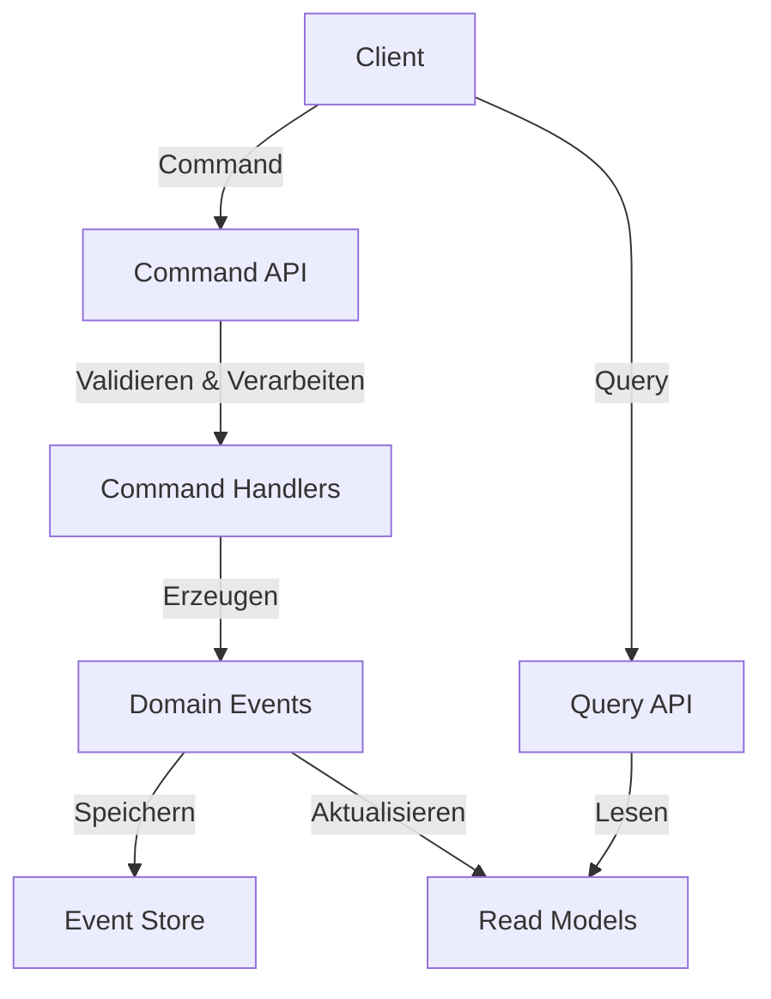
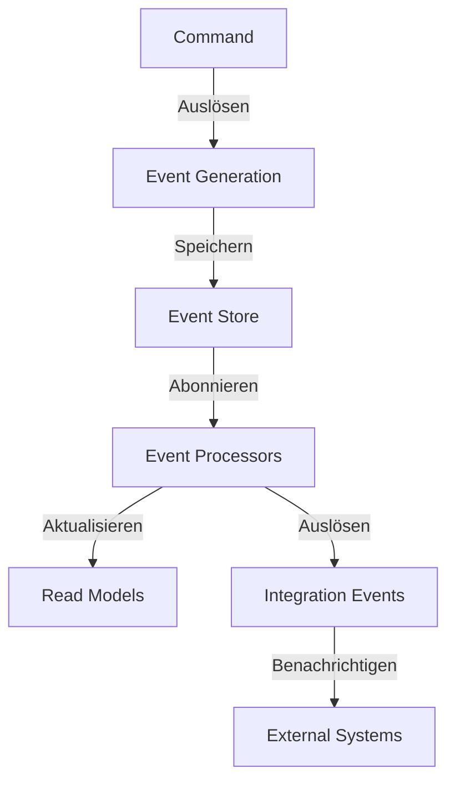

# CQRS und Event Sourcing im Enterprise Application Framework

## Überblick

Dieses Dokument beschreibt die Implementierung des Command Query Responsibility Segregation (CQRS) und Event Sourcing Patterns im ACCI Enterprise Application Framework (EAF). Diese Architekturentscheidung bildet die Grundlage für eine skalierbare, wartbare und robuste Anwendungsstruktur.

## CQRS: Grundprinzipien

CQRS trennt die Lese- und Schreiboperationen einer Anwendung, was mehrere Vorteile bietet:

1. **Spezialisierte Optimierung**: Lese- und Schreibmodelle können unabhängig voneinander optimiert werden.
2. **Skalierbarkeit**: Lese- und Schreibvorgänge können separat skaliert werden, je nach Bedarf.
3. **Bereichstrennung**: Klare Abgrenzung zwischen Kerndomänenlogik und Leseoperationen.
4. **Komplexitätsmanagement**: Bessere Handhabung komplexer Geschäftslogik durch Trennung der Verantwortlichkeiten.

### Implementierung im EAF



#### Command-Seite

Im EAF sind Commands unveränderliche Objekte, die eine Benutzerabsicht darstellen:

```typescript
interface CreateUserCommand {
  readonly type: 'CREATE_USER';
  readonly payload: {
    readonly userId: string;
    readonly email: string;
    readonly firstName: string;
    readonly lastName: string;
    readonly roleId: string;
  };
}
```

Command-Handler validieren und verarbeiten diese Commands:

```typescript
class CreateUserCommandHandler implements CommandHandler<CreateUserCommand> {
  constructor(private eventStore: EventStore) {}

  async execute(command: CreateUserCommand): Promise<void> {
    // Validierung
    this.validateCommand(command);
    
    // Erzeugung des Domain Events
    const userCreatedEvent: UserCreatedEvent = {
      type: 'USER_CREATED',
      aggregateId: command.payload.userId,
      payload: {
        email: command.payload.email,
        firstName: command.payload.firstName,
        lastName: command.payload.lastName,
        roleId: command.payload.roleId,
        createdAt: new Date().toISOString()
      }
    };
    
    // Speichern des Events
    await this.eventStore.save(userCreatedEvent);
  }
  
  private validateCommand(command: CreateUserCommand): void {
    // Implementierung der Validierungslogik
  }
}
```

#### Query-Seite

Die Abfrageseite verwendet spezialisierte Lesemodelle:

```typescript
interface UserReadModel {
  id: string;
  email: string;
  fullName: string;
  role: string;
  createdAt: string;
  lastLogin: string;
}

class UserQueryService {
  constructor(private readRepository: ReadRepository) {}
  
  async getUserById(id: string): Promise<UserReadModel> {
    return this.readRepository.findById('users', id);
  }
  
  async searchUsers(criteria: UserSearchCriteria): Promise<UserReadModel[]> {
    return this.readRepository.search('users', criteria);
  }
}
```

## Event Sourcing: Grundprinzipien

Event Sourcing speichert alle Änderungen am Anwendungszustand als Sequenz von Events, anstatt nur den aktuellen Zustand zu speichern.

1. **Vollständiger Audit-Trail**: Jede Änderung wird als Event erfasst.
2. **Zeitreisen**: Möglichkeit, den Systemzustand zu einem beliebigen vergangenen Zeitpunkt zu rekonstruieren.
3. **Ereignisbasierte Kommunikation**: Natürliche Integration mit ereignisgesteuerten Architekturen.
4. **Wiederherstellbarkeit**: Robuste Wiederherstellungsmechanismen bei Systemfehlern.

### Implementierung im EAF



#### Event-Struktur

Events im EAF folgen einem einheitlichen Format:

```typescript
interface DomainEvent {
  readonly type: string;
  readonly aggregateId: string;
  readonly payload: unknown;
  readonly metadata?: {
    readonly timestamp: string;
    readonly userId?: string;
    readonly correlationId?: string;
    readonly version: number;
  };
}
```

#### Event Store

Der Event Store ist für die persistente Speicherung aller Domain Events verantwortlich:

```typescript
interface EventStore {
  save(event: DomainEvent): Promise<void>;
  getByAggregateId(aggregateId: string): Promise<DomainEvent[]>;
  subscribe(eventType: string, callback: EventCallback): void;
}
```

#### Event Processors

Event Processors aktualisieren die Lesemodelle basierend auf den gespeicherten Events:

```typescript
class UserProjector implements EventProcessor {
  constructor(private readRepository: ReadRepository) {}
  
  async process(event: DomainEvent): Promise<void> {
    switch (event.type) {
      case 'USER_CREATED':
        await this.handleUserCreated(event);
        break;
      case 'USER_UPDATED':
        await this.handleUserUpdated(event);
        break;
      case 'USER_ROLE_CHANGED':
        await this.handleUserRoleChanged(event);
        break;
    }
  }
  
  private async handleUserCreated(event: UserCreatedEvent): Promise<void> {
    const { email, firstName, lastName, roleId } = event.payload;
    await this.readRepository.create('users', {
      id: event.aggregateId,
      email,
      fullName: `${firstName} ${lastName}`,
      role: roleId,
      createdAt: event.metadata.timestamp,
      lastLogin: null
    });
  }
  
  // Weitere Handler-Methoden...
}
```

## Vorteile im Enterprise-Kontext

1. **Skalierbarkeit**: Die Trennung ermöglicht unabhängige Skalierung von Lese- und Schreibvorgängen.
2. **Auditierbarkeit**: Vollständiger Verlauf aller Änderungen für Compliance und Prüfung.
3. **Resilienz**: Robustere Fehlerbehandlung und Wiederherstellungsmechanismen.
4. **Evolution**: Einfacheres Hinzufügen neuer Features ohne Beeinträchtigung bestehender Funktionalität.
5. **Geschäftserkenntnisse**: Events bilden die Grundlage für Geschäftsanalysen und Reporting.

## Kompromisse und Komplexitätsmanagement

1. **Erhöhte Komplexität**: Gezielte Abstraktion und Tooling reduzieren die erhöhte Komplexität.
2. **Konsistenzmodell**: Das EAF verwendet "eventual consistency" mit strategischen sofortigen Konsistenzpunkten.
3. **Lernkurve**: Tooling, Dokumentation und Trainingsmaterialien unterstützen das Onboarding.

## Schema-Evolution und Versionierung

Das EAF implementiert eine robuste Strategie zur Handhabung von Event-Schema-Änderungen:

1. **Additive Änderungen**: Neue Felder sind rückwärtskompatibel.
2. **Ereignisversionierung**: Größere Schema-Änderungen werden durch versionierte Event-Typen verwaltet.
3. **Upcasting**: Konvertierungsmechanismen für ältere Event-Formate.

## Performance-Überlegungen

1. **Event-Snapshots**: Regelmäßige Zustandssnapshots reduzieren die Rekonstruktionszeit.
2. **Selektive Denormalisierung**: Optimierte Lesemodelle für häufige Abfragemuster.
3. **Caching-Strategien**: Mehrschichtiges Caching für Lesemodelle und Aggregate.

## Integration mit externen Systemen

Das EAF verwendet "Integration Events" für die Kommunikation mit externen Systemen:

```typescript
interface IntegrationEvent {
  readonly type: string;
  readonly payload: unknown;
  readonly metadata: {
    readonly timestamp: string;
    readonly correlationId: string;
  };
}

class IntegrationEventPublisher {
  constructor(private messageBroker: MessageBroker) {}
  
  async publish(event: IntegrationEvent): Promise<void> {
    await this.messageBroker.publish('integration-events', event);
  }
}
```

## Beobachtbarkeit und Debugging

1. **Event-Visualisierung**: Tools zur Darstellung von Event-Strömen und Aggregat-Zuständen.
2. **Korrelation**: Durchgängige Correlation-IDs durch alle Systemebenen.
3. **Debugging-Tools**: Spezielle Debugging-Werkzeuge für ereignisbasierte Systeme.

## Zusammenfassung

Die Kombination von CQRS und Event Sourcing im EAF bietet eine robuste Architektur für komplexe Unternehmensanwendungen. Durch klare Trennung von Lese- und Schreibvorgängen, vollständige Ereignisverfolgung und flexible Datenmodellierung unterstützt das Framework sowohl aktuelle als auch zukünftige Geschäftsanforderungen.

## Referenzen

- Fowler, M. (2005). [Event Sourcing](https://martinfowler.com/eaaDev/EventSourcing.html)
- Young, G. (2010). [CQRS Documents](https://cqrs.files.wordpress.com/2010/11/cqrs_documents.pdf)
- Vernon, V. (2013). Implementing Domain-Driven Design. Addison-Wesley Professional.
- CQRS Journey by Microsoft: [GitHub Repository](https://github.com/microsoftarchive/cqrs-journey)
