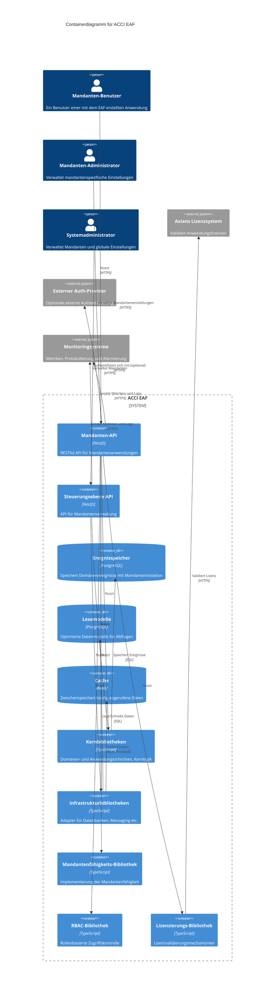
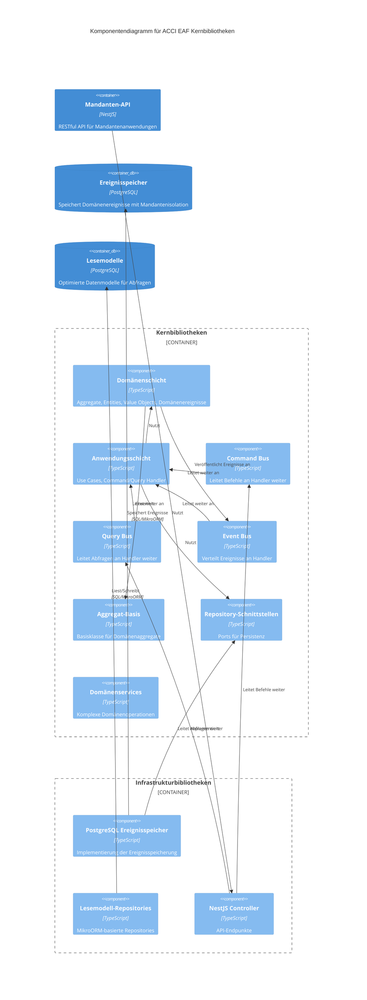
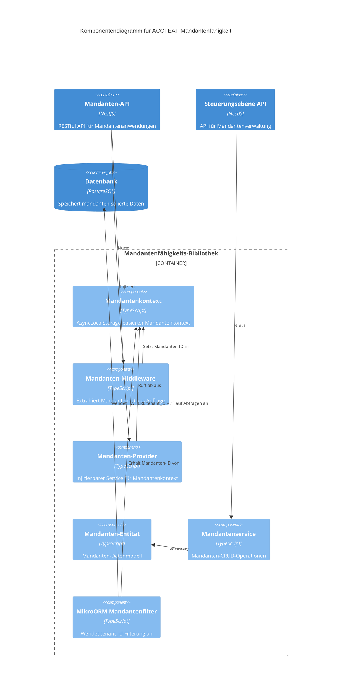

# C4 Systemkontextdiagramm - ACCI EAF

* **Version:** 1.0 Entwurf
* **Datum:** 2025-04-25
* **Status:** Entwurf

## Systemkontextdiagramm

```mermaid
C4Context
title Systemkontextdiagramm für ACCI EAF

Person(tenant_benutzer, "Mandanten-Benutzer", "Ein Benutzer einer mit dem EAF erstellten Anwendung, gehört zu einem bestimmten Mandanten")
Person(tenant_admin, "Mandanten-Administrator", "Verwaltet Benutzer, Rollen und Berechtigungen innerhalb eines bestimmten Mandanten")
Person(system_admin, "Systemadministrator", "Verwaltet Mandanten und globale Einstellungen")
Person(entwickler, "Anwendungsentwickler", "Entwickelt Anwendungen mit dem EAF")

System_Boundary(eaf, "ACCI EAF") {
    System(tenant_anwendung, "Mandanten-Anwendung", "Mit EAF erstellte Unternehmensanwendung, unterstützt mehrere Mandanten")
    System(steuerungs_api, "Steuerungsebene API", "Verwaltet Mandanten und globale Konfiguration")
}

System_Ext(lizenz_system, "Axians Lizenzsystem", "Validiert Anwendungslizenzen")
System_Ext(auth_provider, "Externer Auth-Provider", "Optionale externe Authentifizierung (OAuth, OIDC)")
System_Ext(monitoring, "Monitoringsysteme", "Metriken, Protokollierung und Alarmierung")

Rel(tenant_benutzer, tenant_anwendung, "Nutzt")
Rel(tenant_admin, tenant_anwendung, "Verwaltet mandantenspezifische Einstellungen, Benutzer und Rollen")
Rel(system_admin, steuerungs_api, "Verwaltet Mandanten und globale Einstellungen")
Rel(entwickler, eaf, "Erstellt Anwendungen mit")

Rel(tenant_anwendung, lizenz_system, "Validiert Lizenz", "HTTPS")
Rel(tenant_anwendung, auth_provider, "Authentifiziert sich mit (optional)", "HTTPS")
Rel(tenant_anwendung, monitoring, "Sendet Metriken und Logs", "HTTPS")
Rel(steuerungs_api, monitoring, "Sendet Metriken und Logs", "HTTPS")

UpdateLayoutConfig($c4ShapeInRow="3", $c4BoundaryInRow="1")
```

## Containerdiagramm



## Komponentendiagramm (Kernbibliotheken)



## Komponentendiagramm (Mandantenfähigkeit)



*Hinweis: Diese Diagramme sollten in einem Markdown-Editor oder Renderer betrachtet werden, der Mermaid-Syntax unterstützt. Sie verwenden die C4-Modellnotation, die eine hierarchische Methode zur Beschreibung der Softwarearchitektur auf verschiedenen Detailebenen bietet.*
