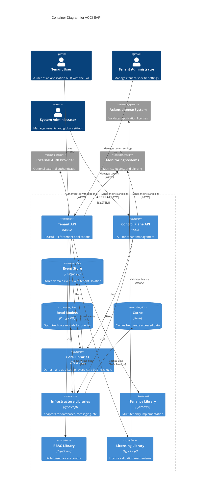
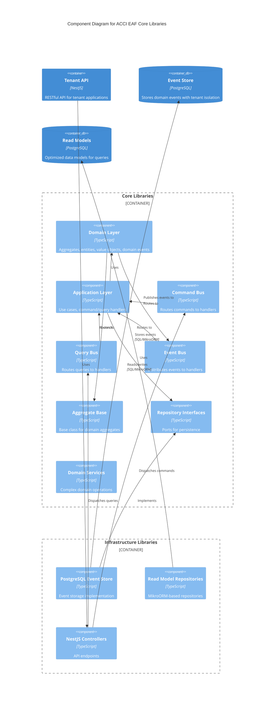
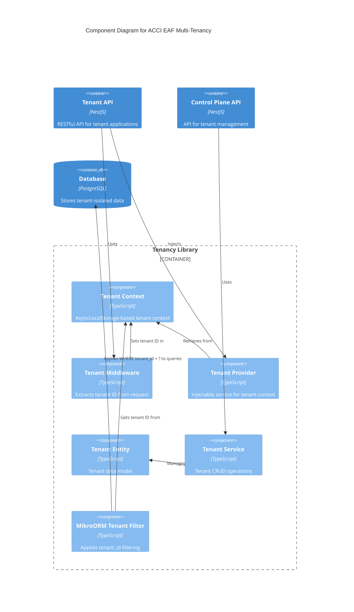

# C4 System Context Diagram - ACCI EAF

* **Version:** 1.0 Draft
* **Date:** 2025-04-25
* **Status:** Draft

## System Context Diagram

```mermaid
C4Context
title System Context Diagram for ACCI EAF

Person(tenant_user, "Tenant User", "A user of an application built with the EAF, belongs to a specific tenant")
Person(tenant_admin, "Tenant Administrator", "Manages users, roles and permissions within a specific tenant")
Person(system_admin, "System Administrator", "Manages tenants and global settings")
Person(developer, "Application Developer", "Develops applications using the EAF")

System_Boundary(eaf, "ACCI EAF") {
    System(tenant_app, "Tenant Application", "Enterprise application built with EAF, supports multiple tenants")
    System(control_plane, "Control Plane API", "Manages tenants and global configuration")
}

System_Ext(license_system, "Axians License System", "Validates application licenses")
System_Ext(auth_provider, "External Auth Provider", "Optional external authentication (OAuth, OIDC)")
System_Ext(monitoring, "Monitoring Systems", "Metrics, logging, and alerting")

Rel(tenant_user, tenant_app, "Uses")
Rel(tenant_admin, tenant_app, "Manages tenant-specific settings, users, and roles")
Rel(system_admin, control_plane, "Manages tenants and global settings")
Rel(developer, eaf, "Builds applications using")

Rel(tenant_app, license_system, "Validates license", "HTTPS")
Rel(tenant_app, auth_provider, "Authenticates with (optional)", "HTTPS")
Rel(tenant_app, monitoring, "Sends metrics and logs", "HTTPS")
Rel(control_plane, monitoring, "Sends metrics and logs", "HTTPS")

UpdateLayoutConfig($c4ShapeInRow="3", $c4BoundaryInRow="1")
```

## Container Diagram



## Component Diagram (Core Libraries)



## Component Diagram (Multi-Tenancy)



*Note: These diagrams should be viewed in a Markdown editor or renderer that supports Mermaid syntax. They use the C4 model notation which provides a hierarchical way to describe software architecture at different levels of detail.*
