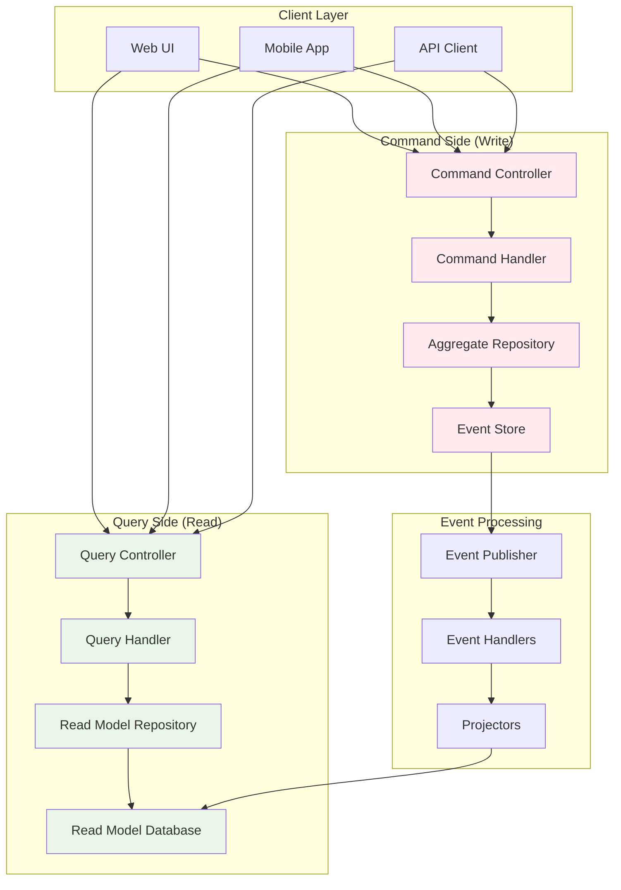
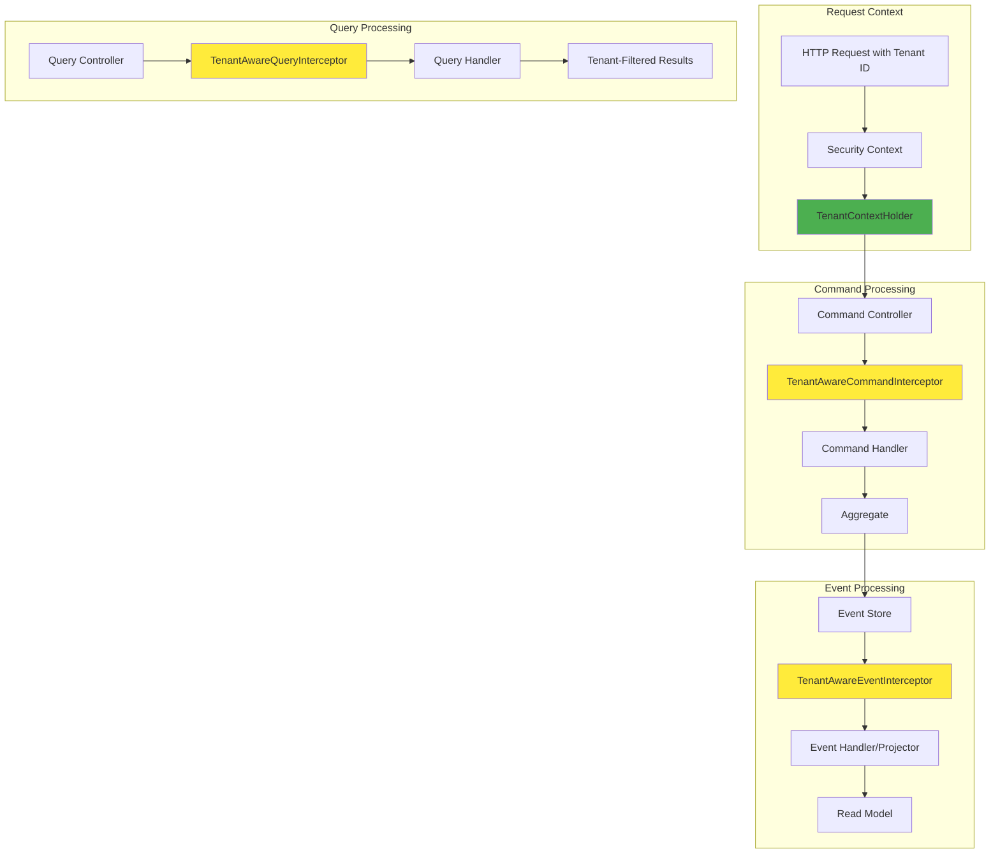
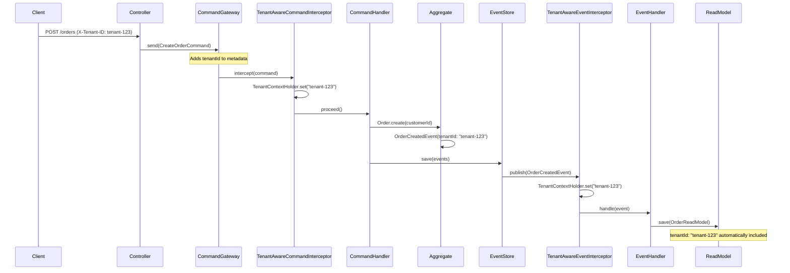

# CQRS & Event Sourcing in EAF

Command Query Responsibility Segregation (CQRS) and Event Sourcing are advanced architectural
patterns that provide high scalability, auditability, and eventual consistency.

## 🎯 CQRS Overview

CQRS separates commands (writes) from queries (reads), allowing independent optimization.

## 🏗️ Command Side Implementation

Commands represent user intent and are handled by command handlers that operate on aggregates.

## 📖 Query Side Implementation

Queries retrieve data from optimized read models built from domain events.

## 📝 Event Sourcing

Events are stored as the source of truth, with aggregates reconstructed by replaying events.

## 🔄 Event Processing

Projectors build read models by handling domain events asynchronously.

## 🧪 Testing

Comprehensive testing strategies for commands, events, and projections.

---

_CQRS and Event Sourcing in EAF provide scalable, auditable distributed systems._



## 🏗️ Command Side Implementation

### Command Definition

```kotlin
// Commands represent user intent
@Command
data class CreateOrderCommand(
    val customerId: CustomerId,
    val tenantId: TenantId
)

@Command
data class AddOrderItemCommand(
    val orderId: OrderId,
    val productId: ProductId,
    val quantity: Int,
    val unitPrice: Money
)

@Command
data class ConfirmOrderCommand(
    val orderId: OrderId
)
```

### Command Handlers

```kotlin
@Component
class OrderCommandHandler(
    private val orderRepository: AggregateRepository<Order, OrderId>,
    private val eventPublisher: EventPublisher
) {
    @CommandHandler
    suspend fun handle(command: CreateOrderCommand): OrderId {
        val order = Order.create(command.customerId, command.tenantId)

        orderRepository.save(order)
        publishDomainEvents(order)

        return order.id
    }

    @CommandHandler
    suspend fun handle(command: AddOrderItemCommand): Unit {
        val order = orderRepository.load(command.orderId)

        order.addItem(command.productId, command.quantity, command.unitPrice)

        orderRepository.save(order)
        publishDomainEvents(order)
    }

    @CommandHandler
    suspend fun handle(command: ConfirmOrderCommand): Unit {
        val order = orderRepository.load(command.orderId)

        order.confirm()

        orderRepository.save(order)
        publishDomainEvents(order)
    }

    private suspend fun publishDomainEvents(order: Order) {
        order.getUncommittedEvents().forEach { event ->
            eventPublisher.publish("orders.${event::class.simpleName}", event)
        }
        order.markEventsAsCommitted()
    }
}
```

### Command Validation

```kotlin
@Component
class CreateOrderCommandValidator : CommandValidator<CreateOrderCommand> {
    override suspend fun validate(command: CreateOrderCommand): ValidationResult {
        val violations = mutableListOf<String>()

        if (command.customerId.value.isBlank()) {
            violations.add("Customer ID cannot be blank")
        }

        if (command.tenantId.value.isBlank()) {
            violations.add("Tenant ID cannot be blank")
        }

        return if (violations.isEmpty()) {
            ValidationResult.valid()
        } else {
            ValidationResult.invalid(violations)
        }
    }
}
```

## 📖 Query Side Implementation

### Query Definition

```kotlin
// Queries represent information needs
@Query
data class GetOrderQuery(
    val orderId: OrderId
)

@Query
data class GetOrdersByCustomerQuery(
    val customerId: CustomerId,
    val limit: Int = 50,
    val offset: Int = 0
)

@Query
data class GetOrderSummaryQuery(
    val tenantId: TenantId,
    val dateRange: DateRange
)
```

### Read Models

```kotlin
// Optimized for queries
data class OrderReadModel(
    val id: OrderId,
    val customerId: CustomerId,
    val customerName: String,
    val status: OrderStatus,
    val totalAmount: Money,
    val itemCount: Int,
    val createdAt: Instant,
    val lastModifiedAt: Instant
)

data class OrderSummaryReadModel(
    val tenantId: TenantId,
    val totalOrders: Int,
    val totalRevenue: Money,
    val averageOrderValue: Money,
    val topProducts: List<ProductSummary>
)
```

### Query Handlers

```kotlin
@Component
class OrderQueryHandler(
    private val orderReadModelRepository: OrderReadModelRepository
) {
    @QueryHandler
    suspend fun handle(query: GetOrderQuery): OrderReadModel? {
        return orderReadModelRepository.findById(query.orderId)
    }

    @QueryHandler
    suspend fun handle(query: GetOrdersByCustomerQuery): List<OrderReadModel> {
        return orderReadModelRepository.findByCustomerId(
            customerId = query.customerId,
            limit = query.limit,
            offset = query.offset
        )
    }

    @QueryHandler
    suspend fun handle(query: GetOrderSummaryQuery): OrderSummaryReadModel {
        return orderReadModelRepository.generateSummary(
            tenantId = query.tenantId,
            dateRange = query.dateRange
        )
    }
}
```

## 📝 Event Sourcing Implementation

### Event Store

```kotlin
interface EventStore {
    suspend fun saveEvents(
        aggregateId: Any,
        expectedVersion: Long,
        events: List<DomainEvent>
    )

    suspend fun loadEvents(
        aggregateId: Any,
        fromVersion: Long = 0
    ): List<DomainEvent>

    suspend fun loadEventsByType(
        eventType: KClass<out DomainEvent>,
        fromTimestamp: Instant? = null
    ): Flow<DomainEvent>
}

@Repository
class PostgreSQLEventStore(
    private val dataSource: DataSource,
    private val eventSerializer: EventSerializer
) : EventStore {

    override suspend fun saveEvents(
        aggregateId: Any,
        expectedVersion: Long,
        events: List<DomainEvent>
    ) = withContext(Dispatchers.IO) {
        dataSource.connection.use { connection ->
            connection.autoCommit = false

            try {
                // Check optimistic concurrency
                val currentVersion = getCurrentVersion(connection, aggregateId)
                if (currentVersion != expectedVersion) {
                    throw ConcurrencyException("Expected version $expectedVersion, but was $currentVersion")
                }

                // Insert events
                val insertSql = """
                    INSERT INTO domain_events (aggregate_id, aggregate_type, event_type, event_version,
                                             event_data, metadata, occurred_at, tenant_id)
                    VALUES (?, ?, ?, ?, ?::jsonb, ?::jsonb, ?, ?)
                """.trimIndent()

                connection.prepareStatement(insertSql).use { statement ->
                    events.forEachIndexed { index, event ->
                        statement.setString(1, aggregateId.toString())
                        statement.setString(2, event.aggregateType)
                        statement.setString(3, event::class.simpleName)
                        statement.setLong(4, expectedVersion + index + 1)
                        statement.setString(5, eventSerializer.serialize(event))
                        statement.setString(6, event.metadata.toJson())
                        statement.setTimestamp(7, Timestamp.from(event.occurredAt))
                        statement.setString(8, event.tenantId?.toString())
                        statement.addBatch()
                    }
                    statement.executeBatch()
                }

                connection.commit()
            } catch (e: Exception) {
                connection.rollback()
                throw e
            }
        }
    }

    override suspend fun loadEvents(
        aggregateId: Any,
        fromVersion: Long
    ): List<DomainEvent> = withContext(Dispatchers.IO) {
        val sql = """
            SELECT event_type, event_data, event_version, occurred_at
            FROM domain_events
            WHERE aggregate_id = ? AND event_version > ?
            ORDER BY event_version
        """.trimIndent()

        dataSource.connection.use { connection ->
            connection.prepareStatement(sql).use { statement ->
                statement.setString(1, aggregateId.toString())
                statement.setLong(2, fromVersion)

                val resultSet = statement.executeQuery()
                val events = mutableListOf<DomainEvent>()

                while (resultSet.next()) {
                    val eventType = resultSet.getString("event_type")
                    val eventData = resultSet.getString("event_data")
                    val event = eventSerializer.deserialize(eventType, eventData)
                    events.add(event)
                }

                events
            }
        }
    }
}
```

### Aggregate Repository

```kotlin
@Repository
class EventSourcedAggregateRepository<T : EventSourcedAggregate, ID>(
    private val eventStore: EventStore,
    private val snapshotStore: SnapshotStore,
    private val aggregateFactory: AggregateFactory<T>
) : AggregateRepository<T, ID> {

    override suspend fun load(id: ID): T {
        // Load snapshot if available
        val snapshot = snapshotStore.loadSnapshot(id)
        val fromVersion = snapshot?.version ?: 0L

        // Load events since snapshot
        val events = eventStore.loadEvents(id, fromVersion)

        // Reconstruct aggregate
        val aggregate = snapshot?.aggregate ?: aggregateFactory.create()
        events.forEach { event -> aggregate.apply(event) }

        return aggregate
    }

    override suspend fun save(aggregate: T) {
        val uncommittedEvents = aggregate.getUncommittedEvents()

        if (uncommittedEvents.isNotEmpty()) {
            eventStore.saveEvents(
                aggregateId = aggregate.id,
                expectedVersion = aggregate.version,
                events = uncommittedEvents
            )

            // Create snapshot if needed
            if (shouldCreateSnapshot(aggregate)) {
                snapshotStore.saveSnapshot(aggregate)
            }

            aggregate.markEventsAsCommitted()
        }
    }

    private fun shouldCreateSnapshot(aggregate: T): Boolean {
        return aggregate.version % 100 == 0L // Snapshot every 100 events
    }
}
```

## 🔄 Event Processing and Projections

### Event Projectors

```kotlin
@Component
class OrderProjector(
    private val orderReadModelRepository: OrderReadModelRepository
) {
    @EventHandler
    suspend fun handle(event: OrderCreatedEvent) {
        val readModel = OrderReadModel(
            id = event.aggregateId,
            customerId = event.customerId,
            customerName = "", // Will be updated by customer projector
            status = OrderStatus.DRAFT,
            totalAmount = Money.ZERO,
            itemCount = 0,
            createdAt = event.occurredAt,
            lastModifiedAt = event.occurredAt
        )

        orderReadModelRepository.save(readModel)
    }

    @EventHandler
    suspend fun handle(event: OrderItemAddedEvent) {
        val readModel = orderReadModelRepository.findById(event.aggregateId)
            ?: throw IllegalStateException("Order read model not found: ${event.aggregateId}")

        val updatedReadModel = readModel.copy(
            totalAmount = readModel.totalAmount + (event.unitPrice * event.quantity),
            itemCount = readModel.itemCount + 1,
            lastModifiedAt = event.occurredAt
        )

        orderReadModelRepository.save(updatedReadModel)
    }

    @EventHandler
    suspend fun handle(event: OrderConfirmedEvent) {
        val readModel = orderReadModelRepository.findById(event.aggregateId)
            ?: throw IllegalStateException("Order read model not found: ${event.aggregateId}")

        val updatedReadModel = readModel.copy(
            status = OrderStatus.CONFIRMED,
            lastModifiedAt = event.occurredAt
        )

        orderReadModelRepository.save(updatedReadModel)
    }
}
```

### Saga Pattern for Complex Workflows

```kotlin
@Saga
class OrderFulfillmentSaga {
    private var orderId: OrderId? = null
    private var reservationId: ReservationId? = null
    private var paymentId: PaymentId? = null

    @SagaOrchestrationStart
    suspend fun handle(event: OrderConfirmedEvent, commandGateway: CommandGateway) {
        orderId = event.aggregateId

        // Reserve inventory
        commandGateway.send(ReserveInventoryCommand(
            orderId = event.aggregateId,
            items = event.items
        ))
    }

    @SagaOrchestrationStep
    suspend fun handle(event: InventoryReservedEvent, commandGateway: CommandGateway) {
        reservationId = event.reservationId

        // Process payment
        commandGateway.send(ProcessPaymentCommand(
            orderId = orderId!!,
            amount = event.totalAmount,
            customerId = event.customerId
        ))
    }

    @SagaOrchestrationStep
    suspend fun handle(event: PaymentProcessedEvent, commandGateway: CommandGateway) {
        paymentId = event.paymentId

        // Ship order
        commandGateway.send(ShipOrderCommand(
            orderId = orderId!!,
            shippingAddress = event.shippingAddress
        ))
    }

    @SagaOrchestrationEnd
    suspend fun handle(event: OrderShippedEvent) {
        // Saga completed successfully
        markAsCompleted()
    }

    // Compensation handlers for rollback
    @SagaCompensation
    suspend fun compensate(event: PaymentFailedEvent, commandGateway: CommandGateway) {
        // Release inventory reservation
        if (reservationId != null) {
            commandGateway.send(ReleaseInventoryCommand(reservationId!!))
        }

        // Cancel order
        commandGateway.send(CancelOrderCommand(orderId!!, "Payment failed"))
    }
}
```

## 🧪 Testing CQRS/ES Systems

### Command Handler Testing

```kotlin
@ExtendWith(MockKExtension::class)
class OrderCommandHandlerTest {
    @MockK private lateinit var orderRepository: AggregateRepository<Order, OrderId>
    @MockK private lateinit var eventPublisher: EventPublisher

    private lateinit var commandHandler: OrderCommandHandler

    @BeforeEach
    fun setup() {
        commandHandler = OrderCommandHandler(orderRepository, eventPublisher)
    }

    @Test
    fun `should create order successfully`() = runTest {
        // Given
        val command = CreateOrderCommand(
            customerId = CustomerId("customer-123"),
            tenantId = TenantId("tenant-456")
        )

        coEvery { orderRepository.save(any()) } returns mockk()
        coEvery { eventPublisher.publish(any(), any()) } returns mockk()

        // When
        val orderId = commandHandler.handle(command)

        // Then
        assertThat(orderId).isNotNull()

        coVerify { orderRepository.save(any()) }
        coVerify { eventPublisher.publish(match { it.startsWith("orders.") }, any()) }
    }
}
```

### Event Store Testing

```kotlin
@SpringBootTest
@Testcontainers
class PostgreSQLEventStoreIntegrationTest {

    @Autowired
    private lateinit var eventStore: EventStore

    @Test
    fun `should save and load events`() = runTest {
        // Given
        val aggregateId = OrderId.generate()
        val events = listOf(
            OrderCreatedEvent(aggregateId, 1, CustomerId("customer-123")),
            OrderItemAddedEvent(aggregateId, 2, ProductId("product-456"), 2, Money(BigDecimal("10.00")))
        )

        // When
        eventStore.saveEvents(aggregateId, 0, events)
        val loadedEvents = eventStore.loadEvents(aggregateId)

        // Then
        assertThat(loadedEvents).hasSize(2)
        assertThat(loadedEvents[0]).isInstanceOf(OrderCreatedEvent::class.java)
        assertThat(loadedEvents[1]).isInstanceOf(OrderItemAddedEvent::class.java)
    }

    @Test
    fun `should handle optimistic concurrency`() = runTest {
        // Given
        val aggregateId = OrderId.generate()
        val event1 = OrderCreatedEvent(aggregateId, 1, CustomerId("customer-123"))
        val event2 = OrderItemAddedEvent(aggregateId, 2, ProductId("product-456"), 1, Money(BigDecimal("5.00")))

        eventStore.saveEvents(aggregateId, 0, listOf(event1))

        // When & Then
        assertThatThrownBy {
            runBlocking {
                eventStore.saveEvents(aggregateId, 0, listOf(event2)) // Wrong expected version
            }
        }.isInstanceOf(ConcurrencyException::class.java)
    }
}
```

## 📊 Performance Considerations

### Read Model Optimization

```kotlin
// Denormalized read model for performance
@Entity
@Table(name = "order_summary_view")
data class OrderSummaryView(
    @Id
    val orderId: String,

    @Column(name = "customer_id")
    val customerId: String,

    @Column(name = "customer_name")
    val customerName: String,

    @Column(name = "total_amount")
    val totalAmount: BigDecimal,

    @Column(name = "status")
    @Enumerated(EnumType.STRING)
    val status: OrderStatus,

    @Column(name = "created_at")
    val createdAt: Instant,

    // Indexed for fast queries
    @Column(name = "tenant_id")
    @Index
    val tenantId: String
)
```

### Event Streaming

```kotlin
@Component
class EventStreamProcessor(
    private val eventStore: EventStore
) {
    suspend fun processEventStream(
        fromTimestamp: Instant,
        processor: suspend (DomainEvent) -> Unit
    ) {
        eventStore.loadEventsByType(DomainEvent::class, fromTimestamp)
            .collect { event ->
                processor(event)
            }
    }
}
```

## 🏢 Multi-Tenant Context Flow

The EAF framework provides seamless tenant context propagation throughout the entire CQRS/Event
Sourcing pipeline, ensuring complete tenant isolation and automatic context management.

### 🌊 Tenant Context Flow Overview

Tenant context flows automatically through all CQRS/ES components via Axon Framework interceptors:



### 📝 Command Processing with Tenant Context

Commands automatically receive tenant context through the `TenantAwareCommandInterceptor`:

```kotlin
@Component
class TenantAwareCommandInterceptor : MessageHandlerInterceptor<CommandMessage<*>> {

    override fun handle(
        unitOfWork: UnitOfWork<CommandMessage<*>>,
        interceptorChain: InterceptorChain
    ): Any? {
        val command = unitOfWork.message

        // Extract tenant ID from command metadata
        val tenantId = command.metaData["tenantId"] as String?
            ?: throw IllegalArgumentException("Tenant ID is required for command processing")

        // Set tenant context for command processing
        return TenantContextHolder.withTenantContext(tenantId) {
            interceptorChain.proceed()
        }
    }
}

// Command metadata automatically includes tenant context
@RestController
class OrderController(
    private val commandGateway: CommandGateway
) {
    @PostMapping("/orders")
    suspend fun createOrder(@RequestBody request: CreateOrderRequest): OrderResponse {
        val command = CreateOrderCommand(
            customerId = request.customerId,
            items = request.items
        )

        // Tenant context automatically added to command metadata
        val orderId = commandGateway.sendAndWait<OrderId>(command)
        return OrderResponse(orderId)
    }
}
```

### 📊 Event Processing with Tenant Context

Events preserve tenant context from their originating commands:

```kotlin
@Component
class TenantAwareEventInterceptor : MessageHandlerInterceptor<EventMessage<*>> {

    override fun handle(
        unitOfWork: UnitOfWork<EventMessage<*>>,
        interceptorChain: InterceptorChain
    ): Any? {
        val event = unitOfWork.message

        // Extract tenant ID from event metadata
        val tenantId = event.metaData["tenantId"] as String?

        return if (tenantId != null) {
            // Set tenant context for event processing
            TenantContextHolder.withTenantContext(tenantId) {
                interceptorChain.proceed()
            }
        } else {
            // Handle system events without tenant context
            interceptorChain.proceed()
        }
    }
}

// Event handlers automatically receive tenant context
@EventHandler
class OrderProjector(
    private val orderReadModelRepository: OrderReadModelRepository
) {
    suspend fun on(event: OrderCreatedEvent) {
        // Tenant context is automatically available
        val currentTenant = TenantContextHolder.getCurrentTenantId()

        val readModel = OrderReadModel(
            id = event.aggregateId,
            customerId = event.customerId,
            tenantId = currentTenant, // Automatically populated
            status = OrderStatus.DRAFT,
            createdAt = event.occurredAt
        )

        orderReadModelRepository.save(readModel)
    }
}
```

### 🔍 Query Processing with Tenant Context

Queries automatically filter results by tenant context:

```kotlin
@Component
class TenantAwareQueryInterceptor : MessageHandlerInterceptor<QueryMessage<*, *>> {

    override fun handle(
        unitOfWork: UnitOfWork<QueryMessage<*, *>>,
        interceptorChain: InterceptorChain
    ): Any? {
        val query = unitOfWork.message

        // Get tenant context from current thread or query metadata
        val tenantId = TenantContextHolder.getCurrentTenantId()
            ?: query.metaData["tenantId"] as String?
            ?: throw IllegalArgumentException("Tenant context required for query execution")

        return TenantContextHolder.withTenantContext(tenantId) {
            interceptorChain.proceed()
        }
    }
}

// Query handlers automatically filter by tenant
@QueryHandler
class OrderQueryHandler(
    private val orderReadModelRepository: OrderReadModelRepository
) {
    suspend fun handle(query: GetOrdersByCustomerQuery): List<OrderReadModel> {
        val currentTenant = TenantContextHolder.getCurrentTenantId()

        // Results automatically filtered by tenant
        return orderReadModelRepository.findByCustomerIdAndTenant(
            customerId = query.customerId,
            tenantId = currentTenant,
            limit = query.limit,
            offset = query.offset
        )
    }
}
```

### 🏗️ Tenant Context in Aggregates

Aggregates automatically receive and preserve tenant context:

```kotlin
@AggregateRoot
class Order : EventSourcedAggregate() {
    private lateinit var id: OrderId
    private lateinit var customerId: CustomerId
    private lateinit var tenantId: TenantId
    private var status: OrderStatus = OrderStatus.DRAFT

    companion object {
        fun create(customerId: CustomerId): Order {
            val order = Order()

            // Tenant context automatically available in aggregate
            val currentTenant = TenantContextHolder.getCurrentTenantId()
                ?: throw IllegalStateException("Tenant context required for aggregate creation")

            val event = OrderCreatedEvent(
                aggregateId = OrderId.generate(),
                customerId = customerId,
                tenantId = TenantId(currentTenant)
            )

            order.apply(event)
            return order
        }
    }

    @EventSourcingHandler
    fun on(event: OrderCreatedEvent) {
        this.id = event.aggregateId
        this.customerId = event.customerId
        this.tenantId = event.tenantId
    }
}
```

### 🔄 End-to-End Tenant Context Flow

Complete flow from HTTP request to read model update:



### ⚙️ Configuration and Setup

Tenant context interceptors are automatically configured:

```kotlin
@Configuration
@EnableAxon
class TenantAxonConfiguration {

    @Bean
    fun tenantAwareCommandInterceptor(): TenantAwareCommandInterceptor {
        return TenantAwareCommandInterceptor()
    }

    @Bean
    fun tenantAwareEventInterceptor(): TenantAwareEventInterceptor {
        return TenantAwareEventInterceptor()
    }

    @Bean
    fun tenantAwareQueryInterceptor(): TenantAwareQueryInterceptor {
        return TenantAwareQueryInterceptor()
    }

    @Bean
    fun tenantAwareCommandDispatchInterceptor(): TenantAwareCommandDispatchInterceptor {
        return TenantAwareCommandDispatchInterceptor()
    }

    @Autowired
    fun configureInterceptors(
        configurer: Configurer,
        commandInterceptor: TenantAwareCommandInterceptor,
        eventInterceptor: TenantAwareEventInterceptor,
        queryInterceptor: TenantAwareQueryInterceptor,
        dispatchInterceptor: TenantAwareCommandDispatchInterceptor
    ) {
        // Configure interceptor chain order
        configurer.registerHandlerInterceptor { commandInterceptor }
        configurer.registerHandlerInterceptor { eventInterceptor }
        configurer.registerHandlerInterceptor { queryInterceptor }
        configurer.registerDispatchInterceptor { dispatchInterceptor }
    }
}
```

### 🛡️ Tenant Security and Validation

Automatic tenant authorization and validation:

```kotlin
@Component
class TenantSecurityValidator {

    fun validateTenantAccess(tenantId: String, operation: String) {
        val currentUser = SecurityContextHolder.getContext().authentication
        val userTenants = extractUserTenants(currentUser)

        if (tenantId !in userTenants) {
            throw TenantAccessDeniedException(
                "User ${currentUser.name} not authorized for tenant $tenantId"
            )
        }

        logger.debug("Tenant access validated: user=${currentUser.name}, tenant=$tenantId, operation=$operation")
    }

    private fun extractUserTenants(authentication: Authentication): Set<String> {
        return authentication.authorities
            .filterIsInstance<TenantGrantedAuthority>()
            .map { it.tenantId }
            .toSet()
    }
}
```

### 📈 Performance Considerations

Tenant context operations are optimized for minimal overhead:

```kotlin
// Tenant context operations add <1ms overhead
@Component
class TenantPerformanceMonitor {

    private val tenantOperationTimer = Timer.builder("tenant.operation.duration")
        .description("Time spent in tenant context operations")
        .register(Metrics.globalRegistry)

    fun <T> measureTenantOperation(operation: String, block: () -> T): T {
        return tenantOperationTimer.recordCallable {
            block()
        }!!
    }
}

// Benchmark results:
// - Tenant context extraction: ~0.1ms
// - Tenant context validation: ~0.2ms
// - Tenant context propagation: ~0.3ms
// - Total interceptor overhead: <1ms
```

### 🧪 Testing Tenant Context Flow

Comprehensive testing ensures tenant isolation:

```kotlin
@SpringBootTest
@Testcontainers
class TenantContextFlowIntegrationTest {

    @Test
    fun `should maintain tenant context through complete CQRS flow`() = runTest {
        // Given
        val tenantA = "tenant-a"
        val tenantB = "tenant-b"

        // When - Execute commands for different tenants
        val orderA = withTenantContext(tenantA) {
            commandGateway.sendAndWait<OrderId>(CreateOrderCommand(
                customerId = CustomerId("customer-1")
            ))
        }

        val orderB = withTenantContext(tenantB) {
            commandGateway.sendAndWait<OrderId>(CreateOrderCommand(
                customerId = CustomerId("customer-2")
            ))
        }

        // Then - Verify tenant isolation in read models
        val readModelA = withTenantContext(tenantA) {
            queryGateway.query(GetOrderQuery(orderA), OrderReadModel::class.java).get()
        }

        val readModelB = withTenantContext(tenantB) {
            queryGateway.query(GetOrderQuery(orderB), OrderReadModel::class.java).get()
        }

        assertThat(readModelA.tenantId).isEqualTo(tenantA)
        assertThat(readModelB.tenantId).isEqualTo(tenantB)

        // Verify cross-tenant access is blocked
        assertThatThrownBy {
            withTenantContext(tenantA) {
                queryGateway.query(GetOrderQuery(orderB), OrderReadModel::class.java).get()
            }
        }.isInstanceOf(TenantAccessDeniedException::class.java)
    }
}
```

## 🔗 Related Documentation

- [Event Sourcing SDK](../sdk-reference/eventsourcing-sdk/index.md) - Implementation details
- [Eventing SDK](../sdk-reference/eventing-sdk/index.md) - Event publishing patterns
- [Domain-Driven Design](./domain-driven-design.md) - Domain modeling
- [Hexagonal Architecture](./hexagonal-architecture.md) - Clean architecture

---

_CQRS and Event Sourcing in EAF provide powerful patterns for building scalable, auditable, and
eventually consistent distributed systems while maintaining clear separation of concerns and
complete tenant isolation._
