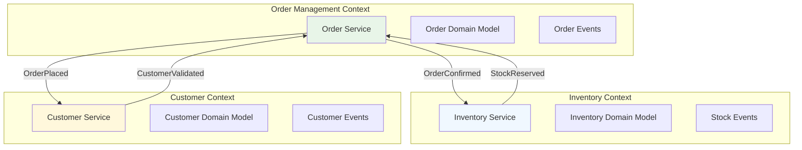
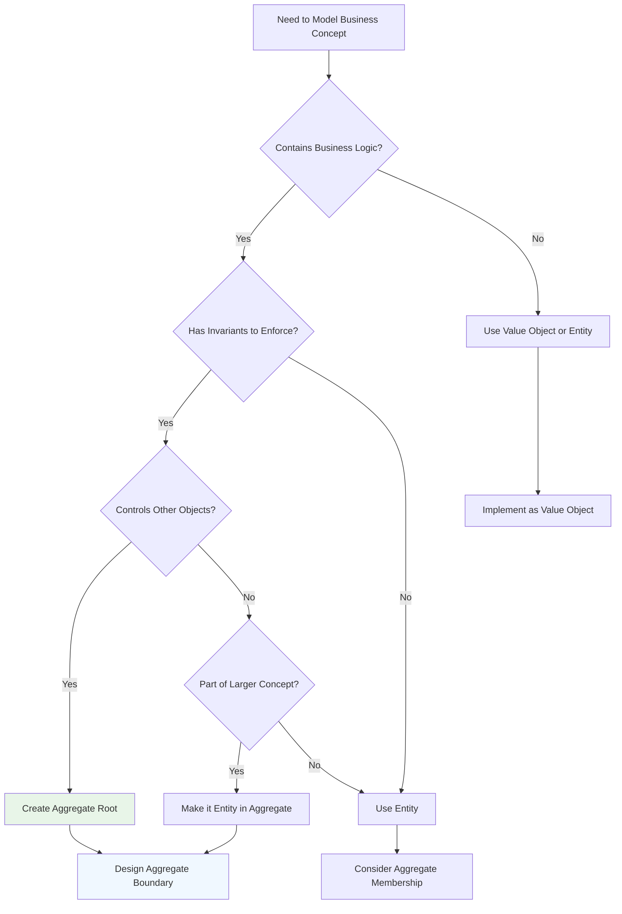
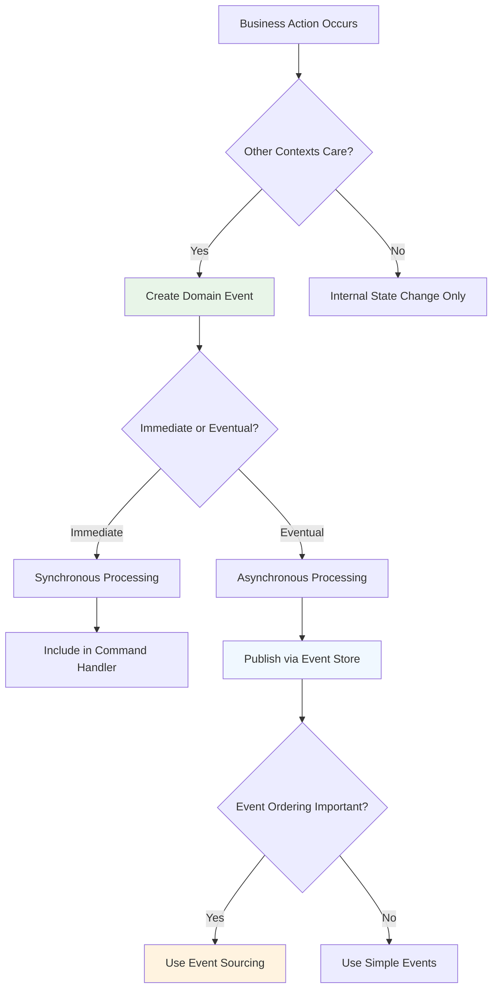

# Domain-Driven Design in EAF

Domain-Driven Design (DDD) is fundamental to the EAF architecture, providing a systematic approach
to modeling complex business domains while maintaining clean separation between business logic and
technical infrastructure.

## 🎯 DDD Philosophy in EAF

### Ubiquitous Language

The EAF enforces the use of ubiquitous language throughout the codebase:

```kotlin
// Business concepts modeled explicitly
data class CustomerId(val value: String)
data class OrderId(val value: String)

enum class OrderStatus {
    DRAFT,
    CONFIRMED,
    SHIPPED,
    DELIVERED,
    CANCELLED
}

// Domain events using business language
data class OrderConfirmedEvent(
    val orderId: OrderId,
    val customerId: CustomerId,
    val confirmedAt: Instant,
    val items: List<OrderItem>
)
```

### Strategic Design Patterns

#### Bounded Contexts

EAF services represent bounded contexts with clear boundaries:



#### Context Mapping

Services integrate through well-defined contracts:

```kotlin
// Anti-corruption layer for external service integration
@Component
class CustomerServiceClient(
    private val httpClient: HttpClient,
    private val customerMapper: CustomerMapper
) {
    suspend fun validateCustomer(customerId: CustomerId): CustomerValidation {
        val response = httpClient.get("/customers/${customerId.value}")

        // Transform external model to our domain model
        return customerMapper.toDomainModel(response)
    }
}

// Domain service using external data
@DomainService
class OrderValidationService(
    private val customerService: CustomerServiceClient
) {
    suspend fun validateOrderCreation(command: CreateOrderCommand): ValidationResult {
        val customerValidation = customerService.validateCustomer(command.customerId)

        return when {
            !customerValidation.isActive -> ValidationResult.invalid("Customer not active")
            !customerValidation.canPlaceOrders -> ValidationResult.invalid("Customer cannot place orders")
            else -> ValidationResult.valid()
        }
    }
}
```

## 🏗️ Tactical Design Patterns

### Aggregate Design

#### Aggregate Root Implementation

```kotlin
@AggregateRoot
class Order private constructor(
    val id: OrderId,
    private val customerId: CustomerId,
    private val tenantId: TenantId,
    private var status: OrderStatus = OrderStatus.DRAFT,
    private val items: MutableList<OrderItem> = mutableListOf(),
    private val events: MutableList<DomainEvent> = mutableListOf()
) {
    companion object {
        fun create(
            customerId: CustomerId,
            tenantId: TenantId
        ): Order {
            val orderId = OrderId.generate()
            val order = Order(orderId, customerId, tenantId)

            order.addEvent(OrderCreatedEvent(orderId, customerId, tenantId))
            return order
        }
    }

    // Business invariants enforced
    fun addItem(
        productId: ProductId,
        quantity: Int,
        unitPrice: Money
    ): Order {
        require(quantity > 0) { "Quantity must be positive" }
        require(status == OrderStatus.DRAFT) { "Cannot modify confirmed order" }

        val existingItem = items.find { it.productId == productId }

        if (existingItem != null) {
            existingItem.updateQuantity(existingItem.quantity + quantity)
        } else {
            val newItem = OrderItem(productId, quantity, unitPrice)
            items.add(newItem)
        }

        addEvent(OrderItemAddedEvent(id, productId, quantity, unitPrice))
        return this
    }

    fun confirm(): Order {
        require(items.isNotEmpty()) { "Cannot confirm empty order" }
        require(status == OrderStatus.DRAFT) { "Order already processed" }

        // Calculate totals and validate business rules
        val totalAmount = items.sumOf { it.totalPrice }
        require(totalAmount.amount > BigDecimal.ZERO) { "Order total must be positive" }

        status = OrderStatus.CONFIRMED
        addEvent(OrderConfirmedEvent(id, customerId, items.toList(), totalAmount))

        return this
    }

    fun cancel(reason: String): Order {
        require(status in listOf(OrderStatus.DRAFT, OrderStatus.CONFIRMED)) {
            "Cannot cancel $status order"
        }

        status = OrderStatus.CANCELLED
        addEvent(OrderCancelledEvent(id, reason))

        return this
    }

    // Event management
    private fun addEvent(event: DomainEvent) = events.add(event)

    fun getUncommittedEvents(): List<DomainEvent> = events.toList()

    fun markEventsAsCommitted() = events.clear()

    // Aggregate invariants
    fun isInDraftStatus(): Boolean = status == OrderStatus.DRAFT
    fun getTotalAmount(): Money = items.sumOf { it.totalPrice }
    fun getItemCount(): Int = items.size
}
```

#### Value Objects

```kotlin
@ValueObject
data class Money(
    val amount: BigDecimal,
    val currency: Currency = Currency.getInstance("EUR")
) {
    init {
        require(amount >= BigDecimal.ZERO) { "Amount cannot be negative" }
    }

    operator fun plus(other: Money): Money {
        require(currency == other.currency) { "Cannot add different currencies" }
        return copy(amount = amount + other.amount)
    }

    operator fun times(multiplier: Int): Money {
        require(multiplier >= 0) { "Multiplier cannot be negative" }
        return copy(amount = amount * multiplier.toBigDecimal())
    }

    fun isZero(): Boolean = amount == BigDecimal.ZERO
}

@ValueObject
data class OrderItem(
    val productId: ProductId,
    var quantity: Int,
    val unitPrice: Money
) {
    init {
        require(quantity > 0) { "Quantity must be positive" }
    }

    val totalPrice: Money
        get() = unitPrice * quantity

    fun updateQuantity(newQuantity: Int) {
        require(newQuantity > 0) { "Quantity must be positive" }
        quantity = newQuantity
    }
}
```

### Domain Services

#### Complex Business Logic

```kotlin
@DomainService
class OrderPricingService(
    private val discountCalculator: DiscountCalculator,
    private val taxCalculator: TaxCalculator
) {
    fun calculateOrderTotal(
        items: List<OrderItem>,
        customerId: CustomerId,
        tenantId: TenantId
    ): OrderPricing {
        val subtotal = items.sumOf { it.totalPrice }

        val discount = discountCalculator.calculateDiscount(
            items = items,
            customerId = customerId,
            tenantId = tenantId
        )

        val discountedAmount = subtotal - discount
        val taxes = taxCalculator.calculateTax(discountedAmount, tenantId)
        val total = discountedAmount + taxes

        return OrderPricing(
            subtotal = subtotal,
            discount = discount,
            taxes = taxes,
            total = total
        )
    }
}

@DomainService
class OrderValidationService {
    fun validateOrderCreation(
        customerId: CustomerId,
        items: List<OrderItem>,
        tenantId: TenantId
    ): ValidationResult {
        val violations = mutableListOf<String>()

        // Business rule validations
        if (items.isEmpty()) {
            violations.add("Order must contain at least one item")
        }

        if (items.any { it.quantity <= 0 }) {
            violations.add("All items must have positive quantity")
        }

        val totalAmount = items.sumOf { it.totalPrice }
        if (totalAmount.isZero()) {
            violations.add("Order total must be greater than zero")
        }

        return if (violations.isEmpty()) {
            ValidationResult.valid()
        } else {
            ValidationResult.invalid(violations)
        }
    }
}
```

### Repository Pattern

#### Domain Repository Interface

```kotlin
// Port - defined in domain layer
interface OrderRepository {
    suspend fun save(order: Order): Order
    suspend fun findById(id: OrderId): Order?
    suspend fun findByCustomerId(customerId: CustomerId): List<Order>
    suspend fun findByStatus(status: OrderStatus): List<Order>
    suspend fun delete(id: OrderId)
}

// Specification pattern for complex queries
interface OrderSpecification {
    fun isSatisfiedBy(order: Order): Boolean
}

class CustomerOrdersSpecification(
    private val customerId: CustomerId,
    private val status: OrderStatus? = null
) : OrderSpecification {
    override fun isSatisfiedBy(order: Order): Boolean {
        return order.customerId == customerId &&
               (status == null || order.status == status)
    }
}
```

#### Infrastructure Implementation

```kotlin
// Adapter - implemented in infrastructure layer
@Repository
class JpaOrderRepository(
    private val jpaRepository: SpringDataOrderRepository,
    private val orderMapper: OrderMapper
) : OrderRepository {

    override suspend fun save(order: Order): Order = withContext(Dispatchers.IO) {
        val entity = orderMapper.toEntity(order)
        val savedEntity = jpaRepository.save(entity)

        // Publish domain events after successful persistence
        publishDomainEvents(order.getUncommittedEvents())
        order.markEventsAsCommitted()

        orderMapper.toDomain(savedEntity)
    }

    override suspend fun findById(id: OrderId): Order? = withContext(Dispatchers.IO) {
        jpaRepository.findById(id.value)?.let { entity ->
            orderMapper.toDomain(entity)
        }
    }

    private suspend fun publishDomainEvents(events: List<DomainEvent>) {
        events.forEach { event ->
            eventPublisher.publish(
                subject = "orders.${event::class.simpleName}",
                event = event
            )
        }
    }
}
```

## 🎭 Domain Events

### Event Design Patterns

#### Rich Domain Events

```kotlin
@DomainEvent
data class OrderConfirmedEvent(
    override val aggregateId: OrderId,
    override val occurredAt: Instant = Instant.now(),
    override val version: Long,

    // Rich business context
    val customerId: CustomerId,
    val tenantId: TenantId,
    val items: List<OrderEventItem>,
    val totalAmount: Money,
    val confirmedBy: UserId
) : DomainEvent

@DomainEvent
data class OrderCancelledEvent(
    override val aggregateId: OrderId,
    override val occurredAt: Instant = Instant.now(),
    override val version: Long,

    val customerId: CustomerId,
    val tenantId: TenantId,
    val reason: String,
    val cancelledBy: UserId
) : DomainEvent

// Event data transfer objects
data class OrderEventItem(
    val productId: ProductId,
    val quantity: Int,
    val unitPrice: Money,
    val totalPrice: Money
)
```

#### Event Handlers

```kotlin
@Component
class OrderEventHandler(
    private val inventoryService: InventoryServiceClient,
    private val notificationService: NotificationServiceClient,
    private val orderProjector: OrderProjector
) {
    @EventHandler
    suspend fun handle(event: OrderConfirmedEvent) {
        logger.info("Processing order confirmed event: {}", event.aggregateId)

        try {
            // Update read model
            orderProjector.project(event)

            // Reserve inventory
            inventoryService.reserveItems(
                ReserveItemsCommand(
                    orderId = event.aggregateId,
                    items = event.items.map {
                        ReservationItem(it.productId, it.quantity)
                    }
                )
            )

            // Send confirmation notification
            notificationService.sendOrderConfirmation(
                OrderConfirmationNotification(
                    customerId = event.customerId,
                    orderId = event.aggregateId,
                    totalAmount = event.totalAmount
                )
            )

        } catch (e: Exception) {
            logger.error("Failed to process order confirmed event: {}", event.aggregateId, e)
            throw OrderEventProcessingException("Failed to process event", e)
        }
    }

    @EventHandler
    suspend fun handle(event: OrderCancelledEvent) {
        logger.info("Processing order cancelled event: {}", event.aggregateId)

        // Update read model
        orderProjector.project(event)

        // Release any reserved inventory
        inventoryService.releaseReservation(event.aggregateId)

        // Send cancellation notification
        notificationService.sendOrderCancellation(
            OrderCancellationNotification(
                customerId = event.customerId,
                orderId = event.aggregateId,
                reason = event.reason
            )
        )
    }
}
```

## 🧪 Testing Domain Logic

### Aggregate Testing

```kotlin
class OrderTest {
    @Test
    fun `should create order with valid customer and tenant`() {
        // Given
        val customerId = CustomerId("customer-123")
        val tenantId = TenantId("tenant-456")

        // When
        val order = Order.create(customerId, tenantId)

        // Then
        assertThat(order.id).isNotNull()
        assertThat(order.customerId).isEqualTo(customerId)
        assertThat(order.tenantId).isEqualTo(tenantId)
        assertThat(order.isInDraftStatus()).isTrue()
        assertThat(order.getUncommittedEvents())
            .hasSize(1)
            .first()
            .isInstanceOf(OrderCreatedEvent::class.java)
    }

    @Test
    fun `should add item to draft order`() {
        // Given
        val order = Order.create(CustomerId("customer-123"), TenantId("tenant-456"))
        val productId = ProductId("product-789")
        val quantity = 2
        val unitPrice = Money(BigDecimal("10.00"))

        // When
        order.addItem(productId, quantity, unitPrice)

        // Then
        assertThat(order.getItemCount()).isEqualTo(1)
        assertThat(order.getTotalAmount()).isEqualTo(Money(BigDecimal("20.00")))
        assertThat(order.getUncommittedEvents())
            .hasSize(2) // OrderCreated + OrderItemAdded
            .last()
            .isInstanceOf(OrderItemAddedEvent::class.java)
    }

    @Test
    fun `should not allow adding items to confirmed order`() {
        // Given
        val order = Order.create(CustomerId("customer-123"), TenantId("tenant-456"))
            .addItem(ProductId("product-789"), 1, Money(BigDecimal("10.00")))
            .confirm()

        // When & Then
        assertThatThrownBy {
            order.addItem(ProductId("product-999"), 1, Money(BigDecimal("5.00")))
        }.isInstanceOf(IllegalArgumentException::class.java)
        .hasMessage("Cannot modify confirmed order")
    }

    @Test
    fun `should not confirm empty order`() {
        // Given
        val order = Order.create(CustomerId("customer-123"), TenantId("tenant-456"))

        // When & Then
        assertThatThrownBy {
            order.confirm()
        }.isInstanceOf(IllegalArgumentException::class.java)
        .hasMessage("Cannot confirm empty order")
    }
}
```

### Domain Service Testing

```kotlin
class OrderValidationServiceTest {
    private val validationService = OrderValidationService()

    @Test
    fun `should validate order with valid items`() {
        // Given
        val customerId = CustomerId("customer-123")
        val tenantId = TenantId("tenant-456")
        val items = listOf(
            OrderItem(ProductId("product-1"), 2, Money(BigDecimal("10.00"))),
            OrderItem(ProductId("product-2"), 1, Money(BigDecimal("15.00")))
        )

        // When
        val result = validationService.validateOrderCreation(customerId, items, tenantId)

        // Then
        assertThat(result.isValid).isTrue()
        assertThat(result.violations).isEmpty()
    }

    @Test
    fun `should reject order with empty items`() {
        // Given
        val customerId = CustomerId("customer-123")
        val tenantId = TenantId("tenant-456")
        val items = emptyList<OrderItem>()

        // When
        val result = validationService.validateOrderCreation(customerId, items, tenantId)

        // Then
        assertThat(result.isValid).isFalse()
        assertThat(result.violations).contains("Order must contain at least one item")
    }
}
```

## 🎯 DDD Decision Trees

### When to Use Aggregates



### Domain Event Design



## 🔗 Related Documentation

- [EAF Overview](./eaf-overview.md) - Framework design principles
- [Hexagonal Architecture](./hexagonal-architecture.md) - Clean architecture implementation
- [CQRS & Event Sourcing](./cqrs-event-sourcing.md) - Advanced data patterns
- [Event Sourcing SDK](../sdk-reference/eventsourcing-sdk/index.md) - Implementation guide

## 📚 Best Practices

### Domain Modeling

1. **Start with the Domain**: Model business concepts before technical concerns
2. **Use Ubiquitous Language**: Ensure code reflects business terminology
3. **Keep Aggregates Small**: Focus on transaction boundaries
4. **Enforce Invariants**: Business rules should be impossible to violate
5. **Design Rich Events**: Include all context needed by consumers

### Testing Strategy

1. **Test Business Logic**: Focus tests on domain behavior
2. **Use Domain Language**: Test names should reflect business scenarios
3. **Test Invariants**: Verify business rules are enforced
4. **Mock Infrastructure**: Keep domain tests pure
5. **Test Event Generation**: Verify correct events are produced

---

_Domain-Driven Design in EAF provides a systematic approach to modeling complex business domains
while maintaining clean separation between business logic and technical infrastructure. The
framework enforces DDD patterns through conventions and tooling._
