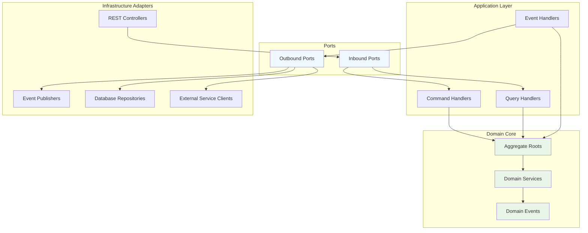
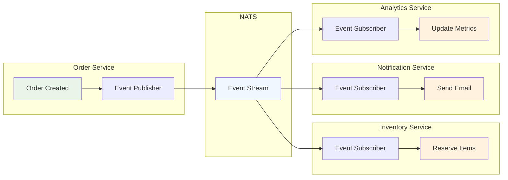

# ACCI EAF Framework Overview

The ACCI Enterprise Application Framework (EAF) is a comprehensive, opinionated framework designed
to accelerate the development of enterprise-grade microservices while enforcing architectural best
practices and design principles.

## 🎯 Framework Philosophy

The EAF embodies several core philosophical principles:

### Opinionated Architecture

EAF is deliberately opinionated, providing clear architectural guidance rather than overwhelming
flexibility. This approach:

- **Reduces cognitive load** by eliminating architectural decisions
- **Ensures consistency** across all services in the ecosystem
- **Accelerates development** through proven patterns and abstractions
- **Facilitates maintenance** with standardized approaches

### Domain-Centric Design

All framework components are designed to support domain-driven development:

- **Domain layer isolation** from infrastructure concerns
- **Rich domain models** with behavior-focused design
- **Event-driven communication** reflecting business processes
- **Bounded context respect** through clear service boundaries

### Production-Ready Defaults

Every framework component includes production-ready configurations:

- **Observability integration** with metrics, logging, and tracing
- **Resilience patterns** including circuit breakers and retry mechanisms
- **Security hardening** with authentication and authorization
- **Performance optimization** through connection pooling and caching

## 🏗️ Architectural Principles

The EAF is built on five foundational architectural principles:

### 1. Hexagonal Architecture (Ports & Adapters)



**Implementation in EAF:**

- **Domain layer** contains business logic and rules
- **Application layer** orchestrates domain operations
- **Infrastructure layer** handles external communication
- **Ports** define contracts between layers
- **Adapters** implement infrastructure-specific concerns

### 2. Domain-Driven Design (DDD)

EAF enforces DDD tactical patterns:

```kotlin
// Aggregate Root Example
@AggregateRoot
class Order(
    val id: OrderId,
    private val customerId: CustomerId,
    private val items: MutableList<OrderItem> = mutableListOf(),
    private var status: OrderStatus = OrderStatus.DRAFT
) {
    private val domainEvents = mutableListOf<DomainEvent>()

    fun addItem(product: Product, quantity: Int): Order {
        require(status == OrderStatus.DRAFT) { "Cannot modify confirmed order" }

        val item = OrderItem(product, quantity)
        items.add(item)

        domainEvents.add(OrderItemAddedEvent(id, item))
        return this
    }

    fun confirm(): Order {
        require(items.isNotEmpty()) { "Cannot confirm empty order" }
        require(status == OrderStatus.DRAFT) { "Order already confirmed" }

        status = OrderStatus.CONFIRMED
        domainEvents.add(OrderConfirmedEvent(id, items.toList()))
        return this
    }

    fun getUncommittedEvents(): List<DomainEvent> = domainEvents.toList()
    fun markEventsAsCommitted() = domainEvents.clear()
}
```

### 3. CQRS & Event Sourcing

Clear separation between commands and queries with event-driven persistence:

```kotlin
// Command Handler
@Component
class OrderCommandHandler(
    private val orderRepository: OrderRepository,
    private val eventPublisher: EventPublisher
) {
    suspend fun handle(command: CreateOrderCommand): OrderId {
        val order = Order(
            id = OrderId.generate(),
            customerId = command.customerId
        )

        orderRepository.save(order)

        order.getUncommittedEvents().forEach { event ->
            eventPublisher.publish("orders.${event::class.simpleName}", event)
        }

        return order.id
    }
}

// Query Handler
@Component
class OrderQueryHandler(private val readModel: OrderReadModelRepository) {
    suspend fun handle(query: GetOrderQuery): OrderView? {
        return readModel.findById(query.orderId)
    }
}
```

### 4. Event-Driven Architecture

Services communicate through domain events:

```kotlin
// Event Publication
@DomainEventHandler
class OrderEventHandler(
    private val inventoryService: InventoryServiceClient,
    private val emailService: EmailServiceClient
) {
    @EventHandler
    suspend fun handle(event: OrderConfirmedEvent) {
        // Update inventory
        inventoryService.reserveItems(event.items)

        // Send confirmation email
        emailService.sendOrderConfirmation(event.orderId)
    }
}
```

### 5. Test-Driven Development

Every component is designed for testability:

```kotlin
class OrderServiceTest {
    @Test
    fun `should create order with items`() {
        // Given
        val customerId = CustomerId.generate()
        val product = Product(name = "Test Product", price = 100.0)

        // When
        val order = Order(OrderId.generate(), customerId)
            .addItem(product, 2)

        // Then
        assertThat(order.items).hasSize(1)
        assertThat(order.getUncommittedEvents())
            .hasSize(1)
            .first()
            .isInstanceOf(OrderItemAddedEvent::class.java)
    }
}
```

## 🚀 Framework Components

### Core Libraries

- **eaf-core**: Fundamental abstractions and base classes
- **eaf-eventing-sdk**: NATS-based event publishing and consumption
- **eaf-eventsourcing-sdk**: PostgreSQL event store implementation
- **eaf-iam-client**: Authentication and authorization integration

### Development Tools

- **acci-eaf-cli**: Code generation and project scaffolding
- **ui-foundation-kit**: React component library with design system

### Infrastructure Support

- **Spring Boot Integration**: Auto-configuration and starter dependencies
- **Testcontainers Support**: Integration testing with real infrastructure
- **Observability**: Metrics, tracing, and structured logging
- **Configuration Management**: Environment-aware configuration

## 🌐 Enterprise Integration

### Multi-Tenancy Support

```kotlin
@Component
class TenantAwareOrderService(
    private val tenantContext: TenantContext,
    private val orderRepository: OrderRepository
) {
    suspend fun createOrder(command: CreateOrderCommand): OrderId {
        val tenantId = tenantContext.getCurrentTenant()

        val order = Order(
            id = OrderId.generate(),
            customerId = command.customerId,
            tenantId = tenantId
        )

        return orderRepository.save(order).id
    }
}
```

### Security Integration

```kotlin
@RestController
@PreAuthorize("hasRole('ORDER_MANAGER')")
class OrderController(private val orderService: OrderService) {

    @PostMapping("/orders")
    @PreAuthorize("hasPermission(#command.customerId, 'CUSTOMER', 'CREATE_ORDER')")
    suspend fun createOrder(@RequestBody command: CreateOrderCommand): ResponseEntity<OrderResponse> {
        val orderId = orderService.createOrder(command)
        return ResponseEntity.ok(OrderResponse(orderId))
    }
}
```

### Event-Driven Integration



## 📊 Performance & Scalability

### Throughput Characteristics

- **HTTP Requests**: 1000+ RPS per service instance
- **Event Processing**: 10,000+ events/second per consumer
- **Database Operations**: Optimized with connection pooling
- **Memory Usage**: < 512MB baseline per service

### Scaling Patterns

```kotlin
// Horizontal scaling through stateless design
@Component
class StatelessOrderProcessor(
    private val eventStore: EventStore,
    private val readModelUpdater: ReadModelUpdater
) {
    suspend fun processOrderEvent(event: OrderEvent) {
        // Process without maintaining state
        val projectedData = projectEvent(event)
        readModelUpdater.update(projectedData)
    }
}

// Vertical scaling through async processing
@Component
class AsyncOrderHandler {
    suspend fun handleOrderConfirmation(order: Order) = coroutineScope {
        // Parallel processing
        val inventoryReservation = async { reserveInventory(order) }
        val emailNotification = async { sendConfirmationEmail(order) }
        val analyticsUpdate = async { updateAnalytics(order) }

        // Await all results
        awaitAll(inventoryReservation, emailNotification, analyticsUpdate)
    }
}
```

## 🔧 Configuration Management

### Environment-Aware Configuration

```yaml
# application.yml
app:
  eaf:
    tenant:
      default-tenant: 'default'
      header-name: 'X-Tenant-ID'
    security:
      jwt:
        public-key-url: '${IAM_PUBLIC_KEY_URL}'
        audience: '${JWT_AUDIENCE:eaf-services}'
    eventing:
      nats-url: '${NATS_URL:nats://localhost:4222}'
      cluster-id: '${NATS_CLUSTER_ID:eaf-cluster}'
    datasource:
      url: '${DATABASE_URL:jdbc:postgresql://localhost:5432/eaf}'
      username: '${DATABASE_USERNAME:eaf_user}'
      password: '${DATABASE_PASSWORD}'
```

### Profile-Based Configuration

```kotlin
@Configuration
@Profile("production")
class ProductionConfiguration {
    @Bean
    fun productionEventingProperties(): EventingProperties = EventingProperties(
        natsUrl = System.getenv("NATS_CLUSTER_URL"),
        retryAttempts = 5,
        timeoutMs = 10000,
        monitoringEnabled = true
    )
}

@Configuration
@Profile("test")
class TestConfiguration {
    @Bean
    @Primary
    fun embeddedNatsConfiguration(): EventingProperties = EventingProperties(
        natsUrl = "nats://embedded:4222",
        retryAttempts = 1,
        timeoutMs = 1000,
        monitoringEnabled = false
    )
}
```

## 🚦 Operational Excellence

### Health Checks

```kotlin
@Component
class EafHealthIndicator : HealthIndicator {
    override fun health(): Health {
        return Health.up()
            .withDetail("framework", "EAF")
            .withDetail("version", eafVersion)
            .withDetail("services", serviceStatus)
            .build()
    }
}
```

### Metrics & Monitoring

```kotlin
@Component
class OrderMetrics(private val meterRegistry: MeterRegistry) {
    private val orderCreatedCounter = Counter.builder("orders.created")
        .description("Number of orders created")
        .register(meterRegistry)

    private val orderProcessingTimer = Timer.builder("orders.processing.time")
        .description("Order processing time")
        .register(meterRegistry)

    fun recordOrderCreated() = orderCreatedCounter.increment()

    fun recordProcessingTime(duration: Duration) =
        orderProcessingTimer.record(duration)
}
```

## 🔗 Related Documentation

- [Domain-Driven Design](./domain-driven-design.md) - DDD implementation patterns
- [Hexagonal Architecture](./hexagonal-architecture.md) - Clean architecture guidelines
- [CQRS & Event Sourcing](./cqrs-event-sourcing.md) - Advanced data patterns
- [Test-Driven Development](./test-driven-development.md) - TDD practices
- [SDK Reference](../sdk-reference/index.md) - Implementation guides

## 🎓 Learning Resources

### Getting Started Path

1. **[Getting Started Guide](../getting-started/index.md)** - Set up your first EAF service
2. **[Hello World Example](../getting-started/hello-world-example.md)** - Build a complete service
3. **[Development Workflow](../getting-started/development-workflow.md)** - Daily development
   practices

### Advanced Topics

1. **[Architectural Decisions](./architectural-decisions.md)** - Framework design rationale
2. **[Patterns & Practices](./patterns-and-practices.md)** - Advanced implementation patterns
3. **[Performance Optimization](../core-services/index.md)** - Production tuning

---

_The ACCI EAF represents years of enterprise development experience distilled into a cohesive,
production-ready framework. It enables teams to focus on business value while ensuring architectural
excellence and operational reliability._
