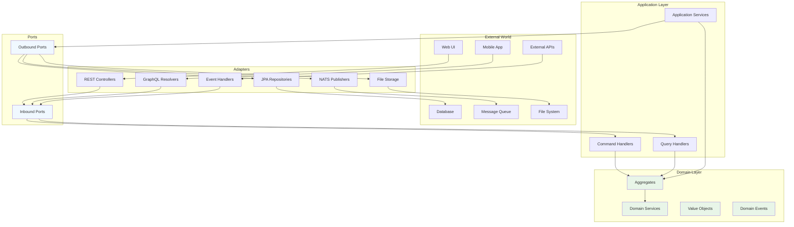

# Hexagonal Architecture in EAF

Hexagonal Architecture (also known as Ports and Adapters) is a core architectural pattern in the EAF
framework, ensuring clean separation of concerns and making applications highly testable and
maintainable.

## 🎯 Architecture Overview

The hexagonal architecture organizes code into distinct layers with clear dependencies flowing
inward toward the domain core.



## 🏗️ Implementation in EAF

### Domain Layer (Core)

The domain layer contains business logic and should have no dependencies on external frameworks:

```kotlin
// Domain Entity
@AggregateRoot
class Order(
    val id: OrderId,
    private val customerId: CustomerId,
    private var status: OrderStatus = OrderStatus.DRAFT
) {
    private val events = mutableListOf<DomainEvent>()

    fun confirm(): Order {
        require(status == OrderStatus.DRAFT) { "Order already confirmed" }

        status = OrderStatus.CONFIRMED
        events.add(OrderConfirmedEvent(id, customerId))

        return this
    }
}

// Domain Service
@DomainService
class OrderPricingService {
    fun calculatePrice(order: Order, discountRules: DiscountRules): Money {
        // Pure business logic
        return order.items
            .sumOf { it.price }
            .let { discountRules.apply(it) }
    }
}
```

### Application Layer

The application layer orchestrates domain operations and coordinates with external systems:

```kotlin
// Application Service
@ApplicationService
class OrderApplicationService(
    private val orderRepository: OrderRepository, // Port
    private val paymentService: PaymentService,   // Port
    private val eventPublisher: EventPublisher    // Port
) {
    suspend fun confirmOrder(command: ConfirmOrderCommand): Result<OrderId> {
        return try {
            val order = orderRepository.findById(command.orderId)
                ?: return Result.failure("Order not found")

            // Business operation
            order.confirm()

            // Coordinate with external systems
            paymentService.processPayment(order.totalAmount)
            orderRepository.save(order)

            // Publish domain events
            order.getUncommittedEvents().forEach { event ->
                eventPublisher.publish(event)
            }

            Result.success(order.id)
        } catch (e: Exception) {
            Result.failure(e.message ?: "Unknown error")
        }
    }
}
```

### Ports (Interfaces)

Ports define contracts between layers:

```kotlin
// Inbound Port (driven by external world)
interface OrderCommandHandler {
    suspend fun handle(command: ConfirmOrderCommand): Result<OrderId>
    suspend fun handle(command: CancelOrderCommand): Result<Unit>
}

// Outbound Port (drives external systems)
interface OrderRepository {
    suspend fun findById(id: OrderId): Order?
    suspend fun save(order: Order): Order
    suspend fun findByCustomerId(customerId: CustomerId): List<Order>
}

interface PaymentService {
    suspend fun processPayment(amount: Money): PaymentResult
    suspend fun refundPayment(paymentId: PaymentId): RefundResult
}

interface EventPublisher {
    suspend fun publish(event: DomainEvent): PublishResult
}
```

### Adapters (Infrastructure)

Adapters implement ports and handle external system integration:

```kotlin
// Inbound Adapter - REST Controller
@RestController
@RequestMapping("/api/orders")
class OrderController(
    private val orderCommandHandler: OrderCommandHandler
) {
    @PostMapping("/{orderId}/confirm")
    suspend fun confirmOrder(
        @PathVariable orderId: String,
        @RequestBody request: ConfirmOrderRequest
    ): ResponseEntity<OrderResponse> {
        val command = ConfirmOrderCommand(OrderId(orderId))

        return when (val result = orderCommandHandler.handle(command)) {
            is Result.Success -> ResponseEntity.ok(OrderResponse(result.value))
            is Result.Failure -> ResponseEntity.badRequest().build()
        }
    }
}

// Outbound Adapter - JPA Repository
@Repository
class JpaOrderRepository(
    private val jpaRepository: SpringDataOrderRepository,
    private val orderMapper: OrderMapper
) : OrderRepository {

    override suspend fun findById(id: OrderId): Order? = withContext(Dispatchers.IO) {
        jpaRepository.findById(id.value)?.let { entity ->
            orderMapper.toDomain(entity)
        }
    }

    override suspend fun save(order: Order): Order = withContext(Dispatchers.IO) {
        val entity = orderMapper.toEntity(order)
        val savedEntity = jpaRepository.save(entity)
        orderMapper.toDomain(savedEntity)
    }
}

// Outbound Adapter - NATS Event Publisher
@Component
class NatsEventPublisher(
    private val natsConnection: Connection
) : EventPublisher {

    override suspend fun publish(event: DomainEvent): PublishResult {
        return try {
            val message = eventSerializer.serialize(event)
            natsConnection.publish(event.subject(), message)
            PublishResult.Success
        } catch (e: Exception) {
            PublishResult.Failure(e)
        }
    }
}
```

## 🧪 Testing Benefits

Hexagonal architecture makes testing much easier:

### Domain Layer Testing

```kotlin
class OrderTest {
    @Test
    fun `should confirm draft order`() {
        // Given
        val order = Order(OrderId.generate(), CustomerId.generate())

        // When
        order.confirm()

        // Then
        assertThat(order.status).isEqualTo(OrderStatus.CONFIRMED)
        assertThat(order.getUncommittedEvents())
            .hasSize(1)
            .first()
            .isInstanceOf(OrderConfirmedEvent::class.java)
    }
}
```

### Application Layer Testing with Mocks

```kotlin
@ExtendWith(MockKExtension::class)
class OrderApplicationServiceTest {
    @MockK private lateinit var orderRepository: OrderRepository
    @MockK private lateinit var paymentService: PaymentService
    @MockK private lateinit var eventPublisher: EventPublisher

    private lateinit var orderService: OrderApplicationService

    @BeforeEach
    fun setup() {
        orderService = OrderApplicationService(orderRepository, paymentService, eventPublisher)
    }

    @Test
    fun `should confirm order successfully`() = runTest {
        // Given
        val order = Order(OrderId.generate(), CustomerId.generate())
        val command = ConfirmOrderCommand(order.id)

        coEvery { orderRepository.findById(order.id) } returns order
        coEvery { paymentService.processPayment(any()) } returns PaymentResult.Success
        coEvery { orderRepository.save(any()) } returns order
        coEvery { eventPublisher.publish(any()) } returns PublishResult.Success

        // When
        val result = orderService.confirmOrder(command)

        // Then
        assertThat(result.isSuccess).isTrue()

        coVerify { orderRepository.findById(order.id) }
        coVerify { paymentService.processPayment(any()) }
        coVerify { orderRepository.save(any()) }
        coVerify { eventPublisher.publish(any()) }
    }
}
```

## 🔧 Configuration and Dependency Injection

EAF uses Spring Boot's dependency injection to wire adapters to ports:

```kotlin
@Configuration
class OrderConfiguration {

    @Bean
    fun orderApplicationService(
        orderRepository: OrderRepository,
        paymentService: PaymentService,
        eventPublisher: EventPublisher
    ): OrderApplicationService = OrderApplicationService(
        orderRepository,
        paymentService,
        eventPublisher
    )

    @Bean
    fun orderCommandHandler(
        orderApplicationService: OrderApplicationService
    ): OrderCommandHandler = orderApplicationService
}

@TestConfiguration
class OrderTestConfiguration {

    @Bean
    @Primary
    fun mockOrderRepository(): OrderRepository = mockk()

    @Bean
    @Primary
    fun mockPaymentService(): PaymentService = mockk()

    @Bean
    @Primary
    fun mockEventPublisher(): EventPublisher = mockk()
}
```

## 📋 Best Practices

### 1. Dependency Direction

- Dependencies always point inward toward the domain
- The domain layer has no knowledge of infrastructure
- Application layer defines interfaces (ports) for external dependencies

### 2. Port Design

```kotlin
// ✅ Good: Focused, domain-oriented interface
interface CustomerRepository {
    suspend fun findById(id: CustomerId): Customer?
    suspend fun save(customer: Customer): Customer
    suspend fun findActiveCustomers(): List<Customer>
}

// ❌ Bad: Infrastructure-leaking interface
interface CustomerRepository {
    fun findById(id: String): CustomerEntity?
    fun save(entity: CustomerEntity): CustomerEntity
    fun executeQuery(sql: String): ResultSet
}
```

### 3. Error Handling

```kotlin
// ✅ Good: Domain-specific errors
sealed class OrderError {
    object OrderNotFound : OrderError()
    object OrderAlreadyConfirmed : OrderError()
    data class PaymentFailed(val reason: String) : OrderError()
}

suspend fun confirmOrder(command: ConfirmOrderCommand): Result<OrderId, OrderError>

// ❌ Bad: Infrastructure errors leaking
suspend fun confirmOrder(command: ConfirmOrderCommand): Order // throws SQLException
```

## 🔗 Related Documentation

- [Domain-Driven Design](./domain-driven-design.md) - Domain modeling patterns
- [Test-Driven Development](./test-driven-development.md) - Testing strategies
- [EAF Overview](./eaf-overview.md) - Framework architecture principles

---

_Hexagonal Architecture in EAF ensures clean separation of concerns, making applications highly
testable, maintainable, and adaptable to changing requirements._
