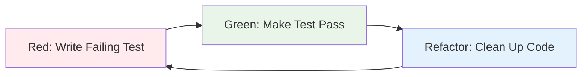
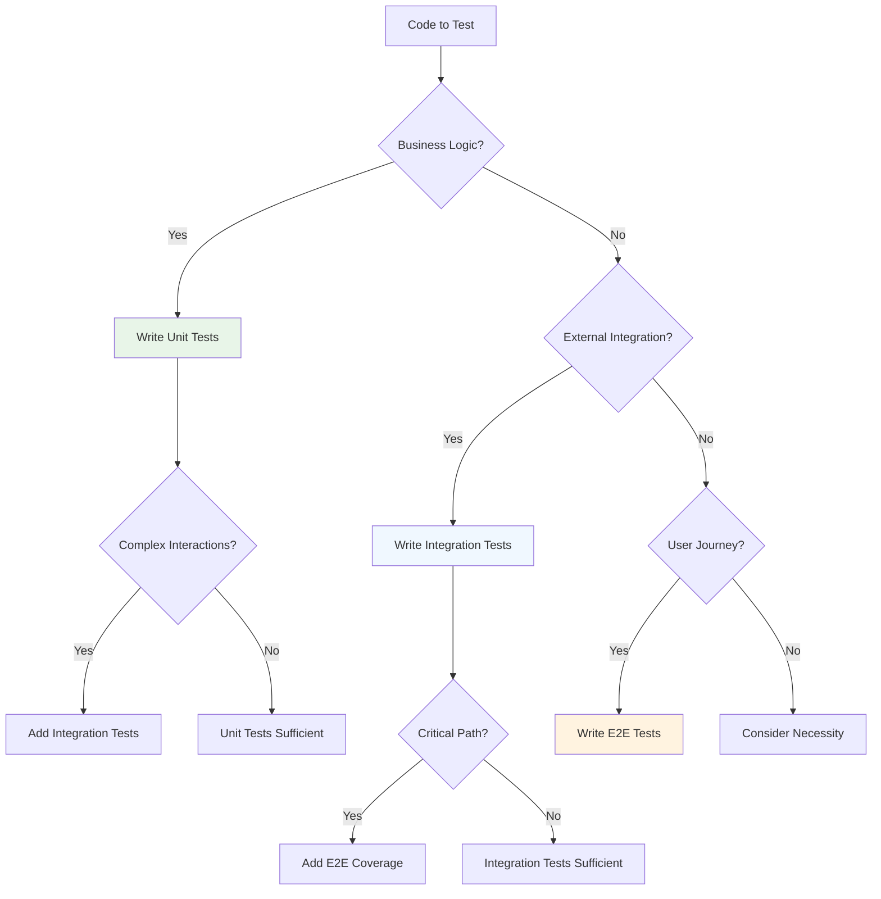

# Test-Driven Development in EAF

Test-Driven Development (TDD) is a cornerstone of the EAF methodology, ensuring high-quality,
maintainable code through a disciplined red-green-refactor cycle. The EAF framework is designed from
the ground up to support comprehensive testing strategies across all architectural layers.

## 🎯 TDD Philosophy in EAF

### Quality First Approach

The EAF enforces a quality-first mindset where tests are not an afterthought but the driving force
of development:

- **Tests Define Behavior**: Tests serve as executable specifications
- **Confidence Through Coverage**: Comprehensive testing enables fearless refactoring
- **Documentation Through Examples**: Tests provide living documentation
- **Design Feedback**: TDD drives better architectural decisions

### The Red-Green-Refactor Cycle



#### Red Phase: Write Failing Test

```kotlin
class OrderServiceTest {
    @Test
    fun `should create order with valid customer`() {
        // Given
        val customerId = CustomerId("customer-123")
        val tenantId = TenantId("tenant-456")
        val command = CreateOrderCommand(customerId, tenantId)

        // When & Then - This will fail initially
        val orderId = orderService.createOrder(command)

        assertThat(orderId).isNotNull()
        assertThat(orderId.value).isNotEmpty()
    }
}
```

#### Green Phase: Make Test Pass

```kotlin
@Component
class OrderService(
    private val orderRepository: OrderRepository,
    private val eventPublisher: EventPublisher
) {
    suspend fun createOrder(command: CreateOrderCommand): OrderId {
        val order = Order.create(command.customerId, command.tenantId)

        orderRepository.save(order)

        order.getUncommittedEvents().forEach { event ->
            eventPublisher.publish("orders.${event::class.simpleName}", event)
        }
        order.markEventsAsCommitted()

        return order.id
    }
}
```

#### Refactor Phase: Clean Up

```kotlin
@Component
class OrderService(
    private val orderRepository: OrderRepository,
    private val eventPublisher: EventPublisher,
    private val orderValidator: OrderValidator
) {
    suspend fun createOrder(command: CreateOrderCommand): OrderId {
        // Validation extracted to separate component
        orderValidator.validateCreation(command)

        val order = Order.create(command.customerId, command.tenantId)

        // Event publishing extracted to separate method
        return persistAndPublishEvents(order)
    }

    private suspend fun persistAndPublishEvents(order: Order): OrderId {
        orderRepository.save(order)
        publishDomainEvents(order)
        return order.id
    }

    private suspend fun publishDomainEvents(order: Order) {
        order.getUncommittedEvents().forEach { event ->
            eventPublisher.publish("orders.${event::class.simpleName}", event)
        }
        order.markEventsAsCommitted()
    }
}
```

## 🏗️ EAF Testing Architecture

### Testing Pyramid

The EAF testing strategy follows a structured pyramid approach:

```mermaid
pyramid
    title EAF Testing Pyramid
    Unit Tests : 70%
    Integration Tests : 20%
    End-to-End Tests : 10%
```

### Layer-Specific Testing Strategies

#### Domain Layer Testing

Domain layer tests focus on business logic in isolation:

```kotlin
class OrderAggregateTest {
    @Test
    fun `should apply business rules when adding items`() {
        // Given
        val order = Order.create(CustomerId("cust-123"), TenantId("tenant-456"))
        val productId = ProductId("prod-789")
        val unitPrice = Money(BigDecimal("15.50"))

        // When
        order.addItem(productId, 3, unitPrice)

        // Then
        assertThat(order.getItemCount()).isEqualTo(1)
        assertThat(order.getTotalAmount()).isEqualTo(Money(BigDecimal("46.50")))

        // Verify domain events
        val events = order.getUncommittedEvents()
        assertThat(events).hasSize(2) // OrderCreated + OrderItemAdded

        val itemAddedEvent = events.last() as OrderItemAddedEvent
        assertThat(itemAddedEvent.productId).isEqualTo(productId)
        assertThat(itemAddedEvent.quantity).isEqualTo(3)
        assertThat(itemAddedEvent.unitPrice).isEqualTo(unitPrice)
    }

    @Test
    fun `should enforce business invariants`() {
        // Given
        val order = Order.create(CustomerId("cust-123"), TenantId("tenant-456"))
            .addItem(ProductId("prod-1"), 1, Money(BigDecimal("10.00")))
            .confirm()

        // When & Then
        assertThatThrownBy {
            order.addItem(ProductId("prod-2"), 1, Money(BigDecimal("5.00")))
        }.isInstanceOf(IllegalArgumentException::class.java)
         .hasMessage("Cannot modify confirmed order")
    }
}
```

#### Application Layer Testing

Application layer tests verify orchestration logic:

```kotlin
@ExtendWith(MockKExtension::class)
class OrderCommandHandlerTest {
    @MockK
    private lateinit var orderRepository: OrderRepository

    @MockK
    private lateinit var eventPublisher: EventPublisher

    @MockK
    private lateinit var orderValidator: OrderValidator

    private lateinit var commandHandler: OrderCommandHandler

    @BeforeEach
    fun setup() {
        commandHandler = OrderCommandHandler(orderRepository, eventPublisher, orderValidator)
    }

    @Test
    fun `should handle create order command successfully`() = runTest {
        // Given
        val command = CreateOrderCommand(
            customerId = CustomerId("customer-123"),
            tenantId = TenantId("tenant-456")
        )

        coEvery { orderValidator.validateCreation(command) } returns ValidationResult.valid()
        coEvery { orderRepository.save(any()) } answers { firstArg() }
        coEvery { eventPublisher.publish(any(), any()) } returns mockk<PublishAck>()

        // When
        val result = commandHandler.handle(command)

        // Then
        assertThat(result).isInstanceOf(Success::class.java)

        coVerify { orderValidator.validateCreation(command) }
        coVerify { orderRepository.save(any()) }
        coVerify { eventPublisher.publish(match { it.startsWith("orders.") }, any()) }
    }

    @Test
    fun `should handle validation failure gracefully`() = runTest {
        // Given
        val command = CreateOrderCommand(
            customerId = CustomerId("invalid-customer"),
            tenantId = TenantId("tenant-456")
        )

        val validationError = ValidationResult.invalid("Customer not found")
        coEvery { orderValidator.validateCreation(command) } returns validationError

        // When
        val result = commandHandler.handle(command)

        // Then
        assertThat(result).isInstanceOf(Failure::class.java)
        val failure = result as Failure
        assertThat(failure.error.message).contains("Customer not found")

        coVerify(exactly = 0) { orderRepository.save(any()) }
        coVerify(exactly = 0) { eventPublisher.publish(any(), any()) }
    }
}
```

#### Infrastructure Layer Testing

Infrastructure tests verify external integrations:

```kotlin
@SpringBootTest(classes = [TestOrderServiceApplication::class])
@Testcontainers
@ActiveProfiles("test")
@Import(OrderTestcontainerConfiguration::class, JpaConfig::class)
class JpaOrderRepositoryIntegrationTest {

    @Autowired
    private lateinit var orderRepository: OrderRepository

    @Autowired
    private lateinit var testEntityManager: TestEntityManager

    @Test
    @Transactional
    fun `should persist and retrieve order with items`() = runTest {
        // Given
        val order = Order.create(
            customerId = CustomerId("customer-123"),
            tenantId = TenantId("tenant-456")
        ).addItem(
            productId = ProductId("product-789"),
            quantity = 2,
            unitPrice = Money(BigDecimal("25.00"))
        )

        // When
        val savedOrder = orderRepository.save(order)
        testEntityManager.flush()
        testEntityManager.clear()

        val retrievedOrder = orderRepository.findById(savedOrder.id)

        // Then
        assertThat(retrievedOrder).isNotNull()
        assertThat(retrievedOrder!!.id).isEqualTo(savedOrder.id)
        assertThat(retrievedOrder.getItemCount()).isEqualTo(1)
        assertThat(retrievedOrder.getTotalAmount()).isEqualTo(Money(BigDecimal("50.00")))
    }

    @Test
    @Transactional
    fun `should handle concurrent modifications with optimistic locking`() = runTest {
        // Given
        val order = Order.create(CustomerId("customer-123"), TenantId("tenant-456"))
        val savedOrder = orderRepository.save(order)

        // When - Simulate concurrent modification
        val order1 = orderRepository.findById(savedOrder.id)!!
        val order2 = orderRepository.findById(savedOrder.id)!!

        order1.addItem(ProductId("product-1"), 1, Money(BigDecimal("10.00")))
        order2.addItem(ProductId("product-2"), 1, Money(BigDecimal("15.00")))

        orderRepository.save(order1)

        // Then
        assertThatThrownBy {
            runBlocking { orderRepository.save(order2) }
        }.isInstanceOf(OptimisticLockException::class.java)
    }
}
```

## 🧪 EAF Testing Utilities

### Test Configuration

```kotlin
@TestConfiguration
class OrderTestConfiguration {

    @Bean
    @Primary
    fun testEventPublisher(): EventPublisher = mockk<EventPublisher> {
        coEvery { publish(any(), any()) } returns mockk<PublishAck>()
    }

    @Bean
    @Primary
    fun testTenantContext(): TenantContext = mockk<TenantContext> {
        every { getCurrentTenant() } returns TenantId("test-tenant")
    }

    @Bean
    fun testDataGenerator(): TestDataGenerator = TestDataGenerator()
}

class TestDataGenerator {
    fun createTestOrder(
        customerId: CustomerId = CustomerId("test-customer"),
        tenantId: TenantId = TenantId("test-tenant")
    ): Order = Order.create(customerId, tenantId)

    fun createTestOrderWithItems(
        itemCount: Int = 3,
        customerId: CustomerId = CustomerId("test-customer"),
        tenantId: TenantId = TenantId("test-tenant")
    ): Order {
        val order = createTestOrder(customerId, tenantId)

        repeat(itemCount) { index ->
            order.addItem(
                productId = ProductId("product-$index"),
                quantity = index + 1,
                unitPrice = Money(BigDecimal("${(index + 1) * 10}.00"))
            )
        }

        return order
    }
}
```

### Event Testing Support

```kotlin
@Component
class TestEventCollector(private val events: MutableList<DomainEvent> = mutableListOf()) {

    fun clear() = events.clear()

    fun collect(event: DomainEvent) = events.add(event)

    fun getEvents(): List<DomainEvent> = events.toList()

    inline fun <reified T : DomainEvent> getEventsOfType(): List<T> =
        events.filterIsInstance<T>()

    inline fun <reified T : DomainEvent> getLastEventOfType(): T? =
        getEventsOfType<T>().lastOrNull()

    suspend fun <T : DomainEvent> awaitEvent(
        eventType: KClass<T>,
        timeout: Duration = Duration.ofSeconds(5),
        predicate: (T) -> Boolean = { true }
    ): T {
        val endTime = Instant.now().plus(timeout)

        while (Instant.now().isBefore(endTime)) {
            val event = events.filterIsInstance(eventType.java)
                .lastOrNull { predicate(it) }

            if (event != null) return event

            delay(100)
        }

        throw AssertionError("Event of type ${eventType.simpleName} not received within $timeout")
    }
}

@TestEventHandler
class TestEventHandler(private val eventCollector: TestEventCollector) {

    @EventHandler("orders.*")
    suspend fun handleOrderEvent(event: DomainEvent) {
        eventCollector.collect(event)
    }
}
```

### Integration Test Base Classes

```kotlin
@SpringBootTest(classes = [TestOrderServiceApplication::class])
@Testcontainers
@ActiveProfiles("test")
@Import(OrderTestcontainerConfiguration::class, JpaConfig::class)
@Transactional
abstract class OrderIntegrationTestBase {

    @Autowired
    protected lateinit var testDataGenerator: TestDataGenerator

    @Autowired
    protected lateinit var testEventCollector: TestEventCollector

    @BeforeEach
    fun setUp() {
        testEventCollector.clear()
    }

    protected suspend inline fun <reified T : DomainEvent> assertEventPublished(
        crossinline predicate: (T) -> Boolean = { true }
    ): T {
        return testEventCollector.awaitEvent(T::class) { predicate(it) }
    }

    protected fun createTestOrderCommand(
        customerId: CustomerId = CustomerId("test-customer"),
        tenantId: TenantId = TenantId("test-tenant")
    ): CreateOrderCommand = CreateOrderCommand(customerId, tenantId)
}

class OrderServiceIntegrationTest : OrderIntegrationTestBase() {

    @Autowired
    private lateinit var orderService: OrderService

    @Test
    fun `should create order and publish events`() = runTest {
        // Given
        val command = createTestOrderCommand()

        // When
        val orderId = orderService.createOrder(command)

        // Then
        assertThat(orderId).isNotNull()

        val createdEvent = assertEventPublished<OrderCreatedEvent> {
            it.aggregateId == orderId
        }

        assertThat(createdEvent.customerId).isEqualTo(command.customerId)
        assertThat(createdEvent.tenantId).isEqualTo(command.tenantId)
    }
}
```

## 📊 Test Metrics and Quality Gates

### Coverage Requirements

The EAF enforces minimum test coverage thresholds:

```kotlin
// build.gradle.kts
tasks.jacocoTestReport {
    reports {
        xml.required.set(true)
        html.required.set(true)
    }

    finalizedBy(tasks.jacocoTestCoverageVerification)
}

tasks.jacocoTestCoverageVerification {
    violationRules {
        rule {
            limit {
                minimum = "0.80".toBigDecimal() // 80% minimum coverage
            }
        }

        rule {
            element = "CLASS"
            excludes = listOf(
                "*.config.*",
                "*.dto.*",
                "*.*Application",
                "*.*Configuration"
            )

            limit {
                counter = "LINE"
                minimum = "0.90".toBigDecimal() // 90% for business logic
            }
        }
    }
}
```

### Mutation Testing

```kotlin
// build.gradle.kts
plugins {
    id("info.solidsoft.pitest") version "1.9.0"
}

pitest {
    targetClasses.set(setOf("com.axians.eaf.order.domain.*"))
    targetTests.set(setOf("com.axians.eaf.order.domain.*Test"))
    threads.set(4)
    outputFormats.set(setOf("XML", "HTML"))
    timestampedReports.set(false)
    mutationThreshold.set(75) // 75% mutation score threshold
}
```

## 🚀 Advanced Testing Patterns

### Property-Based Testing

```kotlin
class OrderPropertyBasedTest {

    @Test
    fun `order total should always equal sum of item totals`(@ForAll orders: Order) {
        // Property: Order total must always equal the sum of individual item totals
        val calculatedTotal = orders.items.sumOf { it.totalPrice }

        assertThat(orders.getTotalAmount()).isEqualTo(calculatedTotal)
    }

    @Test
    fun `adding positive quantity should increase item count`(
        @ForAll @Positive quantity: Int,
        @ForAll productId: ProductId,
        @ForAll @Positive unitPrice: BigDecimal
    ) {
        // Given
        val order = testDataGenerator.createTestOrder()
        val initialCount = order.getItemCount()

        // When
        order.addItem(productId, quantity, Money(unitPrice))

        // Then
        assertThat(order.getItemCount()).isGreaterThan(initialCount)
    }

    @Provide
    fun orders(): Arbitrary<Order> = Arbitraries.of(
        testDataGenerator.createTestOrderWithItems(1),
        testDataGenerator.createTestOrderWithItems(3),
        testDataGenerator.createTestOrderWithItems(5)
    )
}
```

### Contract Testing

```kotlin
@ExtendWith(PactConsumerTestExt::class)
@PactTestFor(providerName = "inventory-service")
class InventoryServiceContractTest {

    @Pact(consumer = "order-service")
    fun reserveItemsPact(builder: PactDslWithProvider): RequestResponsePact {
        return builder
            .given("products are available")
            .uponReceiving("a request to reserve items")
            .path("/api/inventory/reserve")
            .method("POST")
            .headers(mapOf("Content-Type" to "application/json"))
            .body("""
                {
                    "orderId": "order-123",
                    "items": [
                        {
                            "productId": "product-456",
                            "quantity": 2
                        }
                    ]
                }
            """.trimIndent())
            .willRespondWith()
            .status(200)
            .headers(mapOf("Content-Type" to "application/json"))
            .body("""
                {
                    "reservationId": "reservation-789",
                    "status": "RESERVED"
                }
            """.trimIndent())
            .toPact()
    }

    @Test
    @PactTestFor
    fun `should reserve inventory items successfully`(mockServer: MockServer) = runTest {
        // Given
        val inventoryService = InventoryServiceClient(
            baseUrl = mockServer.getUrl(),
            httpClient = HttpClient()
        )

        val command = ReserveItemsCommand(
            orderId = OrderId("order-123"),
            items = listOf(ReservationItem(ProductId("product-456"), 2))
        )

        // When
        val result = inventoryService.reserveItems(command)

        // Then
        assertThat(result.status).isEqualTo(ReservationStatus.RESERVED)
        assertThat(result.reservationId).isNotNull()
    }
}
```

## 🎯 TDD Best Practices in EAF

### Test Naming Conventions

```kotlin
class OrderServiceTest {
    // ✅ Good: Describes behavior in business terms
    @Test
    fun `should create order when customer is valid and active`() { }

    @Test
    fun `should reject order creation when customer does not exist`() { }

    @Test
    fun `should publish OrderCreated event after successful order creation`() { }

    // ❌ Bad: Technical implementation focus
    @Test
    fun testCreateOrder() { }

    @Test
    fun testCreateOrderThrowsException() { }
}
```

### Test Data Management

```kotlin
// ✅ Good: Use builders for complex test data
class OrderTestDataBuilder {
    private var customerId: CustomerId = CustomerId("default-customer")
    private var tenantId: TenantId = TenantId("default-tenant")
    private var items: MutableList<OrderItem> = mutableListOf()

    fun withCustomer(customerId: CustomerId) = apply { this.customerId = customerId }
    fun withTenant(tenantId: TenantId) = apply { this.tenantId = tenantId }
    fun withItem(productId: ProductId, quantity: Int, unitPrice: Money) = apply {
        items.add(OrderItem(productId, quantity, unitPrice))
    }

    fun build(): Order {
        val order = Order.create(customerId, tenantId)
        items.forEach { item ->
            order.addItem(item.productId, item.quantity, item.unitPrice)
        }
        return order
    }
}

// Usage in tests
@Test
fun `should calculate correct total for multi-item order`() {
    // Given
    val order = OrderTestDataBuilder()
        .withCustomer(CustomerId("customer-123"))
        .withItem(ProductId("product-1"), 2, Money(BigDecimal("10.00")))
        .withItem(ProductId("product-2"), 1, Money(BigDecimal("15.00")))
        .build()

    // When & Then
    assertThat(order.getTotalAmount()).isEqualTo(Money(BigDecimal("35.00")))
}
```

### Async Testing Patterns

```kotlin
class EventHandlerTest {
    @Test
    fun `should handle order confirmed event within timeout`() = runTest {
        // Given
        val event = OrderConfirmedEvent(
            aggregateId = OrderId("order-123"),
            customerId = CustomerId("customer-456"),
            // ... other properties
        )

        val handler = OrderEventHandler(inventoryService, notificationService, projector)

        // When
        val processingJob = async { handler.handle(event) }

        // Then
        withTimeout(5.seconds) {
            processingJob.await()
        }

        // Verify side effects
        coVerify { inventoryService.reserveItems(any()) }
        coVerify { notificationService.sendOrderConfirmation(any()) }
    }
}
```

## 🔗 Related Documentation

- [EAF Overview](./eaf-overview.md) - Framework testing philosophy
- [Domain-Driven Design](./domain-driven-design.md) - Domain testing strategies
- [Hexagonal Architecture](./hexagonal-architecture.md) - Layer testing approaches
- [Spring Boot Integration Testing](../core-services/spring-boot-integration-testing.md) -
  Infrastructure testing

## 📚 TDD Decision Trees

### When to Write Different Types of Tests



---

_Test-Driven Development in EAF ensures high-quality, maintainable code through disciplined testing
practices. The framework provides comprehensive testing utilities and enforces quality gates to
maintain code excellence._ 🧪
