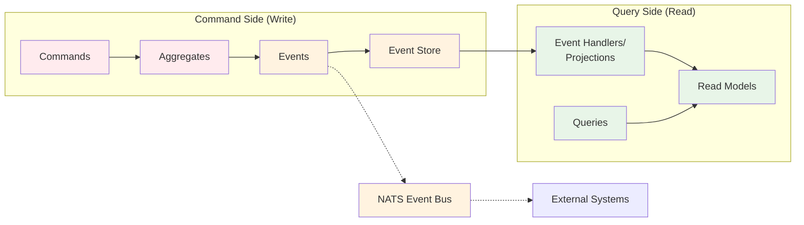
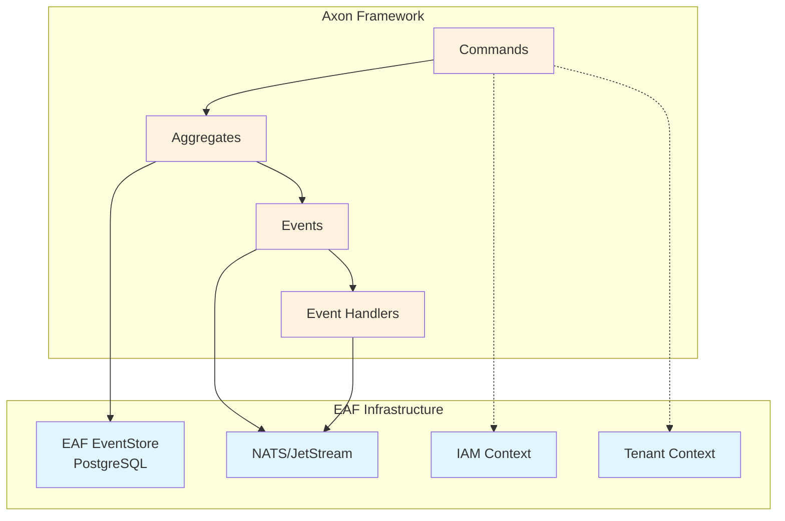

# Core Concepts & Architecture

Welcome to the foundation of Axon Framework! This module explains the core concepts that make
event-sourced systems powerful and how they contrast with traditional approaches.

## 📚 Learning Objectives

By the end of this module, you will understand:

- The difference between Event Sourcing and traditional CRUD
- CQRS architecture and separation of concerns
- Core Axon Framework patterns and terminology
- When and why to use event-sourced systems

## 🔄 Traditional CRUD vs Event Sourcing

### Traditional CRUD Approach

In traditional systems, we directly modify state and lose historical information:

```kotlin
// Traditional CRUD - State mutation
class UserService {
    fun updateUserEmail(userId: String, newEmail: String) {
        val user = userRepository.findById(userId)
        user.email = newEmail  // Previous email is lost forever!
        userRepository.save(user)

        // Audit trail requires separate concerns
        auditService.logChange("User email updated", userId)
    }
}
```

**Problems with CRUD:**

- ❌ No audit trail by default
- ❌ Lost business context ("why did this change?")
- ❌ Difficult to reconstruct past states
- ❌ Complex business rules scattered across services
- ❌ Race conditions and data inconsistency

### Event Sourcing Approach

Event Sourcing captures **what happened** as a sequence of immutable events:

```kotlin
// Event Sourcing - Capture business events
class User {
    @AggregateIdentifier
    private lateinit var userId: String
    private lateinit var email: String
    private var isActive: Boolean = false

    @CommandHandler
    constructor(command: CreateUserCommand) {
        // Validate business rules
        require(command.email.isValidEmail()) { "Invalid email format" }

        // Apply event - this IS the state change
        AggregateLifecycle.apply(
            UserCreatedEvent(
                userId = command.userId,
                email = command.email,
                tenantId = command.tenantId
            )
        )
    }

    @CommandHandler
    fun handle(command: UpdateUserEmailCommand) {
        require(isActive) { "Cannot update inactive user" }
        require(email != command.newEmail) { "Email unchanged" }

        AggregateLifecycle.apply(
            UserEmailUpdatedEvent(
                userId = userId,
                oldEmail = email,
                newEmail = command.newEmail,
                reason = command.reason  // Business context preserved!
            )
        )
    }

    @EventSourcingHandler
    fun on(event: UserCreatedEvent) {
        this.userId = event.userId
        this.email = event.email
        this.isActive = true
    }

    @EventSourcingHandler
    fun on(event: UserEmailUpdatedEvent) {
        this.email = event.newEmail
    }
}
```

**Benefits of Event Sourcing:**

- ✅ Complete audit trail built-in
- ✅ Business context preserved
- ✅ Time travel - reconstruct any past state
- ✅ Business logic centralized in aggregates
- ✅ Natural optimistic concurrency control

## 🏗️ CQRS Architecture

CQRS (Command Query Responsibility Segregation) separates **write** and **read** concerns:



### Command Side (Write Operations)

The command side handles business operations and maintains consistency:

```kotlin
// Commands represent business intentions
data class CreateUserCommand(
    val userId: String,
    val email: String,
    val tenantId: String,
    val roles: List<String>
)

data class UpdateUserEmailCommand(
    val userId: String,
    val newEmail: String,
    val reason: String
)

// Events represent facts that happened
data class UserCreatedEvent(
    val userId: String,
    val email: String,
    val tenantId: String,
    val roles: List<String>,
    val timestamp: Instant = Instant.now()
)

data class UserEmailUpdatedEvent(
    val userId: String,
    val oldEmail: String,
    val newEmail: String,
    val reason: String,
    val timestamp: Instant = Instant.now()
)
```

### Query Side (Read Operations)

The query side builds optimized read models from events:

```kotlin
// Read model optimized for queries
@Entity
@Table(name = "user_projections")
data class UserProjection(
    @Id val userId: String,
    val email: String,
    val tenantId: String,
    val roles: String, // JSON serialized
    val isActive: Boolean,
    val lastUpdated: Instant,
    val emailChangeHistory: String // JSON array of changes
)

// Event handler builds read models
@Component
@ProcessingGroup("user-projections")
class UserProjectionHandler(
    private val userProjectionRepository: UserProjectionRepository
) {
    @EventHandler
    fun on(event: UserCreatedEvent) {
        val projection = UserProjection(
            userId = event.userId,
            email = event.email,
            tenantId = event.tenantId,
            roles = objectMapper.writeValueAsString(event.roles),
            isActive = true,
            lastUpdated = event.timestamp,
            emailChangeHistory = "[]"
        )
        userProjectionRepository.save(projection)
    }

    @EventHandler
    fun on(event: UserEmailUpdatedEvent) {
        val projection = userProjectionRepository.findById(event.userId)
            ?: throw IllegalStateException("Projection not found")

        val updatedProjection = projection.copy(
            email = event.newEmail,
            lastUpdated = event.timestamp,
            emailChangeHistory = addEmailChange(
                projection.emailChangeHistory,
                event.oldEmail,
                event.newEmail,
                event.reason
            )
        )
        userProjectionRepository.save(updatedProjection)
    }
}
```

## 🎯 Core Axon Framework Patterns

### 1. Aggregates - Business Logic Containers

Aggregates are the core building blocks that maintain business invariants:

```kotlin
@Aggregate
class User {
    @AggregateIdentifier
    private lateinit var userId: String
    private lateinit var email: String
    private var isActive: Boolean = false
    private val roles: MutableSet<String> = mutableSetOf()

    // Constructor = Command Handler for creation
    @CommandHandler
    constructor(command: CreateUserCommand) {
        // Business validation
        require(command.email.isValidEmail()) { "Invalid email" }
        require(command.roles.isNotEmpty()) { "User must have at least one role" }

        // Apply event to change state
        AggregateLifecycle.apply(
            UserCreatedEvent(
                userId = command.userId,
                email = command.email,
                tenantId = command.tenantId,
                roles = command.roles
            )
        )
    }

    // State reconstruction from events
    @EventSourcingHandler
    fun on(event: UserCreatedEvent) {
        this.userId = event.userId
        this.email = event.email
        this.isActive = true
        this.roles.addAll(event.roles)
    }
}
```

### 2. Command Handlers - Business Operation Entry Points

```kotlin
@Component
class UserCommandHandler(
    private val repository: Repository<User>
) {
    @CommandHandler
    fun handle(command: AddUserRoleCommand) {
        val user = repository.load(command.userId)
        user.addRole(command.role)
        repository.save(user)
    }
}
```

### 3. Event Handlers - Side Effects and Projections

```kotlin
@Component
class UserNotificationHandler {
    @EventHandler
    fun on(event: UserCreatedEvent) {
        // Send welcome email
        emailService.sendWelcomeEmail(event.email)
    }

    @EventHandler
    fun on(event: UserEmailUpdatedEvent) {
        // Notify admin of email change
        auditService.logEmailChange(event)
    }
}
```

## 🌟 When to Use Event Sourcing

### ✅ Good Use Cases

1. **Audit Requirements**: Financial, medical, or compliance systems
2. **Complex Business Logic**: Many invariants and business rules
3. **Temporal Queries**: "What was the state on date X?"
4. **Integration Needs**: Multiple systems need to react to changes
5. **Debugging**: Need to understand how you got to current state

### ❌ Avoid When

1. **Simple CRUD**: Basic entity management with minimal logic
2. **Performance Critical**: When sub-millisecond latency is required
3. **Small Teams**: Lack expertise in event-driven architecture
4. **Reporting Heavy**: Mainly read operations with few writes

## 🔧 EAF Integration Context

In the EAF platform, Axon Framework integrates with:



**Key EAF Integration Points:**

- **Multi-tenancy**: Every command and event includes tenant context
- **Security**: IAM integration for command authorization
- **Event Distribution**: NATS publishes events to external systems
- **Persistence**: Custom EventStorageEngine for PostgreSQL

## 🎯 Quick Assessment

Test your understanding:

1. **What's the main difference between CRUD and Event Sourcing?**
   <details>
   <summary>Click for answer</summary>
   CRUD directly mutates state, losing history. Event Sourcing captures business events as immutable facts, allowing state reconstruction and providing complete audit trails.
   </details>

2. **What's the purpose of CQRS?**
   <details>
   <summary>Click for answer</summary>
   CQRS separates write operations (commands) from read operations (queries), allowing optimization of each side for its specific purpose and enabling different data models for reads and writes.
   </details>

3. **When should you NOT use Event Sourcing?**
   <details>
   <summary>Click for answer</summary>
   Avoid for simple CRUD operations, performance-critical applications requiring sub-millisecond latency, small teams without expertise, or read-heavy reporting systems.
   </details>

## 🚀 Next Steps

Now that you understand the fundamentals, let's explore how these concepts integrate with EAF
architecture:

**Next Module:** [EAF Integration Overview](./02-eaf-integration.md) →

**Topics covered next:**

- Custom EAF EventStorageEngine
- Multi-tenant event handling
- NATS integration patterns
- Security context propagation

---

💡 **Remember:** Event Sourcing is about capturing business facts, not just technical state changes.
Focus on the business events that matter to your domain!
