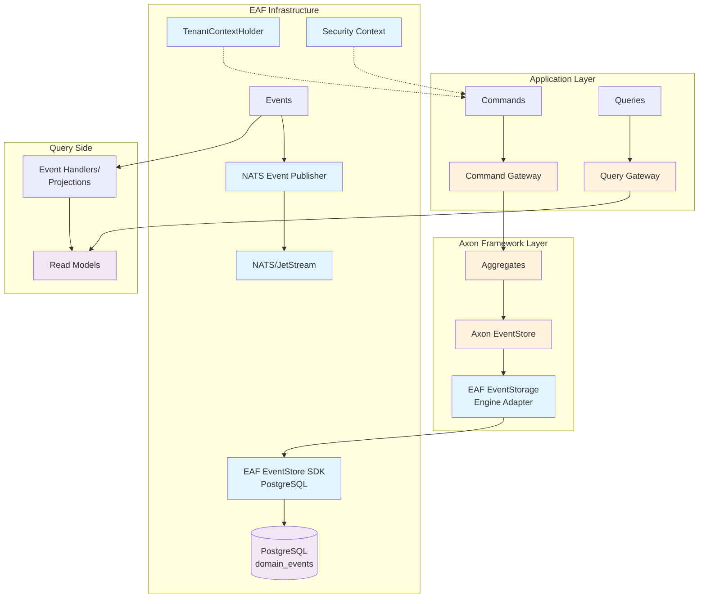

# EAF Integration Overview

This module covers how Axon Framework integrates with EAF infrastructure, leveraging existing
components while adding event sourcing capabilities.

## 📚 Learning Objectives

By the end of this module, you will understand:

- How EAF's custom EventStorageEngine works with PostgreSQL
- Multi-tenant event handling with TenantContextHolder
- NATS integration for event distribution
- Security context propagation in commands and events
- Global sequence tracking for event ordering

## 🏗️ EAF Integration Architecture

EAF's Axon integration bridges Axon Framework with existing EAF infrastructure:



## 🔧 Custom EventStorageEngine Implementation

EAF uses a custom `EventStorageEngine` that bridges Axon with the existing EAF Event Store:

### EventStorageEngine Adapter

```kotlin
@Component
class EafPostgresEventStorageEngine(
    private val eafEventStore: EafEventStoreSdk,
    private val eventMessageMapper: AxonEventMessageMapper,
    private val tenantContextHolder: TenantContextHolder,
    private val persistenceExceptionResolver: PersistenceExceptionResolver
) : EventStorageEngine {

    private val logger = LoggerFactory.getLogger(EafPostgresEventStorageEngine::class.java)

    override fun appendEvents(events: List<DomainEventMessage<*>>): List<DomainEventMessage<*>> {
        val tenantId = tenantContextHolder.getCurrentTenantId()
            ?: throw IllegalStateException("No tenant context available")

        try {
            val persistedEvents = events.map { event ->
                val persistedEvent = eventMessageMapper.mapToPersistedEvent(event, tenantId)
                eafEventStore.appendEvent(persistedEvent)
                event
            }

            logger.debug(
                "Appended {} events for tenant {} to aggregate {}",
                events.size,
                tenantId,
                events.first().aggregateIdentifier
            )

            return persistedEvents
        } catch (e: Exception) {
            logger.error(
                "Failed to append events for tenant {}: {}",
                tenantId,
                e.message,
                e
            )
            throw persistenceExceptionResolver.resolve(e)
        }
    }

    override fun readEvents(aggregateIdentifier: String): Stream<DomainEventMessage<*>> {
        val tenantId = tenantContextHolder.getCurrentTenantId()
            ?: throw IllegalStateException("No tenant context available")

        return try {
            val streamId = PersistedEvent.createStreamId("UnknownAggregate", aggregateIdentifier)
            eafEventStore.readEventStream(tenantId, streamId)
                .map { persistedEvent -> eventMessageMapper.mapToDomainEvent(persistedEvent) }
                .stream()
        } catch (e: Exception) {
            logger.error(
                "Failed to read events for aggregate {} in tenant {}: {}",
                aggregateIdentifier,
                tenantId,
                e.message,
                e
            )
            throw persistenceExceptionResolver.resolve(e)
        }
    }

    override fun createTailToken(): TrackingToken {
        return GlobalSequenceTrackingToken.createTailToken()
    }

    override fun createHeadToken(): TrackingToken {
        return GlobalSequenceTrackingToken.createHeadToken(eafEventStore.getMaxGlobalSequence())
    }

    override fun createTokenAt(dateTime: Instant): TrackingToken {
        val globalSequence = eafEventStore.findGlobalSequenceAtTimestamp(dateTime)
        return GlobalSequenceTrackingToken(globalSequence)
    }
}
```

### Event Message Mapping

The `AxonEventMessageMapper` handles bidirectional conversion between Axon and EAF events:

```kotlin
@Component
class AxonEventMessageMapper(
    private val objectMapper: ObjectMapper
) {
    fun mapToPersistedEvent(
        event: DomainEventMessage<*>,
        tenantId: String
    ): PersistedEvent {
        return PersistedEvent(
            eventId = UUID.fromString(event.identifier),
            streamId = PersistedEvent.createStreamId(event.type, event.aggregateIdentifier),
            aggregateId = event.aggregateIdentifier,
            aggregateType = event.type,
            sequenceNumber = event.sequenceNumber,
            tenantId = tenantId,
            eventType = event.payloadType.name,
            payload = serializePayload(event.payload),
            metadata = serializeMetadata(event.metaData, tenantId, event),
            timestampUtc = event.timestamp
        )
    }

    fun mapToDomainEvent(persistedEvent: PersistedEvent): DomainEventMessage<*> {
        val payload = deserializePayload(persistedEvent.payload, persistedEvent.eventType)
        val metadata = deserializeMetadata(persistedEvent.metadata)
            .and("global_sequence_id", persistedEvent.globalSequenceId.toString())
            .and("tenant_id", persistedEvent.tenantId)

        return GenericDomainEventMessage(
            persistedEvent.aggregateType,
            persistedEvent.aggregateId,
            persistedEvent.sequenceNumber,
            payload,
            metadata
        )
    }
}
```

## 🏢 Multi-Tenant Support

### TenantContextHolder Integration

EAF's multi-tenancy integrates seamlessly with Axon through context propagation:

```kotlin
@Component
class TenantContextHolder {
    private val tenantContext = ThreadLocal<String>()

    fun setCurrentTenantId(tenantId: String) {
        tenantContext.set(tenantId)
        MDC.put("tenant_id", tenantId)
    }

    fun getCurrentTenantId(): String? = tenantContext.get()

    fun clearContext() {
        tenantContext.remove()
        MDC.remove("tenant_id")
    }
}

// Tenant-aware Command Gateway
@Component
class TenantAwareCommandGateway(
    private val commandGateway: CommandGateway,
    private val tenantContextHolder: TenantContextHolder
) {
    fun <R> send(command: Any): CompletableFuture<R> {
        val tenantId = tenantContextHolder.getCurrentTenantId()
            ?: throw IllegalStateException("No tenant context")

        // Add tenant metadata to command
        val metaData = MetaData.with("tenant_id", tenantId)
        return commandGateway.send(command, metaData)
    }
}
```

### Tenant Isolation in Event Processing

```kotlin
@Component
@ProcessingGroup("tenant-aware-projections")
class TenantAwareProjectionHandler(
    private val userProjectionRepository: UserProjectionRepository
) {
    @EventHandler
    fun on(event: UserCreatedEvent, @MetaData("tenant_id") tenantId: String) {
        // Tenant ID is automatically available from metadata
        val projection = UserProjection(
            userId = event.userId,
            tenantId = tenantId, // Ensures proper tenant isolation
            email = event.email,
            // ... other fields
        )
        userProjectionRepository.save(projection)
    }
}
```

## 📡 NATS Integration for Event Distribution

EAF publishes Axon events to NATS for external system integration:

### NATS Event Publisher

```kotlin
@Component
@ProcessingGroup("nats-event-publisher")
class NatsEventRelayProcessor(
    private val natsEventPublisher: NatsEventPublisher
) {
    private val logger = LoggerFactory.getLogger(NatsEventRelayProcessor::class.java)

    @EventHandler
    suspend fun on(
        event: Any,
        @MetaData("tenant_id") tenantId: String,
        @MetaData("correlation_id") correlationId: String?
    ) {
        try {
            val subject = "events.${event.javaClass.simpleName}"

            natsEventPublisher.publish(
                subject = subject,
                tenantId = tenantId,
                event = event,
                metadata = mapOf(
                    "correlation_id" to (correlationId ?: UUID.randomUUID().toString()),
                    "source" to "axon-framework"
                )
            )

            logger.debug(
                "Published event {} to NATS subject {} for tenant {}",
                event.javaClass.simpleName,
                subject,
                tenantId
            )
        } catch (e: Exception) {
            logger.error(
                "Failed to publish event {} to NATS for tenant {}: {}",
                event.javaClass.simpleName,
                tenantId,
                e.message,
                e
            )
            // Don't rethrow - event processing should continue
        }
    }
}
```

### NATS Configuration for Axon

```kotlin
@Configuration
class NatsAxonConfiguration {

    @Bean
    fun natsEventProcessingConfigurer(): EventProcessingConfigurer {
        return { configurer ->
            configurer.registerTrackingEventProcessor("nats-event-publisher") { config ->
                TrackingEventProcessorConfiguration
                    .forSingleThreadedProcessing()
                    .andInitialTrackingToken { config.eventStore().createHeadToken() }
                    .andBatchSize(10) // Process events in small batches
            }
        }
    }
}
```

## 🔒 Security Context Integration

EAF's security context propagates through Axon commands and events:

### Security Context Provider

```kotlin
@Component
class SecurityContextCorrelationDataProvider : CorrelationDataProvider {
    private val logger = LoggerFactory.getLogger(SecurityContextCorrelationDataProvider::class.java)

    override fun correlationDataFor(message: Message<*>): Map<String, *> {
        val securityContext = SecurityContextHolder.getContext()
        val authentication = securityContext.authentication

        val correlationData = mutableMapOf<String, Any>()

        if (authentication != null && authentication.isAuthenticated) {
            correlationData["user_id"] = authentication.name
            correlationData["authorities"] = authentication.authorities
                .map { it.authority }
                .joinToString(",")
        }

        // Add tenant context if available
        val tenantId = MDC.get("tenant_id")
        if (tenantId != null) {
            correlationData["tenant_id"] = tenantId
        }

        // Add correlation ID for distributed tracing
        correlationData["correlation_id"] = UUID.randomUUID().toString()
        correlationData["timestamp"] = Instant.now().toString()

        logger.debug("Added correlation data: {}", correlationData.keys)
        return correlationData
    }
}
```

### Command Authorization

```kotlin
@Component
class UserCommandHandler(
    private val repository: Repository<User>
) {
    @CommandHandler
    @PreAuthorize("hasRole('USER_MANAGEMENT') and #command.tenantId == principal.tenantId")
    fun handle(command: CreateUserCommand) {
        // Security context automatically enforced via @PreAuthorize
        val user = User(command)
        repository.save(user)
    }

    @CommandHandler
    @PreAuthorize("hasRole('USER_MANAGEMENT')")
    fun handle(command: UpdateUserEmailCommand, @MetaData("tenant_id") tenantId: String) {
        // Tenant ID available in metadata for additional validation
        val currentTenantId = SecurityContextHolder.getContext()
            .authentication
            .details as? String

        require(tenantId == currentTenantId) { "Cross-tenant operation not allowed" }

        val user = repository.load(command.userId)
        user.updateEmail(command.newEmail, command.reason)
        repository.save(user)
    }
}
```

## 📈 Global Sequence Tracking

EAF implements `GlobalSequenceTrackingToken` for ordered event processing:

### GlobalSequenceTrackingToken Implementation

```kotlin
data class GlobalSequenceTrackingToken(
    val globalSequence: Long
) : TrackingToken {

    companion object {
        fun createTailToken(): GlobalSequenceTrackingToken = GlobalSequenceTrackingToken(0L)

        fun createHeadToken(maxSequence: Long): GlobalSequenceTrackingToken =
            GlobalSequenceTrackingToken(maxSequence)
    }

    override fun covers(other: TrackingToken): Boolean {
        return when (other) {
            is GlobalSequenceTrackingToken -> this.globalSequence >= other.globalSequence
            else -> false
        }
    }

    override fun unwrap(): Optional<TrackingToken> = Optional.empty()

    fun advance(): GlobalSequenceTrackingToken = copy(globalSequence = globalSequence + 1)
}
```

### Token Store Integration

```kotlin
@Component
class PostgresTokenStore(
    private val dataSource: DataSource
) : TokenStore {

    override fun storeToken(token: TrackingToken, processorName: String, segment: Int) {
        val globalToken = token as GlobalSequenceTrackingToken

        dataSource.connection.use { connection ->
            val sql = """
                INSERT INTO tracking_tokens (processor_name, segment, global_sequence, updated_at)
                VALUES (?, ?, ?, ?)
                ON CONFLICT (processor_name, segment)
                DO UPDATE SET global_sequence = EXCLUDED.global_sequence,
                             updated_at = EXCLUDED.updated_at
            """.trimIndent()

            connection.prepareStatement(sql).use { stmt ->
                stmt.setString(1, processorName)
                stmt.setInt(2, segment)
                stmt.setLong(3, globalToken.globalSequence)
                stmt.setTimestamp(4, Timestamp.from(Instant.now()))
                stmt.executeUpdate()
            }
        }
    }

    override fun fetchToken(processorName: String, segment: Int): TrackingToken? {
        dataSource.connection.use { connection ->
            val sql = "SELECT global_sequence FROM tracking_tokens WHERE processor_name = ? AND segment = ?"

            connection.prepareStatement(sql).use { stmt ->
                stmt.setString(1, processorName)
                stmt.setInt(2, segment)

                stmt.executeQuery().use { rs ->
                    return if (rs.next()) {
                        GlobalSequenceTrackingToken(rs.getLong("global_sequence"))
                    } else {
                        null
                    }
                }
            }
        }
    }
}
```

## 🔧 Configuration Example

Complete EAF Axon configuration:

```kotlin
@Configuration
@EnableAxon
class EafAxonConfiguration {

    @Bean
    fun configurer(
        eventStorageEngine: EafPostgresEventStorageEngine,
        correlationProviders: List<CorrelationDataProvider>,
        tokenStore: TokenStore
    ): Configurer {
        return DefaultConfigurer.defaultConfiguration()
            .configureEventStore { eventStorageEngine }
            .configureCorrelationDataProviders { correlationProviders }
            .configureTokenStore { tokenStore }
            .configureEventProcessing { config ->
                config.registerTrackingEventProcessor("default") {
                    TrackingEventProcessorConfiguration.forSingleThreadedProcessing()
                }
            }
    }

    @Bean
    @Primary
    fun commandGateway(configurer: Configurer): CommandGateway {
        return configurer.buildConfiguration().commandGateway()
    }

    @Bean
    @Primary
    fun queryGateway(configurer: Configurer): QueryGateway {
        return configurer.buildConfiguration().queryGateway()
    }
}
```

## 🎯 Key Integration Benefits

1. **Seamless Multi-tenancy**: Automatic tenant isolation at all levels
2. **Event Distribution**: Automatic NATS publishing for external systems
3. **Security Integration**: Built-in authorization and audit trails
4. **Performance**: Optimized PostgreSQL storage with global sequencing
5. **Observability**: Comprehensive logging and correlation tracking

## 🚀 Next Steps

Now that you understand EAF integration, let's dive into practical implementation:

**Next Module:** [Aggregates & Commands](./03-aggregates-commands.md) →

**Topics covered next:**

- Building EAF-compatible aggregates
- Command validation patterns
- Multi-tenant aggregate design
- Event sourcing best practices

---

💡 **Key Takeaway:** EAF's Axon integration preserves all existing infrastructure benefits while
adding powerful event sourcing capabilities!
