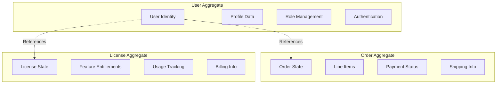

# Aggregates & Commands

This module demonstrates how to build robust, multi-tenant aggregates using Axon Framework within
the EAF architecture.

## 📚 Learning Objectives

By the end of this module, you will be able to:

- Design and implement event-sourced aggregates
- Create commands with proper validation
- Handle multi-tenant business logic
- Apply EAF security and audit patterns
- Implement proper error handling and business rules

## 🏗️ Aggregate Design Principles

### 1. Single Responsibility

Each aggregate manages one business concept with clear boundaries:



### 2. Consistency Boundaries

Keep strongly consistent data within the same aggregate, use eventual consistency between
aggregates.

### 3. Multi-Tenant Isolation

All business operations must respect tenant boundaries.

## 👤 Example: User Aggregate

Let's build a comprehensive User aggregate that handles the complete user lifecycle:

### Commands

```kotlin
// Command definitions with validation
data class CreateUserCommand(
    val userId: String,
    val tenantId: String,
    val email: String,
    val firstName: String,
    val lastName: String,
    val roles: Set<String>,
    val department: String?
) {
    init {
        require(userId.isNotBlank()) { "User ID cannot be blank" }
        require(tenantId.isNotBlank()) { "Tenant ID cannot be blank" }
        require(email.isValidEmail()) { "Invalid email format" }
        require(firstName.isNotBlank()) { "First name cannot be blank" }
        require(lastName.isNotBlank()) { "Last name cannot be blank" }
        require(roles.isNotEmpty()) { "User must have at least one role" }
    }
}

data class UpdateUserProfileCommand(
    val userId: String,
    val firstName: String?,
    val lastName: String?,
    val department: String?,
    val phoneNumber: String?
)

data class ChangeUserEmailCommand(
    val userId: String,
    val newEmail: String,
    val reason: String
) {
    init {
        require(userId.isNotBlank()) { "User ID cannot be blank" }
        require(newEmail.isValidEmail()) { "Invalid email format" }
        require(reason.isNotBlank()) { "Reason for email change is required" }
    }
}

data class AssignUserRoleCommand(
    val userId: String,
    val role: String,
    val assignedBy: String
)

data class RemoveUserRoleCommand(
    val userId: String,
    val role: String,
    val removedBy: String,
    val reason: String
)

data class SuspendUserCommand(
    val userId: String,
    val reason: String,
    val suspendedBy: String
)

data class ReactivateUserCommand(
    val userId: String,
    val reason: String,
    val reactivatedBy: String
)
```

### Events

```kotlin
// Event definitions - immutable facts about what happened
data class UserCreatedEvent(
    val userId: String,
    val tenantId: String,
    val email: String,
    val firstName: String,
    val lastName: String,
    val roles: Set<String>,
    val department: String?,
    val createdAt: Instant = Instant.now()
)

data class UserProfileUpdatedEvent(
    val userId: String,
    val previousFirstName: String?,
    val newFirstName: String?,
    val previousLastName: String?,
    val newLastName: String?,
    val previousDepartment: String?,
    val newDepartment: String?,
    val previousPhoneNumber: String?,
    val newPhoneNumber: String?,
    val updatedAt: Instant = Instant.now()
)

data class UserEmailChangedEvent(
    val userId: String,
    val previousEmail: String,
    val newEmail: String,
    val reason: String,
    val changedAt: Instant = Instant.now()
)

data class UserRoleAssignedEvent(
    val userId: String,
    val role: String,
    val assignedBy: String,
    val assignedAt: Instant = Instant.now()
)

data class UserRoleRemovedEvent(
    val userId: String,
    val role: String,
    val removedBy: String,
    val reason: String,
    val removedAt: Instant = Instant.now()
)

data class UserSuspendedEvent(
    val userId: String,
    val reason: String,
    val suspendedBy: String,
    val suspendedAt: Instant = Instant.now()
)

data class UserReactivatedEvent(
    val userId: String,
    val reason: String,
    val reactivatedBy: String,
    val reactivatedAt: Instant = Instant.now()
)
```

### User Aggregate Implementation

```kotlin
@Aggregate
class User {
    @AggregateIdentifier
    private lateinit var userId: String

    private lateinit var tenantId: String
    private lateinit var email: String
    private lateinit var firstName: String
    private lateinit var lastName: String
    private lateinit var status: UserStatus
    private val roles: MutableSet<String> = mutableSetOf()
    private var department: String? = null
    private var phoneNumber: String? = null
    private var createdAt: Instant? = null
    private var lastUpdatedAt: Instant? = null

    // No-arg constructor required by Axon
    constructor()

    // Creation command handler
    @CommandHandler
    constructor(command: CreateUserCommand) {
        // Business validation
        validateEmailUniqueness(command.email, command.tenantId)
        validateRoles(command.roles, command.tenantId)

        // Apply creation event
        AggregateLifecycle.apply(
            UserCreatedEvent(
                userId = command.userId,
                tenantId = command.tenantId,
                email = command.email,
                firstName = command.firstName,
                lastName = command.lastName,
                roles = command.roles,
                department = command.department
            )
        )
    }

    // Profile update command handler
    @CommandHandler
    fun handle(command: UpdateUserProfileCommand) {
        require(status == UserStatus.ACTIVE) {
            "Cannot update profile of inactive user"
        }

        // Only apply event if something actually changed
        if (hasProfileChanges(command)) {
            AggregateLifecycle.apply(
                UserProfileUpdatedEvent(
                    userId = userId,
                    previousFirstName = firstName,
                    newFirstName = command.firstName,
                    previousLastName = lastName,
                    newLastName = command.lastName,
                    previousDepartment = department,
                    newDepartment = command.department,
                    previousPhoneNumber = phoneNumber,
                    newPhoneNumber = command.phoneNumber
                )
            )
        }
    }

    // Email change command handler
    @CommandHandler
    fun handle(command: ChangeUserEmailCommand) {
        require(status == UserStatus.ACTIVE) {
            "Cannot change email of inactive user"
        }
        require(email != command.newEmail) {
            "New email must be different from current email"
        }

        // Validate new email is unique within tenant
        validateEmailUniqueness(command.newEmail, tenantId)

        AggregateLifecycle.apply(
            UserEmailChangedEvent(
                userId = userId,
                previousEmail = email,
                newEmail = command.newEmail,
                reason = command.reason
            )
        )
    }

    // Role assignment command handler
    @CommandHandler
    fun handle(command: AssignUserRoleCommand) {
        require(status == UserStatus.ACTIVE) {
            "Cannot assign roles to inactive user"
        }
        require(!roles.contains(command.role)) {
            "User already has role: ${command.role}"
        }

        validateRole(command.role, tenantId)

        AggregateLifecycle.apply(
            UserRoleAssignedEvent(
                userId = userId,
                role = command.role,
                assignedBy = command.assignedBy
            )
        )
    }

    // Role removal command handler
    @CommandHandler
    fun handle(command: RemoveUserRoleCommand) {
        require(status == UserStatus.ACTIVE) {
            "Cannot remove roles from inactive user"
        }
        require(roles.contains(command.role)) {
            "User does not have role: ${command.role}"
        }
        require(roles.size > 1) {
            "Cannot remove last role from user"
        }

        AggregateLifecycle.apply(
            UserRoleRemovedEvent(
                userId = userId,
                role = command.role,
                removedBy = command.removedBy,
                reason = command.reason
            )
        )
    }

    // Suspension command handler
    @CommandHandler
    fun handle(command: SuspendUserCommand) {
        require(status == UserStatus.ACTIVE) {
            "User is already suspended or inactive"
        }

        AggregateLifecycle.apply(
            UserSuspendedEvent(
                userId = userId,
                reason = command.reason,
                suspendedBy = command.suspendedBy
            )
        )
    }

    // Reactivation command handler
    @CommandHandler
    fun handle(command: ReactivateUserCommand) {
        require(status == UserStatus.SUSPENDED) {
            "Can only reactivate suspended users"
        }

        AggregateLifecycle.apply(
            UserReactivatedEvent(
                userId = userId,
                reason = command.reason,
                reactivatedBy = command.reactivatedBy
            )
        )
    }

    // Event sourcing handlers - rebuild state from events
    @EventSourcingHandler
    fun on(event: UserCreatedEvent) {
        this.userId = event.userId
        this.tenantId = event.tenantId
        this.email = event.email
        this.firstName = event.firstName
        this.lastName = event.lastName
        this.status = UserStatus.ACTIVE
        this.roles.addAll(event.roles)
        this.department = event.department
        this.createdAt = event.createdAt
        this.lastUpdatedAt = event.createdAt
    }

    @EventSourcingHandler
    fun on(event: UserProfileUpdatedEvent) {
        event.newFirstName?.let { this.firstName = it }
        event.newLastName?.let { this.lastName = it }
        this.department = event.newDepartment
        this.phoneNumber = event.newPhoneNumber
        this.lastUpdatedAt = event.updatedAt
    }

    @EventSourcingHandler
    fun on(event: UserEmailChangedEvent) {
        this.email = event.newEmail
        this.lastUpdatedAt = event.changedAt
    }

    @EventSourcingHandler
    fun on(event: UserRoleAssignedEvent) {
        this.roles.add(event.role)
        this.lastUpdatedAt = event.assignedAt
    }

    @EventSourcingHandler
    fun on(event: UserRoleRemovedEvent) {
        this.roles.remove(event.role)
        this.lastUpdatedAt = event.removedAt
    }

    @EventSourcingHandler
    fun on(event: UserSuspendedEvent) {
        this.status = UserStatus.SUSPENDED
        this.lastUpdatedAt = event.suspendedAt
    }

    @EventSourcingHandler
    fun on(event: UserReactivatedEvent) {
        this.status = UserStatus.ACTIVE
        this.lastUpdatedAt = event.reactivatedAt
    }

    // Private helper methods for business logic
    private fun hasProfileChanges(command: UpdateUserProfileCommand): Boolean {
        return command.firstName != firstName ||
               command.lastName != lastName ||
               command.department != department ||
               command.phoneNumber != phoneNumber
    }

    private fun validateEmailUniqueness(email: String, tenantId: String) {
        // This would integrate with a repository/service to check uniqueness
        // For demonstration, we'll assume it's implemented
        // In real implementation, this might be handled in a separate service
        // or through a saga pattern for cross-aggregate validation
    }

    private fun validateRoles(roles: Set<String>, tenantId: String) {
        // Validate that all roles exist and are valid for the tenant
        // This could integrate with IAM service
    }

    private fun validateRole(role: String, tenantId: String) {
        // Validate single role exists and is valid for tenant
    }
}

enum class UserStatus {
    ACTIVE,
    SUSPENDED,
    INACTIVE
}
```

## 🛡️ Command Handler with EAF Integration

External command handlers can provide additional services and validation:

```kotlin
@Component
class UserCommandHandler(
    private val repository: Repository<User>,
    private val emailValidationService: EmailValidationService,
    private val roleValidationService: RoleValidationService,
    private val auditService: AuditService
) {
    private val logger = LoggerFactory.getLogger(UserCommandHandler::class.java)

    @CommandHandler
    @PreAuthorize("hasRole('USER_MANAGEMENT')")
    fun handle(
        command: CreateUserCommand,
        @MetaData("tenant_id") tenantId: String,
        @MetaData("user_id") currentUserId: String
    ) {
        // Validate tenant context matches command
        require(command.tenantId == tenantId) {
            "Command tenant mismatch"
        }

        try {
            // Pre-validation with external services
            emailValidationService.validateEmailAvailable(command.email, tenantId)
            roleValidationService.validateRoles(command.roles, tenantId)

            // Create and save aggregate
            val user = User(command)
            repository.save(user)

            logger.info(
                "User {} created successfully in tenant {} by user {}",
                command.userId,
                tenantId,
                currentUserId
            )

        } catch (e: Exception) {
            logger.error(
                "Failed to create user {} in tenant {}: {}",
                command.userId,
                tenantId,
                e.message,
                e
            )
            throw e
        }
    }

    @CommandHandler
    @PreAuthorize("hasRole('USER_MANAGEMENT') or @userSecurityService.canModifyUser(#command.userId, principal)")
    fun handle(
        command: UpdateUserProfileCommand,
        @MetaData("tenant_id") tenantId: String,
        @MetaData("user_id") currentUserId: String
    ) {
        try {
            val user = repository.load(command.userId)
            user.handle(command)
            repository.save(user)

            logger.info(
                "User {} profile updated in tenant {} by user {}",
                command.userId,
                tenantId,
                currentUserId
            )

        } catch (e: Exception) {
            logger.error(
                "Failed to update user {} profile in tenant {}: {}",
                command.userId,
                tenantId,
                e.message,
                e
            )
            throw e
        }
    }

    @CommandHandler
    @PreAuthorize("hasRole('EMAIL_MANAGEMENT')")
    fun handle(
        command: ChangeUserEmailCommand,
        @MetaData("tenant_id") tenantId: String,
        @MetaData("user_id") currentUserId: String
    ) {
        try {
            // External validation
            emailValidationService.validateEmailAvailable(command.newEmail, tenantId)

            val user = repository.load(command.userId)
            user.handle(command)
            repository.save(user)

            // Additional audit logging for sensitive operations
            auditService.logEmailChange(
                userId = command.userId,
                oldEmail = "***", // Would get from user state
                newEmail = command.newEmail,
                reason = command.reason,
                changedBy = currentUserId,
                tenantId = tenantId
            )

        } catch (e: Exception) {
            logger.error(
                "Failed to change email for user {} in tenant {}: {}",
                command.userId,
                tenantId,
                e.message,
                e
            )
            throw e
        }
    }
}
```

## 🔧 Validation Services

External services handle cross-aggregate validation:

```kotlin
@Service
class EmailValidationService(
    private val userProjectionRepository: UserProjectionRepository
) {
    fun validateEmailAvailable(email: String, tenantId: String) {
        val existingUser = userProjectionRepository.findByEmailAndTenantId(email, tenantId)
        if (existingUser != null) {
            throw EmailAlreadyExistsException("Email $email already exists in tenant $tenantId")
        }
    }
}

@Service
class RoleValidationService(
    private val iamClientService: IamClientService
) {
    fun validateRoles(roles: Set<String>, tenantId: String) {
        val validRoles = iamClientService.getValidRoles(tenantId)
        val invalidRoles = roles - validRoles.toSet()

        if (invalidRoles.isNotEmpty()) {
            throw InvalidRolesException("Invalid roles for tenant $tenantId: $invalidRoles")
        }
    }

    fun validateRole(role: String, tenantId: String) {
        validateRoles(setOf(role), tenantId)
    }
}
```

## 🎯 Command Validation Patterns

### 1. Constructor Validation

Use `init` blocks for simple validation:

```kotlin
data class CreateUserCommand(
    val email: String,
    val name: String
) {
    init {
        require(email.isValidEmail()) { "Invalid email format" }
        require(name.isNotBlank()) { "Name cannot be blank" }
    }
}
```

### 2. Custom Validation Functions

For complex validation logic:

```kotlin
fun String.isValidEmail(): Boolean {
    return this.matches(Regex("[a-zA-Z0-9._%+-]+@[a-zA-Z0-9.-]+\\.[a-zA-Z]{2,}"))
}

fun String.isValidPhoneNumber(): Boolean {
    return this.matches(Regex("\\+?[1-9]\\d{1,14}"))
}

fun Set<String>.hasValidRoles(): Boolean {
    val validRoles = setOf("USER", "ADMIN", "MANAGER", "ANALYST")
    return this.isNotEmpty() && this.all { it in validRoles }
}
```

### 3. Bean Validation Integration

Use Jakarta validation annotations:

```kotlin
data class CreateUserCommand(
    @field:NotBlank(message = "User ID cannot be blank")
    val userId: String,

    @field:NotBlank(message = "Tenant ID cannot be blank")
    val tenantId: String,

    @field:Email(message = "Invalid email format")
    @field:NotBlank(message = "Email cannot be blank")
    val email: String,

    @field:Size(min = 2, max = 50, message = "First name must be between 2 and 50 characters")
    val firstName: String,

    @field:Size(min = 2, max = 50, message = "Last name must be between 2 and 50 characters")
    val lastName: String,

    @field:NotEmpty(message = "User must have at least one role")
    val roles: Set<@Valid String>
)
```

## 🚨 Error Handling Patterns

### Business Exception Hierarchy

```kotlin
sealed class UserBusinessException(message: String, cause: Throwable? = null) :
    RuntimeException(message, cause)

class EmailAlreadyExistsException(message: String) : UserBusinessException(message)
class InvalidRolesException(message: String) : UserBusinessException(message)
class UserNotFoundException(message: String) : UserBusinessException(message)
class UserInactiveException(message: String) : UserBusinessException(message)
class InsufficientPermissionsException(message: String) : UserBusinessException(message)

// Global exception handler
@ControllerAdvice
class UserExceptionHandler {

    @ExceptionHandler(EmailAlreadyExistsException::class)
    fun handleEmailExists(ex: EmailAlreadyExistsException): ResponseEntity<ErrorResponse> {
        return ResponseEntity.status(HttpStatus.CONFLICT)
            .body(ErrorResponse("EMAIL_EXISTS", ex.message ?: "Email already exists"))
    }

    @ExceptionHandler(InvalidRolesException::class)
    fun handleInvalidRoles(ex: InvalidRolesException): ResponseEntity<ErrorResponse> {
        return ResponseEntity.status(HttpStatus.BAD_REQUEST)
            .body(ErrorResponse("INVALID_ROLES", ex.message ?: "Invalid roles"))
    }
}

data class ErrorResponse(
    val code: String,
    val message: String,
    val timestamp: Instant = Instant.now()
)
```

## 🧪 Testing Aggregates

### Unit Testing with Axon Test

```kotlin
class UserTest {
    private lateinit var fixture: AggregateTestFixture<User>

    @BeforeEach
    fun setUp() {
        fixture = AggregateTestFixture(User::class.java)
    }

    @Test
    fun `should create user when valid command is given`() {
        val command = CreateUserCommand(
            userId = "user-123",
            tenantId = "tenant-abc",
            email = "john.doe@example.com",
            firstName = "John",
            lastName = "Doe",
            roles = setOf("USER"),
            department = "Engineering"
        )

        fixture.givenNoPriorActivity()
            .`when`(command)
            .expectEvents(
                UserCreatedEvent(
                    userId = "user-123",
                    tenantId = "tenant-abc",
                    email = "john.doe@example.com",
                    firstName = "John",
                    lastName = "Doe",
                    roles = setOf("USER"),
                    department = "Engineering"
                )
            )
    }

    @Test
    fun `should update profile when user is active`() {
        val createEvent = UserCreatedEvent(
            userId = "user-123",
            tenantId = "tenant-abc",
            email = "john.doe@example.com",
            firstName = "John",
            lastName = "Doe",
            roles = setOf("USER"),
            department = "Engineering"
        )

        val updateCommand = UpdateUserProfileCommand(
            userId = "user-123",
            firstName = "Johnny",
            lastName = null,
            department = "Product",
            phoneNumber = "+1234567890"
        )

        fixture.given(createEvent)
            .`when`(updateCommand)
            .expectEvents(
                UserProfileUpdatedEvent(
                    userId = "user-123",
                    previousFirstName = "John",
                    newFirstName = "Johnny",
                    previousLastName = "Doe",
                    newLastName = null,
                    previousDepartment = "Engineering",
                    newDepartment = "Product",
                    previousPhoneNumber = null,
                    newPhoneNumber = "+1234567890"
                )
            )
    }

    @Test
    fun `should reject email change when user is suspended`() {
        val createEvent = UserCreatedEvent(
            userId = "user-123",
            tenantId = "tenant-abc",
            email = "john.doe@example.com",
            firstName = "John",
            lastName = "Doe",
            roles = setOf("USER"),
            department = "Engineering"
        )

        val suspendEvent = UserSuspendedEvent(
            userId = "user-123",
            reason = "Policy violation",
            suspendedBy = "admin-456"
        )

        val changeEmailCommand = ChangeUserEmailCommand(
            userId = "user-123",
            newEmail = "john.new@example.com",
            reason = "Personal preference"
        )

        fixture.given(createEvent, suspendEvent)
            .`when`(changeEmailCommand)
            .expectException(IllegalStateException::class.java)
            .expectExceptionMessage("Cannot change email of inactive user")
    }
}
```

## 🚀 Next Steps

You've learned how to build robust aggregates and commands. Next, let's explore the query side:

**Next Module:** [Event Handlers & Projections](./04-event-handlers-projections.md) →

**Topics covered next:**

- Building read models from events
- Projection patterns and strategies
- Query handling and optimization
- Event processing configuration

---

💡 **Key Takeaway:** Aggregates should focus on business invariants and consistency within their
boundaries. Use events to communicate changes and maintain audit trails!
