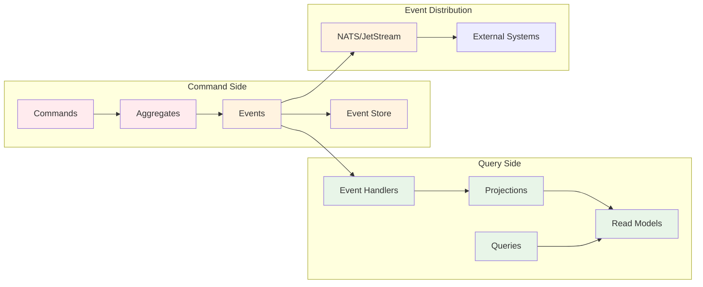

# Event Handlers & Projections

This module covers the query side of CQRS, focusing on building read models and handling events to
create optimized views for different use cases.

## 📚 Learning Objectives

By the end of this module, you will be able to:

- Build event handlers that create and maintain projections
- Design optimal read models for different query patterns
- Handle event ordering and idempotency correctly
- Implement multi-tenant projection strategies
- Configure event processing for performance and reliability

## 🏗️ Understanding the Query Side

### CQRS Separation Recap



**Key Principles:**

- Events drive projection updates
- Projections are optimized for specific queries
- Eventual consistency between command and query sides
- Multiple projections can be built from the same events

## 📊 Projection Design Patterns

### 1. Entity Projection Pattern

Simple one-to-one mapping from aggregate to read model:

```kotlin
// Read model entity
@Entity
@Table(name = "user_projections")
data class UserProjection(
    @Id
    val userId: String,

    @Column(nullable = false)
    val tenantId: String,

    @Column(nullable = false)
    val email: String,

    @Column(nullable = false)
    val firstName: String,

    @Column(nullable = false)
    val lastName: String,

    @Column(nullable = false)
    val fullName: String, // Computed field

    @Enumerated(EnumType.STRING)
    @Column(nullable = false)
    val status: UserStatus,

    @Column(columnDefinition = "TEXT")
    val roles: String, // JSON array

    val department: String?,

    @Column(nullable = false)
    val createdAt: Instant,

    @Column(nullable = false)
    val lastUpdatedAt: Instant,

    // Computed fields for common queries
    val isActive: Boolean,
    val roleCount: Int
)

// Repository with tenant-aware queries
interface UserProjectionRepository : JpaRepository<UserProjection, String> {
    fun findByTenantIdAndUserId(tenantId: String, userId: String): UserProjection?
    fun findAllByTenantId(tenantId: String): List<UserProjection>
    fun findByTenantIdAndStatus(tenantId: String, status: UserStatus): List<UserProjection>
    fun findByTenantIdAndDepartment(tenantId: String, department: String): List<UserProjection>
    fun findByTenantIdAndEmailContaining(tenantId: String, email: String): List<UserProjection>

    @Query("""
        SELECT u FROM UserProjection u
        WHERE u.tenantId = :tenantId
        AND JSON_CONTAINS(u.roles, :role) = 1
    """)
    fun findByTenantIdAndRole(tenantId: String, role: String): List<UserProjection>
}
```

### 2. Aggregated Projection Pattern

Combining data from multiple events into summary views:

```kotlin
// Department summary projection
@Entity
@Table(name = "department_summary_projections")
data class DepartmentSummaryProjection(
    @Id
    val id: String, // "${tenantId}-${department}"

    @Column(nullable = false)
    val tenantId: String,

    @Column(nullable = false)
    val department: String,

    @Column(nullable = false)
    val totalUsers: Int,

    @Column(nullable = false)
    val activeUsers: Int,

    @Column(nullable = false)
    val suspendedUsers: Int,

    @Column(nullable = false)
    val averageRolesPerUser: Double,

    @Column(nullable = false)
    val lastUpdated: Instant,

    // Most common roles in department
    @Column(columnDefinition = "TEXT")
    val topRoles: String // JSON array
)
```

### 3. Search-Optimized Projection Pattern

Denormalized views for full-text search:

```kotlin
// Search-optimized user view
@Entity
@Table(name = "user_search_projections")
data class UserSearchProjection(
    @Id
    val userId: String,

    @Column(nullable = false)
    val tenantId: String,

    // Search-optimized fields
    @Column(columnDefinition = "TEXT")
    val searchText: String, // Combined searchable content

    @Column(columnDefinition = "TEXT")
    val keywords: String, // Space-separated keywords

    // Display fields
    val displayName: String,
    val email: String,
    val department: String?,
    val roles: String,
    val status: String,

    @Column(nullable = false)
    val lastUpdated: Instant
) {
    companion object {
        fun buildSearchText(user: UserProjection): String {
            return listOfNotNull(
                user.firstName,
                user.lastName,
                user.email,
                user.department,
                user.roles
            ).joinToString(" ").lowercase()
        }
    }
}
```

## 🔄 Event Handler Implementation

### Basic Event Handler

```kotlin
@Component
@ProcessingGroup("user-projections")
@Transactional
class UserProjectionHandler(
    private val userProjectionRepository: UserProjectionRepository,
    private val objectMapper: ObjectMapper
) {
    private val logger = LoggerFactory.getLogger(UserProjectionHandler::class.java)

    @EventHandler
    fun on(event: UserCreatedEvent, @MetaData("tenant_id") tenantId: String) {
        logger.debug("Creating user projection for user: {} in tenant: {}", event.userId, tenantId)

        val projection = UserProjection(
            userId = event.userId,
            tenantId = tenantId,
            email = event.email,
            firstName = event.firstName,
            lastName = event.lastName,
            fullName = "${event.firstName} ${event.lastName}",
            status = UserStatus.ACTIVE,
            roles = objectMapper.writeValueAsString(event.roles),
            department = event.department,
            createdAt = event.createdAt,
            lastUpdatedAt = event.createdAt,
            isActive = true,
            roleCount = event.roles.size
        )

        userProjectionRepository.save(projection)

        logger.info("Created user projection for user: {} in tenant: {}", event.userId, tenantId)
    }

    @EventHandler
    fun on(event: UserEmailChangedEvent, @MetaData("tenant_id") tenantId: String) {
        val projection = userProjectionRepository.findByTenantIdAndUserId(tenantId, event.userId)
            ?: throw IllegalStateException("User projection not found: ${event.userId} in tenant: $tenantId")

        val updatedProjection = projection.copy(
            email = event.newEmail,
            lastUpdatedAt = event.changedAt
        )

        userProjectionRepository.save(updatedProjection)

        logger.info("Updated email for user: {} in tenant: {}", event.userId, tenantId)
    }

    @EventHandler
    fun on(event: UserRoleAssignedEvent, @MetaData("tenant_id") tenantId: String) {
        val projection = userProjectionRepository.findByTenantIdAndUserId(tenantId, event.userId)
            ?: throw IllegalStateException("User projection not found: ${event.userId}")

        // Update roles JSON
        val currentRoles = objectMapper.readValue(projection.roles, Array<String>::class.java).toMutableSet()
        currentRoles.add(event.role)

        val updatedProjection = projection.copy(
            roles = objectMapper.writeValueAsString(currentRoles),
            roleCount = currentRoles.size,
            lastUpdatedAt = event.assignedAt
        )

        userProjectionRepository.save(updatedProjection)

        logger.info("Added role {} to user: {} in tenant: {}", event.role, event.userId, tenantId)
    }

    @EventHandler
    fun on(event: UserSuspendedEvent, @MetaData("tenant_id") tenantId: String) {
        val projection = userProjectionRepository.findByTenantIdAndUserId(tenantId, event.userId)
            ?: throw IllegalStateException("User projection not found: ${event.userId}")

        val updatedProjection = projection.copy(
            status = UserStatus.SUSPENDED,
            isActive = false,
            lastUpdatedAt = event.suspendedAt
        )

        userProjectionRepository.save(updatedProjection)

        logger.info("Suspended user: {} in tenant: {}", event.userId, tenantId)
    }
}
```

### Idempotent Event Handler

```kotlin
@Component
@ProcessingGroup("user-projections-idempotent")
@Transactional
class IdempotentUserProjectionHandler(
    private val userProjectionRepository: UserProjectionRepository,
    private val processedEventRepository: ProcessedEventRepository
) {

    @EventHandler
    fun on(
        event: UserCreatedEvent,
        @MetaData("tenant_id") tenantId: String,
        @MetaData("global_sequence_id") sequenceId: Long
    ) {
        // Check if already processed
        if (processedEventRepository.existsBySequenceId(sequenceId)) {
            logger.debug("Event {} already processed, skipping", sequenceId)
            return
        }

        // Check if projection already exists (additional safety)
        if (userProjectionRepository.findByTenantIdAndUserId(tenantId, event.userId) != null) {
            logger.warn("User projection already exists for {}, marking as processed", event.userId)
            markAsProcessed(sequenceId, "UserCreatedEvent")
            return
        }

        // Create projection
        val projection = createUserProjection(event, tenantId)
        userProjectionRepository.save(projection)

        // Mark as processed
        markAsProcessed(sequenceId, "UserCreatedEvent")

        logger.info("Created user projection for {}", event.userId)
    }

    private fun markAsProcessed(sequenceId: Long, eventType: String) {
        val processedEvent = ProcessedEvent(
            sequenceId = sequenceId,
            eventType = eventType,
            processedAt = Instant.now(),
            processorName = "user-projections-idempotent"
        )
        processedEventRepository.save(processedEvent)
    }
}

@Entity
@Table(name = "processed_events")
data class ProcessedEvent(
    @Id
    val sequenceId: Long,

    @Column(nullable = false)
    val eventType: String,

    @Column(nullable = false)
    val processedAt: Instant,

    @Column(nullable = false)
    val processorName: String
)
```

### Batch Event Processing

```kotlin
@Component
@ProcessingGroup("user-analytics")
@Transactional
class UserAnalyticsProjectionHandler(
    private val departmentSummaryRepository: DepartmentSummaryRepository
) {

    @EventHandler
    @BatchSize(50) // Process in batches for performance
    fun on(events: List<UserCreatedEvent>, metaData: List<MetaData>) {
        val eventsByTenant = events.zip(metaData).groupBy { (_, meta) ->
            meta["tenant_id"] as String
        }

        eventsByTenant.forEach { (tenantId, tenantEvents) ->
            updateDepartmentSummaries(tenantId, tenantEvents.map { it.first })
        }
    }

    private fun updateDepartmentSummaries(tenantId: String, events: List<UserCreatedEvent>) {
        val departmentUpdates = events
            .mapNotNull { it.department }
            .groupBy { it }
            .mapValues { (_, users) -> users.size }

        departmentUpdates.forEach { (department, userCount) ->
            val summaryId = "$tenantId-$department"
            val existing = departmentSummaryRepository.findById(summaryId)
                .orElse(createEmptyDepartmentSummary(summaryId, tenantId, department))

            val updated = existing.copy(
                totalUsers = existing.totalUsers + userCount,
                activeUsers = existing.activeUsers + userCount,
                lastUpdated = Instant.now()
            )

            departmentSummaryRepository.save(updated)
        }
    }
}
```

## 🔍 Query Handler Implementation

### Simple Query Handler

```kotlin
@Component
class UserQueryHandler(
    private val userProjectionRepository: UserProjectionRepository,
    private val tenantContextHolder: TenantContextHolder
) {

    @QueryHandler
    fun handle(query: FindUserByIdQuery): UserProjection? {
        val tenantId = tenantContextHolder.getCurrentTenantId()
            ?: throw IllegalStateException("No tenant context")

        return userProjectionRepository.findByTenantIdAndUserId(tenantId, query.userId)
    }

    @QueryHandler
    fun handle(query: FindUsersByDepartmentQuery): List<UserProjection> {
        val tenantId = tenantContextHolder.getCurrentTenantId()
            ?: throw IllegalStateException("No tenant context")

        return userProjectionRepository.findByTenantIdAndDepartment(tenantId, query.department)
    }

    @QueryHandler
    fun handle(query: SearchUsersQuery): Page<UserProjection> {
        val tenantId = tenantContextHolder.getCurrentTenantId()
            ?: throw IllegalStateException("No tenant context")

        val pageable = PageRequest.of(query.page, query.size)

        return if (query.searchTerm.isBlank()) {
            userProjectionRepository.findAllByTenantId(tenantId, pageable)
        } else {
            userProjectionRepository.findByTenantIdAndEmailContaining(
                tenantId,
                query.searchTerm,
                pageable
            )
        }
    }
}

// Query definitions
data class FindUserByIdQuery(val userId: String)
data class FindUsersByDepartmentQuery(val department: String)
data class SearchUsersQuery(
    val searchTerm: String = "",
    val page: Int = 0,
    val size: Int = 20
)
```

### Complex Query with Specifications

```kotlin
@Component
class AdvancedUserQueryHandler(
    private val userProjectionRepository: UserProjectionRepository,
    private val tenantContextHolder: TenantContextHolder
) {

    @QueryHandler
    fun handle(query: FindUsersWithCriteriaQuery): Page<UserProjection> {
        val tenantId = tenantContextHolder.getCurrentTenantId()
            ?: throw IllegalStateException("No tenant context")

        val specification = buildSpecification(tenantId, query)
        val pageable = PageRequest.of(query.page, query.size, query.sort)

        return userProjectionRepository.findAll(specification, pageable)
    }

    private fun buildSpecification(
        tenantId: String,
        query: FindUsersWithCriteriaQuery
    ): Specification<UserProjection> {
        return Specification
            .where(UserProjectionSpecs.hasTenantId(tenantId))
            .and(query.status?.let { UserProjectionSpecs.hasStatus(it) })
            .and(query.department?.let { UserProjectionSpecs.hasDepartment(it) })
            .and(query.role?.let { UserProjectionSpecs.hasRole(it) })
            .and(query.searchTerm?.let { UserProjectionSpecs.containsText(it) })
    }
}

// Specification utility
object UserProjectionSpecs {

    fun hasTenantId(tenantId: String): Specification<UserProjection> {
        return Specification { root, _, cb ->
            cb.equal(root.get<String>("tenantId"), tenantId)
        }
    }

    fun hasStatus(status: UserStatus): Specification<UserProjection> {
        return Specification { root, _, cb ->
            cb.equal(root.get<UserStatus>("status"), status)
        }
    }

    fun hasDepartment(department: String): Specification<UserProjection> {
        return Specification { root, _, cb ->
            cb.equal(root.get<String>("department"), department)
        }
    }

    fun hasRole(role: String): Specification<UserProjection> {
        return Specification { root, _, cb ->
            cb.like(root.get<String>("roles"), "%\"$role\"%")
        }
    }

    fun containsText(searchTerm: String): Specification<UserProjection> {
        return Specification { root, _, cb ->
            val term = "%${searchTerm.lowercase()}%"
            cb.or(
                cb.like(cb.lower(root.get("firstName")), term),
                cb.like(cb.lower(root.get("lastName")), term),
                cb.like(cb.lower(root.get("email")), term),
                cb.like(cb.lower(root.get("department")), term)
            )
        }
    }
}

data class FindUsersWithCriteriaQuery(
    val status: UserStatus? = null,
    val department: String? = null,
    val role: String? = null,
    val searchTerm: String? = null,
    val page: Int = 0,
    val size: Int = 20,
    val sort: Sort = Sort.by("lastUpdatedAt").descending()
)
```

## ⚡ Performance Optimization

### Database Indexing

```sql
-- Essential indexes for user projections
CREATE INDEX idx_user_projections_tenant_id ON user_projections(tenant_id);
CREATE INDEX idx_user_projections_tenant_status ON user_projections(tenant_id, status);
CREATE INDEX idx_user_projections_tenant_department ON user_projections(tenant_id, department);
CREATE INDEX idx_user_projections_tenant_email ON user_projections(tenant_id, email);
CREATE INDEX idx_user_projections_tenant_updated ON user_projections(tenant_id, last_updated_at);

-- Composite index for common queries
CREATE INDEX idx_user_projections_search ON user_projections(tenant_id, status, department, last_updated_at);

-- Full-text search index (PostgreSQL)
CREATE INDEX idx_user_projections_fulltext ON user_projections
USING GIN(to_tsvector('english', first_name || ' ' || last_name || ' ' || email));
```

### Event Processing Configuration

```kotlin
@Configuration
class ProjectionEventProcessingConfiguration {

    @Bean
    fun eventProcessingConfigurer(): EventProcessingConfigurer {
        return { config ->
            // High-priority user projections
            config.registerTrackingEventProcessor("user-projections") {
                TrackingEventProcessorConfiguration
                    .forParallelProcessing(2) // Parallel processing
                    .andBatchSize(25) // Optimize batch size
                    .andInitialTrackingToken { it.eventStore().createHeadToken() }
            }

            // Lower-priority analytics
            config.registerTrackingEventProcessor("user-analytics") {
                TrackingEventProcessorConfiguration
                    .forSingleThreadedProcessing()
                    .andBatchSize(100) // Larger batches for analytics
                    .andInitialTrackingToken { it.eventStore().createHeadToken() }
            }
        }
    }
}
```

### Caching Strategy

```kotlin
@Configuration
@EnableCaching
class ProjectionCacheConfiguration {

    @Bean
    fun cacheManager(): CacheManager {
        return ConcurrentMapCacheManager(
            "user-projections",
            "department-summaries",
            "user-search"
        )
    }
}

@Component
class CachedUserQueryHandler(
    private val userProjectionRepository: UserProjectionRepository,
    private val tenantContextHolder: TenantContextHolder
) {

    @QueryHandler
    @Cacheable(value = ["user-projections"], key = "#query.userId")
    fun handle(query: FindUserByIdQuery): UserProjection? {
        val tenantId = tenantContextHolder.getCurrentTenantId()
            ?: throw IllegalStateException("No tenant context")

        return userProjectionRepository.findByTenantIdAndUserId(tenantId, query.userId)
    }

    @EventHandler
    @CacheEvict(value = ["user-projections"], key = "#event.userId")
    fun on(event: UserEmailChangedEvent) {
        // Cache will be evicted automatically
    }
}
```

## 🧪 Testing Projections

### Unit Testing Event Handlers

```kotlin
class UserProjectionHandlerTest {

    @Mock
    private lateinit var userProjectionRepository: UserProjectionRepository

    @Mock
    private lateinit var objectMapper: ObjectMapper

    @InjectMocks
    private lateinit var handler: UserProjectionHandler

    @Test
    fun `should create user projection when UserCreatedEvent is received`() {
        // Given
        val event = UserCreatedEvent(
            userId = "user-123",
            tenantId = "tenant-abc",
            email = "test@example.com",
            firstName = "John",
            lastName = "Doe",
            roles = setOf("USER"),
            department = "Engineering"
        )
        val tenantId = "tenant-abc"

        whenever(objectMapper.writeValueAsString(event.roles))
            .thenReturn("[\"USER\"]")

        // When
        handler.on(event, tenantId)

        // Then
        verify(userProjectionRepository).save(argThat { projection ->
            projection.userId == "user-123" &&
            projection.tenantId == "tenant-abc" &&
            projection.email == "test@example.com" &&
            projection.fullName == "John Doe" &&
            projection.isActive &&
            projection.roleCount == 1
        })
    }
}
```

### Integration Testing

```kotlin
@SpringBootTest
@Testcontainers
@ActiveProfiles("test")
@Transactional
class UserProjectionIntegrationTest {

    @Autowired
    private lateinit var commandGateway: CommandGateway

    @Autowired
    private lateinit var queryGateway: QueryGateway

    @Autowired
    private lateinit var tenantContextHolder: TenantContextHolder

    @Test
    fun `should create and query user projection`() {
        val tenantId = "tenant-test"
        val userId = "user-123"

        // Set tenant context
        tenantContextHolder.setCurrentTenantId(tenantId)

        try {
            // Send command
            val command = CreateUserCommand(
                userId = userId,
                tenantId = tenantId,
                email = "test@example.com",
                firstName = "John",
                lastName = "Doe",
                roles = setOf("USER"),
                department = "Engineering"
            )

            commandGateway.sendAndWait<Void>(command)

            // Wait for projection to be created
            await().atMost(Duration.ofSeconds(5))
                .until {
                    queryGateway.query(
                        FindUserByIdQuery(userId),
                        UserProjection::class.java
                    ).join() != null
                }

            // Query projection
            val projection = queryGateway.query(
                FindUserByIdQuery(userId),
                UserProjection::class.java
            ).join()

            // Verify
            assertThat(projection).isNotNull
            assertThat(projection?.userId).isEqualTo(userId)
            assertThat(projection?.email).isEqualTo("test@example.com")
            assertThat(projection?.fullName).isEqualTo("John Doe")
            assertThat(projection?.isActive).isTrue()

        } finally {
            tenantContextHolder.clearContext()
        }
    }
}
```

## 🎯 Best Practices Summary

### ✅ Do's

- Design projections for specific query patterns
- Use idempotent event handlers
- Implement proper error handling and logging
- Add database indexes for common queries
- Use batch processing for analytics projections
- Cache frequently accessed projections
- Test both event handlers and query handlers

### ❌ Don'ts

- Don't create one massive projection for all queries
- Don't ignore event ordering issues
- Don't forget tenant isolation in projections
- Don't skip idempotency checks
- Don't over-normalize read models
- Don't ignore projection rebuild strategies

## 🚀 Next Steps

Now that you understand projections, let's explore EAF-specific patterns:

**Next Module:** [EAF-Specific Patterns](./05-eaf-patterns.md) →

**Topics covered next:**

- Multi-tenant projection strategies
- NATS integration patterns
- Security context handling
- Performance optimization techniques

---

💡 **Remember:** Projections are optimized for reading, not writing. Design them for your specific
query patterns and user needs!
