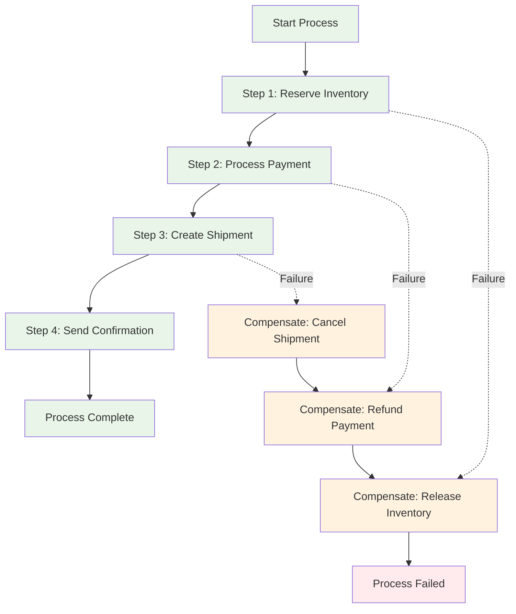

# Sagas & Process Managers

This module covers long-running business processes that coordinate multiple aggregates and external
services using the Saga pattern.

## 📚 Learning Objectives

By the end of this module, you will be able to:

- Design and implement Sagas for complex business processes
- Handle timeouts and compensation in long-running processes
- Coordinate multiple aggregates safely
- Implement retry and error handling strategies
- Use EAF patterns for reliable saga execution

## 🌟 Understanding Sagas

### What is a Saga?

A Saga is a **long-running process** that coordinates multiple operations across different
aggregates or services while maintaining consistency through **compensation** rather than
transactions.



### Saga vs Traditional Transactions

| Traditional Transaction | Saga Pattern          |
| ----------------------- | --------------------- |
| ACID properties         | Eventually consistent |
| Short-lived             | Long-running          |
| Immediate rollback      | Compensation actions  |
| Single database         | Cross-service         |
| Blocking                | Non-blocking          |

## 🏗️ Implementing Sagas with Axon

### Basic Saga Structure

```kotlin
@Saga
class UserOnboardingSaga {

    @SagaOrchestrationStart
    @StartSaga
    @EventHandler
    fun on(event: UserRegistrationRequestedEvent) {
        // Saga starts when a user requests registration
        logger.info("Starting user onboarding for user: {}", event.userId)

        // Step 1: Validate user information
        SagaLifecycle.associateWith("userId", event.userId)
        commandGateway.send(ValidateUserInformationCommand(
            userId = event.userId,
            email = event.email,
            personalInfo = event.personalInfo
        ))
    }

    @EventHandler
    fun on(event: UserInformationValidatedEvent) {
        logger.info("User information validated for: {}", event.userId)

        // Step 2: Create user account
        commandGateway.send(CreateUserAccountCommand(
            userId = event.userId,
            email = event.email,
            validatedInfo = event.validatedInfo
        ))
    }

    @EventHandler
    fun on(event: UserAccountCreatedEvent) {
        logger.info("User account created for: {}", event.userId)

        // Step 3: Allocate default license
        commandGateway.send(AllocateDefaultLicenseCommand(
            userId = event.userId,
            tenantId = event.tenantId,
            licenseType = "BASIC"
        ))
    }

    @EventHandler
    fun on(event: LicenseAllocatedEvent) {
        logger.info("License allocated for user: {}", event.userId)

        // Step 4: Send welcome notification
        commandGateway.send(SendWelcomeNotificationCommand(
            userId = event.userId,
            email = event.email,
            licenseInfo = event.licenseInfo
        ))
    }

    @EventHandler
    @EndSaga
    fun on(event: WelcomeNotificationSentEvent) {
        logger.info("User onboarding completed for: {}", event.userId)

        // Mark onboarding as complete
        commandGateway.send(CompleteUserOnboardingCommand(
            userId = event.userId,
            completedAt = Instant.now()
        ))
    }
}
```

### Error Handling and Compensation

```kotlin
@Saga
class OrderFulfillmentSaga {

    private var inventoryReserved = false
    private var paymentProcessed = false
    private var shipmentCreated = false

    @SagaOrchestrationStart
    @StartSaga
    @EventHandler
    fun on(event: OrderPlacedEvent) {
        SagaLifecycle.associateWith("orderId", event.orderId)

        // Step 1: Reserve inventory
        commandGateway.send(ReserveInventoryCommand(
            orderId = event.orderId,
            items = event.items
        ))
    }

    @EventHandler
    fun on(event: InventoryReservedEvent) {
        inventoryReserved = true

        // Step 2: Process payment
        commandGateway.send(ProcessPaymentCommand(
            orderId = event.orderId,
            amount = event.totalAmount,
            paymentMethod = event.paymentMethod
        ))
    }

    @EventHandler
    fun on(event: PaymentProcessedEvent) {
        paymentProcessed = true

        // Step 3: Create shipment
        commandGateway.send(CreateShipmentCommand(
            orderId = event.orderId,
            shippingAddress = event.shippingAddress
        ))
    }

    @EventHandler
    @EndSaga
    fun on(event: ShipmentCreatedEvent) {
        shipmentCreated = true

        // Order fulfillment complete
        commandGateway.send(CompleteOrderFulfillmentCommand(
            orderId = event.orderId,
            trackingNumber = event.trackingNumber
        ))
    }

    // Error handling and compensation
    @EventHandler
    fun on(event: InventoryReservationFailedEvent) {
        logger.error("Inventory reservation failed for order: {}", event.orderId)

        // Cancel order immediately - no compensation needed
        commandGateway.send(CancelOrderCommand(
            orderId = event.orderId,
            reason = "Insufficient inventory: ${event.reason}"
        ))

        SagaLifecycle.end()
    }

    @EventHandler
    fun on(event: PaymentProcessingFailedEvent) {
        logger.error("Payment processing failed for order: {}", event.orderId)

        // Compensate: Release reserved inventory
        if (inventoryReserved) {
            commandGateway.send(ReleaseInventoryCommand(
                orderId = event.orderId,
                reason = "Payment failed"
            ))
        }

        // Cancel order
        commandGateway.send(CancelOrderCommand(
            orderId = event.orderId,
            reason = "Payment failed: ${event.reason}"
        ))

        SagaLifecycle.end()
    }

    @EventHandler
    fun on(event: ShipmentCreationFailedEvent) {
        logger.error("Shipment creation failed for order: {}", event.orderId)

        // Compensate in reverse order
        startCompensation(event.orderId, "Shipment creation failed: ${event.reason}")
    }

    private fun startCompensation(orderId: String, reason: String) {
        // Compensate payment (refund)
        if (paymentProcessed) {
            commandGateway.send(RefundPaymentCommand(
                orderId = orderId,
                reason = reason
            ))
        }

        // Compensate inventory reservation
        if (inventoryReserved) {
            commandGateway.send(ReleaseInventoryCommand(
                orderId = orderId,
                reason = reason
            ))
        }

        // Cancel order
        commandGateway.send(CancelOrderCommand(
            orderId = orderId,
            reason = reason
        ))

        SagaLifecycle.end()
    }

    @EventHandler
    fun on(event: PaymentRefundedEvent) {
        logger.info("Payment refunded for order: {}", event.orderId)
        // Continue with inventory release if needed
    }

    @EventHandler
    fun on(event: InventoryReleasedEvent) {
        logger.info("Inventory released for order: {}", event.orderId)
        // Compensation complete
    }
}
```

### Timeout Handling

```kotlin
@Saga
class TimeoutAwareSaga {

    @SagaOrchestrationStart
    @StartSaga
    @EventHandler
    fun on(event: ProcessStartedEvent) {
        SagaLifecycle.associateWith("processId", event.processId)

        // Set timeout for the entire process (30 minutes)
        val timeoutId = UUID.randomUUID().toString()
        SagaLifecycle.associateWith("timeoutId", timeoutId)

        eventScheduler.schedule(
            Duration.ofMinutes(30),
            ProcessTimeoutEvent(
                processId = event.processId,
                timeoutId = timeoutId
            )
        )

        // Start the process
        commandGateway.send(StartExternalProcessCommand(
            processId = event.processId
        ))
    }

    @EventHandler
    @EndSaga
    fun on(event: ProcessCompletedEvent) {
        logger.info("Process completed successfully: {}", event.processId)

        // Cancel the timeout since process completed
        eventScheduler.cancelSchedule("timeoutId", event.processId)
    }

    @EventHandler
    @EndSaga
    fun on(event: ProcessTimeoutEvent) {
        logger.warn("Process timed out: {}", event.processId)

        // Handle timeout - cancel external process
        commandGateway.send(CancelExternalProcessCommand(
            processId = event.processId,
            reason = "Process timeout"
        ))

        // Notify stakeholders
        commandGateway.send(NotifyProcessTimeoutCommand(
            processId = event.processId
        ))
    }
}
```

## 🔄 Advanced Saga Patterns

### State Machine Saga

```kotlin
@Saga
class StateMachineOrderSaga {

    private var state: OrderState = OrderState.PENDING
    private val compensationActions = mutableListOf<CompensationAction>()

    enum class OrderState {
        PENDING,
        INVENTORY_RESERVED,
        PAYMENT_PROCESSED,
        SHIPPED,
        COMPLETED,
        FAILED,
        COMPENSATING
    }

    @SagaOrchestrationStart
    @StartSaga
    @EventHandler
    fun on(event: OrderPlacedEvent) {
        state = OrderState.PENDING
        SagaLifecycle.associateWith("orderId", event.orderId)

        executeStep(OrderStep.RESERVE_INVENTORY, event.orderId) {
            ReserveInventoryCommand(
                orderId = event.orderId,
                items = event.items
            )
        }
    }

    @EventHandler
    fun on(event: InventoryReservedEvent) {
        if (state != OrderState.PENDING) {
            logger.warn("Received InventoryReservedEvent in wrong state: {}", state)
            return
        }

        state = OrderState.INVENTORY_RESERVED
        compensationActions.add(CompensationAction.RELEASE_INVENTORY)

        executeStep(OrderStep.PROCESS_PAYMENT, event.orderId) {
            ProcessPaymentCommand(
                orderId = event.orderId,
                amount = event.amount
            )
        }
    }

    @EventHandler
    fun on(event: PaymentProcessedEvent) {
        if (state != OrderState.INVENTORY_RESERVED) {
            logger.warn("Received PaymentProcessedEvent in wrong state: {}", state)
            return
        }

        state = OrderState.PAYMENT_PROCESSED
        compensationActions.add(CompensationAction.REFUND_PAYMENT)

        executeStep(OrderStep.CREATE_SHIPMENT, event.orderId) {
            CreateShipmentCommand(
                orderId = event.orderId
            )
        }
    }

    @EventHandler
    @EndSaga
    fun on(event: ShipmentCreatedEvent) {
        if (state != OrderState.PAYMENT_PROCESSED) {
            logger.warn("Received ShipmentCreatedEvent in wrong state: {}", state)
            return
        }

        state = OrderState.COMPLETED
        logger.info("Order saga completed successfully: {}", event.orderId)
    }

    // Error handling with state-aware compensation
    @EventHandler
    fun on(event: StepFailedEvent) {
        logger.error("Step failed in state {}: {}", state, event.reason)

        state = OrderState.COMPENSATING
        executeCompensation(event.orderId)
    }

    private fun executeStep(step: OrderStep, orderId: String, commandSupplier: () -> Any) {
        try {
            val command = commandSupplier()
            commandGateway.send(command)
            logger.info("Executed step {} for order {}", step, orderId)
        } catch (e: Exception) {
            commandGateway.send(StepFailedEvent(
                orderId = orderId,
                step = step,
                reason = e.message ?: "Unknown error"
            ))
        }
    }

    private fun executeCompensation(orderId: String) {
        // Execute compensations in reverse order
        compensationActions.reversed().forEach { action ->
            when (action) {
                CompensationAction.REFUND_PAYMENT -> {
                    commandGateway.send(RefundPaymentCommand(orderId))
                }
                CompensationAction.RELEASE_INVENTORY -> {
                    commandGateway.send(ReleaseInventoryCommand(orderId))
                }
            }
        }

        commandGateway.send(CancelOrderCommand(orderId))
        SagaLifecycle.end()
    }
}
```

### Retry with Exponential Backoff

```kotlin
@Saga
class ResilientSaga {

    private val maxRetries = 3
    private val retryAttempts = mutableMapOf<String, Int>()

    @EventHandler
    fun on(event: ExternalServiceCallFailedEvent) {
        val currentAttempts = retryAttempts.getOrDefault(event.operationId, 0)

        if (currentAttempts < maxRetries) {
            val nextAttempt = currentAttempts + 1
            retryAttempts[event.operationId] = nextAttempt

            // Exponential backoff: 1s, 2s, 4s
            val delaySeconds = 1L shl (nextAttempt - 1) // 2^(attempt-1)

            logger.info(
                "Scheduling retry {} of {} for operation {} in {}s",
                nextAttempt,
                maxRetries,
                event.operationId,
                delaySeconds
            )

            eventScheduler.schedule(
                Duration.ofSeconds(delaySeconds),
                RetryExternalServiceCallEvent(
                    operationId = event.operationId,
                    attempt = nextAttempt,
                    originalCommand = event.originalCommand
                )
            )
        } else {
            logger.error(
                "Max retries exceeded for operation {}, starting compensation",
                event.operationId
            )

            // Start compensation process
            commandGateway.send(StartCompensationCommand(
                operationId = event.operationId,
                reason = "Max retries exceeded"
            ))
        }
    }

    @EventHandler
    fun on(event: RetryExternalServiceCallEvent) {
        logger.info("Retrying operation {} (attempt {})", event.operationId, event.attempt)

        // Retry the original command
        commandGateway.send(event.originalCommand)
    }
}
```

## 🌐 EAF-Specific Saga Patterns

### Multi-Tenant Saga

```kotlin
@Saga
class MultiTenantUserProvisioningSaga {

    @SagaOrchestrationStart
    @StartSaga
    @EventHandler
    fun on(
        event: UserProvisioningRequestedEvent,
        @MetaData("tenant_id") tenantId: String,
        @MetaData("user_id") requestingUserId: String
    ) {
        // Validate tenant permissions
        if (!validateTenantPermissions(tenantId, requestingUserId)) {
            commandGateway.send(RejectUserProvisioningCommand(
                requestId = event.requestId,
                reason = "Insufficient tenant permissions"
            ))
            SagaLifecycle.end()
            return
        }

        SagaLifecycle.associateWith("requestId", event.requestId)
        SagaLifecycle.associateWith("tenantId", tenantId)

        // Step 1: Validate user quota for tenant
        commandGateway.send(ValidateUserQuotaCommand(
            tenantId = tenantId,
            requestedUsers = event.userCount
        ))
    }

    @EventHandler
    fun on(
        event: UserQuotaValidatedEvent,
        @MetaData("tenant_id") tenantId: String
    ) {
        // Step 2: Reserve user slots
        commandGateway.send(ReserveUserSlotsCommand(
            tenantId = tenantId,
            requestId = event.requestId,
            userCount = event.availableSlots
        ))
    }

    @EventHandler
    fun on(
        event: UserSlotsReservedEvent,
        @MetaData("tenant_id") tenantId: String
    ) {
        // Step 3: Create users for tenant
        event.userSlots.forEach { slot ->
            commandGateway.send(CreateTenantUserCommand(
                userId = slot.userId,
                tenantId = tenantId,
                slotId = slot.slotId,
                userTemplate = slot.template
            ))
        }
    }

    @EventHandler
    fun on(
        event: TenantUserCreatedEvent,
        @MetaData("tenant_id") tenantId: String
    ) {
        // Check if all users are created
        if (areAllUsersCreated(event.requestId)) {
            // Step 4: Finalize provisioning
            commandGateway.send(FinalizeUserProvisioningCommand(
                requestId = event.requestId,
                tenantId = tenantId
            ))
        }
    }

    @EventHandler
    @EndSaga
    fun on(
        event: UserProvisioningCompletedEvent,
        @MetaData("tenant_id") tenantId: String
    ) {
        logger.info(
            "User provisioning completed for request {} in tenant {}",
            event.requestId,
            tenantId
        )

        // Send notification to tenant admin
        commandGateway.send(NotifyTenantAdminCommand(
            tenantId = tenantId,
            message = "User provisioning completed",
            details = event.provisioningDetails
        ))
    }

    // Compensation for tenant-specific operations
    @EventHandler
    fun on(event: UserProvisioningFailedEvent, @MetaData("tenant_id") tenantId: String) {
        logger.error(
            "User provisioning failed for request {} in tenant {}: {}",
            event.requestId,
            tenantId,
            event.reason
        )

        // Compensate reserved user slots
        commandGateway.send(ReleaseUserSlotsCommand(
            tenantId = tenantId,
            requestId = event.requestId
        ))

        // Cleanup any partially created users
        commandGateway.send(CleanupPartialUsersCommand(
            tenantId = tenantId,
            requestId = event.requestId
        ))

        SagaLifecycle.end()
    }
}
```

### Integration with EAF Services

```kotlin
@Saga
class EafServiceIntegrationSaga {

    @SagaOrchestrationStart
    @StartSaga
    @EventHandler
    fun on(event: CompanyOnboardingStartedEvent) {
        SagaLifecycle.associateWith("companyId", event.companyId)

        // Step 1: Create tenant in IAM service
        commandGateway.send(CreateTenantCommand(
            tenantId = event.companyId,
            companyName = event.companyName,
            adminEmail = event.adminEmail
        ))
    }

    @EventHandler
    fun on(event: TenantCreatedEvent) {
        // Step 2: Allocate licenses through License Service
        commandGateway.send(AllocateCompanyLicensesCommand(
            tenantId = event.tenantId,
            licensePackage = event.licensePackage,
            userCount = event.estimatedUsers
        ))
    }

    @EventHandler
    fun on(event: CompanyLicensesAllocatedEvent) {
        // Step 3: Setup feature flags
        commandGateway.send(SetupTenantFeatureFlagsCommand(
            tenantId = event.tenantId,
            licenseLevel = event.licenseLevel,
            features = event.enabledFeatures
        ))
    }

    @EventHandler
    fun on(event: TenantFeatureFlagsConfiguredEvent) {
        // Step 4: Create admin user
        commandGateway.send(CreateTenantAdminUserCommand(
            tenantId = event.tenantId,
            adminEmail = event.adminEmail,
            tempPassword = generateTempPassword()
        ))
    }

    @EventHandler
    @EndSaga
    fun on(event: TenantAdminUserCreatedEvent) {
        // Step 5: Send welcome package
        commandGateway.send(SendCompanyWelcomePackageCommand(
            tenantId = event.tenantId,
            adminUserId = event.adminUserId,
            loginInstructions = event.loginInstructions
        ))

        logger.info("Company onboarding completed for tenant: {}", event.tenantId)
    }

    // Handle failures with proper EAF service cleanup
    @EventHandler
    fun on(event: CompanyOnboardingFailedEvent) {
        logger.error("Company onboarding failed: {}", event.reason)

        // Cleanup in reverse order
        val cleanupCommands = listOf(
            CleanupTenantAdminUserCommand(event.tenantId),
            CleanupTenantFeatureFlagsCommand(event.tenantId),
            ReleaseTenantLicensesCommand(event.tenantId),
            DeactivateTenantCommand(event.tenantId)
        )

        cleanupCommands.forEach { command ->
            try {
                commandGateway.send(command)
            } catch (e: Exception) {
                logger.error("Failed to execute cleanup command: {}", command, e)
            }
        }

        SagaLifecycle.end()
    }
}
```

## 🧪 Testing Sagas

### Unit Testing with Axon Test

```kotlin
class OrderFulfillmentSagaTest {

    private lateinit var fixture: SagaTestFixture<OrderFulfillmentSaga>

    @BeforeEach
    fun setUp() {
        fixture = SagaTestFixture(OrderFulfillmentSaga::class.java)
    }

    @Test
    fun `should complete order fulfillment successfully`() {
        val orderId = "order-123"

        fixture.givenAggregate(orderId).published()
            .whenAggregate(orderId).publishes(
                OrderPlacedEvent(
                    orderId = orderId,
                    items = listOf(OrderItem("item-1", 2)),
                    totalAmount = BigDecimal("100.00")
                )
            )
            .expectActiveSagas(1)
            .expectDispatchedCommands(
                ReserveInventoryCommand(
                    orderId = orderId,
                    items = listOf(OrderItem("item-1", 2))
                )
            )
    }

    @Test
    fun `should compensate when payment fails`() {
        val orderId = "order-123"

        fixture.givenAggregate(orderId).published(
            OrderPlacedEvent(orderId, listOf(OrderItem("item-1", 2)), BigDecimal("100.00")),
            InventoryReservedEvent(orderId, BigDecimal("100.00"))
        )
            .whenAggregate(orderId).publishes(
                PaymentProcessingFailedEvent(
                    orderId = orderId,
                    reason = "Credit card declined"
                )
            )
            .expectDispatchedCommands(
                ReleaseInventoryCommand(orderId, "Payment failed"),
                CancelOrderCommand(orderId, "Payment failed: Credit card declined")
            )
            .expectActiveSagas(0) // Saga should end
    }

    @Test
    fun `should handle timeout correctly`() {
        val orderId = "order-123"
        val timeoutId = "timeout-456"

        fixture.givenAggregate(orderId).published(
            OrderPlacedEvent(orderId, listOf(OrderItem("item-1", 2)), BigDecimal("100.00"))
        )
            .whenTimeElapses(Duration.ofMinutes(31)) // Exceed timeout
            .expectDispatchedCommands(
                CancelOrderCommand(orderId, "Order timeout"),
                NotifyOrderTimeoutCommand(orderId)
            )
            .expectActiveSagas(0)
    }
}
```

### Integration Testing

```kotlin
@SpringBootTest
@Testcontainers
@ActiveProfiles("test")
class SagaIntegrationTest {

    @Autowired
    private lateinit var commandGateway: CommandGateway

    @Autowired
    private lateinit var sagaRepository: SagaRepository<OrderFulfillmentSaga>

    @Test
    fun `should execute full order fulfillment saga`() {
        val orderId = "order-${UUID.randomUUID()}"

        // Start the saga
        commandGateway.sendAndWait<Void>(PlaceOrderCommand(
            orderId = orderId,
            customerId = "customer-123",
            items = listOf(OrderItem("product-1", 2)),
            shippingAddress = Address("123 Main St", "Anytown", "12345")
        ))

        // Wait for saga to start
        await().atMost(Duration.ofSeconds(10))
            .until {
                sagaRepository.findSagas(OrderFulfillmentSaga::class.java,
                    setOf(AssociationValue("orderId", orderId))
                ).isNotEmpty()
            }

        // Simulate successful inventory reservation
        commandGateway.sendAndWait<Void>(ConfirmInventoryReservationCommand(
            orderId = orderId,
            reservationId = "res-123"
        ))

        // Simulate successful payment
        commandGateway.sendAndWait<Void>(ConfirmPaymentCommand(
            orderId = orderId,
            paymentId = "pay-456"
        ))

        // Simulate successful shipment
        commandGateway.sendAndWait<Void>(ConfirmShipmentCommand(
            orderId = orderId,
            trackingNumber = "track-789"
        ))

        // Wait for saga to complete
        await().atMost(Duration.ofSeconds(10))
            .until {
                sagaRepository.findSagas(OrderFulfillmentSaga::class.java,
                    setOf(AssociationValue("orderId", orderId))
                ).isEmpty()
            }

        // Verify final state
        val order = queryGateway.query(FindOrderQuery(orderId), Order::class.java).join()
        assertThat(order.status).isEqualTo(OrderStatus.FULFILLED)
    }
}
```

## 🎯 Best Practices Summary

### ✅ Saga Design Do's

- Keep sagas focused on coordination, not business logic
- Use explicit state management for complex processes
- Implement idempotent compensation actions
- Design for failure from the beginning
- Use timeouts for external dependencies

### ✅ Error Handling Do's

- Plan compensation actions for each step
- Execute compensations in reverse order
- Handle partial failures gracefully
- Log all saga state transitions
- Monitor saga completion rates

### ❌ Common Pitfalls

- Don't put business logic in sagas
- Don't ignore timeout scenarios
- Don't forget to test compensation flows
- Don't create overly complex state machines
- Don't skip monitoring and alerting

## 🚀 Next Steps

You've mastered saga patterns! Next, let's explore testing strategies:

**Next Module:** [Testing Strategies](./07-testing.md) →

**Topics covered next:**

- Comprehensive testing approaches
- Performance testing
- Integration testing with EAF
- Test automation strategies

---

💡 **Remember:** Sagas coordinate processes, they don't contain business logic. Keep them simple and
focused on orchestration!
