# Decision Trees & Guidelines

Quick decision trees and guidelines to help you make the right architectural choices when using Axon
Framework with EAF.

## 🎯 How to Use This Guide

Each decision tree follows this pattern:

1. **Start with a question** about your use case
2. **Follow the arrows** based on your answers
3. **Arrive at a recommendation** with reasoning
4. **See examples** of the recommended pattern

## 🏗️ Aggregate Design Decisions

### When to Create a New Aggregate?

```mermaid
flowchart TD
    START[Define your business concept] --> IDENTITY{Does it have a unique identity that needs to be protected?}

    IDENTITY -->|Yes| LIFECYCLE{Does it have an independent lifecycle?}
    IDENTITY -->|No| ENTITY[Consider as Entity within another Aggregate]

    LIFECYCLE -->|Yes| INVARIANTS{Does it need to enforce business invariants?}
    LIFECYCLE -->|No| ENTITY

    INVARIANTS -->|Yes| BOUNDARIES{Can you define clear consistency boundaries?}
    INVARIANTS -->|No| ENTITY

    BOUNDARIES -->|Yes| NEWAGGREGATE[✅ Create New Aggregate]
    BOUNDARIES -->|No| EXISTING[Add to Existing Aggregate]

    ENTITY --> CHECKSIZE{Is the parent aggregate becoming too large?}
    CHECKSIZE -->|Yes| SPLIT[Consider splitting the aggregate]
    CHECKSIZE -->|No| KEEPENTITY[Keep as Entity]

    EXISTING --> CHECKCOMP{Will this make the aggregate too complex?}
    CHECKCOMP -->|Yes| RECONSIDER[Reconsider aggregate boundaries]
    CHECKCOMP -->|No| ADDTO[Add to existing aggregate]

    classDef decision fill:#fff3e0
    classDef action fill:#e8f5e8
    classDef warning fill:#ffebee

    class IDENTITY,LIFECYCLE,INVARIANTS,BOUNDARIES,CHECKSIZE,CHECKCOMP decision
    class NEWAGGREGATE,KEEPENTITY,ADDTO action
    class ENTITY,EXISTING,SPLIT,RECONSIDER warning
```



**Decision Factors:**

| Factor          | New Aggregate                     | Entity within Aggregate        |
| --------------- | --------------------------------- | ------------------------------ |
| **Identity**    | Globally unique business identity | Identity dependent on parent   |
| **Lifecycle**   | Independent creation/deletion     | Created/deleted with parent    |
| **Invariants**  | Enforces own business rules       | Participates in parent's rules |
| **Consistency** | Own transaction boundary          | Part of parent's transaction   |
| **Size**        | Reasonable number of events       | Doesn't bloat parent aggregate |

**Examples:**

```kotlin
// ✅ Good: Separate aggregates
class Order { ... }        // Independent lifecycle
class Customer { ... }     // Independent lifecycle
class Product { ... }      // Independent lifecycle

// ✅ Good: Entity within aggregate
class Order {
    private val lineItems: MutableList<OrderLineItem> = mutableListOf()
    // OrderLineItem has no independent lifecycle
}

// ❌ Avoid: Everything in one aggregate
class OrderAggregate {
    // Order, Customer, Product, Payment, Shipping all in one
    // This violates aggregate boundaries
}
```

### Aggregate Size Guidelines

```mermaid
flowchart TD
    EVENTS{How many events does your aggregate generate?}

    EVENTS -->|< 100| SMALL[Small Aggregate ✅]
    EVENTS -->|100-500| MEDIUM{Consider business boundaries}
    EVENTS -->|> 500| LARGE[Large Aggregate ⚠️]

    MEDIUM -->|Clear boundaries| MEDIUMOK[Medium Aggregate ✅]
    MEDIUM -->|Unclear boundaries| SPLIT[Consider splitting]

    LARGE --> SNAPSHOT{Can you use snapshots effectively?}
    SNAPSHOT -->|Yes| LARGESNAP[Large with Snapshots ⚠️]
    SNAPSHOT -->|No| MUSTSPLIT[Must split aggregate]

    SMALL --> COMMANDS{How many commands?}
    COMMANDS -->|< 20| PERFECT[Perfect size ✅]
    COMMANDS -->|> 20| REVIEW[Review command complexity]

    classDef good fill:#e8f5e8
    classDef warning fill:#fff3e0
    classDef bad fill:#ffebee

    class SMALL,MEDIUMOK,PERFECT good
    class LARGE,LARGESNAP,REVIEW warning
    class SPLIT,MUSTSPLIT bad
```



## 📊 Event Store Strategy

### PostgreSQL vs Axon Server Decision

```mermaid
flowchart TD
    START[Choose Event Store] --> SCALE{What's your expected scale?}

    SCALE -->|< 1M events/day| SIMPLE{Do you need simple setup?}
    SCALE -->|> 1M events/day| DISTRIBUTED{Do you need distributed processing?}

    SIMPLE -->|Yes| POSTGRES[✅ Use EAF PostgreSQL EventStorageEngine]
    SIMPLE -->|No| FEATURES{Do you need advanced features?}

    FEATURES -->|Basic CQRS/ES| POSTGRES
    FEATURES -->|Advanced routing, clustering| AXONSERVER[Consider Axon Server]

    DISTRIBUTED -->|Yes| AXONSERVER
    DISTRIBUTED -->|No| POSTGRES

    POSTGRES --> BENEFITS1[Benefits:<br/>- Simple setup<br/>- Familiar database<br/>- EAF integration<br/>- Multi-tenancy support]

    AXONSERVER --> BENEFITS2[Benefits:<br/>- Horizontal scaling<br/>- Advanced routing<br/>- Built-in clustering<br/>- Command routing]

    classDef postgres fill:#e8f5e8
    classDef axonserver fill:#e3f2fd

    class POSTGRES,BENEFITS1 postgres
    class AXONSERVER,BENEFITS2 axonserver
```



**When to Use EAF PostgreSQL:**

- ✅ Starting with CQRS/ES
- ✅ Single instance deployment
- ✅ < 1M events per day
- ✅ Need multi-tenancy
- ✅ Want database familiarity

**When to Consider Axon Server:**

- ✅ Need horizontal scaling
- ✅ Multiple service instances
- ✅ > 1M events per day
- ✅ Need advanced routing
- ✅ Plan for distributed architecture

## 🔄 Event Processing Strategy

### Tracking vs Subscribing Processors

```mermaid
flowchart TD
    PURPOSE{What's the processor purpose?}

    PURPOSE -->|Real-time projections| REALTIME{Can you handle occasional restarts?}
    PURPOSE -->|Analytics/Reporting| ANALYTICS[Use Tracking Processor ✅]
    PURPOSE -->|External integration| EXTERNAL{Can you handle duplicates?}

    REALTIME -->|Yes| TRACKING[Use Tracking Processor ✅]
    REALTIME -->|No| SUBSCRIBING[Use Subscribing Processor ⚠️]

    EXTERNAL -->|Yes| TRACKING
    EXTERNAL -->|No| IDEMPOTENT[Make operations idempotent + Tracking]

    ANALYTICS --> BATCHING{Do you need batch processing?}
    BATCHING -->|Yes| LARGEBATCH[Large batch size + Tracking ✅]
    BATCHING -->|No| SMALLBATCH[Small batch size + Tracking ✅]

    classDef recommended fill:#e8f5e8
    classDef caution fill:#fff3e0

    class TRACKING,ANALYTICS,LARGEBATCH,SMALLBATCH,IDEMPOTENT recommended
    class SUBSCRIBING caution
```



**Configuration Examples:**

```kotlin
// ✅ Real-time projections - Tracking
config.registerTrackingEventProcessor("user-projections") {
    TrackingEventProcessorConfiguration
        .forParallelProcessing(2)
        .andBatchSize(10) // Small batches for real-time
        .andInitialTrackingToken { it.eventStore().createHeadToken() }
}

// ✅ Analytics - Tracking with large batches
config.registerTrackingEventProcessor("user-analytics") {
    TrackingEventProcessorConfiguration
        .forSingleThreadedProcessing()
        .andBatchSize(100) // Large batches for efficiency
        .andInitialTrackingToken { it.eventStore().createHeadToken() }
}

// ⚠️ Only when you absolutely cannot use Tracking
config.registerSubscribingEventProcessor("immediate-notifications")
```

## 🏢 Multi-Tenancy Patterns

### Tenant Isolation Strategy

```mermaid
flowchart TD
    ISOLATION{What level of isolation do you need?}

    ISOLATION -->|Data only| SHARED{Can you share infrastructure?}
    ISOLATION -->|Complete isolation| DEDICATED[Dedicated instances per tenant]

    SHARED -->|Yes| DATABASE{How much data per tenant?}
    SHARED -->|No| SEPARATE[Separate databases per tenant]

    DATABASE -->|< 100GB| ROWTENANT[✅ Row-level tenancy (EAF standard)]
    DATABASE -->|> 100GB| SCHEMA[Schema-level tenancy]

    ROWTENANT --> IMPLEMENTATION1[Implementation:<br/>- tenant_id in all tables<br/>- Tenant-aware repositories<br/>- Security context validation]

    SCHEMA --> IMPLEMENTATION2[Implementation:<br/>- Schema per tenant<br/>- Dynamic data source routing<br/>- Tenant-specific migrations]

    SEPARATE --> IMPLEMENTATION3[Implementation:<br/>- Database per tenant<br/>- Connection pool per tenant<br/>- Independent scaling]

    DEDICATED --> IMPLEMENTATION4[Implementation:<br/>- Complete environment per tenant<br/>- Maximum isolation<br/>- Independent deployments]

    classDef standard fill:#e8f5e8
    classDef advanced fill:#fff3e0
    classDef complex fill:#ffebee

    class ROWTENANT,IMPLEMENTATION1 standard
    class SCHEMA,IMPLEMENTATION2,SEPARATE,IMPLEMENTATION3 advanced
    class DEDICATED,IMPLEMENTATION4 complex
```

**EAF Recommendation: Row-Level Tenancy**

```kotlin
// ✅ EAF Standard Pattern
@Entity
@Table(name = "user_projections")
data class UserProjection(
    @Id val userId: String,
    @Column(nullable = false) val tenantId: String, // Always include
    // ... other fields
)

// Always filter by tenant
interface UserProjectionRepository : JpaRepository<UserProjection, String> {
    fun findByTenantIdAndUserId(tenantId: String, userId: String): UserProjection?
    fun findAllByTenantId(tenantId: String): List<UserProjection>
}

// Always validate tenant context
@EventHandler
fun on(event: UserCreatedEvent, @MetaData("tenant_id") tenantId: String) {
    require(event.tenantId == tenantId) { "Tenant mismatch" }
    // ... handle event
}
```

## 🔄 Saga Usage Decisions

### When to Use Sagas

```mermaid
flowchart TD
    PROCESS{Do you have a long-running business process?}

    PROCESS -->|Yes| AGGREGATES{Does it span multiple aggregates?}
    PROCESS -->|No| SIMPLE[Use simple event handlers]

    AGGREGATES -->|Yes| EXTERNAL{Does it involve external services?}
    AGGREGATES -->|No| EVENTHANDLER[Use event handlers for coordination]

    EXTERNAL -->|Yes| COMPENSATION{Do you need compensation logic?}
    EXTERNAL -->|No| SAGA1[Use Saga for coordination ✅]

    COMPENSATION -->|Yes| SAGA2[Use Saga with compensation ✅]
    COMPENSATION -->|No| SAGA3[Use Saga for reliability ✅]

    EVENTHANDLER --> TIMEOUT{Do you need timeouts?}
    TIMEOUT -->|Yes| SAGACOORD[Use Saga for coordination ✅]
    TIMEOUT -->|No| EVENTS[Use event handlers ✅]

    classDef saga fill:#e8f5e8
    classDef simple fill:#fff3e0

    class SAGA1,SAGA2,SAGA3,SAGACOORD saga
    class SIMPLE,EVENTHANDLER,EVENTS simple
```



**Saga Use Cases:**

```kotlin
// ✅ Good Saga use case - Order fulfillment
@Saga
class OrderFulfillmentSaga {
    // Coordinates: Inventory → Payment → Shipping → Notification
    // Handles: Timeouts, compensation, external service calls
}

// ✅ Good Saga use case - User onboarding
@Saga
class UserOnboardingSaga {
    // Coordinates: Account creation → License allocation → Welcome email
    // Handles: External service integration, compensation
}

// ❌ Avoid Saga - Simple event propagation
// Just use event handlers instead:
@EventHandler
fun on(event: UserCreatedEvent) {
    // Simple notification - no saga needed
    notificationService.sendWelcomeEmail(event.userId)
}
```

## 📈 Performance Decisions

### Optimization Strategy


**Performance Tuning Checklist:**

```kotlin
// ✅ Command Optimization
@CommandHandler
fun handle(command: CreateUserCommand) {
    // Keep business logic minimal
    // Defer heavy operations to event handlers
    val user = User(command)
    repository.save(user)
}

// ✅ Query Optimization
@Entity
@Table(indexes = [
    Index(name = "idx_tenant_user", columnList = "tenantId,userId"),
    Index(name = "idx_tenant_email", columnList = "tenantId,email")
])
data class UserProjection(...)

// ✅ Event Processing Optimization
config.registerTrackingEventProcessor("projections") {
    TrackingEventProcessorConfiguration
        .forParallelProcessing(4) // Parallel threads
        .andBatchSize(50) // Optimize batch size
}

// ✅ Caching
@Cacheable(value = ["users"], key = "#userId")
fun findUser(userId: String): UserProjection?
```

## 🧪 Testing Strategy Decisions

### What to Test and How

```mermaid
flowchart TD
    COMPONENT{What component are you testing?}

    COMPONENT -->|Aggregate| AGGTEST[Aggregate Testing:<br/>- Use AxonTestFixture<br/>- Test command/event flows<br/>- Focus on business logic]

    COMPONENT -->|Event Handler| HANDLERTEST[Handler Testing:<br/>- Mock dependencies<br/>- Test event processing<br/>- Verify side effects]

    COMPONENT -->|Saga| SAGATEST[Saga Testing:<br/>- Use SagaTestFixture<br/>- Test orchestration flow<br/>- Test compensation paths]

    COMPONENT -->|Integration| INTTEST[Integration Testing:<br/>- Use Testcontainers<br/>- Test full flows<br/>- Test multi-tenant scenarios]

    AGGTEST --> AGGEXAMPLE[Example:<br/>AggregateTestFixture&lt;User&gt;<br/>.when(CreateUserCommand)<br/>.expectEvents(UserCreatedEvent)]

    HANDLERTEST --> HANDLEREXAMPLE[Example:<br/>@Mock repository<br/>handler.on(event)<br/>verify(repository.save)]

    SAGATEST --> SAGAEXAMPLE[Example:<br/>SagaTestFixture&lt;OrderSaga&gt;<br/>.when(OrderPlacedEvent)<br/>.expectDispatchedCommands]

    INTTEST --> INTEGEXAMPLE[Example:<br/>@SpringBootTest<br/>@Testcontainers<br/>Full command → event → projection]

    classDef testing fill:#e8f5e8
    classDef examples fill:#fff3e0

    class AGGTEST,HANDLERTEST,SAGATEST,INTTEST testing
    class AGGEXAMPLE,HANDLEREXAMPLE,SAGAEXAMPLE,INTEGEXAMPLE examples
```

## 🚨 Common Anti-Patterns to Avoid

### ❌ What NOT to Do

```mermaid
flowchart TD
    ANTIPATTERN[Common Anti-Patterns] --> AP1[❌ Anemic Aggregates]
    ANTIPATTERN --> AP2[❌ Event Sourcing Everything]
    ANTIPATTERN --> AP3[❌ Ignoring Tenant Boundaries]
    ANTIPATTERN --> AP4[❌ Synchronous External Calls]
    ANTIPATTERN --> AP5[❌ Complex Event Handlers]

    AP1 --> FIX1[✅ Fix: Put business logic in aggregates<br/>Use rich domain models]
    AP2 --> FIX2[✅ Fix: Use CRUD for simple entities<br/>ES for complex business logic]
    AP3 --> FIX3[✅ Fix: Always validate tenant context<br/>Include tenant_id everywhere]
    AP4 --> FIX4[✅ Fix: Use async messaging<br/>Implement compensation patterns]
    AP5 --> FIX5[✅ Fix: Keep handlers simple<br/>Use sagas for orchestration]

    classDef antipattern fill:#ffebee
    classDef fix fill:#e8f5e8

    class AP1,AP2,AP3,AP4,AP5 antipattern
    class FIX1,FIX2,FIX3,FIX4,FIX5 fix
```



## 🎯 Quick Decision Summary

| Decision        | Small Scale              | Medium Scale              | Large Scale              |
| --------------- | ------------------------ | ------------------------- | ------------------------ |
| **Event Store** | EAF PostgreSQL           | EAF PostgreSQL            | Consider Axon Server     |
| **Processors**  | Tracking (small batches) | Tracking (medium batches) | Tracking (large batches) |
| **Tenancy**     | Row-level                | Row-level                 | Schema-level             |
| **Aggregates**  | Simple boundaries        | Clear boundaries          | Very clear boundaries    |
| **Testing**     | Unit + Integration       | Unit + Integration + E2E  | All levels + Performance |
| **Monitoring**  | Basic metrics            | Comprehensive metrics     | Full observability       |

---

💡 **Remember:** These are guidelines, not rigid rules. Always consider your specific context and
requirements when making architectural decisions!
