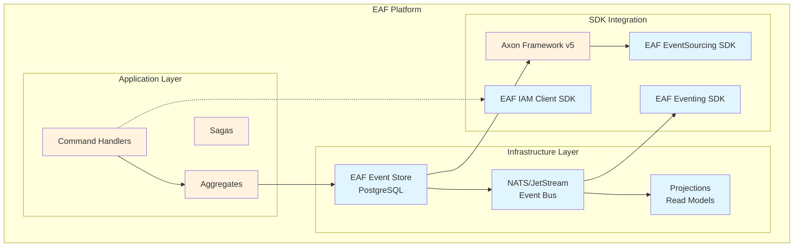

# Axon Framework Training Hub

Welcome to the comprehensive Axon Framework training materials for the EAF platform. This training
is designed to onboard developers to Axon Framework v5 within the EAF architecture context.

## 🎯 Learning Path

Follow this structured learning path to master Axon Framework in the EAF context:

### 1. Foundation Concepts

- [Core Concepts & Architecture](./01-core-concepts.md) - Event Sourcing, CQRS, and Axon
  fundamentals
- [EAF Integration Overview](./02-eaf-integration.md) - How Axon fits into EAF architecture

### 2. Practical Implementation

- [Aggregates & Commands](./03-aggregates-commands.md) - Building event-sourced aggregates
- [Event Handlers & Projections](./04-event-handlers-projections.md) - Query-side implementation
- [EAF-Specific Patterns](./05-eaf-patterns.md) - Multi-tenancy, security context, NATS integration

### 3. Advanced Topics

- [Sagas & Process Managers](./06-sagas.md) - Cross-aggregate coordination
- [Testing Strategies](./07-testing.md) - Unit, integration, and acceptance testing
- [Performance & Operations](./08-performance-operations.md) - Monitoring, debugging, deployment

### 4. Hands-on Exercises

- [Lab 1: Order Management System](./lab-01-order-management.md) - Build a complete event-sourced
  system
- [Lab 2: Multi-tenant User Management](./lab-02-user-management.md) - EAF patterns in practice

## 🏗️ EAF Architecture Context

Axon Framework integrates seamlessly with existing EAF infrastructure:



## 🎓 Prerequisites

Before starting this training, you should have:

- **Intermediate Kotlin knowledge** - Functions, classes, coroutines
- **Spring Boot experience** - Dependency injection, auto-configuration
- **Basic event-driven concepts** - Events, message passing, eventual consistency
- **EAF platform familiarity** - Multi-tenancy, security context, NATS integration

## 📚 Training Objectives

After completing this training, you will be able to:

1. **Understand Core Concepts**

   - Explain Event Sourcing vs traditional CRUD patterns
   - Design CQRS architectures with proper separation
   - Identify when to use Axon Framework patterns

2. **Implement EAF-Specific Solutions**

   - Build multi-tenant event-sourced aggregates
   - Handle security context propagation
   - Integrate with NATS for event publishing
   - Use custom EAF EventStorageEngine

3. **Apply Best Practices**

   - Write comprehensive tests for Axon components
   - Handle event schema evolution with upcasting
   - Implement proper error handling and monitoring
   - Optimize performance for production workloads

4. **Troubleshoot Common Issues**
   - Debug event ordering and consistency problems
   - Resolve serialization and versioning conflicts
   - Handle multi-tenant data isolation
   - Monitor and tune Axon performance

## 🛠️ Development Environment

Ensure your development environment is configured with:

- **Java 17+** or **Kotlin 1.9+**
- **Spring Boot 3.2+**
- **PostgreSQL 15+** (via Docker Compose)
- **NATS 2.10+** (via Docker Compose)
- **IntelliJ IDEA** or **VS Code** with Kotlin support

Quick setup:

```bash
# Start infrastructure services
nx run docker-compose up -d

# Run tests to verify setup
nx test eaf-eventsourcing-sdk
```

## 📖 Documentation Standards

All training materials follow these conventions:

- **Code examples** are complete and runnable
- **Diagrams** use Mermaid for version control
- **Package structure** follows EAF hexagonal architecture
- **Testing** includes unit, integration, and acceptance examples

## 🆘 Getting Help

If you encounter issues during training:

1. Check the [Troubleshooting Guide](./troubleshooting.md)
2. Review [Common Patterns FAQ](./faq.md)
3. Consult the [Decision Tree Guide](./decision-trees.md)
4. Ask questions in the `#eaf-architecture` Slack channel

## 📈 Success Metrics

Track your progress with these milestones:

- [ ] Complete all foundation concept modules
- [ ] Successfully implement Order Management lab
- [ ] Pass the practical assessment quiz
- [ ] Build a simple event-sourced feature in your project
- [ ] Demonstrate understanding in architecture review

---

**Ready to start?** Begin with [Core Concepts & Architecture](./01-core-concepts.md) →
