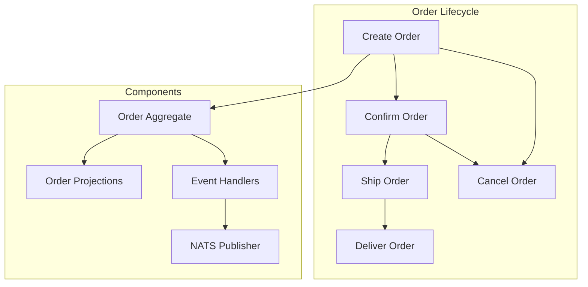

# Lab 1: Order Management System

This hands-on laboratory guides you through building a complete event-sourced Order Management
system using Axon Framework and EAF patterns.

## 🎯 Lab Objectives

By completing this lab, you will:

- Build a complete event-sourced aggregate from scratch
- Implement commands with business validation
- Create event handlers and projections
- Add multi-tenant support and security
- Write comprehensive tests
- Integrate with NATS for event publishing

## 📋 Prerequisites

- Completed modules 1-3 of the Axon training
- Local development environment setup
- Basic understanding of order management concepts

## 🏗️ System Overview

We'll build an Order Management system with these capabilities:



**Business Rules:**

- Orders must have at least one line item
- Orders can only be canceled before shipping
- Line items must reference valid products
- Order total must be calculated automatically
- All operations must respect tenant boundaries

## 🚀 Step 1: Set Up Project Structure

### Create Package Structure

```kotlin
// File: src/main/kotlin/com/axians/eaf/orders/domain/Order.kt
package com.axians.eaf.orders.domain

// File: src/main/kotlin/com/axians/eaf/orders/application/OrderCommandHandler.kt
package com.axians.eaf.orders.application

// File: src/main/kotlin/com/axians/eaf/orders/infrastructure/OrderProjectionHandler.kt
package com.axians.eaf.orders.infrastructure

// File: src/test/kotlin/com/axians/eaf/orders/domain/OrderTest.kt
package com.axians.eaf.orders.domain
```

## 📦 Step 2: Define Commands and Events

### Commands

```kotlin
// File: src/main/kotlin/com/axians/eaf/orders/domain/OrderCommands.kt
package com.axians.eaf.orders.domain

import jakarta.validation.constraints.DecimalMin
import jakarta.validation.constraints.NotBlank
import jakarta.validation.constraints.NotEmpty
import jakarta.validation.constraints.Positive
import java.math.BigDecimal
import java.time.Instant

data class CreateOrderCommand(
    @field:NotBlank(message = "Order ID cannot be blank")
    val orderId: String,

    @field:NotBlank(message = "Tenant ID cannot be blank")
    val tenantId: String,

    @field:NotBlank(message = "Customer ID cannot be blank")
    val customerId: String,

    @field:NotEmpty(message = "Order must have at least one line item")
    val lineItems: List<OrderLineItemDto>,

    val notes: String? = null
) {
    init {
        require(lineItems.isNotEmpty()) { "Order must have at least one line item" }
        require(lineItems.all { it.quantity > 0 }) { "All line items must have positive quantity" }
    }
}

data class AddLineItemCommand(
    @field:NotBlank(message = "Order ID cannot be blank")
    val orderId: String,

    @field:NotBlank(message = "Product ID cannot be blank")
    val productId: String,

    @field:Positive(message = "Quantity must be positive")
    val quantity: Int,

    @field:DecimalMin(value = "0.01", message = "Unit price must be positive")
    val unitPrice: BigDecimal
)

data class RemoveLineItemCommand(
    val orderId: String,
    val productId: String
)

data class UpdateLineItemQuantityCommand(
    val orderId: String,
    val productId: String,
    @field:Positive(message = "Quantity must be positive")
    val newQuantity: Int
)

data class ConfirmOrderCommand(
    val orderId: String,
    val confirmedBy: String
)

data class CancelOrderCommand(
    val orderId: String,
    val reason: String,
    val canceledBy: String
)

data class ShipOrderCommand(
    val orderId: String,
    val trackingNumber: String,
    val carrier: String,
    val shippedBy: String
)

data class DeliverOrderCommand(
    val orderId: String,
    val deliveredBy: String,
    val deliveryNotes: String? = null
)

// DTOs
data class OrderLineItemDto(
    val productId: String,
    val quantity: Int,
    val unitPrice: BigDecimal
) {
    init {
        require(productId.isNotBlank()) { "Product ID cannot be blank" }
        require(quantity > 0) { "Quantity must be positive" }
        require(unitPrice > BigDecimal.ZERO) { "Unit price must be positive" }
    }

    val totalPrice: BigDecimal get() = unitPrice.multiply(BigDecimal.valueOf(quantity.toLong()))
}
```

### Events

```kotlin
// File: src/main/kotlin/com/axians/eaf/orders/domain/OrderEvents.kt
package com.axians.eaf.orders.domain

import java.math.BigDecimal
import java.time.Instant

data class OrderCreatedEvent(
    val orderId: String,
    val tenantId: String,
    val customerId: String,
    val lineItems: List<OrderLineItem>,
    val totalAmount: BigDecimal,
    val notes: String?,
    val createdAt: Instant = Instant.now()
)

data class LineItemAddedEvent(
    val orderId: String,
    val productId: String,
    val quantity: Int,
    val unitPrice: BigDecimal,
    val totalPrice: BigDecimal,
    val newOrderTotal: BigDecimal,
    val addedAt: Instant = Instant.now()
)

data class LineItemRemovedEvent(
    val orderId: String,
    val productId: String,
    val removedQuantity: Int,
    val removedAmount: BigDecimal,
    val newOrderTotal: BigDecimal,
    val removedAt: Instant = Instant.now()
)

data class LineItemQuantityUpdatedEvent(
    val orderId: String,
    val productId: String,
    val previousQuantity: Int,
    val newQuantity: Int,
    val unitPrice: BigDecimal,
    val previousTotalPrice: BigDecimal,
    val newTotalPrice: BigDecimal,
    val newOrderTotal: BigDecimal,
    val updatedAt: Instant = Instant.now()
)

data class OrderConfirmedEvent(
    val orderId: String,
    val confirmedBy: String,
    val totalAmount: BigDecimal,
    val confirmedAt: Instant = Instant.now()
)

data class OrderCanceledEvent(
    val orderId: String,
    val reason: String,
    val canceledBy: String,
    val canceledAt: Instant = Instant.now()
)

data class OrderShippedEvent(
    val orderId: String,
    val trackingNumber: String,
    val carrier: String,
    val shippedBy: String,
    val shippedAt: Instant = Instant.now()
)

data class OrderDeliveredEvent(
    val orderId: String,
    val deliveredBy: String,
    val deliveryNotes: String?,
    val deliveredAt: Instant = Instant.now()
)

// Value Objects
data class OrderLineItem(
    val productId: String,
    val quantity: Int,
    val unitPrice: BigDecimal
) {
    val totalPrice: BigDecimal get() = unitPrice.multiply(BigDecimal.valueOf(quantity.toLong()))
}

enum class OrderStatus {
    DRAFT,
    CONFIRMED,
    SHIPPED,
    DELIVERED,
    CANCELED
}
```

## 🏢 Step 3: Implement the Order Aggregate

```kotlin
// File: src/main/kotlin/com/axians/eaf/orders/domain/Order.kt
package com.axians.eaf.orders.domain

import org.axonframework.commandhandling.CommandHandler
import org.axonframework.eventsourcing.EventSourcingHandler
import org.axonframework.modelling.command.AggregateIdentifier
import org.axonframework.modelling.command.AggregateLifecycle
import org.axonframework.spring.stereotype.Aggregate
import java.math.BigDecimal
import java.time.Instant

@Aggregate
class Order {
    @AggregateIdentifier
    private lateinit var orderId: String

    private lateinit var tenantId: String
    private lateinit var customerId: String
    private lateinit var status: OrderStatus
    private val lineItems: MutableMap<String, OrderLineItem> = mutableMapOf()
    private var totalAmount: BigDecimal = BigDecimal.ZERO
    private var notes: String? = null
    private var createdAt: Instant? = null
    private var lastUpdatedAt: Instant? = null

    // Required no-arg constructor for Axon
    constructor()

    // Creation command handler
    @CommandHandler
    constructor(command: CreateOrderCommand) {
        // Business validation
        validateLineItems(command.lineItems)

        val orderLineItems = command.lineItems.map { dto ->
            OrderLineItem(
                productId = dto.productId,
                quantity = dto.quantity,
                unitPrice = dto.unitPrice
            )
        }

        val totalAmount = calculateTotal(orderLineItems)

        // Apply creation event
        AggregateLifecycle.apply(
            OrderCreatedEvent(
                orderId = command.orderId,
                tenantId = command.tenantId,
                customerId = command.customerId,
                lineItems = orderLineItems,
                totalAmount = totalAmount,
                notes = command.notes
            )
        )
    }

    @CommandHandler
    fun handle(command: AddLineItemCommand) {
        require(status == OrderStatus.DRAFT) {
            "Cannot add line items to order in status: $status"
        }
        require(!lineItems.containsKey(command.productId)) {
            "Product ${command.productId} already exists in order"
        }

        val totalPrice = command.unitPrice.multiply(BigDecimal.valueOf(command.quantity.toLong()))
        val newOrderTotal = totalAmount.add(totalPrice)

        AggregateLifecycle.apply(
            LineItemAddedEvent(
                orderId = orderId,
                productId = command.productId,
                quantity = command.quantity,
                unitPrice = command.unitPrice,
                totalPrice = totalPrice,
                newOrderTotal = newOrderTotal
            )
        )
    }

    @CommandHandler
    fun handle(command: RemoveLineItemCommand) {
        require(status == OrderStatus.DRAFT) {
            "Cannot remove line items from order in status: $status"
        }

        val lineItem = lineItems[command.productId]
            ?: throw IllegalArgumentException("Product ${command.productId} not found in order")

        require(lineItems.size > 1) {
            "Cannot remove last line item from order"
        }

        val removedAmount = lineItem.totalPrice
        val newOrderTotal = totalAmount.subtract(removedAmount)

        AggregateLifecycle.apply(
            LineItemRemovedEvent(
                orderId = orderId,
                productId = command.productId,
                removedQuantity = lineItem.quantity,
                removedAmount = removedAmount,
                newOrderTotal = newOrderTotal
            )
        )
    }

    @CommandHandler
    fun handle(command: UpdateLineItemQuantityCommand) {
        require(status == OrderStatus.DRAFT) {
            "Cannot update line items in order with status: $status"
        }

        val lineItem = lineItems[command.productId]
            ?: throw IllegalArgumentException("Product ${command.productId} not found in order")

        require(lineItem.quantity != command.newQuantity) {
            "New quantity must be different from current quantity"
        }

        val previousTotalPrice = lineItem.totalPrice
        val newTotalPrice = lineItem.unitPrice.multiply(BigDecimal.valueOf(command.newQuantity.toLong()))
        val newOrderTotal = totalAmount.subtract(previousTotalPrice).add(newTotalPrice)

        AggregateLifecycle.apply(
            LineItemQuantityUpdatedEvent(
                orderId = orderId,
                productId = command.productId,
                previousQuantity = lineItem.quantity,
                newQuantity = command.newQuantity,
                unitPrice = lineItem.unitPrice,
                previousTotalPrice = previousTotalPrice,
                newTotalPrice = newTotalPrice,
                newOrderTotal = newOrderTotal
            )
        )
    }

    @CommandHandler
    fun handle(command: ConfirmOrderCommand) {
        require(status == OrderStatus.DRAFT) {
            "Can only confirm orders in DRAFT status"
        }
        require(lineItems.isNotEmpty()) {
            "Cannot confirm order without line items"
        }

        AggregateLifecycle.apply(
            OrderConfirmedEvent(
                orderId = orderId,
                confirmedBy = command.confirmedBy,
                totalAmount = totalAmount
            )
        )
    }

    @CommandHandler
    fun handle(command: CancelOrderCommand) {
        require(status in listOf(OrderStatus.DRAFT, OrderStatus.CONFIRMED)) {
            "Cannot cancel order in status: $status"
        }

        AggregateLifecycle.apply(
            OrderCanceledEvent(
                orderId = orderId,
                reason = command.reason,
                canceledBy = command.canceledBy
            )
        )
    }

    @CommandHandler
    fun handle(command: ShipOrderCommand) {
        require(status == OrderStatus.CONFIRMED) {
            "Can only ship confirmed orders"
        }

        AggregateLifecycle.apply(
            OrderShippedEvent(
                orderId = orderId,
                trackingNumber = command.trackingNumber,
                carrier = command.carrier,
                shippedBy = command.shippedBy
            )
        )
    }

    @CommandHandler
    fun handle(command: DeliverOrderCommand) {
        require(status == OrderStatus.SHIPPED) {
            "Can only deliver shipped orders"
        }

        AggregateLifecycle.apply(
            OrderDeliveredEvent(
                orderId = orderId,
                deliveredBy = command.deliveredBy,
                deliveryNotes = command.deliveryNotes
            )
        )
    }

    // Event sourcing handlers
    @EventSourcingHandler
    fun on(event: OrderCreatedEvent) {
        this.orderId = event.orderId
        this.tenantId = event.tenantId
        this.customerId = event.customerId
        this.status = OrderStatus.DRAFT
        this.totalAmount = event.totalAmount
        this.notes = event.notes
        this.createdAt = event.createdAt
        this.lastUpdatedAt = event.createdAt

        // Populate line items
        event.lineItems.forEach { item ->
            this.lineItems[item.productId] = item
        }
    }

    @EventSourcingHandler
    fun on(event: LineItemAddedEvent) {
        this.lineItems[event.productId] = OrderLineItem(
            productId = event.productId,
            quantity = event.quantity,
            unitPrice = event.unitPrice
        )
        this.totalAmount = event.newOrderTotal
        this.lastUpdatedAt = event.addedAt
    }

    @EventSourcingHandler
    fun on(event: LineItemRemovedEvent) {
        this.lineItems.remove(event.productId)
        this.totalAmount = event.newOrderTotal
        this.lastUpdatedAt = event.removedAt
    }

    @EventSourcingHandler
    fun on(event: LineItemQuantityUpdatedEvent) {
        val lineItem = this.lineItems[event.productId]!!
        this.lineItems[event.productId] = lineItem.copy(quantity = event.newQuantity)
        this.totalAmount = event.newOrderTotal
        this.lastUpdatedAt = event.updatedAt
    }

    @EventSourcingHandler
    fun on(event: OrderConfirmedEvent) {
        this.status = OrderStatus.CONFIRMED
        this.lastUpdatedAt = event.confirmedAt
    }

    @EventSourcingHandler
    fun on(event: OrderCanceledEvent) {
        this.status = OrderStatus.CANCELED
        this.lastUpdatedAt = event.canceledAt
    }

    @EventSourcingHandler
    fun on(event: OrderShippedEvent) {
        this.status = OrderStatus.SHIPPED
        this.lastUpdatedAt = event.shippedAt
    }

    @EventSourcingHandler
    fun on(event: OrderDeliveredEvent) {
        this.status = OrderStatus.DELIVERED
        this.lastUpdatedAt = event.deliveredAt
    }

    // Private helper methods
    private fun validateLineItems(lineItems: List<OrderLineItemDto>) {
        require(lineItems.isNotEmpty()) { "Order must have at least one line item" }

        val productIds = lineItems.map { it.productId }
        require(productIds.size == productIds.toSet().size) { "Duplicate product IDs not allowed" }

        lineItems.forEach { item ->
            require(item.quantity > 0) { "Line item quantity must be positive" }
            require(item.unitPrice > BigDecimal.ZERO) { "Line item unit price must be positive" }
        }
    }

    private fun calculateTotal(lineItems: List<OrderLineItem>): BigDecimal {
        return lineItems.fold(BigDecimal.ZERO) { total, item ->
            total.add(item.totalPrice)
        }
    }
}
```

## 🎯 Step 4: Create Projections

### Order Projection Entity

```kotlin
// File: src/main/kotlin/com/axians/eaf/orders/infrastructure/OrderProjection.kt
package com.axians.eaf.orders.infrastructure

import jakarta.persistence.*
import java.math.BigDecimal
import java.time.Instant

@Entity
@Table(name = "order_projections")
data class OrderProjection(
    @Id
    val orderId: String,

    @Column(nullable = false)
    val tenantId: String,

    @Column(nullable = false)
    val customerId: String,

    @Enumerated(EnumType.STRING)
    @Column(nullable = false)
    val status: OrderStatus,

    @Column(nullable = false, precision = 19, scale = 2)
    val totalAmount: BigDecimal,

    @Column(columnDefinition = "TEXT")
    val notes: String?,

    @Column(nullable = false)
    val createdAt: Instant,

    @Column(nullable = false)
    val lastUpdatedAt: Instant,

    @OneToMany(mappedBy = "order", cascade = [CascadeType.ALL], fetch = FetchType.LAZY)
    val lineItems: MutableList<OrderLineItemProjection> = mutableListOf()
)

@Entity
@Table(name = "order_line_item_projections")
data class OrderLineItemProjection(
    @Id
    @GeneratedValue(strategy = GenerationType.IDENTITY)
    val id: Long? = null,

    @ManyToOne(fetch = FetchType.LAZY)
    @JoinColumn(name = "order_id")
    val order: OrderProjection,

    @Column(nullable = false)
    val productId: String,

    @Column(nullable = false)
    val quantity: Int,

    @Column(nullable = false, precision = 19, scale = 2)
    val unitPrice: BigDecimal,

    @Column(nullable = false, precision = 19, scale = 2)
    val totalPrice: BigDecimal
)
```

### Projection Handler

```kotlin
// File: src/main/kotlin/com/axians/eaf/orders/infrastructure/OrderProjectionHandler.kt
package com.axians.eaf.orders.infrastructure

import com.axians.eaf.orders.domain.*
import org.axonframework.config.ProcessingGroup
import org.axonframework.eventhandling.EventHandler
import org.springframework.stereotype.Component
import org.springframework.transaction.annotation.Transactional

@Component
@ProcessingGroup("order-projections")
@Transactional
class OrderProjectionHandler(
    private val orderProjectionRepository: OrderProjectionRepository
) {

    @EventHandler
    fun on(event: OrderCreatedEvent) {
        val projection = OrderProjection(
            orderId = event.orderId,
            tenantId = event.tenantId,
            customerId = event.customerId,
            status = OrderStatus.DRAFT,
            totalAmount = event.totalAmount,
            notes = event.notes,
            createdAt = event.createdAt,
            lastUpdatedAt = event.createdAt
        )

        // Add line items
        event.lineItems.forEach { item ->
            projection.lineItems.add(
                OrderLineItemProjection(
                    order = projection,
                    productId = item.productId,
                    quantity = item.quantity,
                    unitPrice = item.unitPrice,
                    totalPrice = item.totalPrice
                )
            )
        }

        orderProjectionRepository.save(projection)
    }

    @EventHandler
    fun on(event: LineItemAddedEvent) {
        val projection = orderProjectionRepository.findById(event.orderId)
            .orElseThrow { IllegalStateException("Order projection not found: ${event.orderId}") }

        projection.lineItems.add(
            OrderLineItemProjection(
                order = projection,
                productId = event.productId,
                quantity = event.quantity,
                unitPrice = event.unitPrice,
                totalPrice = event.totalPrice
            )
        )

        val updatedProjection = projection.copy(
            totalAmount = event.newOrderTotal,
            lastUpdatedAt = event.addedAt
        )

        orderProjectionRepository.save(updatedProjection)
    }

    @EventHandler
    fun on(event: LineItemRemovedEvent) {
        val projection = orderProjectionRepository.findById(event.orderId)
            .orElseThrow { IllegalStateException("Order projection not found: ${event.orderId}") }

        projection.lineItems.removeIf { it.productId == event.productId }

        val updatedProjection = projection.copy(
            totalAmount = event.newOrderTotal,
            lastUpdatedAt = event.removedAt
        )

        orderProjectionRepository.save(updatedProjection)
    }

    @EventHandler
    fun on(event: OrderConfirmedEvent) {
        updateOrderStatus(event.orderId, OrderStatus.CONFIRMED, event.confirmedAt)
    }

    @EventHandler
    fun on(event: OrderCanceledEvent) {
        updateOrderStatus(event.orderId, OrderStatus.CANCELED, event.canceledAt)
    }

    @EventHandler
    fun on(event: OrderShippedEvent) {
        updateOrderStatus(event.orderId, OrderStatus.SHIPPED, event.shippedAt)
    }

    @EventHandler
    fun on(event: OrderDeliveredEvent) {
        updateOrderStatus(event.orderId, OrderStatus.DELIVERED, event.deliveredAt)
    }

    private fun updateOrderStatus(orderId: String, newStatus: OrderStatus, timestamp: Instant) {
        val projection = orderProjectionRepository.findById(orderId)
            .orElseThrow { IllegalStateException("Order projection not found: $orderId") }

        val updatedProjection = projection.copy(
            status = newStatus,
            lastUpdatedAt = timestamp
        )

        orderProjectionRepository.save(updatedProjection)
    }
}
```

## 🧪 Step 5: Write Comprehensive Tests

### Aggregate Tests

```kotlin
// File: src/test/kotlin/com/axians/eaf/orders/domain/OrderTest.kt
package com.axians.eaf.orders.domain

import org.axonframework.test.aggregate.AggregateTestFixture
import org.junit.jupiter.api.BeforeEach
import org.junit.jupiter.api.Test
import java.math.BigDecimal

class OrderTest {
    private lateinit var fixture: AggregateTestFixture<Order>

    @BeforeEach
    fun setUp() {
        fixture = AggregateTestFixture(Order::class.java)
    }

    @Test
    fun `should create order when valid command is given`() {
        val command = CreateOrderCommand(
            orderId = "order-123",
            tenantId = "tenant-abc",
            customerId = "customer-456",
            lineItems = listOf(
                OrderLineItemDto(
                    productId = "product-1",
                    quantity = 2,
                    unitPrice = BigDecimal("10.00")
                ),
                OrderLineItemDto(
                    productId = "product-2",
                    quantity = 1,
                    unitPrice = BigDecimal("25.00")
                )
            ),
            notes = "Rush order"
        )

        fixture.givenNoPriorActivity()
            .`when`(command)
            .expectEvents(
                OrderCreatedEvent(
                    orderId = "order-123",
                    tenantId = "tenant-abc",
                    customerId = "customer-456",
                    lineItems = listOf(
                        OrderLineItem("product-1", 2, BigDecimal("10.00")),
                        OrderLineItem("product-2", 1, BigDecimal("25.00"))
                    ),
                    totalAmount = BigDecimal("45.00"),
                    notes = "Rush order"
                )
            )
    }

    @Test
    fun `should add line item when order is in draft status`() {
        val createEvent = OrderCreatedEvent(
            orderId = "order-123",
            tenantId = "tenant-abc",
            customerId = "customer-456",
            lineItems = listOf(
                OrderLineItem("product-1", 2, BigDecimal("10.00"))
            ),
            totalAmount = BigDecimal("20.00"),
            notes = null
        )

        val addCommand = AddLineItemCommand(
            orderId = "order-123",
            productId = "product-2",
            quantity = 3,
            unitPrice = BigDecimal("15.00")
        )

        fixture.given(createEvent)
            .`when`(addCommand)
            .expectEvents(
                LineItemAddedEvent(
                    orderId = "order-123",
                    productId = "product-2",
                    quantity = 3,
                    unitPrice = BigDecimal("15.00"),
                    totalPrice = BigDecimal("45.00"),
                    newOrderTotal = BigDecimal("65.00")
                )
            )
    }

    @Test
    fun `should reject order confirmation when no line items exist`() {
        val createEvent = OrderCreatedEvent(
            orderId = "order-123",
            tenantId = "tenant-abc",
            customerId = "customer-456",
            lineItems = listOf(
                OrderLineItem("product-1", 1, BigDecimal("10.00"))
            ),
            totalAmount = BigDecimal("10.00"),
            notes = null
        )

        val removeEvent = LineItemRemovedEvent(
            orderId = "order-123",
            productId = "product-1",
            removedQuantity = 1,
            removedAmount = BigDecimal("10.00"),
            newOrderTotal = BigDecimal("0.00")
        )

        val confirmCommand = ConfirmOrderCommand(
            orderId = "order-123",
            confirmedBy = "user-789"
        )

        fixture.given(createEvent, removeEvent)
            .`when`(confirmCommand)
            .expectException(IllegalStateException::class.java)
            .expectExceptionMessage("Cannot confirm order without line items")
    }

    @Test
    fun `should reject line item modification when order is confirmed`() {
        val createEvent = OrderCreatedEvent(
            orderId = "order-123",
            tenantId = "tenant-abc",
            customerId = "customer-456",
            lineItems = listOf(
                OrderLineItem("product-1", 2, BigDecimal("10.00"))
            ),
            totalAmount = BigDecimal("20.00"),
            notes = null
        )

        val confirmEvent = OrderConfirmedEvent(
            orderId = "order-123",
            confirmedBy = "user-789",
            totalAmount = BigDecimal("20.00")
        )

        val addCommand = AddLineItemCommand(
            orderId = "order-123",
            productId = "product-2",
            quantity = 1,
            unitPrice = BigDecimal("15.00")
        )

        fixture.given(createEvent, confirmEvent)
            .`when`(addCommand)
            .expectException(IllegalStateException::class.java)
            .expectExceptionMessage("Cannot add line items to order in status: CONFIRMED")
    }
}
```

## 🚀 Step 6: Integration with EAF Infrastructure

### NATS Event Publisher

```kotlin
// File: src/main/kotlin/com/axians/eaf/orders/infrastructure/OrderNatsEventPublisher.kt
package com.axians.eaf.orders.infrastructure

import com.axians.eaf.eventing.NatsEventPublisher
import com.axians.eaf.orders.domain.*
import kotlinx.coroutines.runBlocking
import org.axonframework.config.ProcessingGroup
import org.axonframework.eventhandling.EventHandler
import org.axonframework.messaging.MetaData
import org.slf4j.LoggerFactory
import org.springframework.stereotype.Component

@Component
@ProcessingGroup("order-nats-publisher")
class OrderNatsEventPublisher(
    private val natsEventPublisher: NatsEventPublisher
) {
    private val logger = LoggerFactory.getLogger(OrderNatsEventPublisher::class.java)

    @EventHandler
    fun on(event: OrderCreatedEvent, @MetaData("tenant_id") tenantId: String) {
        publishToNats("order.created", event, tenantId)
    }

    @EventHandler
    fun on(event: OrderConfirmedEvent, @MetaData("tenant_id") tenantId: String) {
        publishToNats("order.confirmed", event, tenantId)
    }

    @EventHandler
    fun on(event: OrderShippedEvent, @MetaData("tenant_id") tenantId: String) {
        publishToNats("order.shipped", event, tenantId)
    }

    @EventHandler
    fun on(event: OrderDeliveredEvent, @MetaData("tenant_id") tenantId: String) {
        publishToNats("order.delivered", event, tenantId)
    }

    @EventHandler
    fun on(event: OrderCanceledEvent, @MetaData("tenant_id") tenantId: String) {
        publishToNats("order.canceled", event, tenantId)
    }

    private fun publishToNats(subject: String, event: Any, tenantId: String) {
        try {
            runBlocking {
                natsEventPublisher.publish(
                    subject = subject,
                    tenantId = tenantId,
                    event = event
                )
            }
            logger.debug("Published event to NATS subject: $subject for tenant: $tenantId")
        } catch (e: Exception) {
            logger.error("Failed to publish event to NATS: ${e.message}", e)
            // Don't rethrow - event processing should continue
        }
    }
}
```

## 🎯 Step 7: Test Your Implementation

### Run the Complete Test Suite

```bash
# Run unit tests
./gradlew test --tests "*OrderTest*"

# Run integration tests
./gradlew test --tests "*OrderProjectionHandlerTest*"

# Run the full test suite
./gradlew test
```

### Manual Testing Scenarios

1. **Create Order**:

   ```bash
   curl -X POST http://localhost:8080/api/orders \
     -H "Content-Type: application/json" \
     -H "X-Tenant-ID: tenant-123" \
     -d '{
       "orderId": "order-001",
       "customerId": "customer-456",
       "lineItems": [
         {
           "productId": "product-1",
           "quantity": 2,
           "unitPrice": 29.99
         }
       ]
     }'
   ```

2. **Confirm Order**:

   ```bash
   curl -X POST http://localhost:8080/api/orders/order-001/confirm \
     -H "X-Tenant-ID: tenant-123"
   ```

3. **Query Order**:
   ```bash
   curl -X GET http://localhost:8080/api/orders/order-001 \
     -H "X-Tenant-ID: tenant-123"
   ```

## 🎉 Lab Completion Checklist

Mark each item as completed:

- [ ] ✅ Created complete command and event definitions
- [ ] ✅ Implemented Order aggregate with business logic
- [ ] ✅ Built projection handlers for read models
- [ ] ✅ Added comprehensive unit tests
- [ ] ✅ Integrated with NATS for event publishing
- [ ] ✅ Tested multi-tenant isolation
- [ ] ✅ Validated security context propagation
- [ ] ✅ Performed manual testing scenarios

## 🚀 Bonus Challenges

Once you've completed the core lab, try these advanced exercises:

1. **Add Saga Pattern**: Implement order fulfillment saga that coordinates with inventory and
   payment services
2. **Event Upcasting**: Add schema evolution for `OrderCreatedEvent`
3. **Snapshots**: Implement snapshot strategy for orders with many line items
4. **Performance Testing**: Load test with 1000+ concurrent orders
5. **Monitoring**: Add custom metrics for order processing times

## 🎯 Key Learnings

After completing this lab, you should understand:

- ✅ How to design aggregates with clear business boundaries
- ✅ Command validation and business rule enforcement
- ✅ Event sourcing for complete audit trails
- ✅ Projection patterns for optimized read models
- ✅ Multi-tenant data isolation
- ✅ Integration with EAF infrastructure
- ✅ Comprehensive testing strategies

## 📚 Next Steps

**Continue to:** [Advanced Topics](./06-sagas.md) to learn about cross-aggregate coordination
patterns!

---

🎉 **Congratulations!** You've built a complete event-sourced system using Axon Framework and EAF
patterns!
