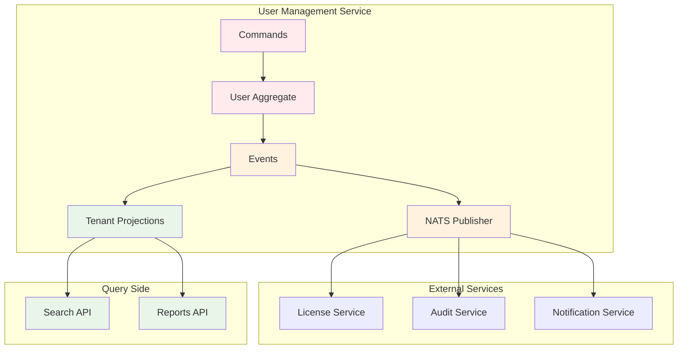

# Lab 2: Multi-Tenant User Management

Build a complete multi-tenant user management system using advanced Axon Framework patterns with EAF
integration.

## 🎯 Learning Goals

- Implement multi-tenant command handling
- Build tenant-aware projections
- Handle security context propagation
- Create cross-service integration patterns
- Test multi-tenant scenarios

## 🏗️ System Overview



## 📋 Lab Prerequisites

1. Complete Lab 1 (Order Management)
2. Understanding of multi-tenancy concepts
3. Basic knowledge of security contexts
4. Familiarity with Spring Security

## 🚀 Step 1: Multi-Tenant User Aggregate

```kotlin
@Aggregate
class User(
    @AggregateIdentifier
    private var userId: String = "",

    private var tenantId: String = "",
    private var email: String = "",
    private var profile: UserProfile = UserProfile(),
    private var roles: MutableSet<String> = mutableSetOf(),
    private var status: UserStatus = UserStatus.ACTIVE,
    private var securitySettings: SecuritySettings = SecuritySettings(),
    private var createdAt: Instant = Instant.now(),
    private var lastModified: Instant = Instant.now()
) {

    @CommandHandler
    constructor(command: CreateUserCommand) : this() {
        // Validate tenant access
        require(command.tenantId.isNotBlank()) { "Tenant ID is required" }
        require(command.email.contains("@")) { "Valid email is required" }

        AggregateLifecycle.apply(
            UserCreatedEvent(
                userId = command.userId,
                tenantId = command.tenantId,
                email = command.email,
                profile = command.profile,
                roles = command.roles,
                createdBy = command.createdBy,
                createdAt = Instant.now()
            )
        )
    }

    @CommandHandler
    fun handle(command: AssignRoleCommand) {
        require(command.tenantId == this.tenantId) {
            "Cross-tenant role assignment not allowed"
        }

        if (!roles.contains(command.role)) {
            AggregateLifecycle.apply(
                RoleAssignedEvent(
                    userId = userId,
                    tenantId = tenantId,
                    role = command.role,
                    assignedBy = command.assignedBy,
                    assignedAt = Instant.now()
                )
            )
        }
    }

    @CommandHandler
    fun handle(command: SuspendUserCommand) {
        require(command.tenantId == this.tenantId) {
            "Cross-tenant user suspension not allowed"
        }

        if (status == UserStatus.ACTIVE) {
            AggregateLifecycle.apply(
                UserSuspendedEvent(
                    userId = userId,
                    tenantId = tenantId,
                    reason = command.reason,
                    suspendedBy = command.suspendedBy,
                    suspendedAt = Instant.now()
                )
            )
        }
    }

    @EventSourcingHandler
    fun on(event: UserCreatedEvent) {
        this.userId = event.userId
        this.tenantId = event.tenantId
        this.email = event.email
        this.profile = event.profile
        this.roles = event.roles.toMutableSet()
        this.createdAt = event.createdAt
        this.lastModified = event.createdAt
    }

    @EventSourcingHandler
    fun on(event: RoleAssignedEvent) {
        this.roles.add(event.role)
        this.lastModified = event.assignedAt
    }

    @EventSourcingHandler
    fun on(event: UserSuspendedEvent) {
        this.status = UserStatus.SUSPENDED
        this.lastModified = event.suspendedAt
    }
}

data class UserProfile(
    val firstName: String = "",
    val lastName: String = "",
    val department: String? = null,
    val phoneNumber: String? = null
)

data class SecuritySettings(
    val mfaEnabled: Boolean = false,
    val passwordLastChanged: Instant? = null,
    val loginAttempts: Int = 0
)

enum class UserStatus {
    ACTIVE, SUSPENDED, INACTIVE, DELETED
}
```

## 📤 Step 2: Tenant-Aware Commands

```kotlin
// Commands with tenant validation
data class CreateUserCommand(
    @TargetAggregateIdentifier
    val userId: String,
    val tenantId: String,
    val email: String,
    val profile: UserProfile,
    val roles: Set<String> = setOf("USER"),
    val createdBy: String
)

data class AssignRoleCommand(
    @TargetAggregateIdentifier
    val userId: String,
    val tenantId: String,
    val role: String,
    val assignedBy: String
)

data class SuspendUserCommand(
    @TargetAggregateIdentifier
    val userId: String,
    val tenantId: String,
    val reason: String,
    val suspendedBy: String
)

// Secure command handler with tenant validation
@Component
class SecureUserCommandHandler(
    private val repository: Repository<User>,
    private val tenantContextHolder: TenantContextHolder,
    private val securityContextAccessor: SecurityContextAccessor,
    private val authorizationService: AuthorizationService
) {

    @CommandHandler
    fun handle(command: CreateUserCommand) {
        // Validate tenant context
        val currentTenantId = tenantContextHolder.getCurrentTenantId()
            ?: throw SecurityException("No tenant context")

        require(command.tenantId == currentTenantId) {
            "Command tenant ID does not match current tenant context"
        }

        // Check permissions
        val currentUserId = securityContextAccessor.getCurrentUserId()
            ?: throw SecurityException("No authenticated user")

        authorizationService.requirePermission(
            userId = currentUserId,
            tenantId = currentTenantId,
            permission = "USER_CREATE",
            resourceContext = mapOf("department" to command.profile.department)
        )

        // Create user
        val user = User(command)
        repository.save(user)
    }

    @CommandHandler
    fun handle(command: AssignRoleCommand) {
        validateTenantAndPermissions(command.tenantId, "ROLE_ASSIGN")

        repository.load(command.userId).execute { user ->
            user.handle(command)
        }
    }

    private fun validateTenantAndPermissions(tenantId: String, permission: String) {
        val currentTenantId = tenantContextHolder.getCurrentTenantId()
            ?: throw SecurityException("No tenant context")

        require(tenantId == currentTenantId) {
            "Tenant mismatch: expected $currentTenantId, got $tenantId"
        }

        val currentUserId = securityContextAccessor.getCurrentUserId()
            ?: throw SecurityException("No authenticated user")

        authorizationService.requirePermission(
            userId = currentUserId,
            tenantId = tenantId,
            permission = permission
        )
    }
}
```

## 📊 Step 3: Tenant-Isolated Projections

```kotlin
@Entity
@Table(name = "user_projections")
data class UserProjection(
    @Id
    val userId: String,

    @Column(nullable = false)
    val tenantId: String,

    @Column(nullable = false)
    val email: String,

    val firstName: String,
    val lastName: String,
    val fullName: String,
    val department: String?,

    @Enumerated(EnumType.STRING)
    val status: UserStatus,

    @Column(columnDefinition = "TEXT")
    val roles: String, // JSON

    val createdAt: Instant,
    val lastModified: Instant,

    // Computed fields
    val isActive: Boolean,
    val roleCount: Int
)

@Component
@ProcessingGroup("user-projections")
@Transactional
class TenantUserProjectionHandler(
    private val repository: UserProjectionRepository,
    private val objectMapper: ObjectMapper,
    private val tenantMetricsService: TenantMetricsService
) {

    @EventHandler
    fun on(
        event: UserCreatedEvent,
        @MetaData("tenant_id") metaTenantId: String
    ) {
        // Validate tenant isolation
        require(event.tenantId == metaTenantId) {
            "Event tenant ID mismatch"
        }

        val projection = UserProjection(
            userId = event.userId,
            tenantId = event.tenantId,
            email = event.email,
            firstName = event.profile.firstName,
            lastName = event.profile.lastName,
            fullName = "${event.profile.firstName} ${event.profile.lastName}",
            department = event.profile.department,
            status = UserStatus.ACTIVE,
            roles = objectMapper.writeValueAsString(event.roles),
            createdAt = event.createdAt,
            lastModified = event.createdAt,
            isActive = true,
            roleCount = event.roles.size
        )

        repository.save(projection)

        // Update tenant metrics
        tenantMetricsService.incrementUserCount(event.tenantId)

        logger.info("Created user projection for {} in tenant {}",
                   event.userId, event.tenantId)
    }

    @EventHandler
    fun on(
        event: RoleAssignedEvent,
        @MetaData("tenant_id") metaTenantId: String
    ) {
        require(event.tenantId == metaTenantId) {
            "Event tenant ID mismatch"
        }

        val projection = repository.findByTenantIdAndUserId(event.tenantId, event.userId)
            ?: throw IllegalStateException("User projection not found")

        val currentRoles = objectMapper.readValue(
            projection.roles,
            Array<String>::class.java
        ).toMutableSet()

        currentRoles.add(event.role)

        val updatedProjection = projection.copy(
            roles = objectMapper.writeValueAsString(currentRoles),
            roleCount = currentRoles.size,
            lastModified = event.assignedAt
        )

        repository.save(updatedProjection)
    }
}

interface UserProjectionRepository : JpaRepository<UserProjection, String> {
    fun findByTenantIdAndUserId(tenantId: String, userId: String): UserProjection?
    fun findAllByTenantId(tenantId: String): List<UserProjection>
    fun findByTenantIdAndStatus(tenantId: String, status: UserStatus): List<UserProjection>
    fun findByTenantIdAndDepartment(tenantId: String, department: String): List<UserProjection>

    @Query("""
        SELECT u FROM UserProjection u
        WHERE u.tenantId = :tenantId
        AND JSON_CONTAINS(u.roles, :role) = 1
    """)
    fun findByTenantIdAndRole(tenantId: String, role: String): List<UserProjection>
}
```

## 🔍 Step 4: Tenant-Aware Queries

```kotlin
@Component
class TenantUserQueryHandler(
    private val repository: UserProjectionRepository,
    private val tenantContextHolder: TenantContextHolder
) {

    @QueryHandler
    fun handle(query: FindUserByIdQuery): UserProjection? {
        val tenantId = getCurrentTenantId()
        return repository.findByTenantIdAndUserId(tenantId, query.userId)
    }

    @QueryHandler
    fun handle(query: FindUsersByDepartmentQuery): List<UserProjection> {
        val tenantId = getCurrentTenantId()
        return repository.findByTenantIdAndDepartment(tenantId, query.department)
    }

    @QueryHandler
    fun handle(query: SearchUsersQuery): Page<UserProjection> {
        val tenantId = getCurrentTenantId()
        val pageable = PageRequest.of(query.page, query.size)

        return if (query.searchTerm.isBlank()) {
            repository.findAllByTenantId(tenantId, pageable)
        } else {
            repository.findByTenantIdAndSearchTerm(tenantId, query.searchTerm, pageable)
        }
    }

    private fun getCurrentTenantId(): String {
        return tenantContextHolder.getCurrentTenantId()
            ?: throw IllegalStateException("No tenant context available")
    }
}

// Query DTOs
data class FindUserByIdQuery(val userId: String)
data class FindUsersByDepartmentQuery(val department: String)
data class SearchUsersQuery(
    val searchTerm: String = "",
    val page: Int = 0,
    val size: Int = 20
)
```

## 🔄 Step 5: Cross-Service Integration

```kotlin
@Component
@ProcessingGroup("user-license-integration")
class UserLicenseIntegrationHandler(
    private val licenseServiceClient: LicenseServiceClient,
    private val commandGateway: CommandGateway
) {

    @EventHandler
    suspend fun on(
        event: UserCreatedEvent,
        @MetaData("tenant_id") tenantId: String
    ) {
        try {
            // Allocate default license for new user
            val licenseRequest = AllocateLicenseRequest(
                userId = event.userId,
                tenantId = tenantId,
                licenseType = determineLicenseType(event.roles),
                reason = "New user creation"
            )

            val licenseResult = licenseServiceClient.allocateLicense(licenseRequest)

            if (licenseResult.isSuccess) {
                commandGateway.send(ConfirmUserLicenseCommand(
                    userId = event.userId,
                    licenseId = licenseResult.licenseId
                ))
            } else {
                logger.warn("Failed to allocate license for user {}: {}",
                           event.userId, licenseResult.errorMessage)
            }

        } catch (e: Exception) {
            logger.error("Error in license allocation for user {}: {}",
                        event.userId, e.message, e)
        }
    }

    @EventHandler
    suspend fun on(
        event: UserSuspendedEvent,
        @MetaData("tenant_id") tenantId: String
    ) {
        try {
            // Suspend user's licenses
            licenseServiceClient.suspendUserLicenses(
                userId = event.userId,
                tenantId = tenantId,
                reason = event.reason
            )

        } catch (e: Exception) {
            logger.error("Error suspending licenses for user {}: {}",
                        event.userId, e.message, e)
        }
    }

    private fun determineLicenseType(roles: Set<String>): String {
        return when {
            "ADMIN" in roles -> "PREMIUM"
            "MANAGER" in roles -> "PROFESSIONAL"
            else -> "BASIC"
        }
    }
}
```

## 🧪 Step 6: Testing Multi-Tenant Scenarios

```kotlin
@SpringBootTest
@Testcontainers
@ActiveProfiles("test")
class MultiTenantUserTest {

    @Autowired
    private lateinit var commandGateway: CommandGateway

    @Autowired
    private lateinit var queryGateway: QueryGateway

    @Autowired
    private lateinit var tenantContextHolder: TenantContextHolder

    @Test
    fun `should isolate users between tenants`() {
        val tenant1 = "tenant-1"
        val tenant2 = "tenant-2"
        val userId = "user-123"

        // Create user in tenant 1
        tenantContextHolder.setCurrentTenantId(tenant1)
        createUser(userId, tenant1, "user1@tenant1.com")

        // Create user with same ID in tenant 2
        tenantContextHolder.setCurrentTenantId(tenant2)
        createUser(userId, tenant2, "user1@tenant2.com")

        // Verify tenant isolation
        tenantContextHolder.setCurrentTenantId(tenant1)
        val user1 = queryGateway.query(
            FindUserByIdQuery(userId),
            UserProjection::class.java
        ).join()

        tenantContextHolder.setCurrentTenantId(tenant2)
        val user2 = queryGateway.query(
            FindUserByIdQuery(userId),
            UserProjection::class.java
        ).join()

        assertThat(user1?.email).isEqualTo("user1@tenant1.com")
        assertThat(user2?.email).isEqualTo("user1@tenant2.com")
        assertThat(user1?.tenantId).isEqualTo(tenant1)
        assertThat(user2?.tenantId).isEqualTo(tenant2)
    }

    @Test
    fun `should prevent cross-tenant role assignment`() {
        val tenant1 = "tenant-1"
        val tenant2 = "tenant-2"
        val userId = "user-123"

        // Create user in tenant 1
        tenantContextHolder.setCurrentTenantId(tenant1)
        createUser(userId, tenant1, "user@tenant1.com")

        // Try to assign role from tenant 2 context
        tenantContextHolder.setCurrentTenantId(tenant2)

        assertThatThrownBy {
            commandGateway.sendAndWait<Void>(AssignRoleCommand(
                userId = userId,
                tenantId = tenant2, // Wrong tenant!
                role = "ADMIN",
                assignedBy = "admin"
            ))
        }.hasMessageContaining("Cross-tenant")
    }

    private fun createUser(userId: String, tenantId: String, email: String) {
        commandGateway.sendAndWait<Void>(CreateUserCommand(
            userId = userId,
            tenantId = tenantId,
            email = email,
            profile = UserProfile("Test", "User"),
            createdBy = "system"
        ))
    }
}
```

## 🎯 Lab Completion Checklist

- [ ] Multi-tenant User aggregate implemented
- [ ] Tenant-aware command handlers created
- [ ] Tenant-isolated projections working
- [ ] Cross-service integration implemented
- [ ] Multi-tenant tests passing
- [ ] Security context validation added
- [ ] Tenant metrics collection working

## 🏆 Bonus Challenges

1. **Add User Import/Export**: Bulk operations with tenant validation
2. **Implement User Groups**: Nested tenant organization
3. **Add Audit Trail**: Complete user action history
4. **Create User Templates**: Tenant-specific user creation templates
5. **Add User Analytics**: Tenant-specific user behavior metrics

## 📚 Key Learnings

- **Tenant Isolation**: Always validate tenant context in commands
- **Security Integration**: Proper authentication and authorization
- **Cross-Service Communication**: Reliable async integration patterns
- **Testing Strategy**: Comprehensive multi-tenant test coverage
- **Monitoring**: Tenant-specific metrics and observability

---

🎉 **Congratulations!** You've built a production-ready multi-tenant user management system with
Axon Framework and EAF patterns!
