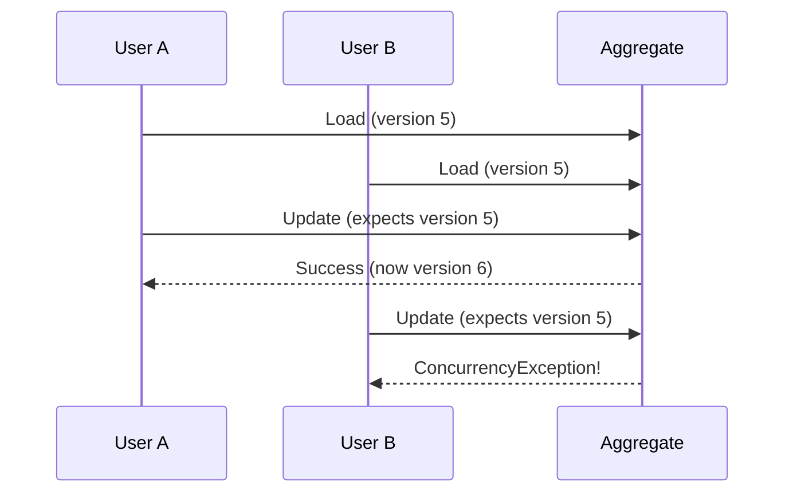

# Troubleshooting Guide

This guide helps you diagnose and resolve common issues when working with Axon Framework in the EAF
platform.

## 🚨 Quick Diagnostic Checklist

When experiencing issues, start with this checklist:

- [ ] Check application logs for error messages
- [ ] Verify Axon configuration is correct
- [ ] Confirm database connectivity and schema
- [ ] Check NATS connection and subjects
- [ ] Validate tenant context is set properly
- [ ] Ensure security context is authenticated
- [ ] Verify event processor status
- [ ] Check for concurrency conflicts

## 🔧 Configuration Issues

### Issue: "No suitable constructor found for aggregate"

**Symptoms:**

```
Exception: No suitable constructor found for aggregate of type com.example.User
```

**Diagnosis:**

```kotlin
// ❌ Missing no-arg constructor
@Aggregate
class User {
    @CommandHandler
    constructor(command: CreateUserCommand) { }
    // Missing no-arg constructor!
}
```

**Solution:**

```kotlin
// ✅ Add no-arg constructor
@Aggregate
class User {
    constructor() // Required for Axon

    @CommandHandler
    constructor(command: CreateUserCommand) {
        // Command handling logic
    }
}
```

**Prevention:**

- Always include a no-arg constructor in aggregates
- Use IDE templates for consistent aggregate structure

### Issue: "EventStore configuration not found"

**Symptoms:**

```
No qualifying bean of type 'EventStorageEngine' available
```

**Diagnosis:** Check if EAF EventStorageEngine is properly configured:

```bash
# Check if bean is registered
curl http://localhost:8080/actuator/beans | grep -i eventstore
```

**Solution:**

```kotlin
// Ensure proper configuration
@Configuration
@EnableAxon
class AxonConfiguration {

    @Bean
    @Primary
    fun eventStorageEngine(
        eafEventStore: EafEventStoreSdk,
        eventMessageMapper: AxonEventMessageMapper,
        tenantContextHolder: TenantContextHolder
    ): EventStorageEngine {
        return EafPostgresEventStorageEngine(
            eafEventStore,
            eventMessageMapper,
            tenantContextHolder,
            PersistenceExceptionResolver()
        )
    }
}
```

**Verification:**

```bash
# Check configuration
curl http://localhost:8080/actuator/configprops | grep -i axon
```

### Issue: "Processing group not found"

**Symptoms:**

```
EventProcessingConfiguration: No configuration found for processing group 'user-projections'
```

**Solution:**

```kotlin
@Configuration
class EventProcessingConfiguration {

    @Bean
    fun eventProcessingConfigurer(): EventProcessingConfigurer {
        return { config ->
            config.registerTrackingEventProcessor("user-projections") {
                TrackingEventProcessorConfiguration
                    .forSingleThreadedProcessing()
                    .andInitialTrackingToken { it.eventStore().createHeadToken() }
            }
        }
    }
}
```

## 📊 Event Processing Issues

### Issue: Events not reaching projections

**Symptoms:**

- Commands execute successfully
- Events are stored in event store
- Projections are not updated

**Diagnosis Steps:**

1. **Check event processor status:**

```bash
curl http://localhost:8080/actuator/eventprocessors
```

2. **Verify event handler registration:**

```kotlin
@Component
@ProcessingGroup("user-projections") // ✅ Must specify group
class UserProjectionHandler {

    @EventHandler // ✅ Must be annotated
    fun on(event: UserCreatedEvent) {
        // Handler logic
    }
}
```

3. **Check for errors in logs:**

```bash
grep -i "error\|exception" application.log | grep -i projection
```

**Common Solutions:**

1. **Missing @ProcessingGroup:**

```kotlin
// ❌ Missing annotation
@Component
class UserProjectionHandler { }

// ✅ Correct annotation
@Component
@ProcessingGroup("user-projections")
class UserProjectionHandler { }
```

2. **Handler not public:**

```kotlin
// ❌ Private handler
@EventHandler
private fun on(event: UserCreatedEvent) { }

// ✅ Public handler
@EventHandler
fun on(event: UserCreatedEvent) { }
```

3. **Event processor not started:**

```kotlin
@Component
class EventProcessorManager(
    private val eventProcessingConfiguration: EventProcessingConfiguration
) {

    @PostConstruct
    fun startProcessors() {
        eventProcessingConfiguration.eventProcessors().forEach { (name, processor) ->
            if (!processor.isRunning) {
                processor.start()
                logger.info("Started event processor: $name")
            }
        }
    }
}
```

### Issue: Duplicate event processing

**Symptoms:**

- Same event processed multiple times
- Duplicate records in projections
- Inconsistent state

**Diagnosis:**

```sql
-- Check for duplicate projections
SELECT user_id, COUNT(*)
FROM user_projections
GROUP BY user_id
HAVING COUNT(*) > 1;
```

**Solution:** Implement idempotent event handlers:

```kotlin
@Component
@ProcessingGroup("user-projections")
@Transactional
class UserProjectionHandler(
    private val userProjectionRepository: UserProjectionRepository
) {

    @EventHandler
    fun on(event: UserCreatedEvent) {
        // ✅ Idempotent check
        if (userProjectionRepository.existsById(event.userId)) {
            logger.debug("User projection already exists: {}", event.userId)
            return
        }

        val projection = UserProjection(
            userId = event.userId,
            email = event.email,
            // ... other fields
        )
        userProjectionRepository.save(projection)
    }
}
```

**Advanced idempotency with processed events table:**

```kotlin
@EventHandler
fun on(event: UserCreatedEvent, @MetaData("global_sequence_id") sequenceId: Long) {
    if (processedEventRepository.existsBySequenceId(sequenceId)) {
        return // Already processed
    }

    // Process event
    val projection = createProjection(event)
    userProjectionRepository.save(projection)

    // Mark as processed
    processedEventRepository.save(ProcessedEvent(sequenceId, "UserCreatedEvent"))
}
```

## 🔄 Command Processing Issues

### Issue: Commands timing out

**Symptoms:**

```
CommandExecutionException: Command execution timed out
```

**Diagnosis:**

```kotlin
// Check command gateway timeout configuration
@Bean
fun commandGateway(configurer: Configurer): CommandGateway {
    return DefaultCommandGateway.builder()
        .commandBus(configurer.commandBus())
        .retryScheduler(IntervalRetryScheduler.builder()
            .retryExecutor(Executors.newScheduledThreadPool(1))
            .maxRetryCount(3)
            .retryInterval(Duration.ofMillis(500))
            .build())
        .build()
}
```

**Solutions:**

1. **Increase timeout:**

```kotlin
// For specific commands
CompletableFuture<Void> result = commandGateway.send(command);
result.get(30, TimeUnit.SECONDS); // Custom timeout
```

2. **Optimize aggregate loading:**

```kotlin
// Add snapshots for large aggregates
@Aggregate(snapshotTriggerDefinition = "userSnapshotTrigger")
class User { }

@Bean
fun userSnapshotTrigger(): SnapshotTriggerDefinition {
    return EventCountSnapshotTriggerDefinition(snapshotter, 50)
}
```

3. **Use async processing:**

```kotlin
// Don't wait for completion if not needed
commandGateway.send(command) // Async
```

### Issue: Concurrency exceptions

**Symptoms:**

```
ConcurrencyException: Current version does not match expected version
```

**Understanding the issue:**



**Solutions:**

1. **Implement retry logic:**

```kotlin
@Component
class UserCommandHandler {

    @Retryable(
        value = [ConcurrencyException::class],
        maxAttempts = 3,
        backoff = Backoff(delay = 100, multiplier = 2.0)
    )
    fun handle(command: UpdateUserCommand) {
        commandGateway.sendAndWait<Void>(command)
    }
}
```

2. **Optimistic UI patterns:**

```kotlin
// Update UI immediately, handle conflicts later
fun updateUserEmail(userId: String, newEmail: String) {
    // Update UI immediately
    updateUserInterface(userId, newEmail)

    // Send command asynchronously
    commandGateway.send(ChangeUserEmailCommand(userId, newEmail))
        .exceptionally { ex ->
            if (ex.cause is ConcurrencyException) {
                // Refresh UI with current state
                refreshUserInterface(userId)
                showMessage("Another user updated this record. Please try again.")
            }
            null
        }
}
```

3. **Reduce aggregate contention:**

```kotlin
// Split large aggregates into smaller ones
// Instead of one UserAggregate handling everything:

@Aggregate
class UserProfile { /* Profile-related operations */ }

@Aggregate
class UserSecurity { /* Authentication/authorization */ }

@Aggregate
class UserPreferences { /* Settings and preferences */ }
```

## 🌐 Multi-Tenancy Issues

### Issue: Cross-tenant data access

**Symptoms:**

```
IllegalStateException: No tenant context available
SecurityException: Access denied to tenant data
```

**Diagnosis:**

```kotlin
// Check tenant context in logs
@CommandHandler
fun handle(command: CreateUserCommand) {
    val currentTenant = tenantContextHolder.getCurrentTenantId()
    logger.debug("Current tenant: {}, Command tenant: {}", currentTenant, command.tenantId)

    if (currentTenant != command.tenantId) {
        throw SecurityException("Tenant mismatch")
    }
}
```

**Solution:**

```kotlin
// Ensure tenant context is set
@Component
class TenantContextFilter : Filter {

    override fun doFilter(request: ServletRequest, response: ServletResponse, chain: FilterChain) {
        val httpRequest = request as HttpServletRequest
        val tenantId = httpRequest.getHeader("X-Tenant-ID")

        if (tenantId != null) {
            tenantContextHolder.setCurrentTenantId(tenantId)
            try {
                chain.doFilter(request, response)
            } finally {
                tenantContextHolder.clearContext()
            }
        } else {
            (response as HttpServletResponse).sendError(400, "Missing tenant ID")
        }
    }
}
```

### Issue: Tenant isolation in projections

**Symptoms:**

- Users seeing data from other tenants
- Projections mixing tenant data

**Solution:**

```kotlin
@EventHandler
fun on(event: UserCreatedEvent, @MetaData("tenant_id") tenantId: String) {
    // ✅ Always include tenant ID
    val projection = UserProjection(
        userId = event.userId,
        tenantId = tenantId, // Critical for isolation
        email = event.email
    )
    userProjectionRepository.save(projection)
}

// ✅ Tenant-aware repository methods
interface UserProjectionRepository : JpaRepository<UserProjection, String> {
    fun findByTenantIdAndUserId(tenantId: String, userId: String): UserProjection?
    fun findAllByTenantId(tenantId: String): List<UserProjection>
}
```

## 📡 NATS Integration Issues

### Issue: Events not published to NATS

**Symptoms:**

- Events stored successfully in event store
- External systems not receiving events
- NATS subjects empty

**Diagnosis:**

```bash
# Check NATS connectivity
nats-cli stream ls

# Check subject activity
nats-cli sub "events.>"
```

**Solutions:**

1. **Verify NATS event handler:**

```kotlin
@Component
@ProcessingGroup("nats-publisher") // ✅ Dedicated processing group
class NatsEventPublisher(
    private val natsEventPublisher: NatsEventPublisher
) {

    @EventHandler
    suspend fun on( // ✅ Suspend for async
        event: UserCreatedEvent,
        @MetaData("tenant_id") tenantId: String
    ) {
        try {
            natsEventPublisher.publish(
                subject = "events.UserCreated",
                tenantId = tenantId,
                event = event
            )
        } catch (e: Exception) {
            logger.error("Failed to publish to NATS", e)
            // ✅ Don't rethrow - let event processing continue
        }
    }
}
```

2. **Check NATS configuration:**

```kotlin
@Configuration
class NatsConfiguration {

    @Bean
    fun natsConnection(): Connection {
        val options = Options.Builder()
            .server("nats://localhost:4222")
            .connectionTimeout(Duration.ofSeconds(10))
            .pingInterval(Duration.ofSeconds(120))
            .reconnectWait(Duration.ofSeconds(1))
            .maxReconnects(-1) // Unlimited reconnects
            .build()

        return Nats.connect(options)
    }
}
```

### Issue: NATS connection drops

**Symptoms:**

```
IOException: Connection lost
NATS connection not available
```

**Solution:**

```kotlin
@Component
class ResilientNatsEventPublisher(
    private val natsConnection: Connection
) {

    suspend fun publish(subject: String, tenantId: String, event: Any) {
        var attempt = 0
        val maxAttempts = 3

        while (attempt < maxAttempts) {
            try {
                if (natsConnection.status == Connection.Status.CONNECTED) {
                    doPublish(subject, tenantId, event)
                    return
                }

                // Wait for reconnection
                delay(1000 * (attempt + 1))
                attempt++

            } catch (e: Exception) {
                attempt++
                if (attempt >= maxAttempts) {
                    logger.error("Failed to publish after $maxAttempts attempts", e)
                    throw e
                }
                delay(1000 * attempt)
            }
        }
    }
}
```

## 📈 Performance Issues

### Issue: Slow aggregate loading

**Symptoms:**

```
Command processing taking > 1 second
High database load during aggregate loading
```

**Diagnosis:**

```sql
-- Check event count per aggregate
SELECT aggregate_id, COUNT(*) as event_count
FROM domain_events
GROUP BY aggregate_id
ORDER BY event_count DESC
LIMIT 10;
```

**Solutions:**

1. **Implement snapshots:**

```kotlin
@Aggregate(snapshotTriggerDefinition = "userSnapshotTrigger")
class User { }

@Bean
fun userSnapshotTrigger(): SnapshotTriggerDefinition {
    return EventCountSnapshotTriggerDefinition(snapshotter, 50)
}

@Bean
fun snapshotter(eventStore: EventStore): Snapshotter {
    return AggregateSnapshotter.builder()
        .eventStore(eventStore)
        .build()
}
```

2. **Optimize database queries:**

```sql
-- Add indexes for common queries
CREATE INDEX idx_events_aggregate_sequence
ON domain_events(tenant_id, aggregate_id, sequence_number);

CREATE INDEX idx_events_timestamp
ON domain_events(tenant_id, timestamp_utc);
```

3. **Use caching:**

```kotlin
@Configuration
class CacheConfiguration {

    @Bean
    fun aggregateCache(): Cache {
        return Caffeine.newBuilder()
            .maximumSize(1000)
            .expireAfterWrite(10, TimeUnit.MINUTES)
            .recordStats()
            .build()
    }
}
```

### Issue: Projection lag

**Symptoms:**

- Read models showing stale data
- Long delay between command and query results

**Diagnosis:**

```bash
# Check event processor lag
curl http://localhost:8080/actuator/eventprocessors
```

**Solutions:**

1. **Increase processing threads:**

```kotlin
@Bean
fun eventProcessingConfigurer(): EventProcessingConfigurer {
    return { config ->
        config.registerTrackingEventProcessor("user-projections") {
            TrackingEventProcessorConfiguration
                .forParallelProcessing(4) // ✅ 4 threads instead of 1
                .andBatchSize(100) // ✅ Process in batches
        }
    }
}
```

2. **Optimize projection handlers:**

```kotlin
@EventHandler
@BatchSize(50) // ✅ Batch processing
fun on(events: List<UserCreatedEvent>) {
    val projections = events.map { event ->
        UserProjection(event.userId, event.email, event.firstName, event.lastName)
    }

    // ✅ Batch database operation
    userProjectionRepository.saveAll(projections)
}
```

## 🛠️ Debugging Tools

### Enable Debug Logging

```yaml
# application-debug.yml
logging:
  level:
    org.axonframework: DEBUG
    com.axians.eaf.eventsourcing: DEBUG
    com.axians.eaf.eventing: DEBUG
    root: INFO
```

### Health Checks

```kotlin
@Component
class AxonHealthIndicator : HealthIndicator {

    @Autowired
    private lateinit var eventProcessingConfiguration: EventProcessingConfiguration

    override fun health(): Health {
        val processors = eventProcessingConfiguration.eventProcessors()
        val unhealthyProcessors = processors.filter { !it.value.isRunning }

        return if (unhealthyProcessors.isEmpty()) {
            Health.up()
                .withDetail("processors", processors.keys)
                .build()
        } else {
            Health.down()
                .withDetail("unhealthy", unhealthyProcessors.keys)
                .build()
        }
    }
}
```

### Monitoring Endpoints

```bash
# Check application health
curl http://localhost:8080/actuator/health

# Check event processors
curl http://localhost:8080/actuator/eventprocessors

# Check metrics
curl http://localhost:8080/actuator/metrics/axon.command

# Check database connections
curl http://localhost:8080/actuator/datasource
```

## 📞 Getting Help

### 1. **Collect Information**

- Application logs
- Configuration files
- Error stack traces
- Current behavior vs expected behavior

### 2. **Use Debug Tools**

```bash
# Enable debug logging
export SPRING_PROFILES_ACTIVE=debug

# Check processor status
curl http://localhost:8080/actuator/eventprocessors

# Monitor NATS
nats-cli stream report
```

### 3. **Contact Support**

- **Slack Channel**: `#eaf-architecture`
- **Architecture Review**: Schedule with platform team
- **Documentation**: Check [EAF Architecture Docs](../../architecture/index.md)

### 4. **Escalation Path**

1. Team lead
2. Architecture team
3. Platform engineering
4. External Axon support

---

💡 **Remember:** Most issues are configuration-related. Start with the basics before diving into
complex solutions!
