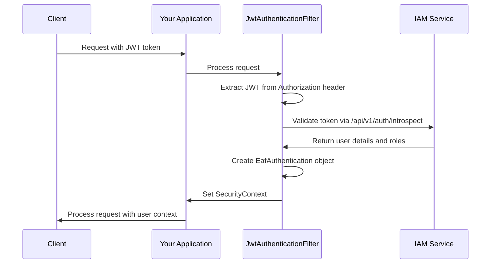

# EAF IAM Client SDK

The EAF IAM Client SDK provides seamless integration with the ACCI EAF Identity and Access
Management (IAM) service, enabling Spring Boot applications to authenticate users, enforce
role-based access control (RBAC), and maintain tenant context across multi-tenant environments.

## Features

- **🔐 JWT Token Validation**: Automatic validation of EAF-issued JWT tokens
- **🏢 Multi-tenant Context**: Automatic tenant context propagation
- **🛡️ Spring Security Integration**: Seamless integration with Spring Security
- **📋 Role-Based Access Control**: Support for `@PreAuthorize` annotations and programmatic role
  checking
- **⚙️ Auto-Configuration**: Zero-configuration setup with Spring Boot auto-configuration
- **🧪 Test Support**: Comprehensive testing utilities and examples

## Quick Start

### 1. Add Dependency

Add the EAF IAM Client SDK to your Spring Boot project:

```kotlin
dependencies {
    implementation("com.axians.eaf:eaf-iam-client")
}
```

### 2. Configure Properties

Add the following properties to your `application.yml`:

```yaml
eaf:
  iam:
    enabled: true
    base-url: 'http://localhost:8080'
    issuer-uri: 'http://localhost:8080'
    audience: 'eaf-services'
```

### 3. Secure Your Endpoints

Use Spring Security annotations to protect your endpoints:

```kotlin
@RestController
@RequestMapping("/api/products")
class ProductController {

    @GetMapping
    @PreAuthorize("hasRole('TENANT_USER')")
    fun getProducts(): List<Product> {
        // Your business logic here
        return productService.findAll()
    }

    @PostMapping
    @PreAuthorize("hasRole('TENANT_ADMIN')")
    fun createProduct(@RequestBody product: Product): Product {
        return productService.create(product)
    }
}
```

### 4. Access User Context

Access the current user and tenant context in your services:

```kotlin
@Service
class ProductService {

    fun findAll(): List<Product> {
        val authentication = SecurityContextHolder.getContext().authentication as EafAuthentication
        val tenantId = authentication.tenantId
        val userId = authentication.principal.userId

        // Use tenant context for data isolation
        return productRepository.findByTenantId(tenantId)
    }
}
```

## Configuration Properties

| Property             | Description                        | Default | Required |
| -------------------- | ---------------------------------- | ------- | -------- |
| `eaf.iam.enabled`    | Enable/disable EAF IAM integration | `true`  | No       |
| `eaf.iam.base-url`   | Base URL of the IAM service        | -       | Yes      |
| `eaf.iam.issuer-uri` | JWT token issuer URI               | -       | Yes      |
| `eaf.iam.audience`   | Expected JWT audience              | -       | Yes      |

## Authentication Flow



## Role Mapping

The SDK automatically maps IAM service roles to Spring Security authorities:

| IAM Role       | Spring Authority    | Description                              |
| -------------- | ------------------- | ---------------------------------------- |
| `TENANT_ADMIN` | `ROLE_TENANT_ADMIN` | Full administrative access within tenant |
| `TENANT_USER`  | `ROLE_TENANT_USER`  | Standard user access within tenant       |
| `SUPER_ADMIN`  | `ROLE_SUPER_ADMIN`  | System-wide administrative access        |

## Programmatic Role Checking

Beyond annotations, you can check roles programmatically:

```kotlin
@Service
class BusinessService {

    fun performSensitiveOperation() {
        val authentication = SecurityContextHolder.getContext().authentication as EafAuthentication
        val principal = authentication.principal as EafPrincipal

        when {
            principal.hasRole("TENANT_ADMIN") -> {
                // Admin-specific logic
            }
            principal.hasRole("TENANT_USER") -> {
                // User-specific logic
            }
            else -> {
                throw AccessDeniedException("Insufficient permissions")
            }
        }
    }
}
```

## Error Handling

The SDK provides comprehensive error handling:

### Common Error Scenarios

| Scenario                 | HTTP Status | Response                                                                    |
| ------------------------ | ----------- | --------------------------------------------------------------------------- |
| Missing token            | 401         | `{"error": "unauthorized", "message": "No authentication token provided"}`  |
| Invalid token            | 401         | `{"error": "invalid_token", "message": "Token validation failed"}`          |
| Expired token            | 401         | `{"error": "token_expired", "message": "Authentication token has expired"}` |
| Insufficient permissions | 403         | `{"error": "access_denied", "message": "Insufficient permissions"}`         |

### Custom Error Handling

You can customize error responses by providing your own `AuthenticationEntryPoint`:

```kotlin
@Configuration
class SecurityConfig {

    @Bean
    fun authenticationEntryPoint(): AuthenticationEntryPoint {
        return AuthenticationEntryPoint { request, response, authException ->
            response.contentType = "application/json"
            response.status = HttpServletResponse.SC_UNAUTHORIZED
            response.writer.write("""{"error": "custom_unauthorized", "message": "${authException.message}"}""")
        }
    }
}
```

## Testing

### Unit Testing

Test your secured endpoints using Spring Security test utilities:

```kotlin
@WebMvcTest(ProductController::class)
class ProductControllerTest {

    @Autowired
    private lateinit var mockMvc: MockMvc

    @Test
    @WithMockUser(roles = ["TENANT_USER"])
    fun `should allow access to users with TENANT_USER role`() {
        mockMvc.perform(get("/api/products"))
            .andExpect(status().isOk)
    }

    @Test
    @WithMockUser(roles = ["TENANT_ADMIN"])
    fun `should allow product creation for admins`() {
        mockMvc.perform(
            post("/api/products")
                .contentType(MediaType.APPLICATION_JSON)
                .content("""{"name": "Test Product"}""")
        ).andExpect(status().isCreated)
    }
}
```

### Integration Testing

For integration tests, you can mock the IAM service or use test containers:

```kotlin
@SpringBootTest
@TestPropertySource(properties = [
    "eaf.iam.base-url=http://localhost:8080",
    "eaf.iam.issuer-uri=http://localhost:8080",
    "eaf.iam.audience=test-audience"
])
class ProductIntegrationTest {

    @Test
    fun `should authenticate valid JWT token`() {
        // Your integration test logic
    }
}
```

## Troubleshooting

### Common Issues

**Issue**: `NoSuchBeanDefinitionException` for security components **Solution**: Ensure
`@EnableWebSecurity` is present and auto-configuration is not excluded

**Issue**: Token validation fails with 401 **Solution**: Verify IAM service URL and ensure the
service is accessible

**Issue**: Roles not recognized in `@PreAuthorize` **Solution**: Check role mapping and ensure roles
are prefixed with `ROLE_`

### Debug Logging

Enable debug logging to troubleshoot authentication issues:

```yaml
logging:
  level:
    com.axians.eaf.iam.client: DEBUG
    org.springframework.security: DEBUG
```

## Architecture

The EAF IAM Client SDK follows clean architecture principles:

```
┌─────────────────────────────────────────┐
│           Your Application              │
├─────────────────────────────────────────┤
│         EAF IAM Client SDK              │
│  ┌─────────────┐  ┌─────────────────┐   │
│  │   Security  │  │   Auto Config   │   │
│  │   Filter    │  │                 │   │
│  └─────────────┘  └─────────────────┘   │
├─────────────────────────────────────────┤
│         Spring Security                 │
├─────────────────────────────────────────┤
│            IAM Service                  │
└─────────────────────────────────────────┘
```

## Best Practices

1. **Always validate tenant context**: Ensure data isolation by checking tenant ID
2. **Use method-level security**: Prefer `@PreAuthorize` over URL-based security
3. **Handle authentication errors gracefully**: Provide meaningful error messages
4. **Test security configurations**: Include security tests in your test suite
5. **Monitor authentication metrics**: Track authentication success/failure rates

## Migration Guide

If you're migrating from a custom authentication solution:

1. **Replace custom filters** with EAF IAM Client SDK auto-configuration
2. **Update role checks** to use Spring Security authorities
3. **Migrate user context access** to use `EafAuthentication` and `EafPrincipal`
4. **Update tests** to use Spring Security test utilities

## Related Documentation

- [Security Context Access Guide](./security-context-access.md)
- [Spring Boot Integration Testing](./spring-boot-integration-testing.md)
- IAM Service API Reference (Coming Soon)

## Support

For issues and questions:

- Check the [troubleshooting section](#troubleshooting) above
- Review the
  [integration tests](https://github.com/axians/acci-eaf/tree/main/libs/eaf-iam-client/src/test/kotlin)
  for examples
- Consult the [EAF documentation](../index.md) for broader context
