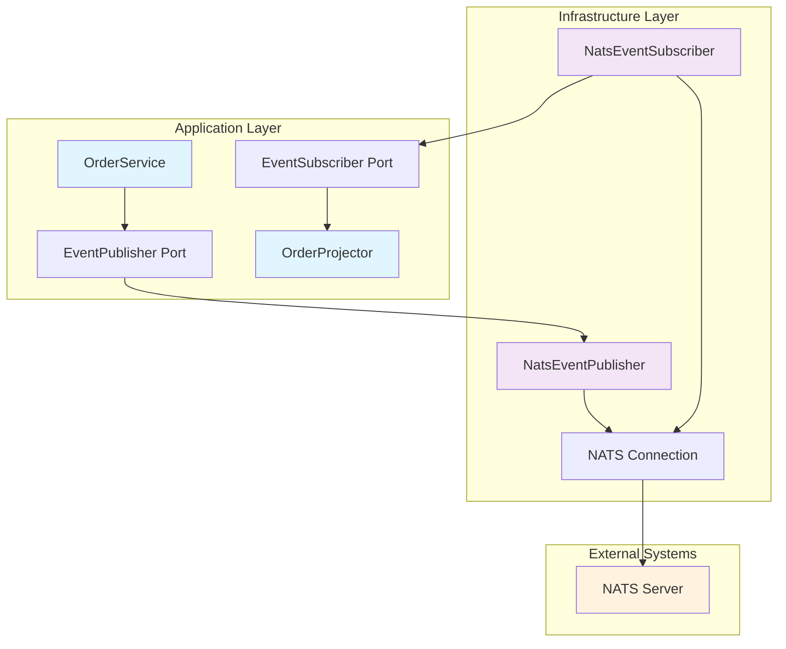

# EAF Eventing SDK

The EAF Eventing SDK provides a robust, type-safe, and resilient event publishing and consumption
framework built on NATS messaging infrastructure. It implements event-driven architecture patterns
following hexagonal architecture principles.

## 🚀 Quick Start

```kotlin
// Add dependency to your build.gradle.kts
dependencies {
    implementation("com.axians.eaf:eaf-eventing-sdk:${eafVersion}")
}

// Configure in your application
@Configuration
@EnableEafEventing
class EventingConfiguration {
    @Bean
    fun natsEventingProperties(): NatsEventingProperties = NatsEventingProperties(
        natsUrl = "nats://localhost:4222",
        retryAttempts = 3,
        timeoutMs = 5000
    )
}

// Publish events
@Component
class OrderEventPublisher(
    private val eventPublisher: NatsEventPublisher
) {
    suspend fun publishOrderCreated(order: Order) {
        val event = OrderCreatedEvent(
            orderId = order.id,
            customerId = order.customerId,
            amount = order.totalAmount
        )

        eventPublisher.publish(
            subject = "orders.created",
            tenantId = order.tenantId,
            event = event
        )
    }
}
```

## 🎯 Key Features

### Event Publishing

- **Type-safe publishing** with automatic serialization
- **Retry mechanisms** with exponential backoff
- **Tenant-aware routing** for multi-tenant environments
- **Error handling** with dead letter queue support
- **Monitoring integration** with metrics and tracing

### Event Consumption

- **Resilient subscription** with automatic reconnection
- **Message filtering** based on subjects and metadata
- **Concurrent processing** with configurable parallelism
- **Error recovery** with retry and dead letter handling
- **Backpressure management** for high-throughput scenarios

### Infrastructure Abstraction

- **NATS abstraction** hiding messaging complexity
- **Connection management** with pooling and health checks
- **Configuration management** through Spring Boot properties
- **Testing support** with embedded NATS for integration tests

## 📚 Documentation Sections

### [Getting Started](./getting-started.md)

Complete setup guide with examples and best practices for integrating the Eventing SDK into your
service.

### [API Reference](./api-reference.md)

Comprehensive API documentation covering all public classes, methods, and configuration options.

### [Configuration](./configuration.md)

Detailed configuration reference with environment-specific settings and tuning guidelines.

### [Usage Patterns](./patterns.md)

Common implementation patterns, best practices, and real-world examples from production services.

### [Troubleshooting](./troubleshooting.md)

Common issues, error patterns, and solutions for debugging eventing problems.

## 🏗️ Architecture Overview

The Eventing SDK follows hexagonal architecture principles:



## 🧪 Testing Support

The SDK provides comprehensive testing utilities:

```kotlin
@SpringBootTest
@TestEventing
class OrderEventIntegrationTest {

    @Autowired
    private lateinit var eventPublisher: NatsEventPublisher

    @Autowired
    private lateinit var testEventCollector: TestEventCollector

    @Test
    fun `should publish and consume order created event`() = runBlocking {
        // Given
        val order = createTestOrder()

        // When
        eventPublisher.publish("orders.created", order.tenantId, OrderCreatedEvent(order))

        // Then
        testEventCollector.awaitEvent&lt;OrderCreatedEvent&gt;("orders.created") {
            it.orderId == order.id
        }
    }
}
```

## 📊 Performance Characteristics

- **Throughput**: 10,000+ messages/second per instance
- **Latency**: < 5ms P99 for local NATS cluster
- **Memory**: Efficient pooling with bounded queues
- **CPU**: Minimal overhead with optimized serialization
- **Network**: Automatic compression for large payloads

## 🔧 Configuration Example

```yaml
# application.yml
app:
  eaf:
    eventing:
      nats-url: 'nats://localhost:4222'
      cluster-id: 'eaf-cluster'
      client-id: 'order-service'
      retry:
        attempts: 3
        initial-delay-ms: 1000
        max-delay-ms: 30000
        backoff-multiplier: 2.0
      connection:
        timeout-ms: 5000
        max-reconnect-attempts: 10
        reconnect-delay-ms: 2000
      monitoring:
        metrics-enabled: true
        health-check-interval-ms: 30000
```

## 🔗 Related Documentation

- [Event Sourcing SDK](../eventsourcing-sdk/index.md) - Complement with event sourcing patterns
- [Hexagonal Architecture](../../architecture/hexagonal-architecture.md) - Architectural principles
- [Event-Driven Architecture](../../architecture/cqrs-event-sourcing.md) - CQRS/ES patterns
- [Integration Testing](../../core-services/nats-integration-testing.md) - Testing strategies

---

_The EAF Eventing SDK is battle-tested in production environments and designed for enterprise-scale
event-driven systems._
