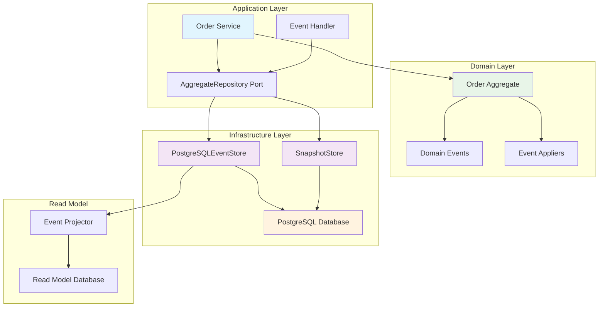

# EAF Event Sourcing SDK

The EAF Event Sourcing SDK provides a robust, production-ready implementation of event sourcing
patterns using PostgreSQL as the event store. It enables building highly scalable, auditable systems
with full event history and point-in-time recovery capabilities.

## 🚀 Quick Start

```kotlin
// Add dependency to your build.gradle.kts
dependencies {
    implementation("com.axians.eaf:eaf-eventsourcing-sdk:${eafVersion}")
}

// Configure in your application
@Configuration
@EnableEafEventSourcing
class EventSourcingConfiguration {
    @Bean
    fun eventSourcingProperties(): EventSourcingProperties = EventSourcingProperties(
        dataSourceUrl = "jdbc:postgresql://localhost:5432/eventstore",
        snapshotFrequency = 100,
        eventTableName = "domain_events"
    )
}

// Define aggregate with event sourcing
@EventSourcedAggregate
class Order private constructor() {
    lateinit var id: OrderId
    lateinit var customerId: CustomerId
    private var status: OrderStatus = OrderStatus.DRAFT
    private val items: MutableList&lt;OrderItem&gt; = mutableListOf()

    companion object {
        fun create(customerId: CustomerId): Order {
            val order = Order()
            order.apply(OrderCreatedEvent(OrderId.generate(), customerId))
            return order
        }
    }

    fun addItem(productId: ProductId, quantity: Int, unitPrice: Money): Order {
        require(status == OrderStatus.DRAFT) { "Cannot modify confirmed order" }

        val event = OrderItemAddedEvent(id, productId, quantity, unitPrice)
        apply(event)
        return this
    }

    // Event application methods
    private fun apply(event: OrderCreatedEvent) {
        this.id = event.orderId
        this.customerId = event.customerId
        this.status = OrderStatus.DRAFT
    }

    private fun apply(event: OrderItemAddedEvent) {
        items.add(OrderItem(event.productId, event.quantity, event.unitPrice))
    }
}
```

## 🎯 Key Features

### Event Store Implementation

- **PostgreSQL-based storage** with ACID guarantees
- **Optimistic concurrency control** to prevent conflicts
- **Event versioning and migration** support
- **Multi-tenant isolation** with tenant-aware queries
- **High-performance reads** with connection pooling

### Aggregate Persistence

- **Automatic event sourcing** with minimal boilerplate
- **Snapshot support** for performance optimization
- **Event replay** for aggregate reconstruction
- **Schema evolution** with backward compatibility
- **Type-safe event handling** with Kotlin sealed classes

### Advanced Capabilities

- **Projection building** for read models
- **Event stream processing** with replay capabilities
- **Temporal queries** for point-in-time state
- **Event archiving** for long-term storage
- **Monitoring integration** with metrics and health checks

## 📚 Documentation Sections

### [Getting Started](./getting-started.md)

Complete setup guide with database schema creation, configuration, and your first event-sourced
aggregate.

### [API Reference](./api-reference.md)

Comprehensive API documentation covering EventStore, AggregateRepository, and snapshot management.

### [Configuration](./configuration.md)

Detailed configuration reference including database settings, performance tuning, and
environment-specific options.

### [Usage Patterns](./patterns.md)

Common implementation patterns, best practices, and real-world examples from production systems.

### [Troubleshooting](./troubleshooting.md)

Solutions for common issues, performance optimization tips, and debugging guidance.

## 🏗️ Architecture Overview

The Event Sourcing SDK follows hexagonal architecture principles:



## 🔄 Event Sourcing Workflow

### 1. Command Processing

```kotlin
@Component
class OrderCommandHandler(
    private val orderRepository: AggregateRepository&lt;Order, OrderId&gt;
) {
    suspend fun handle(command: CreateOrderCommand): OrderId {
        val order = Order.create(command.customerId)
        orderRepository.save(order)
        return order.id
    }

    suspend fun handle(command: AddOrderItemCommand): Unit {
        val order = orderRepository.load(command.orderId)
        order.addItem(command.productId, command.quantity, command.unitPrice)
        orderRepository.save(order)
    }
}
```

### 2. Event Storage

```kotlin
// Events are automatically stored by the repository
data class OrderCreatedEvent(
    override val aggregateId: OrderId,
    override val aggregateVersion: Long,
    override val occurredAt: Instant = Instant.now(),
    val customerId: CustomerId
) : DomainEvent

data class OrderItemAddedEvent(
    override val aggregateId: OrderId,
    override val aggregateVersion: Long,
    override val occurredAt: Instant = Instant.now(),
    val productId: ProductId,
    val quantity: Int,
    val unitPrice: Money
) : DomainEvent
```

### 3. Aggregate Reconstruction

```kotlin
@Component
class PostgreSQLAggregateRepository&lt;T : EventSourcedAggregate, ID&gt;(
    private val eventStore: EventStore,
    private val snapshotStore: SnapshotStore,
    private val aggregateFactory: AggregateFactory&lt;T&gt;
) : AggregateRepository&lt;T, ID&gt; {

    override suspend fun load(id: ID): T {
        // Load latest snapshot (if available)
        val snapshot = snapshotStore.loadSnapshot(id)
        val fromVersion = snapshot?.version ?: 0L

        // Load events since snapshot
        val events = eventStore.loadEvents(id, fromVersion)

        // Reconstruct aggregate
        val aggregate = snapshot?.aggregate ?: aggregateFactory.create()
        events.forEach { event -> aggregate.apply(event) }

        return aggregate
    }

    override suspend fun save(aggregate: T) {
        val uncommittedEvents = aggregate.getUncommittedEvents()

        // Save events with optimistic concurrency check
        eventStore.saveEvents(
            aggregateId = aggregate.id,
            expectedVersion = aggregate.version,
            events = uncommittedEvents
        )

        // Create snapshot if needed
        if (shouldCreateSnapshot(aggregate)) {
            snapshotStore.saveSnapshot(aggregate)
        }

        aggregate.markEventsAsCommitted()
    }
}
```

## 📊 Performance Characteristics

### Throughput & Latency

- **Write throughput**: 1,000+ aggregates/second with proper indexing
- **Read latency**: < 10ms for typical aggregate reconstruction
- **Snapshot benefits**: 90% reduction in reconstruction time for large aggregates
- **Concurrent access**: Optimistic locking with minimal contention

### Storage Optimization

```kotlin
// Efficient event storage with compression
@Entity
@Table(name = "domain_events")
data class EventEntity(
    @Id @GeneratedValue
    val id: Long = 0,

    @Column(name = "aggregate_id", nullable = false)
    val aggregateId: String,

    @Column(name = "aggregate_type", nullable = false)
    val aggregateType: String,

    @Column(name = "event_type", nullable = false)
    val eventType: String,

    @Column(name = "event_version", nullable = false)
    val eventVersion: Long,

    @Column(name = "event_data", columnDefinition = "JSONB")
    val eventData: String,

    @Column(name = "metadata", columnDefinition = "JSONB")
    val metadata: String = "{}",

    @Column(name = "occurred_at", nullable = false)
    val occurredAt: Instant,

    @Column(name = "tenant_id", nullable = false)
    val tenantId: String
)
```

## 🧪 Testing Support

### Event Sourcing Test Utilities

```kotlin
@SpringBootTest
@TestEventSourcing
class OrderEventSourcingTest {

    @Autowired
    private lateinit var orderRepository: AggregateRepository&lt;Order, OrderId&gt;

    @Autowired
    private lateinit var eventTestRunner: EventTestRunner

    @Test
    fun `should rebuild aggregate from events`() = runTest {
        // Given - Events in store
        val orderId = OrderId.generate()
        val events = listOf(
            OrderCreatedEvent(orderId, 1, customerId = CustomerId("customer-123")),
            OrderItemAddedEvent(orderId, 2, ProductId("product-456"), 2, Money(BigDecimal("10.00")))
        )

        eventTestRunner.givenEvents(orderId, events)

        // When - Load aggregate
        val order = orderRepository.load(orderId)

        // Then - Verify state
        assertThat(order.id).isEqualTo(orderId)
        assertThat(order.getItemCount()).isEqualTo(1)
        assertThat(order.getTotalAmount()).isEqualTo(Money(BigDecimal("20.00")))
    }

    @Test
    fun `should handle concurrent modifications`() = runTest {
        // Given
        val orderId = OrderId.generate()
        val order1 = Order.create(CustomerId("customer-123"))
        val order2 = Order.create(CustomerId("customer-123"))

        orderRepository.save(order1)

        // When - Concurrent modifications
        val loadedOrder1 = orderRepository.load(orderId)
        val loadedOrder2 = orderRepository.load(orderId)

        loadedOrder1.addItem(ProductId("product-1"), 1, Money(BigDecimal("10.00")))
        loadedOrder2.addItem(ProductId("product-2"), 1, Money(BigDecimal("15.00")))

        orderRepository.save(loadedOrder1)

        // Then
        assertThatThrownBy {
            runBlocking { orderRepository.save(loadedOrder2) }
        }.isInstanceOf(ConcurrencyException::class.java)
    }
}
```

### Event Store Testing

```kotlin
@Component
class EventTestRunner(private val eventStore: EventStore) {

    suspend fun givenEvents(aggregateId: Any, events: List&lt;DomainEvent&gt;) {
        eventStore.saveEvents(
            aggregateId = aggregateId,
            expectedVersion = 0,
            events = events
        )
    }

    suspend fun thenEventsSaved(aggregateId: Any, expectedEvents: List&lt;DomainEvent&gt;) {
        val actualEvents = eventStore.loadEvents(aggregateId)

        assertThat(actualEvents).hasSize(expectedEvents.size)

        expectedEvents.forEachIndexed { index, expected ->
            val actual = actualEvents[index]
            assertThat(actual::class).isEqualTo(expected::class)
            assertThat(actual.aggregateId).isEqualTo(expected.aggregateId)
        }
    }
}
```

## 🔧 Configuration Example

```yaml
# application.yml
app:
  eaf:
    eventsourcing:
      # Database configuration
      datasource:
        url: '${DATABASE_URL:jdbc:postgresql://localhost:5432/eventstore}'
        username: '${DATABASE_USERNAME:eventstore_user}'
        password: '${DATABASE_PASSWORD}'

      # Event store settings
      event-store:
        table-name: 'domain_events'
        schema-name: 'public'
        batch-size: 1000

      # Snapshot configuration
      snapshots:
        enabled: true
        frequency: 100
        table-name: 'aggregate_snapshots'
        compression: gzip

      # Performance tuning
      performance:
        connection-pool-size: 20
        query-timeout-seconds: 30
        bulk-insert-batch-size: 500

      # Monitoring
      monitoring:
        metrics-enabled: true
        slow-query-threshold-ms: 1000
```

## 🔄 Event Migration Support

### Schema Evolution

```kotlin
@EventMigration(from = 1, to = 2)
class OrderCreatedEventMigration : EventMigrationStrategy {
    override fun migrate(event: Map&lt;String, Any&gt;): Map&lt;String, Any&gt; {
        // Add new field with default value
        return event + ("tenantId" to "default-tenant")
    }
}

@EventMigration(from = 2, to = 3)
class OrderItemAddedEventMigration : EventMigrationStrategy {
    override fun migrate(event: Map&lt;String, Any&gt;): Map&lt;String, Any&gt; {
        // Rename field
        val mutableEvent = event.toMutableMap()
        mutableEvent["unitPrice"] = mutableEvent.remove("price")
        return mutableEvent
    }
}
```

### Upcasting Support

```kotlin
@Component
class EventUpcaster(private val migrationStrategies: List&lt;EventMigrationStrategy&gt;) {

    fun upcastEvent(eventData: String, currentVersion: Int, targetVersion: Int): String {
        var event = jsonMapper.readValue(eventData, Map::class.java)

        for (version in currentVersion until targetVersion) {
            val migration = migrationStrategies.find {
                it.fromVersion == version && it.toVersion == version + 1
            }

            if (migration != null) {
                event = migration.migrate(event)
            }
        }

        return jsonMapper.writeValueAsString(event)
    }
}
```

## 🔗 Related Documentation

- [Eventing SDK](../eventing-sdk/index.md) - Complement with event-driven communication
- [Domain-Driven Design](../../architecture/domain-driven-design.md) - Aggregate design patterns
- [CQRS & Event Sourcing](../../architecture/cqrs-event-sourcing.md) - Architectural principles
- [Spring Boot Integration Testing](../../core-services/spring-boot-integration-testing.md) -
  Testing strategies

## 📈 Operational Considerations

### Monitoring & Observability

```kotlin
@Component
class EventSourcingMetrics(private val meterRegistry: MeterRegistry) {

    private val eventsSavedCounter = Counter.builder("eventsourcing.events.saved")
        .description("Number of events saved")
        .register(meterRegistry)

    private val aggregateLoadTimer = Timer.builder("eventsourcing.aggregate.load.time")
        .description("Time to load aggregate")
        .register(meterRegistry)

    private val snapshotCreatedCounter = Counter.builder("eventsourcing.snapshots.created")
        .description("Number of snapshots created")
        .register(meterRegistry)

    fun recordEventSaved() = eventsSavedCounter.increment()
    fun recordAggregateLoadTime(duration: Duration) = aggregateLoadTimer.record(duration)
    fun recordSnapshotCreated() = snapshotCreatedCounter.increment()
}
```

### Health Checks

```kotlin
@Component
class EventStoreHealthIndicator(
    private val eventStore: EventStore
) : HealthIndicator {

    override fun health(): Health {
        return try {
            val testResult = eventStore.checkConnection()

            Health.up()
                .withDetail("event-store", "operational")
                .withDetail("last-check", Instant.now())
                .withDetail("version", eventStore.getVersion())
                .build()
        } catch (e: Exception) {
            Health.down()
                .withDetail("event-store", "unavailable")
                .withDetail("error", e.message)
                .build()
        }
    }
}
```

---

_The EAF Event Sourcing SDK provides enterprise-grade event sourcing capabilities with PostgreSQL,
enabling building highly scalable, auditable systems with complete event history and powerful
temporal query capabilities._
