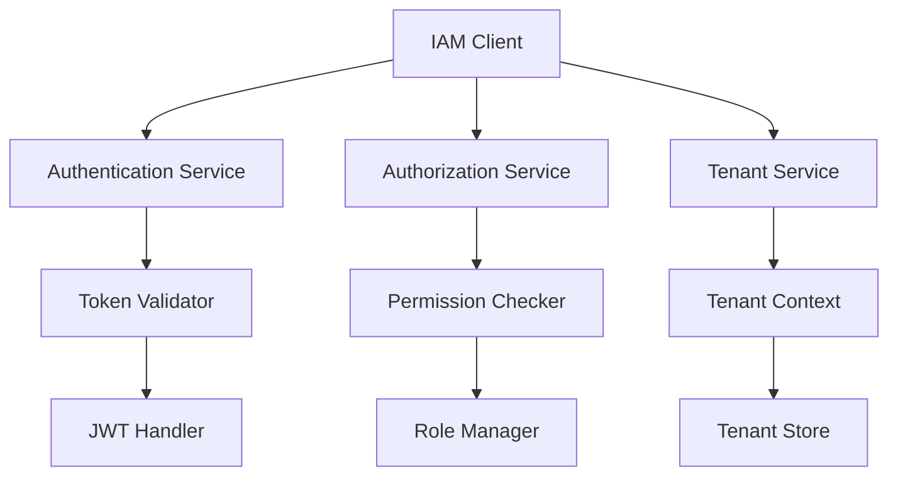

# EAF IAM Client SDK

The EAF IAM Client SDK provides seamless integration with the ACCI IAM service for authentication,
authorization, and tenant management.

## 🚀 Quick Start

### Installation

```kotlin
dependencies {
    implementation("com.axians.eaf:eaf-iam-client-sdk:${eafVersion}")
}
```

### Basic Configuration

```yaml
eaf:
  iam:
    base-url: 'https://iam.acci.com'
    client-id: 'my-service'
    client-secret: '${IAM_CLIENT_SECRET}'
```

## 🔑 Key Features

### Authentication

- JWT token validation
- Service-to-service authentication
- Token refresh management

### Authorization

- Role-based access control (RBAC)
- Permission checking
- Resource-based authorization

### Multi-tenancy

- Tenant context management
- Tenant-aware operations
- Cross-tenant security

## 🏗️ Architecture

The IAM Client SDK follows hexagonal architecture principles with clean separation between domain
logic and infrastructure concerns.



## 📚 Documentation Sections

### [Getting Started](./getting-started.md)

Complete setup guide with configuration and basic usage examples.

### [API Reference](./api-reference.md)

Comprehensive API documentation for all public classes and methods.

### [Configuration](./configuration.md)

Detailed configuration options and environment-specific settings.

### [Usage Patterns](./patterns.md)

Common usage patterns and best practices for authentication and authorization.

### [Troubleshooting](./troubleshooting.md)

Common issues and solutions for IAM integration.

## 🔗 Related Documentation

- [IAM Service Documentation](../../core-services/eaf-iam-client-sdk.md) - Service implementation
  details
- [Security Context Access](../../core-services/security-context-access.md) - Security patterns
- [Getting Started Guide](../../getting-started/index.md) - Overall setup guide

---

_The EAF IAM Client SDK provides enterprise-grade authentication and authorization capabilities for
building secure, multi-tenant applications._
