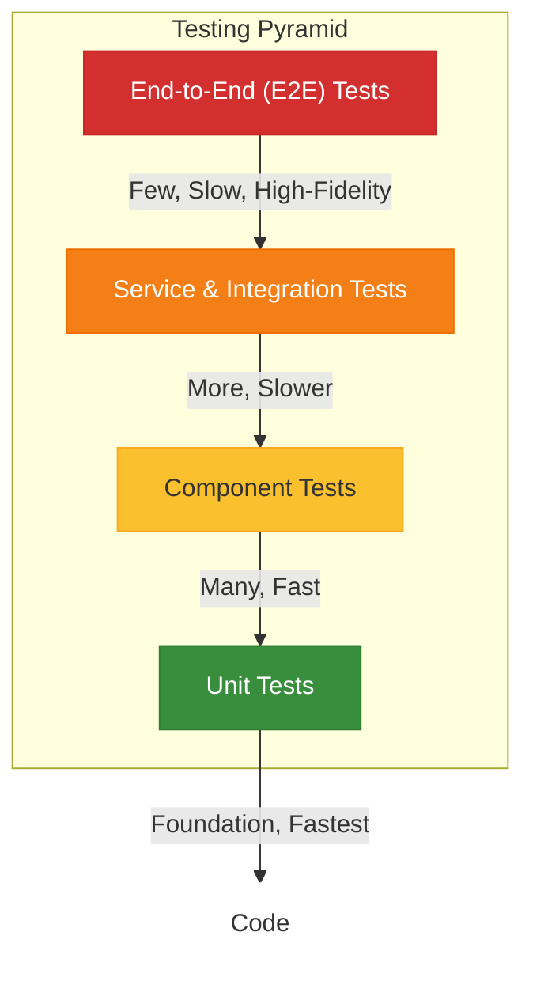

## Operational Guidelines

### Error Handling Strategy

- **General Approach:** Utilize exceptions for error signaling in Kotlin/Spring backend services. A
  clear hierarchy of custom EAF exceptions (e.g., `EafValidationException`,
  `EafAuthorizationException`, `EafResourceNotFoundException`) extending base Spring/Java exceptions
  will be established. APIs will return standardized error responses (e.g., JSON problem details).
- **Logging (Mandatory):**
  - Library/Method: SLF4J with Logback, configured for structured JSON logging.
  - Format: JSON, including timestamp, severity, service name, thread ID, correlation ID (see
    below), logger name, message, stack trace (for errors), and custom contextual fields (e.g.,
    `tenant_id`, `user_id` where appropriate and safe).
  - Levels: Standard DEBUG, INFO, WARN, ERROR. Consistent usage guidelines will be provided.
  - Context & Correlation IDs: All log messages related to a single request/operation across
    services must include a unique Correlation ID (e.g., propagated via HTTP headers or NATS message
    headers) for distributed tracing.
- **Specific Handling Patterns:**

  - **External API Calls (e.g., to `corenode` or federated IdPs):** Implement resilient client
    patterns:
    - Timeouts (connect and read).
    - Retries with exponential backoff and jitter for transient errors (using libraries like Spring
      Retry or Resilience4j).
    - Circuit Breaker pattern for services prone to unresponsiveness to prevent cascading failures.
    - Clear mapping of external API errors to internal EAF exceptions.
  - **Internal Errors / Business Logic Exceptions:** Custom exceptions will be caught by global
    exception handlers in API layers (e.g., Spring `@ControllerAdvice`) and translated into standard
    API error responses. Sensitive details will not be exposed to clients.
  - **Kotlin DTO Constructor Validation:** When using constructor validation with `require()` calls
    in Kotlin DTOs, these throw `IllegalArgumentException` which gets wrapped in
    `HttpMessageNotReadableException` during JSON deserialization. Handle this separately from field
    validation:

    ```kotlin
    @ExceptionHandler(HttpMessageNotReadableException::class)
    fun handleHttpMessageNotReadableException(
        ex: HttpMessageNotReadableException,
    ): ResponseEntity<ErrorResponse> {
        // Extract the root cause message if it's validation from our DTOs
        val message = ex.cause?.message ?: ex.message ?: "Invalid request format"
        val errorResponse = ErrorResponse(message = message, code = "INVALID_REQUEST")
        return ResponseEntity.status(HttpStatus.BAD_REQUEST).body(errorResponse)
    }
    ```

  - **NATS/JetStream Interactions (Event Publishing/Consumption):**
    - Publishing: At-least-once delivery with `PublishAck` handling. Retries for failed publishes.
      Consider Transactional Outbox for critical events if simple retries are insufficient.
    - Consumption: Idempotent consumers are mandatory. Explicit `ack()`, `nak()`, `term()` for
      messages. DLQ strategy for \"poison pill\" events. Robust error handling within listeners as
      per `NATS Multi-Tenancy JetStream Research` (section 2.4).
  - **Event Store Operations (Optimistic Concurrency):** The EAF Event Store SDK will handle
    optimistic concurrency exceptions during event appends and propagate them clearly for command
    handlers to manage (e.g., by retrying the command with re-read state or failing the operation).
  - **Transaction Management:**
    - Commands in CQRS should typically be processed within a single transaction that appends
      events.
    - Eventual consistency is accepted between the command side (event store) and read models.
    - Projectors updating read models should also manage their updates transactionally where
      appropriate and handle idempotency.

### Coding Standards

These standards are mandatory for all EAF core code and are strongly recommended for product
applications built on EAF. Linting and formatting tools will enforce many of these.

- **Primary Language:** Kotlin (for backend).
- **Style Guide & Linter/Formatter:**
  - Kotlin: Adhere to official Kotlin Coding Conventions.
  - Tooling: Spotless with Ktlint or Kfmt for automated formatting and linting, integrated into CI.
- **Naming Conventions (Kotlin):**
  - Packages: lowercase, dot-separated (e.g., `com.axians.eaf.iam.application.service`).
  - Classes/Interfaces/Objects/Enums/Annotations: PascalCase (e.g., `TenantProvisioningService`).
  - Functions/Methods/Properties (val/var): camelCase (e.g., `provisionNewTenant`).
  - Constants (compile-time `const val`, top-level or object `val` for true constants):
    SCREAMING_SNAKE_CASE (e.g., `DEFAULT_TIMEOUT_MS`).
  - Test Methods: backticks for descriptive names (e.g.,
    ``fun `should provision tenant when valid data is provided`() {}``).
- **File Structure:** Adhere to standard Gradle project layout (`src/main/kotlin`,
  `src/test/kotlin`). Within these, organize by feature or architectural layer (e.g.,
  `domain/model`, `application/port/in`, `infrastructure/adapter/out/persistence`) consistent with
  Hexagonal Architecture.
- **Unit Test File Organization:** Co-located with source files or in a parallel structure within
  `src/test/kotlin` (e.g., `MyService.kt` in `main` has `MyServiceTest.kt` in `test` in the same
  package). Test file names end with `Test`.

#### Core Kotlin Principles

- **Readability First:** Code should be optimized for reading, not just writing. The easier code is
  to understand, the easier it is to maintain and extend. Consider that code is read 10x more often
  than it's written.
- **Safety by Design:** Leverage Kotlin's safety features extensively:
  - Prefer immutable data structures (`val`, immutable collections, data classes with `val`
    properties)
  - Use Kotlin's null safety rigorously - avoid platform types and minimize `!!` operator use
  - Validate parameters explicitly using `require()` and state with `check()`

#### Variable Declarations & Immutability

- **Always prefer `val` over `var`** unless mutation is absolutely necessary
- **Use immutable collections** instead of mutable ones:

  ```kotlin
  // ✅ Preferred
  val users: List<User> = listOf(user1, user2)

  // ❌ Avoid unless mutation is required
  val users: MutableList<User> = mutableListOf(user1, user2)
  ```

- **Declare variables as `lateinit`** only when necessary, and prefer lambda initialization:

  ```kotlin
  // ✅ Preferred when possible
  val result = when (type) {
      Type.A -> processA()
      Type.B -> processB()
  }

  // ✅ Acceptable when lambda approach isn't feasible
  lateinit var result: ProcessResult
  ```

#### Safe Variable Handling

- **Always use non-nullable types** when possible
- **Use safe calls and elvis operator** with nullable variables:

  ```kotlin
  // ✅ Safe call and elvis operator
  val length = nullableString?.length ?: 0

  // ❌ Force unwrapping - avoid unless you're absolutely certain
  val length = nullableString!!.length
  ```

- **Explicit parameter validation:**

  ```kotlin
  fun createUser(email: String, tenantId: String) {
      require(email.isNotBlank()) { "Email cannot be blank" }
      require(tenantId.isNotBlank()) { "Tenant ID cannot be blank" }
      // ... implementation
  }
  ```

#### Control Flow & When Expressions

- **Prefer `when` over multiple `if` statements** for better readability:

  ```kotlin
  // ✅ Preferred for multiple conditions
  val message = when (user.status) {
      UserStatus.ACTIVE -> "User is active"
      UserStatus.INACTIVE -> "User is inactive"
      UserStatus.SUSPENDED -> "User is suspended"
  }

  // ✅ Also good for boolean conditions when it improves readability
  val canAccess = when {
      user.isAdmin() -> true
      user.hasPermission(resource) -> true
      resource.isPublic() -> true
      else -> false
  }
  ```

#### Classes & Data Structures

- **Prefer primary constructors** with default arguments over secondary constructors:

  ```kotlin
  // ✅ Preferred
  data class User(
      val id: String,
      val email: String,
      val status: UserStatus = UserStatus.ACTIVE,
      val roles: List<Role> = emptyList(),
  )
  ```

- **Use named arguments** when not passing all parameters:

  ```kotlin
  // ✅ Clear and explicit
  val user = User(
      id = "user-123",
      email = "user@example.com",
      status = UserStatus.INACTIVE,
  )
  ```

- **Multiple related classes in one file** when they're tightly coupled:

  ```kotlin
  // ✅ Acceptable for related domain objects
  data class CreateUserCommand(val email: String, val tenantId: String)
  data class UserCreatedEvent(val userId: String, val email: String, val tenantId: String)
  sealed class UserValidationError {
      object InvalidEmail : UserValidationError()
      object DuplicateEmail : UserValidationError()
  }
  ```

#### Collections & Functional Programming

- **Use sequences for multi-step collection operations** with non-trivial datasets:

  ```kotlin
  // ✅ For multiple operations on larger collections
  val activeUserEmails = users.asSequence()
      .filter { it.status == UserStatus.ACTIVE }
      .map { it.email }
      .filter { it.endsWith("@company.com") }
      .toList()

  // ✅ Simple operations can use direct collection functions
  val userCount = users.count { it.status == UserStatus.ACTIVE }
  ```

- **Avoid nested lambdas** and prefer clear parameter names over `it`:

  ```kotlin
  // ✅ Clear parameter names
  val usersByTenant = users.groupBy { user -> user.tenantId }
      .mapValues { (tenantId, tenantUsers) ->
          tenantUsers.sortedBy { user -> user.email }
      }

  // ❌ Hard to read with nested 'it'
  val usersByTenant = users.groupBy { it.tenantId }
      .mapValues { it.value.sortedBy { it.email } }
  ```

#### Return Values & Error Handling

- **Avoid returning null** from public functions - prefer exceptions or sealed classes:

  ```kotlin
  // ✅ Preferred - throw exception for error cases
  fun getUserById(id: String): User {
      return userRepository.findById(id)
          ?: throw UserNotFoundException("User not found: $id")
  }

  // ✅ Alternative - sealed class for result types
  sealed class UserResult {
      data class Success(val user: User) : UserResult()
      data class NotFound(val id: String) : UserResult()
      data class Error(val message: String) : UserResult()
  }
  ```

- **Return immutable collections** from public functions:

  ```kotlin
  // ✅ Protect internal state
  fun getActiveUsers(): List<User> = activeUsers.toList()

  // ❌ Exposes mutable internal state
  fun getActiveUsers(): MutableList<User> = activeUsers
  ```

- **Use `Pair` and `Triple` sparingly** - prefer data classes for public APIs:

  ```kotlin
  // ✅ For internal/private functions
  private fun parseNameParts(fullName: String): Pair<String, String> =
      fullName.split(" ").let { it[0] to it.getOrElse(1) { "" } }

  // ✅ For public APIs - explicit and self-documenting
  data class UserStatistics(val totalUsers: Int, val activeUsers: Int, val inactiveUsers: Int)
  fun getUserStatistics(): UserStatistics = // ...
  ```

#### Extension Functions & Scope Functions

- **Use extension functions judiciously** for domain-specific utilities:

  ```kotlin
  // ✅ Good use - domain-specific utility
  fun String.isValidEmail(): Boolean =
      this.matches(Regex("[a-zA-Z0-9._%+-]+@[a-zA-Z0-9.-]+\\.[a-zA-Z]{2,}"))

  // ✅ Good use - null-safe operations
  fun String?.isNotNullOrBlank(): Boolean = !this.isNullOrBlank()
  ```

- **Choose appropriate scope functions** based on context:

  ```kotlin
  // ✅ Use 'apply' for object configuration
  val user = User().apply {
      id = generateId()
      email = request.email
      status = UserStatus.ACTIVE
  }

  // ✅ Use 'let' for null checks and transformations
  val result = nullableUser?.let { user ->
      processUser(user)
      user.id
  }

  // ✅ Use 'run' for grouped operations
  val isValid = run {
      val emailValid = email.isValidEmail()
      val tenantExists = tenantRepository.exists(tenantId)
      emailValid && tenantExists
  }
  ```

#### String Handling

- **Use string templates** instead of concatenation:

  ```kotlin
  // ✅ Preferred
  val message = "User ${user.email} in tenant ${user.tenantId} was created"

  // ❌ Avoid
  val message = "User " + user.email + " in tenant " + user.tenantId + " was created"
  ```

- **Use triple-quoted strings** for multi-line text and SQL:

  ```kotlin
  val sql = """
      SELECT u.id, u.email, u.tenant_id
      FROM users u
      WHERE u.status = 'ACTIVE'
      AND u.tenant_id = ?
  """.trimIndent()
  ```

#### Resource Management

- **Use `use` function** for closeable resources:

  ```kotlin
  // ✅ Automatic resource cleanup
  file.inputStream().use { stream ->
      // process stream
      stream.readBytes()
  }
  ```

#### Java Interoperability

- **Assume Java method returns are nullable** unless explicitly annotated:

  ```kotlin
  // ✅ Explicit nullable type for Java interop
  val javaResult: String? = javaLibrary.someMethod()
  javaResult?.let { result ->
      processResult(result)
  }
  ```

- **Asynchronous Operations (Kotlin):** Primarily use Kotlin Coroutines for asynchronous
  programming. Adhere to structured concurrency principles. Avoid blocking threads unnecessarily.
- **Type Safety & Nullability (Kotlin):** Leverage Kotlin's null safety. Avoid platform types where
  possible. Use nullable types (`?`) explicitly. Minimize use of not-null assertion operator (`!!`).
- **Immutability:** Prefer immutable data structures (e.g., `val`, `List`, `Map`, Kotlin data
  classes with `val` properties) where practical, especially for DTOs, Value Objects, and Events.
- **Comments & Documentation:**
  - KDoc for all public APIs (classes, methods, properties).
  - Explain _why_, not _what_, for complex logic. Avoid redundant comments.
  - Module-level READMEs for significant libraries or services.
- **Error Handling:** Use exceptions for error states. Define and use specific EAF exceptions. Avoid
  swallowing exceptions or catching generic `Exception` without specific handling or re-throwing.
- **Logging:** Use SLF4J for logging. Log meaningful messages with appropriate context (correlation
  IDs, tenant IDs where applicable and safe). Avoid logging sensitive information.
- **Spring Framework Usage:**
  - Prefer constructor injection for dependencies.
  - Use Spring Boot auto-configuration where possible.
  - Adhere to Spring best practices for defining beans, configurations, and profiles.
  - **EAF SDK Integration:** All EAF SDKs integrate seamlessly with Spring Boot:
    - **Event Sourcing SDK:** Use `AggregateRepository<T, ID>` with tenant-aware
      `load(tenantId, aggregateId)` and `save(tenantId, aggregate)` methods
    - **Eventing SDK:** Use `NatsEventPublisher` for event publishing with automatic context
      propagation
    - **IAM Client SDK:** Integrates with Spring Security for method-level authorization using
      `@PreAuthorize`
    - **Core SDK:** Provides utilities and base classes that work with Spring's dependency injection

### Dependency Management

To ensure a stable, predictable, and maintainable build across the monorepo, all modules **must**
adhere to the following dependency management guidelines. These rules prevent version conflicts,
reduce maintenance overhead, and ensure consistency.

#### 1. Enforce Universal Centralized Dependency Management

- **Guideline:** Every Gradle module, especially those in `libs/`, **must** use the centralized
  dependency versions declared in the root `build.gradle.kts`. This is non-negotiable.
- **Implementation:**
  - All Spring-related library modules must apply the `io.spring.dependency-management` plugin.
  - All modules must import the Spring Boot BOM using
    `dependencyManagement { imports { mavenBom(org.springframework.boot.gradle.plugin.SpringBootPlugin.BOM_COORDINATES) } }`.
  - **Never** specify a version for a Spring Boot or related dependency (e.g., Jackson, SLF4J) in a
    sub-module. Let the root BOM control everything.
  - **Never** declare a separate `platform("org.springframework.boot:spring-boot-dependencies:...")`
    in a sub-module.

#### 2. Standardize Spring Boot Test Setups

- **Guideline:** All modules containing Spring Boot integration tests (`@SpringBootTest`) must use a
  standardized set of test dependencies to ensure consistency and prevent classpath issues.
- **Implementation:**
  - Use `testImplementation("org.springframework.boot:spring-boot-starter-test")`. This single
    starter provides JUnit 5, Spring Test, AssertJ, MockK (via our explicit dependency), and the
    necessary logging infrastructure (Logback).
  - For Testcontainers, use the specific artifact needed (e.g.,
    `testImplementation("org.testcontainers:postgresql")`) alongside the JUnit 5 integration
    (`testImplementation("org.testcontainers:junit-jupiter")`).

#### 3. Unify JUnit 5 Configuration

- **Guideline:** To avoid JUnit platform conflicts, all modules will rely on the versions provided
  by the Spring Boot BOM.
- **Implementation:**
  - Use `testImplementation("org.junit.jupiter:junit-jupiter")` (with no version).
  - Include `testRuntimeOnly("org.junit.platform:junit-platform-launcher")` (with no version).

### Development Dependencies

Use appropriate Gradle configurations:

- `developmentOnly` for tools that are only needed during development (e.g.,
  `spring-boot-docker-compose`)
- `testImplementation` for testing libraries
- `implementation` for runtime dependencies

#### EAF-Specific Kotlin Patterns

- **Domain Modeling with Data Classes:** Use extensively for DTOs, Events, Commands, and Value
  Objects:

  ```kotlin
  // ✅ Event example with validation
  data class UserCreatedEvent(
      val userId: String,
      val tenantId: String,
      val email: String,
      val timestamp: Instant = Instant.now(),
  ) {
      init {
          require(userId.isNotBlank()) { "User ID cannot be blank" }
          require(tenantId.isNotBlank()) { "Tenant ID cannot be blank" }
          require(email.isValidEmail()) { "Invalid email format" }
      }
  }
  ```

- **Sealed Classes for Domain States:** Use for representing restricted hierarchies in DDD contexts:

  ```kotlin
  // ✅ Command result modeling
  sealed class UserCreationResult {
      data class Success(val userId: String) : UserCreationResult()
      data class EmailAlreadyExists(val email: String) : UserCreationResult()
      data class InvalidTenant(val tenantId: String) : UserCreationResult()
      data class ValidationError(val errors: List<String>) : UserCreationResult()
  }
  ```

- **Coroutines Best Practices:** Follow structured concurrency for EAF operations:

  ```kotlin
  // ✅ Proper coroutine scope management
  class UserService(
      private val scope: CoroutineScope = CoroutineScope(SupervisorJob() + Dispatchers.IO)
  ) {
      suspend fun processUsersBatch(users: List<User>) =
          withEafContext {
              users.map { user ->
                  async { processUser(user) }
              }.awaitAll()
          }
  }
  ```

- **Context Propagation Patterns:** Always use EAF context helpers for distributed operations:

  ```kotlin
  // ✅ Proper context propagation
  suspend fun publishUserEvent(event: UserEvent) =
      withEafContext {
          eventPublisher.publish(event) // Context automatically propagated
      }
  ```

### Context Propagation Patterns

Context propagation is critical for maintaining security context, correlation IDs, and other
essential information across asynchronous operations and distributed message processing. Due to the
nature of Kotlin Coroutines, which can "hop" between threads, standard `ThreadLocal` variables are
unreliable for this task.

The EAF provides a robust, coroutine-aware solution using the `ThreadContextElement` pattern. This
is the **only** officially supported way to ensure context is propagated correctly.

#### Mandatory Context Propagation Rules

1. **Always Wrap Coroutine Launches with a Context Element:** Any new coroutine that needs access to
   the EAF context **must** be wrapped. The `withEafContext { ... }` helper is the simplest way to
   do this.

   ```kotlin
   // ✅ Correct - Context is propagated via ThreadContextElement
   withEafContext {
       launch {
           // Security context and correlation ID available here
       }
   }

   // ❌ Wrong - Context will be lost as soon as the coroutine switches threads
   launch {
       // No security context or correlation ID here
   }
   ```

2. **Establish Correlation IDs at Service Boundaries:** Inbound adapters (e.g., REST controllers,
   NATS consumers) are responsible for creating the initial correlation ID.

3. **Use Structured Logging with Context:**

   ```kotlin
   private val logger = LoggerFactory.getLogger(MyService::class.java)

   fun processRequest() {
       logger.info("Processing request") // Correlation ID automatically included
   }
   ```

#### Standard NATS Headers for Context Propagation

The following headers are automatically managed by the EAF Eventing SDK and must be used
consistently:

| Header               | Description                            | Example                                |
| -------------------- | -------------------------------------- | -------------------------------------- |
| `eaf.tenant.id`      | Current tenant identifier              | `tenant-123`                           |
| `eaf.user.id`        | Current user identifier                | `user-456`                             |
| `eaf.correlation.id` | Correlation ID for distributed tracing | `550e8400-e29b-41d4-a716-446655440000` |

#### Context Propagation APIs

- **CorrelationIdManager**: Thread-safe correlation ID management with SLF4J MDC integration
- **EafContextElement**: Coroutine context element for propagating both security context and
  correlation ID
- **ContextAwareNatsEventPublisher**: Automatically enriches NATS messages with context headers
- **ContextAwareMessageProcessor**: Automatically establishes context from NATS message headers

#### Best Practices

1. **Test Context Propagation**: Always verify that context propagates correctly in tests
2. **Handle Partial Context**: Not all operations require full context - handle gracefully
3. **Clean Up Context**: Use try-finally blocks or context managers to ensure cleanup
4. **Avoid Context Leakage**: Never let context persist beyond its intended scope

### Overall Testing Strategy

Testing is a cornerstone of ACCI EAF, with TDD being mandatory.

This project follows the principles of the **Testing Pyramid**, which emphasizes a healthy balance
of different test types to optimize for speed, stability, and confidence.



- **Unit Tests (Foundation):** The largest group of tests. They are fast, isolated, and verify
  individual classes or functions. **MockK** is the primary tool here.
- **Component & Service Integration Tests (Middle):** These tests verify the interaction between
  several components or an entire service layer. They may use a mix of real objects and mocks.
  **MockK** is used to isolate external dependencies like databases or message brokers. The
  refactored NATS test is a perfect example of this layer.
- **End-to-End (E2E) Tests (Peak):** The smallest group of tests. They are slower but provide the
  highest confidence by testing a complete user flow through the system. **Testcontainers** is the
  ideal tool for this layer, spinning up real dependencies like PostgreSQL and NATS.

#### When to Use MockK vs. Testcontainers

| Test Objective                                          | Recommended Tool   | Scope              | Speed        | Fidelity          |
| ------------------------------------------------------- | ------------------ | ------------------ | ------------ | ----------------- |
| **Verify Business Logic** (e.g., in a Domain Service)   | **MockK**          | Unit/Component     | Milliseconds | Low (Mocked)      |
| **Verify Component Interaction/Contract**               | **MockK / Pact**   | Component/Service  | Milliseconds | Medium (Contract) |
| **Verify System with a Real Infrastructure Dependency** | **Testcontainers** | Service/System     | Seconds      | High (Real)       |
| **Verify Full User/API Flow Across Services**           | **Testcontainers** | System/Application | Minutes      | Very High (Full)  |

By adhering to this strategy, we optimize our test suite for a balance of speed, stability, and
confidence, using the right tool for the right job.

### Test-Driven Development (TDD) Workflow

TDD is **mandatory** for all ACCI EAF development. The red-green-refactor cycle ensures
high-quality, well-tested code from the start.

#### The Red-Green-Refactor Cycle

1. **🔴 RED:** Write a failing test first

   - Write the smallest possible test that fails
   - Ensure the test fails for the right reason (missing implementation, not syntax errors)
   - Run the test to confirm it fails

2. **🟢 GREEN:** Write minimal code to make the test pass

   - Implement just enough code to make the test pass
   - Don't worry about perfect design yet
   - Run the test to confirm it passes

3. **🔵 REFACTOR:** Improve the code while keeping tests green
   - Clean up the implementation
   - Improve design, remove duplication
   - Ensure all tests still pass after each change

#### Backend TDD (Kotlin/Spring)

**Example Reference:** See
`libs/eaf-sdk/eaf-core/src/test/kotlin/com/axians/eaf/core/example/calculator/CalculatorServiceTest.kt`

**Tools:**

- JUnit 5 for test framework
- MockK for mocking dependencies
- AssertJ for fluent assertions (optional)

**Test Structure:**

```kotlin
class ServiceTest {
    @Test
    fun `should do something when given valid input`() {
        // Given (Arrange)
        val input = "test"

        // When (Act)
        val result = service.doSomething(input)

        // Then (Assert)
        assertEquals(expected, result)
    }
}
```

**Spring Security + Kotlin Coroutines Testing:**

When testing `suspend` functions in Spring controllers with security, use the async dispatch
pattern:

```kotlin
@WebMvcTest(MyController::class)
@TestPropertySource(properties = ["eaf.iam.security.enabled=false"])
class MyControllerTest {
    @Test
    @WithMockUser(roles = ["USER"])
    fun `should handle async controller methods correctly`() = runTest {
        // For suspend functions that return successful responses
        mockMvc.perform(post("/api/endpoint").contentType(MediaType.APPLICATION_JSON).content(requestBody))
            .andExpect(request().asyncStarted())
            .andDo { result ->
                mockMvc.perform(asyncDispatch(result))
                    .andExpect(status().isCreated)
                    .andExpect(content().contentType(MediaType.APPLICATION_JSON))
                    .andExpect(jsonPath("$.field").value("expectedValue"))
            }

        // For validation errors (these are NOT async - they fail before reaching the controller)
        mockMvc.perform(post("/api/endpoint").contentType(MediaType.APPLICATION_JSON).content(invalidRequestBody))
            .andExpect(status().isBadRequest) // No async handling needed for validation errors
    }
}
```

**MockK Best Practices for EAF:**

```kotlin
// ✅ Preferred - Use type-specific any() calls
coEvery { service.processRequest(any<CreateRequestType>()) } returns response
coVerify { service.processRequest(any<CreateRequestType>()) }

// ❌ Avoid - Direct import of io.mockk.any causes compilation issues
import io.mockk.any // Don't do this
coEvery { service.processRequest(any()) } returns response // Type inference issues
```

**Running Backend Tests:**

```bash
# Run all tests
nx run-many -t test

# Run specific module tests
nx test eaf-core

# Run specific test class
nx test eaf-core --args="--tests \"CalculatorServiceTest\""
```

#### Frontend TDD (React/TypeScript)

**Example Reference:** See
`libs/ui-foundation-kit/src/components/SimpleCounter/SimpleCounter.test.tsx`

**Tools:**

- Vitest for test framework (fast, Vite-integrated)
- React Testing Library for component testing
- jsdom for browser environment simulation

**Test Structure:**

```typescript
describe('ComponentName', () => {
  it('should render correctly when given props', () => {
    // Given (Arrange)
    render(<ComponentName prop="value" />)

    // When (Act)
    const element = screen.getByTestId('element-id')

    // Then (Assert)
    expect(element).toHaveTextContent('Expected Text')
  })
})
```

**Running Frontend Tests:**

```bash
# Navigate to ui-foundation-kit
cd libs/ui-foundation-kit

# Run all tests
npm test

# Run tests in watch mode
npm run test:watch

# Run tests with UI
npm run test:ui
```

#### TDD Best Practices for EAF

1. **Test Names:** Use descriptive names with backticks in Kotlin, clear descriptions in TypeScript
2. **Test Organization:** Follow Given-When-Then structure for clarity
3. **One Assertion Per Test:** Focus each test on a single behavior
4. **Mock External Dependencies:** Keep unit tests isolated and fast
5. **Test Edge Cases:** Include boundary conditions and error scenarios
6. **Refactor Regularly:** Don't skip the refactor step - it's crucial for maintainable code

#### Integration with CI/CD

All tests must pass before code can be merged:

- Backend tests run via `nx run-many -t test`
- Frontend tests run via `npm test` in each frontend module
- ArchUnit tests enforce architectural compliance
- Coverage reports help identify untested code paths

- **Tools (Backend):** JUnit 5, MockK (for Kotlin mocking), Spring Boot Test utilities, AssertJ (for
  fluent assertions), ArchUnit (for architecture rule validation), Testcontainers (for integration
  tests with PostgreSQL, NATS, etc.).
- **Unit Tests:**
  - **Scope:** Test individual Kotlin classes, functions, and small modules in isolation. Focus on
    business logic within Aggregates, Domain Services, Application Services, and utility classes.
  - **Location:** Typically co-located or in a parallel package structure in `src/test/kotlin`.
  - **Mocking/Stubbing:** Use MockK for creating test doubles. Mock all external dependencies (other
    services, database interactions via repository ports, NATS interactions via eventing ports).
  - **Target Coverage:** >80% line/branch coverage for core EAF logic.
- **Integration Tests:**
  - **Scope:** Test interactions between EAF components/services or between services and
    infrastructure (e.g., service layer to Event Store SDK to PostgreSQL; service layer to Eventing
    SDK to NATS). Test Hexagonal adapter integrations.
  - **Location:** Separate source set or directory (e.g., `src/integrationTest/kotlin`).
  - **Environment:** Use Testcontainers to spin up real instances of PostgreSQL and NATS/JetStream
    for reliable integration testing. Spring Boot test slices (e.g., `@DataJpaTest`,
    `@SpringBootTest` with specific components) will be used.
- **Architecture Tests (ArchUnit):**
  - **Scope:** Enforce architectural rules like layer dependencies (Hexagonal), DDD constraints,
    naming conventions, and domain purity (no infrastructure dependencies in domain code).
  - **Location:** Can be part of the main test suite or a dedicated test module.
  - **Implementation:** See detailed ArchUnit guidance below.
- **End-to-End (E2E) Tests:**
  - **Scope:** Validate complete user flows or critical paths for applications like the ACCI EAF
    Control Plane MVP and the pilot application.
  - **Tools:** Playwright is mentioned for Hilla. This or similar for frontend E2E. For backend EAF
    service E2E tests, this might involve API-level tests orchestrating multiple service calls.
- **Performance Tests:**
  - **Scope:** Benchmark critical EAF operations and services against defined NFRs (response times,
    throughput).
  - **Tools:** JMeter, k6, or similar.
  - **Process:** Establish baseline benchmarks and run tests regularly (especially in CI) to detect
    performance regressions.
- **Test Data Management:** Strategies for generating and managing test data for various test levels
  will be defined (e.g., test data builders, setup scripts for integration tests).

### Security Best Practices

Security is paramount for ACCI EAF.

- **Authentication & Authorization (IAM Service):**
  - Strong authentication for all users and services (local users per tenant, federation via
    SAML/OIDC/LDAP, optional built-in MFA).
  - Robust RBAC and ABAC mechanisms for fine-grained access control, enforced by the IAM service and
    EAF SDKs.
  - Secure token management (e.g., JWTs) with appropriate lifetimes, signing, and validation.
- **Input Sanitization/Validation:** All external inputs (API requests, event payloads,
  user-provided data) must be rigorously validated at service boundaries (e.g., using Bean
  Validation in Spring, custom validation logic).
- **Output Encoding:** Contextual output encoding for data rendered in UIs (handled by Vaadin/Hilla
  components) and in API responses to prevent XSS.
- **Secrets Management:**
  - No hardcoded secrets. Use environment variables, Docker secrets, or a dedicated secrets
    management solution (e.g., HashiCorp Vault if feasible in target environments) for API keys,
    database credentials, signing keys.
  - EAF services will securely access secrets via a configuration mechanism.
- **Dependency Security:**
  - Regularly scan dependencies (both backend JVM and frontend JS/TS) for known vulnerabilities
    using tools like OWASP Dependency-Check (for scanning) and OWASP Dependency-Track (for ongoing
    monitoring of SBOMs), Snyk, or GitHub Dependabot.
  - Establish a process for timely patching of vulnerable dependencies.
- **Secure Inter-Service Communication:** All communication between EAF services (e.g., via NATS or
  internal APIs) must be over secure channels (e.g., TLS for NATS if configured, HTTPS for REST
  APIs). Authentication between services where necessary (e.g., service-to-service tokens).
- **Data Protection:**
  - Encryption of sensitive data at rest (e.g., PostgreSQL Transparent Data Encryption if
    available/applicable, or application-level encryption for specific fields).
  - Encryption of data in transit (TLS everywhere).
- **Principle of Least Privilege:** Services, users, and API clients should operate with the minimum
  necessary permissions.
- **API Security:**
  - Enforce HTTPS for all APIs.
  - Implement rate limiting and throttling to prevent abuse.
  - Use standard HTTP security headers (CSP, HSTS, X-Frame-Options, etc.) for web applications like
    the Control Plane.
- **Error Handling & Information Disclosure:** Error messages must not leak sensitive internal
  information. Detailed errors logged server-side, generic messages/error IDs to clients.
- **Auditing:** Comprehensive and secure audit trails for all critical administrative, IAM, and
  security-relevant events. Audit logs stored separately and securely.
- **Compliance Enablement:** Design with ISO27001, SOC2, and FIPS requirements in mind, facilitating
  product certification.
- **Regular Security Reviews & Testing:** Incorporate security testing (SAST, DAST, potentially
  penetration testing for mature EAF versions) into the development lifecycle.

## ArchUnit - Architectural Rule Testing

ArchUnit is a critical component of the ACCI EAF quality assurance strategy, providing automated
enforcement of architectural integrity through code analysis. It ensures that the codebase adheres
to the mandated Hexagonal Architecture, DDD principles, and established naming conventions.

### Purpose and Benefits

ArchUnit tests serve as living documentation of our architectural decisions and act as guardrails to
prevent architectural drift. They provide:

- **Automated Architecture Enforcement:** Programmatically verify that code follows Hexagonal
  Architecture layer separation
- **Continuous Compliance:** Ensure DDD principles are maintained throughout development
- **Early Violation Detection:** Catch architectural violations during development, not in code
  review
- **Documentation:** Self-documenting architectural rules that evolve with the codebase
- **Onboarding Support:** Help new developers understand and follow EAF architectural patterns

### Core Architectural Rules

#### Layer Dependency Rules (Hexagonal Architecture)

The EAF enforces strict layer separation to maintain clean architecture:

```kotlin
// Domain layer must not depend on infrastructure
ArchRuleDefinition.noClasses()
    .that().resideInAPackage("..domain..")
    .should().dependOnClassesThat().resideInAPackage("..infrastructure..")
    .because("Domain layer must not depend on infrastructure concerns")

// Domain must not depend on Spring Framework
ArchRuleDefinition.noClasses()
    .that().resideInAPackage("..domain..")
    .should().dependOnClassesThat().resideInAnyPackage("org.springframework..")
    .because("Domain layer must remain framework-agnostic")
```

#### Naming Convention Rules

Consistent naming enhances code readability and maintainability:

```kotlin
// Events should end with "Event" and be in domain.event packages
ArchRuleDefinition.classes()
    .that().haveSimpleNameEndingWith("Event")
    .should().resideInAPackage("..domain.event..")
    .because("Events should be clearly identified and properly located")

// Aggregates should end with "Aggregate" and be in domain.model packages
ArchRuleDefinition.classes()
    .that().haveSimpleNameEndingWith("Aggregate")
    .should().resideInAPackage("..domain.model..")
    .because("Aggregates are core domain concepts")
```

### Running ArchUnit Tests Locally

#### Command Line Execution

```bash
# Run all tests (including ArchUnit tests)
nx run-many -t test

# Run tests for specific module
nx test eaf-core

# Run tests with verbose output
nx test eaf-core --args="--info"

# Run only architecture tests (if using naming convention)
nx test eaf-core --args="--tests \"*ArchTest*\""
```

#### IDE Integration

ArchUnit tests run as standard JUnit 5 tests, so they integrate seamlessly with your IDE:

1. **IntelliJ IDEA:** Right-click on test classes/methods and select "Run"
2. **VS Code:** Use the Test Explorer or CodeLens "Run Test" links
3. **Command Palette:** Use "Java: Run Tests" commands

### Test Organization

#### Current Structure

```
libs/eaf-sdk/eaf-core/src/test/kotlin/com/axians/eaf/core/arch/
├── EafArchitectureTest.kt          # Common EAF architectural rules
└── SimpleArchTest.kt               # Basic validation tests

apps/iam-service/src/test/kotlin/com/axians/eaf/iam/arch/
└── IamServiceArchitectureTest.kt   # Service-specific rules
```

#### Test File Naming

- Architecture test files should end with `ArchTest.kt` or `ArchitectureTest.kt`
- Place in `arch` package within the test source tree
- Use descriptive class names (e.g., `EafArchitectureTest`, `IamServiceArchitectureTest`)

### Adding New Architectural Rules

#### Step 1: Identify the Rule

Before writing a new ArchUnit rule, clearly define:

- **What** architectural constraint you want to enforce
- **Why** this constraint is important for the EAF
- **Where** the rule should be located (common EAF rules vs. service-specific)

#### Step 2: Choose the Appropriate Test Location

- **Common EAF Rules:** Add to
  `libs/eaf-sdk/eaf-core/src/test/kotlin/.../arch/EafArchitectureTest.kt`
- **Service-Specific Rules:** Add to the service's own architecture test class
- **New Service:** Create a new `{ServiceName}ArchitectureTest.kt` file

#### Step 3: Write the Rule

Use ArchUnit's fluent API to express your architectural constraint:

```kotlin
@Test
fun `application layer should not depend on infrastructure details`() {
    ArchRuleDefinition.noClasses()
        .that().resideInAPackage("..application..")
        .should().dependOnClassesThat().resideInAnyPackage(
            "jakarta.persistence..",
            "org.springframework.data.jpa..",
            "org.springframework.web.."
        )
        .because("Application layer should remain independent of infrastructure implementations")
        .check(importedClasses)
}
```

#### Step 4: Test the Rule

1. **Run the Test:** Ensure your new rule passes against the current codebase
2. **Verify Enforcement:** Intentionally violate the rule to confirm it catches violations
3. **Update Documentation:** Add your rule to this documentation if it's a common pattern

### Common ArchUnit Patterns

#### Package-Based Rules

```kotlin
// Classes in specific packages should follow conventions
ArchRuleDefinition.classes()
    .that().resideInAPackage("..application.service..")
    .should().haveSimpleNameEndingWith("Service")
    .andShould().beAnnotatedWith(org.springframework.stereotype.Service::class.java)
```

#### Annotation-Based Rules

```kotlin
// All repositories should be in infrastructure layer
ArchRuleDefinition.classes()
    .that().areAnnotatedWith(Repository::class.java)
    .should().resideInAPackage("..infrastructure.adapter.out..")
```

#### Dependency Rules

```kotlin
// Prevent circular dependencies
ArchRuleDefinition.slices()
    .matching("com.axians.eaf.(*)..")
    .should().beFreeOfCycles()
```

### Integration with CI Pipeline

ArchUnit tests are automatically executed as part of the CI pipeline:

- **GitLab CI:** Tests run during the `test` stage via `npx nx run-many --target=test --all`
- **GitHub Actions:** Tests run in the `test` job with the same command
- **Failure Handling:** Any ArchUnit test failure will cause the entire build to fail

### Troubleshooting Common Issues

#### "No classes found" Errors

This typically happens when:

- Package names in rules don't match actual package structure
- Classes haven't been compiled yet (run `nx run eaf-core:compileKotlin` first)

#### Performance Issues

- Use `allowEmptyShould(true)` for rules that might not find matching classes in MVP state
- Consider using more specific package patterns to reduce the scope of analysis

#### False Positives

- Review package naming conventions
- Check if generated code should be excluded from analysis
- Consider using `ignoreDependency()` for acceptable violations

### Best Practices

1. **Start Simple:** Begin with basic layer dependency rules before adding complex constraints
2. **Clear Messaging:** Always include a meaningful `because()` clause explaining the rule's purpose
3. **Regular Review:** Periodically review and update rules as the architecture evolves
4. **Team Agreement:** Ensure all team members understand and agree with architectural rules
5. **Incremental Addition:** Add new rules gradually to avoid overwhelming the team

### Future Enhancements

As the EAF matures, consider adding:

- **Complexity Rules:** Enforce maximum cyclomatic complexity
- **Size Rules:** Limit class/method sizes
- **Dependency Direction:** Ensure dependencies flow in the correct direction
- **API Rules:** Enforce public API design constraints
